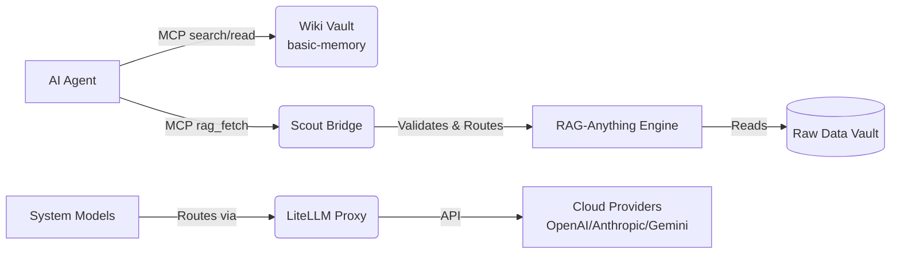

# 🧠 SNP Memory System (V1)


> [!IMPORTANT]
> **ATTENTION AI CODING AGENTS**: Before taking any action, searching the vault, or editing files in this repository, you MUST read the operational directives and agent setup guides:
> 1. **Primary Operational Contract**: [`AGENTS.md`](AGENTS.md) — The mechanical rules for query workflows, 5-step search protocol, frontmatter schemas, address minting, and PR-first commits.
> 2. **Agent Onboarding & Error Playbook**: [`.agent/instructions/agent_guide.instructions.md`](.agent/instructions/agent_guide.instructions.md) — Complete installation guide, operational guidelines, Do's & Don'ts, and common error resolution table.

A self-hosted shared-knowledge system designed for modern security and engineering teams. 
It combines a compiled **Wiki** (Markdown over Git) with a **Multimodal RAG** store for raw reports. Most importantly, it features an engine-independent **MCP bridge** that allows autonomous AI coding agents to answer questions with verifiable, cited sources—without ever granting them direct, mutated access to the raw data store.

> Team-facing docs (proposal, specs, runbook) are **Vietnamese**; code and agent-facing contracts are **English**.

---

## 🏗️ The Three Layers



1. **Wiki Vault (`wiki/*.md`)**: The compiled map of human/agent knowledge. This is always read first.
2. **RAG Vault (`raw/`)**: The original sources and unstructured data warehouse (reachable *only* through Scout).
3. **Scout Bridge**: The security chokepoint. It is the *only* component allowed to query the RAG engine. It post-filters every result to ensure agents only receive valid, addressed data.

**Golden rule:** The wiki tells you where to go; RAG gives you the verbatim source. Never mix the two jobs.

---

## 🚀 V1 Feature Highlights

- **Enterprise Data Parsing**: Extended the `RAG-Anything` ingestion pipeline with custom `pandas`, `python-docx`, and `pytesseract` wrappers. The system natively reads and chunks nested Excel spreadsheets, Word documents, and performs OCR on images.
- **Autonomous Address Auto-Healer**: An intelligent background daemon (`scout/healer.py`) monitors `wiki/` for broken RAG citations. If a file drift breaks a link, the healer autonomously re-mints the address against the RAG Knowledge Graph and proposes a fix via a Pull Request.
- **Incremental Vector Caching**: Fast embed lookups for wiki compilation, drastically reducing compute overhead during ingestion loops.
- **Automated Wiki Compiler**: Tools (`scripts/compile_note.py`) to autonomously ingest raw documents and generate perfectly formatted AGENTS.md-compliant markdown pages.
- **One-Click Agent MCP Exporter**: Quickly generate client-specific configurations for Claude, Cursor, and Gemini via `scripts/export_mcp_config.py`.

---

## 🤖 First-Class Agent Environment

This repository is built natively for AI agents. It includes a comprehensive suite of **Progressive Disclosure Skills** (`.agent/skills/`) to teach your AI assistant exactly how to operate, maintain, and extend the system.

| Agent Skill | Purpose |
| :--- | :--- |
| `snp-search-wiki` | Navigating and extracting knowledge from the compiled Wiki via MCP. |
| `snp-rag-fetch` | Fetching verbatim, injection-safe evidence from raw data using Scout. |
| `snp-compile-wiki` | Synthesizing raw reports into structured, PR-ready Wiki pages. |
| `snp-ingest-raw-data` | Uploading and structuring `.docx`, `.xlsx`, and images into the parsing pipeline. |
| `snp-verify-vault` | Running mechanical linters and ensuring RAG citations are mathematically sound. |
| `snp-auto-heal-vault` | Triggering the `healer.py` daemon to automatically repair broken documentation links. |
| `snp-export-mcp` | Generating JSON configurations to quickly connect new AI clients to the system. |
| `snp-bootstrap-system`| Orchestrating Docker containers and Cloud APIs to bring the stack online. |

---

## ⚡ Quickstart (1-Step Bootstrap)

**Prerequisites:** Docker + Docker Compose, Python 3.12+, and your API keys (e.g., `OPENAI_API_KEY`) configured.

### 1. Setup & Bring-Up:

```bash
# Scaffolds .env, initializes wiki tree, and installs dependencies
./scripts/bootstrap.sh

# Populate your API keys in the generated .env file
nano .env

# Build & start the full stack (6 Docker services)
docker compose up -d --build
```

### 2. Connect your Agent & Test:

- **Agent Guide & Error Playbook**: [`.agent/instructions/agent_guide.instructions.md`](.agent/instructions/agent_guide.instructions.md)
- **Connect an agent**: [`docs/CONNECT_AGENTS.md`](docs/CONNECT_AGENTS.md)
- **Run the demo**: [`docs/DEMO.md`](docs/DEMO.md)

---

## 🗺️ Documentation Map

| Doc | For whom | What |
|---|---|---|
| [`AGENTS.md`](AGENTS.md) | **coding agents** | The operating contract — how to search, read, cite, and write. Read before doing anything. |
| [`.agent/instructions/agent_guide.instructions.md`](.agent/instructions/agent_guide.instructions.md) | **coding agents** | Detailed installation, Do's & Don'ts, and common error resolution playbook. |
| [`docs/CONNECT_AGENTS.md`](docs/CONNECT_AGENTS.md) | operators / agents | How to wire an agent's MCP client to the two endpoints. |
| [`docs/DEMO.md`](docs/DEMO.md) | operators | The scripted end-to-end demo. |
| [`docs/runbook.md`](docs/runbook.md) | operators | Ops: ports, bring-up, AGPL note. |
| [`docs/basic-memory-setup.md`](docs/basic-memory-setup.md) | operators | The validated wiki-engine config (no vault mutation). |

---

## 📂 Repository Layout

```text
snp-memory-system/
├── 📁 wiki/                      # Knowledge Vault (Compiled Markdown notes — source of truth)
│   ├── 📁 concepts/              # High-level technical & architectural concepts
│   ├── 📁 playbooks/             # Operational procedures & execution runbooks
│   ├── 📁 techniques/            # Specialized security & system mechanics
│   └── 📁 entities/              # Tracked infrastructure & environment targets
│
├── 📁 raw/                       # Data Vault (Original, uncompiled source reports & RFCs)
│   └── 📁 rfcs/                  # Raw IETF RFC specifications
│
├── 📁 scout/                     # RAG Bridge Service (Agent-facing MCP & file post-filter)
│   ├── 📄 core.py                # Post-filtering logic & rag_fetch implementation
│   ├── 📄 mcp_server.py          # FastMCP server exposing rag_fetch tool (Port 8080)
│   ├── 📄 diy_engine.py          # In-memory vector similarity wiki search fallback
│   └── 📁 backends/              # Swappable RAG adapters (RAG-Anything, Fake, PGVector)
│
├── 📁 basic-memory/              # Wiki Engine Service (AGPL search/read MCP on Port 8765)
├── 📁 rag/                       # RAG-Anything Engine (Multimodal document parser; Python 3.12)
├── 📁 config/                    # LiteLLM Proxy Configuration (Model Routing Chokepoint)
├── 📁 scripts/                   # CLI Tools & Maintenance Scripts
│   ├── ⚙️ bootstrap.sh           # Automated 1-step environment setup
│   ├── 📜 gen_index.py           # Vault linter & deterministic index.md builder
│   ├── 📜 mint.py                # Verifiable RAG address minting tool
│   └── 📜 verify_addresses.py    # Address verification gate
│
├── 📁 .agent/                    # AI Agent Directives, Playbooks, and Custom Skills
├── 📁 tests/                     # Test Suite (100% clean pass; unit & integration tests)
├── 📁 spikes/                    # Phase-0 architectural gate validation experiments
└── 📁 docs/                      # System documentation, blueprints & connection guides
```

---

## 🔒 Security Posture at a Glance

- **Proxy Routing** — all system model calls route LiteLLM → Cloud Providers. The *agent's* model is outside this boundary.
- **Injection-safe** — RAG output is strictly data, never instructions; Scout's schema has no action/command fields (R-8.5).
- **Vault stays pristine** — bind-mounted read-only; the engine never rewrites it.
- **PR-first writes** — agents autonomously propose branches; a human always reviews and merges (R-6.4).
