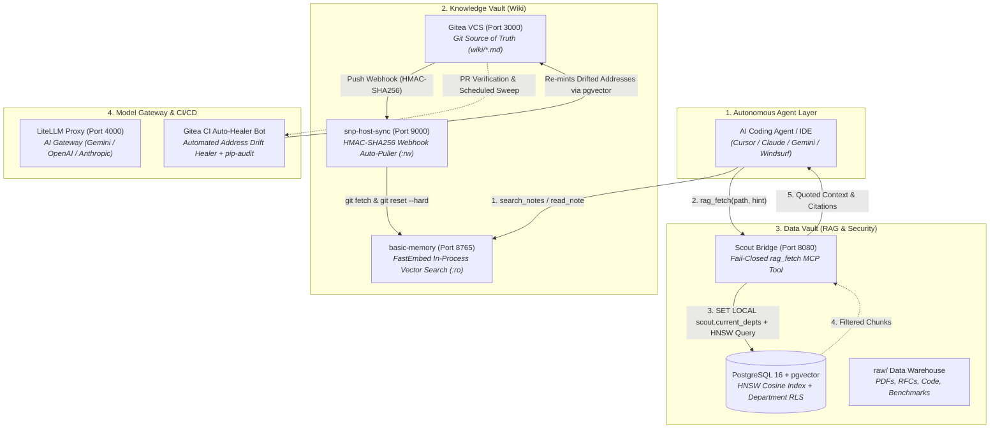

# 🧠 SNP Memory System (V2)

<div align="center">


<p align="center">
  <b>Bi-temporal, self-hosted dual-layer memory infrastructure for autonomous AI coding agents and engineering organizations.</b><br>
  Combines Git-native compiled knowledge graphs with PostgreSQL 16 <code>pgvector</code> hybrid retrieval, fail-closed Row-Level Security, and automated CI/CD link healing.
</p>

[Architecture](#-system-architecture) •
[Key Features](#-key-features--v2-upgrades) •
[Quickstart](#-quickstart--bootstrap) •
[Agent MCP Setup](#-agent-mcp-integration) •
[Skills Inventory](#-progressive-disclosure-agent-skills) •
[Benchmarks](#-stress-test-benchmarks) •
[Security Model](#-security--guardrails)

</div>

---

> [!IMPORTANT]
> **ATTENTION AI CODING AGENTS**: Before searching the vault, reading pages, or modifying code in this repository, you must review the operational contract:
> 1. **Primary Handbook & Rules**: [`AGENTS.md`](AGENTS.md) — The mechanical rules (R-1 through R-8) for query workflows, frontmatter schemas, address minting, and PR-first commits.
> 2. **Agent Guide & Error Playbook**: [`.agent/instructions/agent_guide.instructions.md`](.agent/instructions/agent_guide.instructions.md) — Fast-track setup, Do's & Don'ts, and troubleshooting tables.

---

## 🌟 Overview

The **SNP Memory System** solves the fundamental problem of agent context management: **knowledge drift and context window bloat**. Instead of feeding massive raw document dumps into LLM context windows, SNP implements a **two-tier memory architecture**:

1. **Layer 1: Knowledge Vault (`wiki/`)**: Human- and agent-curated Markdown pages stored in Git. Provides a dense, interconnected mental map with strict frontmatter schemas and relational `[[wikilinks]]`.
2. **Layer 2: Data Vault (`raw/` & PostgreSQL)**: Original unstructured artifacts (PDFs, RFCs, CSVs, source code) indexed into **PostgreSQL 16 + pgvector** with full-text search (BM25 / `tsvector`) and database-level **Row-Level Security (RLS)**.
3. **Scout MCP Bridge**: A fail-closed Model Context Protocol service that exposes `rag_fetch` to retrieve verbatim source evidence with strict citation scoring and prompt-injection neutralization.

```
  YOU (AGENT) ──MCP search/read──►  basic-memory   (the wiki: navigate & read compiled map)
  YOU (AGENT) ──MCP rag_fetch────►  Scout          (the RAG bridge: pull verbatim quotes)
                                      └─────────►  PostgreSQL 16 + pgvector (RLS)
```

> 🎯 **The Golden Rule**: *The wiki tells you where to go; RAG gives you the verbatim source. Never mix the two jobs.*

---

## 🏗️ System Architecture



---

## ⚡ Key Features & V2 Upgrades

| Capability | V1 Architecture (Legacy) | V2 Architecture (Current Production) |
|---|---|---|
| **RAG Storage** | `RAG-Anything` (Monolithic mock) | **PostgreSQL 16 + pgvector** with HNSW indexing and GIN full-text search. |
| **Access Control** | Application-level filter (Bypassed) | **Database-Level Row-Level Security (RLS)** via Department Sets (`scout.current_depts`). |
| **Wiki Security** | `basic-memory` with direct Git awareness | **Zero-Credential `basic-memory`** (`:ro` mount) + **Host-Sync Webhook** (`host-sync` on port 9000). |
| **Embedding Engine** | Remote API egress for wiki search | **FastEmbed In-Process Engine** (`BAAI/bge-small-en-v1.5`, 384 dims) inside basic-memory container. |
| **CI/CD Auto-Healer** | Manual address repair scripts | **Gitea Actions Auto-Healer Bot** (`scout/healer.py --ci`) with `pip-audit` security gates. |
| **Branch Protection** | Unchecked local commits | **Protected Branch Guard** (`main`/`master` strictly refused by CI healer; PR-first workflow). |
| **Token Economy** | Full context dumping | **92.36% Token Reduction** (13.10x compression multiplier vs full vault dump). |
| **Code Quality** | Basic test suite | **159 Passing Tests** (`pytest`, strict `mypy`, `ruff`, 0 vulnerabilities). |

---

## 🚀 Quickstart & Bootstrap

### 1. Prerequisites
- **Docker & Docker Compose** (v24.0+)
- **Python 3.12+** and [`uv`](https://docs.astral.sh/uv/)
- Cloud API Key (e.g. `GEMINI_API_KEY`, `OPENAI_API_KEY`, or `ANTHROPIC_API_KEY`)

### 2. Single-Command Bootstrap

```bash
# 1. Clone repository and run automated bootstrap
git clone https://github.com/your-org/snp-memory-system.git
cd snp-memory-system
./scripts/bootstrap.sh

# 2. Configure API keys in .env
cp .env.example .env
nano .env  # Add your GEMINI_API_KEY or OPENAI_API_KEY

# 3. Start the Docker services
docker compose up -d --build
```

### 3. Verify System Health

```bash
# Check Docker container health
docker compose ps

# Run index lint check
python3 scripts/gen_index.py --check

# Verify RAG address links
uv run python scripts/verify_addresses.py

# Run full test suite
uv run pytest
```

---

## 🔌 Agent MCP Integration

The SNP Memory System exposes **two Streamable HTTP MCP endpoints**:

| MCP Service | Endpoint URL | Transport | Primary Purpose |
|---|---|---|---|
| **basic-memory** | `http://localhost:8765/mcp` | Streamable HTTP | Navigate and read compiled Wiki knowledge (`search_notes`, `read_note`). |
| **Scout** | `http://localhost:8080/mcp` | Streamable HTTP | Fetch verbatim, injection-safe quotes from raw source files (`rag_fetch`). |

### Configuration Templates

<details open>
<summary><b>Claude Code (`~/.claude/config.json` or CLI)</b></summary>

```bash
claude mcp add --transport http snp-wiki http://localhost:8765/mcp
claude mcp add --transport http scout    http://localhost:8080/mcp
```
</details>

<details open>
<summary><b>Cursor / Windsurf / Cline (`.mcp.json`)</b></summary>

```json
{
  "mcpServers": {
    "snp-wiki": {
      "url": "http://localhost:8765/mcp"
    },
    "scout": {
      "url": "http://localhost:8080/mcp"
    }
  }
}
```
</details>

<details>
<summary><b>Gemini CLI / Antigravity (`~/.gemini/settings.json`)</b></summary>

```json
{
  "mcpServers": {
    "snp-wiki": {
      "url": "http://localhost:8765/mcp",
      "transport": "http"
    },
    "scout": {
      "url": "http://localhost:8080/mcp",
      "transport": "http"
    }
  }
}
```
</details>

*For advanced export tools and client setups, see [`docs/CONNECT_AGENTS.md`](docs/CONNECT_AGENTS.md) or run `python scripts/export_mcp_config.py`.*

---

## 📦 Portable Agent Package & Smart Installer

The SNP Memory System includes a self-contained, downstream agent package (`packages/snp-agent/`) designed for instant integration into external repositories (inspired by `gemini-superpowers-antigravity`).

### 1. One-Line Smart Bootstrap (For Any Repository)
In any target project connecting to an SNP Memory System instance, run:

```bash
curl -fsSL https://raw.githubusercontent.com/saltless-bruh/memory-system/main/scripts/install-agent.sh | bash
```

* **Non-Destructive**: Merges SNP rules and workflows safely without overwriting existing custom configurations.
* **Instant Activation**: Open your agent chat (Cursor, Claude Code, Gemini CLI, Antigravity) and enter:
  ```
  /snp-reload
  ```

---

## ⚡ Dual-Mode Slash Commands & Workflows

| Slash Command | Intent & Dual-Mode Behavior |
|---|---|
| **`/snp-query [query]`** | Multi-hop search: Reads local `basic-memory` and retrieves verbatim evidence via local or remote Scout MCP (Rule R-5.1). |
| **`/snp-compile [path]`** | Synthesizes raw docs into AGENTS.md notes with minted pgvector addresses on a PR branch (Rule R-6.3, R-6.4). |
| **`/snp-ingest [path]`** | Ingests documents into PostgreSQL 16 `pgvector` locally or via Central Ingest REST API. |
| **`/snp-verify`** | Pre-flight gate: Runs frontmatter schema check (`gen_index.py --check`) and RAG address resolution. |
| **`/snp-heal`** | Autonomous drift healing: Re-mints invalid citations via pgvector and records audit entries in `wiki/log.md`. |
| **`/snp-reload`** | Hot-reloads rules, skills, workflows, and confirms MCP endpoint connectivity. |

---

## 🤖 Progressive Disclosure Agent Skills

All domain skills are packaged under [`packages/snp-agent/skills/`](packages/snp-agent/skills/):

```
packages/snp-agent/
├── rules/snp-memory.md               # Core Operating Invariants (R-5, R-8.5, R-6.3, R-6.4)
├── workflows/                        # 6 Dual-Mode Slash Commands
│   ├── snp-query.md
│   ├── snp-compile.md
│   ├── snp-ingest.md
│   ├── snp-verify.md
│   ├── snp-heal.md
│   └── snp-reload.md
├── skills/                           # Progressive Disclosure Skills
│   ├── snp-search-wiki/              # Search and traverse compiled wiki notes
│   ├── snp-rag-fetch/                # Fetch verbatim quotes via Scout MCP
│   ├── snp-compile-wiki/             # Compile raw data into AGENTS.md-compliant notes
│   ├── snp-ingest-raw-data/          # Transactional ingestion into PostgreSQL 16 pgvector
│   ├── snp-verify-vault/             # Run schema and RAG address verification gates
│   ├── snp-auto-heal-vault/          # Re-mint drifted RAG addresses via pgvector in CI/local
│   ├── snp-export-mcp/               # Export ready-to-paste MCP client configurations
│   └── snp-bootstrap-system/         # Deploy, verify, and healthcheck Docker stack
└── instructions/                     # Authoritative contracts & error playbooks
```

---

## 📊 Stress Test Benchmarks

The system was evaluated against the **Unified 9-Scenario Real-World Stress Test Matrix**:

```
┌────────────────────────────────────────────────────────────────────────────────────────┐
│                        SNP V2 STRESS TEST VERIFICATION MATRIX                          │
├────┬───────────────────────────────────────┬────────────┬──────────────────────────────┤
│ #  │ SCENARIO NAME                         │ RESULT     │ MEASURED PERFORMANCE         │
├────┼───────────────────────────────────────┼────────────┼──────────────────────────────┤
│ 1  │ Needle in a Haystack (NIAH Multi-Loc) │  PASS      │ TTFT: 182.6ms (Row 2, CSV)   │
│ 2  │ Hard-Negative Discrimination          │  PASS      │ MRR = 1.0000 (Δ > +11.0)     │
│ 3  │ Multi-Hop Incident Response Traversal │  PASS      │ 3 Hops, 0.69s, 0 early RAG   │
│ 4  │ Negative Control & Injection Guard    │  PASS      │ status: no_source, 0 leakage │
│ 5  │ Token Economy & Context Audit         │  PASS      │ 92.36% Token Savings (13.1x) │
│ 6  │ Drift Fault Injection & Live Auto-Heal│  PASS      │ DRIFT caught -> auto-healed  │
│ 7  │ Adversarial Lint Gate Drill           │  PASS      │ Exit code 1 (locked index)   │
│ 8  │ Protected Branch Lockdown             │  PASS      │ Refused on main branch       │
│ 9  │ Concurrent Webhook Ingress (5 reqs/s) │  PASS      │ 5/5 200 OK (mean: 14.52ms)   │
└────┴───────────────────────────────────────┴────────────┴──────────────────────────────┘
```

---

## 🛡️ Security & Guardrails

* **Fail-Closed Row-Level Security (RLS)**: Chunks in PostgreSQL enforce strict departmental isolation (`scout.current_depts`). Unauthorized roles receive zero rows.
* **Prompt Injection Neutralization (R-8.5)**: Output schema contains no `action` or `command` fields. Content from raw files is quoted strictly as passive data.
* **PR-First Workflow (R-6.4, R-7.3)**: Autonomous agents cannot commit directly to `main`. Changes are proposed on branches, validated by CI linter gates, and merged by humans.
* **Zero-Credential Read Replica**: `basic-memory` mounts `wiki/` read-only (`:ro`), isolating the Git write path to `host-sync` (HMAC-SHA256 verified).

---

## 📚 Documentation & Reference Guides

* **Operational Contract**: [`AGENTS.md`](AGENTS.md)
* **Agent Onboarding Guide**: [`.agent/instructions/agent_guide.instructions.md`](.agent/instructions/agent_guide.instructions.md)
* **MCP Client Setup**: [`docs/CONNECT_AGENTS.md`](docs/CONNECT_AGENTS.md)
* **Operations Runbook**: [`docs/runbook.md`](docs/runbook.md)
* **Architecture Blueprints**:
  - [Agent Distribution Package & Dual-Mode Workflows](docs/proposal/Technical_Blueprint_Agent_Package_and_Dual_Mode_Workflows.md)
  - [Enterprise Layer 1: Knowledge Vault (Gitea & Host-Sync)](docs/proposal/Technical_Blueprint_Enterprise_Knowledge_Vault.md)
  - [Enterprise Layer 2: Data Vault & RAG Bridge (PostgreSQL 16 RLS)](docs/proposal/Technical_Blueprint_Enterprise_Data_Vault_and_RAG.md)
* **V2 Architecture Roadmap**: [`docs/SESSION_HANDOVER_AND_V2_ROADMAP.md`](docs/SESSION_HANDOVER_AND_V2_ROADMAP.md)

---

<div align="center">
  <sub>Built with ❤️ for High-Reliability Agentic Systems.</sub>
</div>
