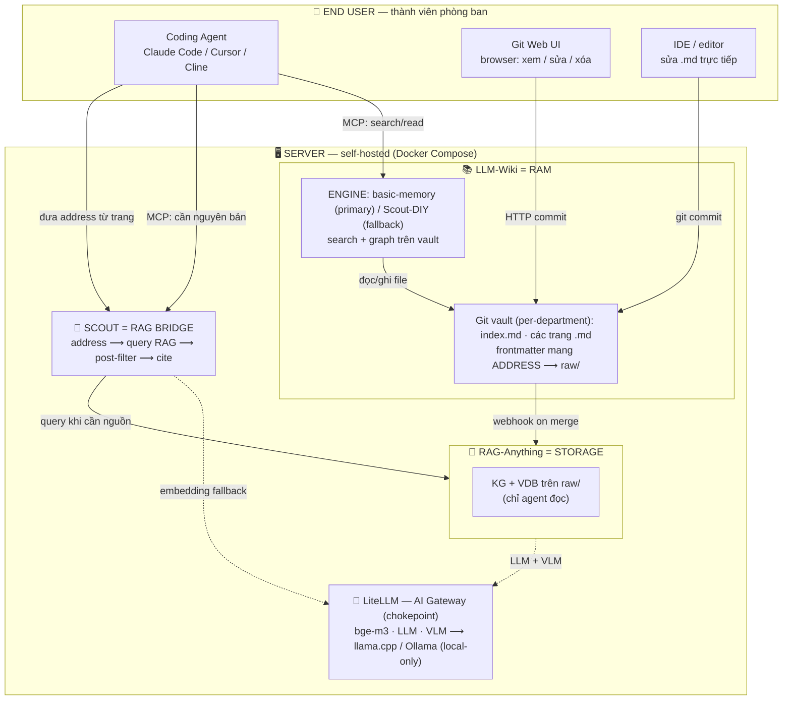
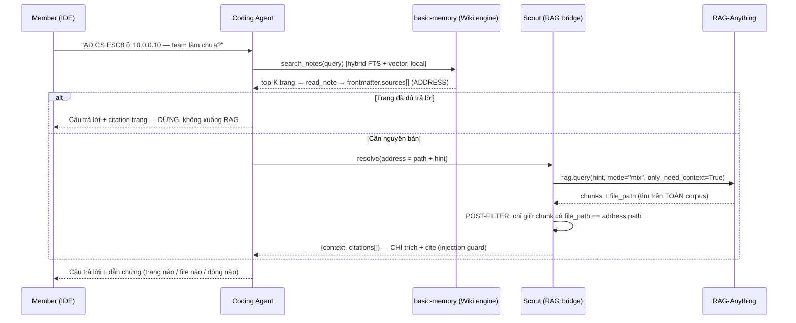
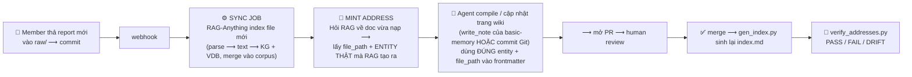

# SNP Memory System — Tài liệu Kiến trúc & Đề xuất Kỹ thuật

> **SUPERSEDED PROPOSAL.** Preserved for design history; current architecture
> and commands are documented in `docs/ARCHITECTURE_STATUS.md`.

| | |
|---|---|
| **Version** | 2.3 — thêm hướng V2 cho RAG engine (swappable + RBAC). Xem §5 và `Suggestion_V2_RAG_Replacement.md`. |
| **Tác giả** | Trần Quang Huy (Laz) |
| **Ngày** | 19/07/2026 (v2.2) · 21/07/2026 (v2.3: hướng thay RAG cho V2) |
| **Tên project** | **SNP Memory System** — hệ thống trí nhớ dùng chung của team Security. Gồm 3 lớp: **LLM-Wiki** (RAM), **RAG-Anything** (Storage), **Scout** (thủ thư / RAG bridge). |
| **Engine LLM-Wiki** | **PRIMARY: basic-memory** (AGPL-3.0, self-host, MCP-native) · **FALLBACK: Scout-DIY** (tự viết, chạy trên cùng vault) |
| **Phạm vi V1** | (1) Thiết kế – xây – chạy thử **LLM-Wiki** · (2) Cài đặt & tích hợp **RAG-Anything** · (3) **Workflow** truy vấn + nạp dữ liệu |
| **Cảm hứng** | LLM-Wiki pattern của Karpathy (một wiki tri thức mà agent đọc được), tầng lưu trữ dùng **RAG-Anything** (HKUDS) |

> **Lưu ý tên gọi:** **SNP Memory System** là tên **cả hệ thống**. **LLM-Wiki** chỉ là **một lớp** bên trong (lớp Wiki/RAM), đứng cạnh RAG-Anything và Scout. Trong tài liệu này, "LLM-Wiki" luôn chỉ *riêng lớp Wiki*, còn "SNP Memory System" chỉ *toàn bộ hệ thống*.

---

## 0. Tóm tắt điều hành

**SNP Memory System** là **kho tri thức dùng chung của team Security**, được thiết kế để **các coding agent trong IDE của từng thành viên đọc và tra cứu được**, thay vì chỉ để con người đọc. Hệ thống tách làm hai tầng lưu trữ: một tầng **LLM-Wiki** (các file Markdown đã được compile, gọn, điều hướng nhanh) và một tầng **RAG** (nguồn gốc thô — PDF, report, evidence, sheet — lưu nguyên bản, dung lượng lớn), với **Scout** làm lớp truy hồi ở giữa. LLM-Wiki đóng vai "bản đồ", RAG đóng vai "kho hàng"; mỗi trang trong LLM-Wiki mang sẵn **địa chỉ (address)** trỏ xuống đúng nguồn trong RAG.

Lớp **LLM-Wiki** được dựng trên **basic-memory** (open-source, self-host) làm engine chính, và giữ một bản **DIY (Scout tự viết)** làm phương án dự phòng — cả hai chạy trên **cùng một vault Markdown trong Git**, nên đổi qua lại **không mất dữ liệu** (§2.2, §2.6).

Bản v1 này **chỉ tập trung vào cơ chế lõi**: dựng được LLM-Wiki, cài được RAG-Anything, và nối hai thứ đó bằng workflow truy vấn + nạp dữ liệu chạy được đầu-cuối. Các phần **phân quyền (RBAC), khóa file khi nhiều người/agent cùng sửa (lock), và giao diện cho người không rành kỹ thuật** được **để dành cho V2** — có nêu rõ *cái gì, làm thế nào, vì sao* ở §5.

---

## 1. Dự án này là gì

### 1.1. Vấn đề đang giải

Tri thức của team Security hiện nằm rải rác: report pentest, advisory, evidence, sheet, ảnh màn hình, đoạn code… ở nhiều định dạng, nhiều nơi. Hệ quả:

- **Con người** phải nhớ "cái đó nằm ở đâu" và mở từng file để tìm.
- **Coding agent** (Claude Code / Cursor / Cline…) không có nguồn tri thức chung của team — mỗi lần hỏi phải nạp cả đống tài liệu vào context, vừa tốn token vừa nhiễu.
- Tri thức **không có phiên bản**: ai sửa gì, xóa gì, lúc nào — không truy được.

### 1.2. SNP Memory System là gì (và LLM-Wiki nằm ở đâu trong đó)

**SNP Memory System** là hệ thống trí nhớ ghép từ 3 lớp:

| Lớp | Tên | Vai trò | Engine |
|---|---|---|---|
| **RAM** | **LLM-Wiki** | Tri thức đã compile, người + AI cùng đọc–ghi. Gọn, điều hướng nhanh. | **basic-memory** (primary) · **Scout-DIY** (fallback) |
| **Storage** | **RAG-Anything** | Nguồn gốc thô (`raw/`), agent chỉ đọc. Nguồn sự thật. | RAG-Anything / LightRAG |
| **Thủ thư** | **Scout** | Nối Wiki ↔ RAG: đọc address trong trang → lấy nguyên bản từ RAG có trích dẫn. | tự viết |

**LLM-Wiki** — lớp trung tâm của tài liệu này — là một **wiki mà cả người lẫn AI đọc–ghi được**, lưu dưới dạng file Markdown trong Git. Ý tưởng gốc lấy từ **LLM-Wiki pattern của Karpathy**: một trang wiki không viết cho người đọc lướt, mà viết **mật độ cao, khẳng định, có cấu trúc** để một model có thể nạp vào và dùng ngay.

Điểm **khác** Karpathy: ở pattern gốc chỉ có **một người viết**; ở đây **cả con người và AI cùng viết** vào wiki. Đó là lý do sau này (V2) cần cơ chế khóa để tránh giẫm chân nhau — nhưng V1 chưa cần.

LLM-Wiki **không chứa nguồn gốc thô**. Nó chứa **tri thức đã compile**, và mỗi trang mang một **address** trỏ xuống nguồn gốc nằm trong RAG. Agent đọc trang wiki trước; chỉ khi cần bằng chứng/nguyên bản mới lần theo address xuống RAG.

### 1.3. Ai dùng, dùng để làm gì

| Người dùng | Dùng để làm gì | Vào hệ thống bằng đường nào |
|---|---|---|
| **Coding agent** (trong IDE của member) | Hỏi tri thức team ("kỹ thuật X đã dùng ở target nào chưa?"), lấy về câu trả lời có dẫn chứng | MCP (basic-memory) + Scout (RAG bridge) |
| **Thành viên rành kỹ thuật** | Clone repo, sửa `.md` trong IDE, commit | Git (file I/O) |
| **Thành viên không rành Git** | Mở trang trên browser, bấm sửa, Save | Git Web UI (HTTP) |

Giá trị cốt lõi: **agent trả lời dựa trên tri thức thật của team, kèm trích dẫn nguồn**, mà **không** phải nuốt toàn bộ kho tài liệu vào context.

### 1.4. Mô hình khái niệm: LLM = CPU · LLM-Wiki = RAM · RAG = Storage

Cách dễ nhất để nắm kiến trúc là ánh xạ theo phần cứng máy tính:

```
   LLM       =  CPU       Model chính trong IDE của member. Suy luận, ra quyết định.
   LLM-Wiki  =  RAM       Tri thức đã compile. Nóng, điều hướng nhanh; người + AI cùng sửa.
   RAG       =  STORAGE   raw/ — nguồn gốc bất biến. Nguội, dung lượng lớn; agent chỉ đọc.
```

- **CPU không lưu dữ liệu lâu dài** → LLM không "nhớ" tri thức team; nó phải đọc từ RAM/Storage.
- **RAM là nơi làm việc nóng** → LLM-Wiki là tri thức đã sắp xếp để nạp nhanh.
- **Storage là nguồn sự thật** → RAG giữ nguyên bản; nếu LLM-Wiki và RAG lệch nhau, **RAG đúng**.

Ánh xạ này giải thích luôn tên gọi: cả ba lớp hợp lại là **bộ nhớ (memory)** của team → **SNP Memory System**. **LLM-Wiki chính là thanh RAM** trong đó. Cũng lưu ý về quy mô: **RAM nhỏ, Storage lớn** — LLM-Wiki gói gọn ~100–500 trang, còn RAG mới là tầng 10GB+.

### 1.5. Nguyên tắc phân tách LLM-Wiki ↔ RAG

Đây là ranh giới thiết kế quan trọng nhất, cần thuộc:

| | **LLM-Wiki (RAM)** | **RAG (Storage)** |
|---|---|---|
| **Nội dung** | Markdown đã compile | PDF, advisory, evidence, sheet gốc |
| **Kích thước** | ~100–500 trang | 10GB+ |
| **Ai ghi** | Người + AI, thường xuyên | Người thả vào, hiếm khi sửa |
| **Ai đọc** | Người + agent | **Chỉ agent** |
| **Phạm vi** | Theo phòng ban | Dùng chung |
| **Cách truy cập** | **Điều hướng** (search + graph) | **Truy hồi** (semantic query) |
| **Vai trò** | Bản đồ | Kho hàng / nguồn sự thật |

> Ghi nhớ một câu: **LLM-Wiki để đi tới đúng chỗ; RAG để lấy nguyên bản. Không lẫn hai việc.**

---

## 2. Kiến trúc

Phần này đi từ **ngoài vào trong**: trước hết là sơ đồ **toàn hệ thống SNP Memory System** (§2.1), rồi phóng to vào **lớp LLM-Wiki** và cách nó nối xuống RAG (§2.2), tiếp đến RAG-Anything (§2.3), tech stack (§2.4), hợp đồng dữ liệu nối hai lớp (§2.5), và cuối cùng là lý do chọn thiết kế này (§2.6).

### 2.1. Sơ đồ kiến trúc SNP Memory System

Đây là bức tranh **toàn hệ thống**: mọi lớp và mọi đường vào. Toàn bộ chạy **self-hosted trong Docker Compose**. Con người vào bằng 3 đường; agent vào bằng MCP. Mọi lời gọi model (không kể embedding nội bộ của basic-memory) đi qua **một chokepoint** là LiteLLM.



### 2.2. Sơ đồ kiến trúc LLM-Wiki (ASCII) — và cách nối xuống RAG

Đây là **thiết kế lõi của lớp LLM-Wiki**, vẽ đầy đủ đường xuống RAG. Ý tưởng trung tâm: **engine tra cứu là một khe cắm thay thế được** (basic-memory hoặc DIY), nằm trên **cùng một vault Git**; còn **frontmatter** và **RAG bridge** là bất biến — nên đổi engine **không đụng dữ liệu**.

```
   ┌───────────────────────────────────────────────────────────────────┐
   │  CODING AGENT   (Claude Code / Cursor / Cline, trong IDE)          │
   └───────────────────────────────┬───────────────────────────────────┘
                                   │ MCP  (hỏi tri thức)
                                   ▼
   ╔═══════════════════════════════════════════════════════════════════╗
   ║  ①  LLM-WIKI ENGINE   —   KHE CẮM THAY THẾ ĐƯỢC (swappable)        ║
   ║                                                                   ║
   ║   ● PRIMARY   basic-memory   (AGPL-3.0 · self-host · MCP-native)   ║
   ║       · search_notes      →  hybrid full-text + vector (local)     ║
   ║       · read_note / build_context  →  đọc trang, đi graph          ║
   ║       · index SQLite/Postgres  =  sinh TỪ file (KHÔNG là source)   ║
   ║                                                                   ║
   ║   ○ FALLBACK  Scout-DIY   (bật nếu basic-memory không đạt yêu cầu) ║
   ║       · tự embed `summary` (bge-m3 / LiteLLM)  →  route top-K       ║
   ║       · đọc trang thẳng từ Git                                     ║
   ╚═══════════════════════════════════╤═══════════════════════════════╝
                                       │ đọc / ghi .md
                                       │ (CẢ HAI engine dùng CHUNG vault dưới đây)
                                       ▼
   ┌───────────────────────────────────────────────────────────────────┐
   │  ②  GIT VAULT   =   NGUỒN SỰ THẬT của Wiki  (Gitea · versioned)    │
   │      wiki/  index.md · techniques/ entities/ playbooks/ concepts/  │
   │            archive.md · log.md          (~100–500 trang)           │
   │                                                                   │
   │   Mỗi trang .md mang FRONTMATTER — HỢP ĐỒNG CƠ KHÍ:                │
   │   ┌─────────────────────────────────────────────────────────┐     │
   │   │ type · title · summary · entities · department           │     │
   │   │ sources:                          ◄── ③ ĐỊA CHỈ RA RAG   │     │
   │   │   - path: raw/reports/acme.pdf       (Scout đọc field    │     │
   │   │     loc:  "p.12-14"                   này, engine bỏ qua) │     │
   │   │     hint: "Acme kerberoasting SPN"                        │     │
   │   │ ── body: TL;DR · Technical Specs · Provenance ──          │     │
   │   │ ── [[wikilink]]  ≙  relations của basic-memory ──         │     │
   │   └────────────────────────────┬────────────────────────────┘     │
   └────────────────────────────────┼──────────────────────────────────┘
                                    │ khi trang CHƯA đủ → cần nguyên bản
                                    │ (đưa path + hint xuống)
                                    ▼
   ╔═══════════════════════════════════════════════════════════════════╗
   ║  ④  SCOUT = RAG BRIDGE   (tự viết · ENGINE-INDEPENDENT)            ║
   ║      1. nhận address (path + hint) từ frontmatter                 ║
   ║      2. rag.query(hint, mode="mix", only_need_context=True)       ║
   ║      3. post-filter: chỉ giữ chunk có file_path == address.path   ║
   ║      4. trả {context, citations[]}  — CHỈ trích + cite            ║
   ║         (không tóm-tắt-rồi-ra-lệnh → chống prompt-injection)      ║
   ╚═══════════════════════════════════╤═══════════════════════════════╝
                                       │ query (chỉ lấy đoạn gốc)
                                       ▼
   ┌───────────────────────────────────────────────────────────────────┐
   │  ⑤  RAG-ANYTHING   (STORAGE)                                       │
   │      KG + VDB trên raw/ · merge toàn corpus · agent CHỈ đọc        │
   └───────────────────────────────────┬───────────────────────────────┘
                                       │ embedding + LLM/VLM (local)
                                       ▼
   ┌───────────────────────────────────────────────────────────────────┐
   │  LiteLLM   (AI gateway · chokepoint · local-only)                 │
   │      bge-m3 · LLM · VLM  →  llama.cpp / Ollama                     │
   └───────────────────────────────────────────────────────────────────┘
```

**Đọc sơ đồ theo 5 mốc:**

1. **Engine (khe cắm).** `basic-memory` làm engine chính: nó cho agent các MCP tool `search_notes` (hybrid full-text + vector, chạy **local**), `read_note`/`build_context` (đọc trang + đi graph `[[wikilink]]`). Chỉ số của nó (SQLite hoặc Postgres) **sinh ra từ file**, không phải nguồn sự thật. Nếu basic-memory không đạt yêu cầu (xem gate ở §2.6), bật **Scout-DIY**: tự embed `summary` bằng bge-m3 qua LiteLLM rồi route top-K — chạy trên **đúng vault đó**.
2. **Vault Git (nguồn sự thật).** ~100–500 trang `.md` trong Gitea, có version. Cả hai engine chỉ đọc/ghi file ở đây; đổi engine **không migration** vì dữ liệu là Markdown thuần.
3. **Frontmatter = địa chỉ ra RAG.** Field `sources[]` (path + hint) là con trỏ xuống nguồn gốc. Engine wiki **không hiểu** field này (nó chỉ lo tìm/đọc trang) — **Scout** mới là bên đọc `sources[]`.
4. **Scout = RAG bridge (bất biến).** Đây là mảnh tự viết, **độc lập với engine**. Nhận address → `rag.query(..., only_need_context=True)` để lấy **đoạn gốc** → **post-filter** theo `file_path` → trả về context kèm citation. Scout **chỉ trích + cite**, không diễn giải rồi ra lệnh (hàng rào injection).
5. **RAG-Anything + LiteLLM.** Kho nguồn (KG+VDB trên `raw/`) và cổng model local. Chi tiết ở §2.3.

**Vì sao khe cắm engine + vault chung là điểm mạnh:** basic-memory là công cụ *chuyên dụng* cho đúng việc này (second-brain Markdown cho AI qua MCP, người + AI cùng ghi, có knowledge graph) → viết ít code hơn. Nhưng vì tri thức luôn nằm ở **Markdown trong Git**, nếu basic-memory hụt thì thay bằng Scout-DIY với **0 chi phí chuyển dữ liệu**. Đây chính là câu trả lời cho yêu cầu "chắc chắn cho cả phòng ban": ta đặt cược vào **Markdown + Git** (bền, không lock-in), còn engine chỉ là lớp phủ thay được.

### 2.3. Kiến trúc RAG-Anything (nguồn: HKUDS)

Sơ đồ chính thức của RAG-Anything (dùng ảnh trong repo của nhóm HKUDS):


*Nguồn: [github.com/HKUDS/RAG-Anything](https://github.com/HKUDS/RAG-Anything) — pipeline 3 giai đoạn: Parsing → Knowledge Grounding → Query.*

RAG-Anything **không phải** một API "lấy chunk theo file". Nó là **pipeline hoàn chỉnh** gồm 3 giai đoạn:

1. **Multi-modal Content Parsing** — tài liệu vào (PDF/PPT/DOC/XLS/ảnh) được parser (MinerU) bóc thành *Structured Content List*: text, ảnh, công thức, bảng.
2. **Graph-based Knowledge Grounding** — VLM/LLM biến ảnh/bảng/công thức thành **text trước** ("Textual Multi-modal Info"), rồi rút **Entity & Relation** để dựng **Knowledge Graph (KG)** và encode thành **Vector Database (VDB)**.
3. **Query** — câu hỏi được tách high-/low-level keys → truy hồi trên KG **và** VDB → trả về *Retrieved Info* → (mặc định) đưa vào LLM để sinh *Response*.

**Ba điều rút ra — ảnh hưởng TRỰC TIẾP tới thiết kế của ta:**

| # | Sự thật về RAG-Anything | Hệ quả cho SNP Memory System |
|---|---|---|
| **1** | Nó **merge MỌI document vào MỘT KG + MỘT VDB** ("KG/VDB over All Documents"). Gộp xuyên tài liệu là **tính năng lõi**, không phải tác dụng phụ. | **Không lọc trước theo file được.** Không có `path_filter`. Muốn giữ đúng nguồn → phải **post-filter** ở phía Scout (§2.2, §3.1). |
| **2** | **Multimodal → text trước.** "Multimodal" ở đây nghĩa là *parse ảnh/bảng ra text rồi xử lý như text.* | Recall phụ thuộc chất lượng caption/parse. Ảnh mờ, bảng vỡ layout ⟶ grounding kém. Cần kiểm trên data thật. |
| **3** | **Đầu ra mặc định là Response do LLM của NÓ sinh ra**, không phải đoạn gốc. | Phải bật `only_need_context=True` để lấy **đoạn gốc** — nếu không, hai model cùng suy luận (thừa) và ta **mất chuỗi trích dẫn**. Đây cũng là hàng rào chống prompt-injection: context là **dữ liệu**, không phải lệnh. |

**API thật** (không phải bản nháp cũ ghi `path_filter`):

```python
rag.query(text, QueryParam(mode="mix", only_need_context=True))
# mode: naive (vector) · local (entity) · global (KG) · hybrid · mix
# only_need_context=True  → trả ĐOẠN GỐC + file_path, KHÔNG chạy LLM của RAG
```

> **RAG engine cũng là khe cắm thay được (mới ở v2.3).** RAG-Anything là backend **của V1**, nằm sau một **RAG-backend interface** trong Scout (mirror khe-cắm wiki-engine). V2 sẽ **thay** nó để có privilege lock theo role — merged-KG của RAG-Anything không làm nổi RBAC row-level. Ứng viên + lý do ở **`Suggestion_V2_RAG_Replacement.md`**; hợp đồng interface ở `design.md §2.3`. Vì thế Scout **không** được phụ thuộc API riêng RAG-Anything — chỉ gọi qua interface.

### 2.4. Tech Stack (V1 — chỉ phần lõi)

| Lớp | Công nghệ | Vai trò | Lý do chọn |
|---|---|---|---|
| **LLM-Wiki engine (primary)** | **basic-memory** (AGPL-3.0, Python) | Search + graph + đọc/ghi trang qua MCP | Chuyên dụng cho AI-second-brain trên Markdown; người + AI cùng ghi; index local; multi-CLI |
| **LLM-Wiki engine (fallback)** | **Scout-DIY** *(tự viết)* | Thay basic-memory nếu hụt yêu cầu | Chạy trên cùng vault → đổi 0 migration; toàn quyền kiểm soát schema |
| **RAG bridge** | **Scout** *(tự viết, ~lõi nhỏ)* | Address ⟶ RAG ⟶ post-filter ⟶ cite | Mảnh basic-memory KHÔNG làm; engine-independent |
| **Embedding (RAG + fallback)** | bge-m3 (qua LiteLLM/Ollama) | Vector hoá cho RAG-Anything và Scout-DIY | Multilingual — recall tiếng Việt |
| **Embedding (wiki search)** | FastEmbed (nội bộ basic-memory) | Semantic search trong basic-memory | Chạy local, in-process — *cần kiểm model có đỡ tiếng Việt (§2.6)* |
| **Storage engine** | RAG-Anything (LightRAG) | Index + truy hồi `raw/` | Native multimodal: PDF/ảnh/bảng |
| **Model gateway** | LiteLLM | Chokepoint lời gọi model | Chứng minh không ra cloud bằng 1 config |
| **Version store** | Git — Gitea *(hoặc GitLab nếu công ty đã có)* | Version + audit trail | Ai / cái gì / lúc nào / agent-hay-người |
| **Runtime** | Docker Compose | Đóng gói toàn bộ | Self-hosted, portable |

Ba thứ **tự viết** trong V1: **Scout** (RAG bridge + engine fallback), **schema frontmatter** (`AGENTS.md` — văn bản), và **script sinh/kiểm index** (`gen_index.py`, `verify_addresses.py`). Còn lại là cấu hình.

> **Đã dời sang V2:** Lock service (Redis) và mọi thứ về RBAC/phân quyền — xem §5. V1 **không** có các thành phần này. (basic-memory có backend Postgres → giúp mở rộng concurrency ở V2.)

### 2.5. Data contract — frontmatter (liên kết cơ khí LLM-Wiki ↔ RAG)

Frontmatter là **sợi dây cơ khí** nối một trang LLM-Wiki với nguồn gốc của nó trong RAG. Đây là thứ khiến "agent đọc wiki rồi lần xuống RAG" chạy được — và nó **không phụ thuộc engine**.

```yaml
---
# ===== HỢP ĐỒNG CƠ KHÍ — KHÔNG đổi tên trường =====
type: technique                    # technique | entity | playbook | concept
title: Kerberoasting               # tên hiển thị ở index (basic-memory cũng dùng)
summary: Lấy TGS của service account có SPN rồi crack offline.
                                   # ← dòng index.md + VECTOR ĐỊNH TUYẾN (fallback). BẮT BUỘC.
entities: [kerberoasting, active-directory, service-account]
department: redteam                # scope hook (V1: chưa enforce)
sources:                           # ADDRESS xuống RAG — SCOUT đọc, engine bỏ qua
  - path: raw/reports/acme-2026-final.pdf
    loc:  "p.12-14"
    hint: "Acme kerberoasting service account SPN"
last_compiled: 2026-07-19
---

## TL;DR                    # mật độ cao, khẳng định, KHÔNG kể lể
## Technical Specifications # tri thức đã compile ("RAM")
## Provenance              # nối về raw/ + ghi rõ mâu thuẫn giữa nguồn (nếu có)
## Cross-References        # [[wikilink]] thuần — KHÔNG chỉ thị routing
```

**Hòa hợp với basic-memory (quan trọng):** basic-memory có convention riêng — frontmatter `title`/`type`/`permalink`/`tags`, cùng `Observations` (`- [category] nội dung #tag`) và `Relations` (`- relation_type [[WikiLink]]`) để dựng knowledge graph. Cách ghép:
- **Trùng nhau:** `title`, `type`, và `[[wikilink]]` — dùng chung, không xung đột. `[[wikilink]]` của ta **chính là** relations của basic-memory.
- **Field riêng của ta** (`summary`, `entities`, `department`, `sources`): basic-memory **giữ nguyên như metadata passthrough**, không đụng tới; `search_notes` còn cho lọc theo metadata nếu cần.
- **`sources[]` là field then chốt:** nó là **địa chỉ ra RAG**, chỉ **Scout** đọc. Đây là ranh giới sạch: **basic-memory lo trong-wiki (tìm/đọc/graph), Scout lo bridge-ra-RAG.**

**Vì sao `summary` vẫn bắt buộc:** ở chế độ fallback (Scout-DIY), `summary` là chuỗi được embed để định tuyến. Ngay cả khi dùng basic-memory, `summary` là dòng sinh ra `index.md` và là mô tả ngắn cho mỗi trang. Bỏ nó → fallback định tuyến kém, đặc biệt với câu hỏi tiếng Việt không trùng từ khoá.

**`index.md` sinh tự động:** `gen_index.py` gom mọi `summary` thành `index.md` (deterministic → luôn khớp nội dung), đồng thời **lint**: address gãy, wikilink gãy, trang mồ côi.

### 2.6. Vì sao thiết kế này (Design Rationale)

**RAG thuần vs Wiki thuần vs Hybrid — vì sao Hybrid.** RAG thuần **tái khám phá tri thức mỗi câu hỏi**, không tích luỹ, không có ngữ cảnh team, trích dẫn rời rạc. Wiki thuần thì **không chứa nổi 10GB+** nguồn gốc và mất bản gốc để đối chứng. Hybrid lấy cả hai: **Wiki (bounded ~100–500 trang) để điều hướng + tích luỹ**, **RAG để giữ nguyên bản**. Với quy mô wiki nhỏ, đây đúng vùng mà pattern "compile một lần, dùng nhiều lần" thắng.

**Vì sao basic-memory làm engine chính.** Nó là công cụ open-source *chuyên dụng cho đúng bài toán này* — Markdown local + MCP để AI đọc/ghi, người + AI cùng viết, có knowledge graph + semantic search, đa CLI — nên ta **viết ít code hơn** so với tự dựng toàn bộ. Self-host, không cần cloud → hợp yêu cầu local-first/bảo mật.

**Vì sao vẫn giữ DIY làm fallback.** Vì tri thức nằm ở **Markdown thuần trong Git**, engine là lớp **thay được**. basic-memory còn trẻ hơn Gitea; giữ Scout-DIY nghĩa là nếu nó hụt ở quy mô phòng ban thì thay **không mất dữ liệu**. Ta cược vào Markdown+Git (bền), không cược vào một tool đơn lẻ.

**Gate cần qua trước khi chốt hẳn basic-memory (làm ở V1 spike):**
1. **Đồng bộ với Git.** Chỉ số file↔DB của basic-memory có nhất quán khi commit Git rơi vào và nhiều người ghi cùng lúc không? (Nó có sẵn `basic-memory doctor` để kiểm; backend Postgres đỡ concurrency tốt hơn SQLite.)
2. **Schema `sources[]`.** Địa chỉ RAG có đi xuyên frontmatter của nó như passthrough mà không bị viết lại không?
3. **Giấy phép AGPL-3.0.** Chính sách OSS của công ty có cho phép phụ thuộc AGPL không? (Dùng nội bộ, self-host thì không vướng điều khoản network của AGPL. Gitea/RAG-Anything/LightRAG đều MIT — basic-memory là mảnh AGPL duy nhất.)
4. **Recall tiếng Việt.** Model FastEmbed mặc định của basic-memory có đỡ tiếng Việt, hay cần trỏ sang model multilingual?

---

## 3. Workflows

Đây là phần "cơ chế lõi" của V1: hai luồng chính — **truy vấn** (agent lấy bài) và **nạp dữ liệu** (đưa nguồn vào RAG rồi query được).

### 3.1. Workflow TRUY VẤN — 1 hay nhiều agent lấy 1 hay nhiều bài

Kịch bản: nhiều thành viên, mỗi người một coding agent trong IDE, cùng hỏi wiki. Phần **tìm/đọc trang** do **basic-memory** phục vụ (đọc-nhiều, an toàn song song); phần **lấy nguyên bản từ RAG** do **Scout** làm.



> **Chế độ fallback:** nếu chạy Scout-DIY, bước `search_notes` của basic-memory được thay bằng Scout tự embed + route; các bước còn lại (đọc address, xuống RAG, post-filter) **y hệt**.

**"Nhiều bài" (multi-article):** top-K > 1 → đọc và đóng gói nhiều trang, mỗi mảnh kèm citation riêng.

**"Nhiều agent" (multi-agent):** N agent hỏi song song. Tìm/đọc là read-only nên không cần lock ở V1 (backend Postgres của basic-memory đỡ concurrency tốt). *Ghi* đồng thời mới cần lock → V2.

**Token — vì sao rẻ:** agent **không đọc cả index** (vd 300 trang ≈ 13K token). Nó **semantic-search** và chỉ nhận top-K. Prototype Scout-DIY đo được một truy vấn: ~578 token định tuyến (ở phía Scout) → agent chỉ nhận ~401 token payload + citation. basic-memory đạt cùng mục tiêu "không nuốt cả index" bằng chính cơ chế search của nó.

### 3.2. Workflow NẠP DỮ LIỆU — đưa nguồn vào RAG rồi query được

Kịch bản: có report/evidence mới. Cần đưa vào RAG (để truy hồi được) **và** cập nhật trang wiki liên quan (để agent điều hướng tới). Điểm tinh tế nhất là **address phải được "mint" từ chính RAG**, không viết tay.

> **Hai nhịp khác nhau — đừng gộp:** **(A) Nạp vào RAG là TỰ ĐỘNG** cho *mọi* file thả vào `raw/` (webhook → sync-job). **(B) Compile trang wiki là THEO YÊU CẦU** — *không phải* file nào cũng sinh trang; một người/agent chủ động quyết định compile một trang, và bước đó mới mint address + mở PR. Sơ đồ dưới đọc theo thứ tự nhân-quả, không phải "mỗi file tự đẻ một trang".



**Vì sao phải MINT address, không viết tay** (đây là cái bẫy im lặng):

Cùng một document bị **hai quá trình trích xuất độc lập** đặt tên khác nhau:

```
   raw/reports/acme.pdf
        ├─► RAG-Anything (Entity & Relation Extraction) → KG nodes:
        │        "Kerberoasting" · "SPN" · "Service Account" · "Acme AD"
        └─► Agent compile → trang wiki → entities: [kerberoasting, service-account]
```

Không ai bảo đảm hai bên dùng **cùng từ vựng**. LightRAG rút high-/low-level keys từ `hint` rồi khớp vào **KG của nó**. Lệch từ vựng ⟹ address **trả rỗng, im lặng** — file vẫn tồn tại, lint đường dẫn vẫn PASS, nhưng agent đi vào ngõ cụt.

**Quy tắc mint (4 bước):**

| Bước | Việc |
|---|---|
| 1 | Doc mới vào `raw/` → RAG index |
| 2 | Hỏi RAG về doc đó → lấy `file_path` + **entity THẬT** RAG trả về |
| 3 | Viết trang wiki dùng **chính** entity + `file_path` đó |
| 4 | `verify_addresses.py` → chứng minh `hint` kéo đúng nguồn |

`verify_addresses.py` phân ba trạng thái: **PASS** (đúng nguồn) · **FAIL** (hint không khớp KG) · **DRIFT** (kéo được context nhưng toàn file khác). Đây là lớp kiểm **khác** với `gen_index.py` (chỉ kiểm `path` có tồn tại trên đĩa).

### 3.3. Ba cách con người sửa LLM-Wiki (tóm tắt)

```
   Không rành Git   ──► Git Web UI: mở trang, bấm sửa, Save.          (0 setup)
   Rành kỹ thuật    ──► clone repo, sửa .md trong IDE, commit.
   Qua hội thoại    ──► bảo agent "cập nhật trang X" → agent mở PR → mình duyệt.
```

Ở V1, agent **đề xuất qua PR**, con người **duyệt rồi merge**. (Cơ chế khóa tự động khi nhiều writer cùng lúc → V2.)

---

## 4. Phạm vi V1 — cơ chế lõi

V1 cố tình **hẹp**: chứng minh cơ chế lõi chạy đầu-cuối, rồi mới mở rộng. Ba khối việc:

### 4.1. Thiết kế – Xây – Chạy thử LLM-Wiki

- Dựng cấu trúc vault: `wiki/` với `index.md`, các thư mục `techniques/ entities/ playbooks/ concepts/` (kiến trúc lớp Wiki ở §2.2).
- **Cài basic-memory (self-host)** trỏ vào vault; nối MCP tới IDE của member.
- Chốt **schema frontmatter** (§2.5) — bảo đảm `sources[]` đi xuyên basic-memory như passthrough; viết `gen_index.py` (sinh `index.md` + lint).
- **Chạy spike xác thực basic-memory** theo 4 gate ở §2.6 (đồng bộ Git, schema `sources[]`, giấy phép AGPL, recall tiếng Việt).
- **Giữ Scout-DIY search** làm fallback đã tài liệu hoá (chạy trên cùng vault).
- Chạy thử với một wiki mẫu + vài câu hỏi (gồm câu tiếng Việt không trùng từ khoá).

### 4.2. Cài đặt & tích hợp RAG-Anything

- Cài RAG-Anything (LightRAG + MinerU), cấu hình `working_dir` trỏ vào `raw/`.
- Nối RAG-Anything (và Scout-DIY fallback) vào **LiteLLM** (embedding bge-m3, LLM/VLM local).
- Xác lập giao ước tích hợp: **`only_need_context=True`** (lấy đoạn gốc) + **post-filter theo `file_path`** (§2.3, §3.1).
- Viết **Scout = RAG bridge** + `verify_addresses.py` (PASS/FAIL/DRIFT) cho quy trình mint address (§3.2).

### 4.3. Workflow design layouts

- Chốt **workflow truy vấn** (§3.1) và **workflow nạp dữ liệu** (§3.2) thành layout chuẩn để cả team theo.
- Viết `sync-job` (webhook `raw/` → index + gen `index.md`).
- Đóng gói toàn bộ bằng **Docker Compose**.

**Deployment topology (V1):**

```
   docker compose:
   ┌─ basic-memory   (LLM-Wiki engine: MCP + search/graph trên vault)
   ├─ scout          (RAG bridge, agent-facing MCP; gọi RAG-Anything trực tiếp.
   │                  + chế độ DIY search khi fallback)
   ├─ rag            (RAG-Anything trên raw/ — chỉ Scout gọi, KHÔNG expose cho agent)
   ├─ litellm        (gateway → llama.cpp / Ollama, local-only)
   ├─ sync-job       (webhook → index + gen index.md)
   └─ git            (Gitea; nếu công ty đã có GitLab → bỏ service này)

   Vault LLM-Wiki KHÔNG cần container riêng — nó là file trong Git repo,
   basic-memory và Scout cùng đọc.
```

### 4.4. Ranh giới V1 — cái gì KHÔNG nằm trong V1

**Ranh giới thiết kế (cố ý giữ):**
- Agent lấy nguyên bản **luôn qua Scout** (RAG bridge) — không gọi RAG trực tiếp.
- Scout (RAG bridge) **chỉ đọc**, không ghi vào RAG.
- RAG **chỉ index `raw/`**, không index `wiki/`.
- LLM-Wiki điều hướng, RAG truy hồi — không lẫn.

**Chưa nằm trong V1 (→ V2, xem §5):**
- Lock service (L1/L2/L3) khi nhiều người/agent cùng ghi.
- RBAC / phân quyền / scope enforce theo phòng ban.
- Presence (thay lệnh claim thủ công).
- Giao diện đẹp cho người không rành kỹ thuật.
- Tách nhiều LLM-Wiki phòng ban vào cùng một RAG.

**Chưa verify — cần test trên data thật / spike:**
- **4 gate của basic-memory** (§2.6): đồng bộ với Git, schema `sources[]` passthrough, giấy phép AGPL, recall tiếng Việt của FastEmbed.
- Recall tiếng Việt của bge-m3 (dùng cho RAG + Scout-DIY) trên corpus team.
- Độ trễ khi N người hỏi đồng thời (SQLite vs Postgres backend của basic-memory).
- Chống prompt-injection từ `raw/` qua Scout.
- Chi phí index lần đầu của RAG (chạy khảo sát khi có data).

---

## 5. Đề xuất V2 (cái gì · làm thế nào · vì sao)

Những phần dưới đây **đã có hook/chỗ chờ trong thiết kế V1** nhưng **chưa bật**. Nêu ở đây để lộ trình rõ ràng.

| # | Cái gì | Làm thế nào | Vì sao |
|---|---|---|---|
| **1** | **Lock service** (concurrency khi nhiều writer) | Service Python + **Redis** giữ per-file mutex trên `wiki/<path>`. **L1:** human sửa → AI chỉ mở PR (branch protection). **L2:** AI sửa → AI khác bị chặn cùng file (khác file OK). **L3:** human claim khi AI đang sửa → gửi HALT → agent dừng, bỏ branch. | Cả người lẫn AI cùng ghi (khác Karpathy 1 writer). Git merge cứu được text nhưng hai agent ghi cùng file cùng lúc vẫn tạo branch xung đột, tốn công. Chặn từ đầu tốt hơn. |
| **2** | **RBAC / privilege lock theo role** (tham vọng: cả phòng IT, không chỉ team Security) | **Thay RAG engine** sang backend có access-control thật: **R2R** (permission ở tầng app, MIT) hoặc **MinerU + pgvector + Postgres RLS** (enforce ở tầng DB). Wiki-side: lọc theo `department` khi search. **KHÔNG fork RAG-Anything.** Chi tiết + khảo sát: **`Suggestion_V2_RAG_Replacement.md`**. | RAG giữ **mọi** data nhưng mỗi member (theo role) chỉ truy được phần được phép. **RAG-Anything không làm nổi:** merged-KG gộp entity xuyên tài liệu → mất provenance theo role → RBAC row-level bất khả. post-filter V1 chỉ chặn ở Scout, RAG **vẫn retrieve** data role khác. |
| **3** | **Nhiều LLM-Wiki → một RAG dùng chung** | `wiki-redteam/ wiki-blueteam/ wiki-appsec/` cùng nối vào **một** RAG. `department` (frontmatter) chảy qua Scout thành `meta.team` để backend V2 pre-filter/enforce. **Điều kiện tiên quyết làm ở V1:** Scout gọi RAG qua **interface backend-agnostic** (mirror khe-cắm wiki-engine) — đổi RAG engine không đụng agent/wiki/frontmatter. | Mở nhiều team mà không nhân bản kho nguồn; và không bị lock-in vào RAG-Anything khi V2 cần swap. |
| **4** | **Nâng cấp concurrency của basic-memory** | Chuyển backend basic-memory sang **Postgres**; tinh chỉnh sync khi nhiều người ghi. | SQLite đủ cho khởi đầu; phòng ban đông thì Postgres bền hơn. |
| **5** | **UI cho người không rành kỹ thuật** | Lớp giao diện thân thiện phủ lên Git (đọc/sửa trang không cần biết Git). | Team hiện quen terminal/code; khi mở rộng cho người không kỹ thuật cần QoL tốt hơn Git Web UI thuần. |
| **6** | **Supersedes / chống tự mâu thuẫn** | Frontmatter `supersedes:` (structured): `page:` (trang bị thay) + `claim:` (khẳng định bị lật). Sự thật thay thế → **ghi đè toàn file** + khai `supersedes`, KHÔNG append. Lint kiểm cả hai dạng. | Wiki sống lâu sẽ tích mâu thuẫn; cần cơ chế để tri thức cũ bị thay minh bạch, truy được. |

---

## Phụ lục A — Thuật ngữ nhanh

| Thuật ngữ | Nghĩa trong tài liệu này |
|---|---|
| **SNP Memory System** | Tên **cả hệ thống**: LLM-Wiki (RAM) + RAG-Anything (Storage) + Scout (thủ thư). |
| **LLM-Wiki (RAM)** | **Một lớp** của hệ thống: các file Markdown đã compile, người + AI đọc–ghi, lưu trong Git. |
| **Wiki engine (thay thế được)** | Lớp phủ lo tìm/đọc/graph trên vault. Primary: **basic-memory**; fallback: **Scout-DIY**. |
| **basic-memory** | Công cụ OSS (AGPL-3.0) làm engine chính: Markdown local + MCP, semantic search, knowledge graph; người + AI cùng ghi. |
| **RAG (Storage)** | RAG-Anything index trên `raw/` — nguồn gốc thô, agent chỉ đọc. |
| **Scout / RAG bridge** | Mảnh tự viết (engine-independent): đọc `sources[]` → query RAG → post-filter → trả context có citation. Ở fallback còn kiêm luôn wiki search. |
| **Address** | `frontmatter.sources[]` (path + hint) — con trỏ từ một trang LLM-Wiki xuống một nguồn trong RAG. |
| **Mint address** | Lấy `file_path` + entity **thật** từ RAG rồi mới viết vào frontmatter (không viết tay). |
| **only_need_context** | Cờ của RAG-Anything: trả **đoạn gốc** thay vì để LLM của RAG tự sinh câu trả lời. |
| **Post-filter** | Scout lọc kết quả RAG theo `file_path` (vì RAG không lọc trước theo file được). |
| **KG / VDB** | Knowledge Graph / Vector Database — hai chỉ mục RAG-Anything dựng trên corpus. |
| **Chokepoint (LiteLLM)** | Điểm nghẽn duy nhất mọi lời gọi model đi qua, để chứng minh local-only. |
