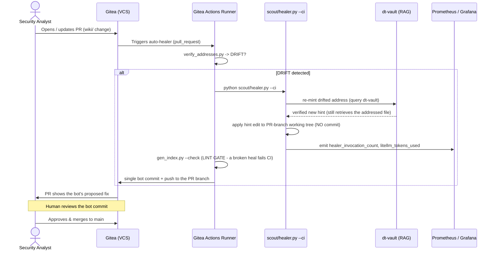

# Technical Blueprint: CI/CD Pipelines, Auto-Healer, & Observability (Revised)

**Document Version:** 2.1
**Status:** Revised for review — supersedes v2.0 (real `--ci` entrypoint, no double-commit, dept-set RLS signal)
**Target Audience:** DevOps Engineers, SecOps Analysts, Backend Developers
**Related Components:** `scout/healer.py`, `scripts/verify_addresses.py`, Prometheus, Grafana
**Related Documents:** `Technical_Blueprint_V2_RAG.md`, `Technical_Blueprint_Basic_Memory_Gitea.md`

> **What changed from v2.0 (matches the shipped code):**
> 1. **Real entrypoint.** The healer is invoked as `python scout/healer.py --ci`, not the phantom `--mode ci-cd --commit-target`. That flag exists in `scout/healer.py` and applies heals to the *current PR branch's working tree* (guarded — it refuses to run on `main`/`master`).
> 2. **No double-commit.** The healer applies edits but does **not** commit. The workflow **lints as a gate**, then makes a **single** bot commit to the PR branch. (v2.0 had the healer *and* the workflow both committing.)
> 3. **PR-first is explicit.** The bot commit lands on the analyst's PR branch; a human reviews it before merge to `main`. The healer never mutates `main` directly.
> 4. **RLS signal is dept-set, not clearance.** `rls_rejection_count` counts denials where the caller's departments don't overlap a document's `allowed_depts` (per the revised RAG blueprint), not a `role_id`/clearance integer.
> 5. **Egress is honest.** Token-burn monitoring exists precisely because model calls go to the **company LiteLLM gateway → cloud** (this system is not air-gapped). That's a feature of the cost model, not a contradiction.
>
> **Phase note:** this is the CI/CD-phase plan. It is **engine-agnostic** (drives the V1 `RagAnythingHttpBackend` today via `RAG_HTTP_URL`), so it does **not** require the V2 RAG engine — it requires **CI/CD infrastructure** (Gitea Actions + a self-hosted runner + secrets). Deploy it whenever you stand that up; until then `scout/healer.py` runs fine standalone.

---

## 1. Executive Summary

This blueprint expands the healer from a local background task into a **CI/CD pipeline with integrated observability**. By embedding the auto-healer into Gitea Actions, every automated change to the `knl-vault` (`wiki/`) is a **bot commit on a pull request that a human reviews** before merge. It also adds **telemetry**: LiteLLM token spend (cloud cost), RLS security rejections (an insider/misconfig signal), and pipeline health, surfaced via Prometheus and Grafana.

---

## 2. Architecture Overview & Sequence Flow

Two triggers, matching the healer's two modes:
- **`pull_request`** → `--ci`: heal drift in the analyst's in-flight PR (bot commit on that PR branch → human review).
- **`schedule`** → `--push`: sweep already-merged content; the healer opens its **own** heal PR off `main`.

### Sequence: PR-path auto-heal (the `--ci` mode)



---

## 3. Core Components Deep Dive

### 3.1. The Verification Gate & PR-First Healer
`scripts/verify_addresses.py` is the trigger. On `DRIFT`/`FAIL`:
- **PR path (`--ci`):** the healer re-mints against the `dt-vault`, and **applies** the corrected hint to the PR branch's working tree — it does **not** commit or push. The workflow lints, then commits once. A stale re-mint that breaks the index fails the lint gate and never ships.
- **Scheduled path (`--push`):** for drift in already-merged pages, the healer opens its own `heal/addresses-<ts>` PR off `main`.
- Both keep a human between the bot and `main` — the healer is instrumented (OpenTelemetry) so every LiteLLM call it makes logs its token count, preventing runaway billing on a pipeline loop.

### 3.2. Telemetry & Observability (Cost & Security Auditing)

**A. Pipeline metrics (Grafana dashboard 1)**
- `ci_pipeline_success_rate` — how often analysts write correct addresses vs. how often the bot steps in.
- `healer_token_burn` — LiteLLM/cloud spend incurred by the auto-healer during CI runs.

**B. Runtime security metrics (Grafana dashboard 2)**
- `rls_rejection_count` — how often Postgres RLS blocks a retrieval because the caller's **departments do not overlap the document's `allowed_depts`**. A spike means a misconfigured agent or an insider probing for documents outside their department set.
- `rag_latency_ms` — pgvector cosine-similarity search latency.

---

## 4. Integration Point: Workflow Configuration

The reconciled workflow (`.gitea/workflows/auto-healer.yaml`). The healer applies; the workflow lints then commits **once** to the PR branch. A separate scheduled job opens a heal PR for merged content.

```yaml
name: Vault Verification & Auto-Healer

on:
  pull_request:
    paths: ['wiki/**/*.md']
  schedule:
    - cron: '0 0 * * 0'   # weekly sweep

permissions:
  contents: write
  pull-requests: write

jobs:
  # PR path: heal drift on the analyst's PR branch (bot commit -> human review)
  pr-heal:
    if: github.event_name == 'pull_request'
    runs-on: self-hosted            # must reach the company LiteLLM gateway; not public
    env:
      LITELLM_MASTER_KEY: ${{ secrets.LITELLM_MASTER_KEY }}   # secret, never hardcoded
      RAG_HTTP_URL: ${{ vars.RAG_HTTP_URL }}
      OTEL_EXPORTER_OTLP_ENDPOINT: "http://internal-telemetry:4317"
    steps:
      - uses: actions/checkout@v4
        with: { token: "${{ secrets.BOT_TOKEN }}", ref: "${{ github.head_ref }}" }
      - uses: actions/setup-python@v5
        with: { python-version: '3.12' }
      - run: curl -LsSf https://astral.sh/uv/install.sh | sh && uv sync

      - name: Verify addresses
        run: |
          if ! uv run python scripts/verify_addresses.py; then
            echo "DRIFT_DETECTED=true" >> "$GITHUB_ENV"
          fi

      - name: Heal (CI mode - applies to this PR branch, no commit)
        if: env.DRIFT_DETECTED == 'true'
        run: uv run python scout/healer.py --ci

      - name: Lint gate (a broken heal fails CI - nothing gets pushed)
        if: env.DRIFT_DETECTED == 'true'
        run: uv run python scripts/gen_index.py --check

      - name: Commit and push bot fix (single commit)
        if: env.DRIFT_DETECTED == 'true'
        run: |
          git config user.name  "SNP Vault Healer Bot"
          git config user.email "bot@snp-memory.local"
          git add wiki/
          if git diff --cached --quiet; then
            echo "Healer produced no changes."
          else
            git commit -m "bot: auto-heal drifted RAG citation(s) [skip ci]"
            git push origin "HEAD:${{ github.head_ref }}"
          fi

  # Scheduled sweep: already-merged drift -> healer opens a heal PR off main
  scheduled-sweep:
    if: github.event_name == 'schedule'
    runs-on: self-hosted
    env:
      LITELLM_MASTER_KEY: ${{ secrets.LITELLM_MASTER_KEY }}
      RAG_HTTP_URL: ${{ vars.RAG_HTTP_URL }}
    steps:
      - uses: actions/checkout@v4
        with: { token: "${{ secrets.BOT_TOKEN }}", ref: main, fetch-depth: 0 }
      - uses: actions/setup-python@v5
        with: { python-version: '3.12' }
      - run: curl -LsSf https://astral.sh/uv/install.sh | sh && uv sync
      - name: Configure bot identity
        run: |
          git config user.name  "SNP Vault Healer Bot"
          git config user.email "bot@snp-memory.local"
      - name: Sweep and open a heal PR
        run: uv run python scout/healer.py --push --base main
```

---

## 5. Security Model & Data Protection

### 5.1. Preventing Pipeline Injection
`verify_addresses.py` and `healer.py` do **not** execute anything in the Markdown; they parse YAML frontmatter with `yaml.safe_load`. Re-minting queries the RAG for a hint — it never runs page content.

### 5.2. Secrets Handling
The gateway key is a **CI secret** (`${{ secrets.LITELLM_MASTER_KEY }}`) — never hardcoded in scripts or committed. (See `SECRET_SCRUB_RUNBOOK.md` for rotating and purging the key that was previously committed.)

### 5.3. Network Boundaries
Run the healer on a **self-hosted runner** on the internal network. It needs egress to the **company LiteLLM gateway** (this system is not air-gapped) and to the internal OpenTelemetry collector — but neither the gateway nor the collector should be exposed to the public internet.

### 5.4. Runaway-Cost Guard
If `healer_token_burn` exceeds a daily budget (e.g., $5/day), Grafana fires an alert — catching a recursive CI loop before it drains the gateway budget. The `[skip ci]` tag on the bot commit prevents the heal commit from re-triggering the workflow.
