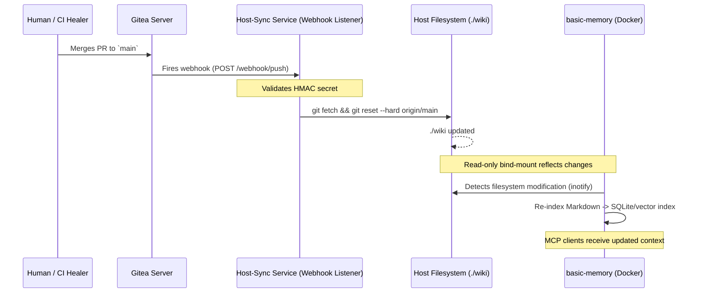

# Technical Blueprint: Gitea & basic-memory Integration (Zero-Credential Host-Sync)

**Document Version:** 1.1
**Status:** Revised for review — supersedes v1.0 (honest egress; air-gap claim removed)
**Target Audience:** Infrastructure Engineers, SecOps Architects
**Related Components:** `basic-memory` (knl-vault engine), `Gitea`
**Related Documents:** `Technical_Blueprint_V2_RAG.md` §6 (egress posture)

> **What changed from v1.0:** the title and network claims called this an
> "Air-Gapped Workflow" with "zero ingress **and** egress." That is inaccurate:
> the system reaches a **company-hosted LiteLLM gateway** (which fronts cloud
> providers) for embeddings. The genuinely strong idea here — a **zero-credential
> engine** that has no path back to Gitea — is unchanged and kept intact. Only
> the framing is corrected: **no public ingress; controlled egress to one vetted
> gateway. Not air-gapped.**

---

## 1. Executive Summary

In V2, **Gitea** becomes the definitive source of truth for the `knl-vault` (the `wiki/` directory). This blueprint details the mechanical integration between the Gitea repository and the `basic-memory` MCP engine.

The core architectural mandate is a **zero-credential, least-privilege posture for the engine itself**: the `basic-memory` container is **not** granted Git credentials, holds **no** SSH keys, and does **not** talk to Gitea directly. Sync happens out-of-process via a webhook-driven host service and read-only bind mounts. This is a hardening property of the *engine*, and it holds regardless of the system's egress posture — which is **not** air-gapped: model calls leave the host to the company LiteLLM gateway (see §6).

---

## 2. Architecture Overview & Data Flow

Gitea handles version control; a lightweight host-sync service handles the network fetch; `basic-memory` handles purely filesystem-based indexing.



---

## 3. Design Decisions & Rationale

### 3.1. Zero-Credential Container (`basic-memory`)
**Decision:** `basic-memory` never runs `git pull` and has no Gitea tokens.
**Rationale:** it exposes an MCP server (port 8765) to AI agents. If a malicious agent achieved RCE inside the container via a parser zero-day, it would find **no Git credentials and no network path back to Gitea**. The engine is ignorant of version control. *(This property is independent of egress — it holds whether models are local or cloud.)*

### 3.2. Host-Level Sync Service
**Decision:** the `git pull` runs on the Docker host (or a dedicated sidecar with no incoming ports except the webhook).
**Rationale:** least privilege — the sync service has only a read-only deploy key; `basic-memory` has only read access to the resulting files.

### 3.3. Read-Only Bind Mounts
**Decision:** `wiki/` is mounted into `basic-memory` with `:ro`.
**Rationale:** (R-2.5) `basic-memory` is *mechanically* incapable of mutating the vault — the Docker daemon blocks writes even if application logic fails.

---

## 4. Core Components Deep Dive

### 4.1. Gitea Webhook Configuration
Fires only on `push` to `main`.
- **Endpoint:** `http://internal-sync-host:9000/hooks/wiki-update`
- **Security:** HMAC-SHA256 signed, so a forged request can't trigger false pulls (SSRF).

### 4.2. The Host-Sync Service (Webhook Receiver)
A minimal hardened service (Go `webhook` by adnanh, or a tiny Flask app).
- **Validation:** verifies the HMAC signature.
- **Execution:** `cd /opt/snp-memory-system && git fetch && git reset --hard origin/main`. `reset --hard` enforces Gitea as source of truth (reverts any accidental host-side mutation). *(Only safe because the host copy of `wiki/` is a read replica — nothing else writes to it.)*

### 4.3. The `basic-memory` File Watcher
A filesystem indexer backed by SQLite.
- **Function:** OS-level file-modification events (`inotify`).
- **Execution:** on change, it parses the new frontmatter, re-embeds the `summary`, and updates the SQLite index.
- **Embedding choice (matters for egress — see §6.4):** `basic-memory` can embed **either** via the LiteLLM gateway (bge-m3, consistent with `dt-vault`) **or** via **in-process FastEmbed** (local, no network). The choice changes whether the `knl-vault` path has egress at all.

---

## 5. Deployment Architecture

```text
===================================================================================
                             VLAN 10: INTERNAL INFRASTRUCTURE
===================================================================================

  [ Gitea Server ]  (SSH keys, user DB, repos)
        │  Webhook (internal HTTP)
        ▼
===================================================================================
                             VLAN 20: SNP MEMORY SYSTEM HOST
===================================================================================

  ┌────────────────────────────────────────────────────────────────────────┐
  │ DOCKER HOST (Ubuntu Linux)                                             │
  │                                                                        │
  │  [Host-Sync Service] <---- Webhook Receiver (Port 9000)                │
  │         │ (executes git pull)                                          │
  │         ▼                                                              │
  │  [Host FS: /opt/snp-memory-system/wiki]                               │
  │         │ (bind mount -v ./wiki:/vault:ro)                            │
  │ ┌────────────────────────────────────────────────────────────────────┐ │
  │ │ DOCKER NETWORK                                                     │ │
  │ │  [basic-memory] <-- MCP agents ; reads /vault:ro ; SQLite index    │ │
  │ │  [rag-brdg]     <-- MCP agents ; reads /vault:ro                    │ │
  │ │  [litellm]  ----> EGRESS: company LiteLLM gateway -> cloud providers│ │
  │ └────────────────────────────────────────────────────────────────────┘ │
  └────────────────────────────────────────────────────────────────────────┘

  Egress: ONLY the litellm container leaves VLAN 20, and ONLY to the company
  LiteLLM gateway. No public ingress to any component.
```

---

## 6. Security Model & Failure Modes

### 6.1. Network Posture — no public ingress, controlled egress (NOT air-gapped)
Gitea and the SNP Memory System sit on the internal network with **no public ingress**. There **is** egress: the `litellm` container reaches the **company LiteLLM gateway**, which fronts cloud providers (for embeddings, and for VLM/LLM on the `dt-vault` side). The accurate description is *"no public ingress; egress restricted to one vetted gateway,"* not *"air-gapped."*

### 6.2. The prerequisite that replaces "no egress"
Because content transits the gateway to cloud subprocessors (see `Technical_Blueprint_V2_RAG.md` §6.2): confirm the gateway's providers are on **zero-data-retention / no-training** terms; confirm **client NDAs permit** those subprocessors (exclude engagements that don't); and disable request-body logging for the key on the gateway.

### 6.3. Handling Sync Failures
If Gitea or the host-sync service is down, `basic-memory` keeps serving the last SQLite state — it degrades gracefully to slightly stale data rather than failing. Sync failures are logged to an internal monitor (Prometheus/Grafana) for operator alerts.

### 6.4. Egress-minimization option (worth considering)
If `basic-memory` embeds with **in-process FastEmbed** (§4.3) instead of the gateway, the **`knl-vault` path becomes fully egress-free** — your *compiled, curated* knowledge never leaves the host, and cloud exposure is limited to `dt-vault` raw-report retrieval. For a team under client NDAs, keeping the curated wiki on-box while accepting egress only for raw-report queries is a meaningfully smaller exposure surface. Trade-off: FastEmbed and the gateway's bge-m3 are different embedders, so wiki-search recall (especially Vietnamese — Gate 4) must be validated on whichever you pick.

### 6.5. Race Conditions During Pull
`git reset --hard`/`git pull` aren't filesystem-atomic; `basic-memory` may read a file mid-write. **Mitigation:** file locking + retry; an `inotify` event during a partial write yields a caught YAML parse error, and the file is re-queued for indexing on the next tick.
