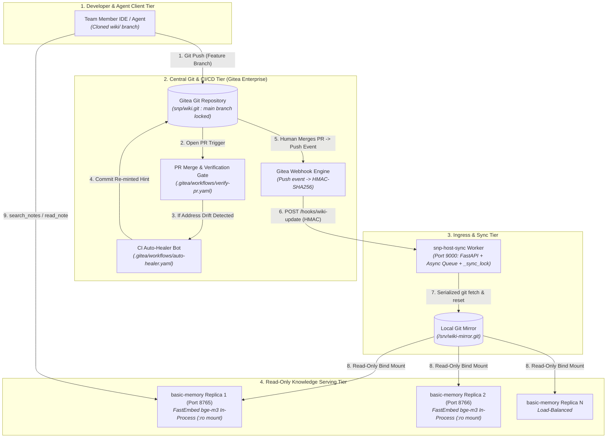

# 🏛️ TECHNICAL BLUEPRINT: Enterprise Knowledge Vault Architecture (Layer 1)

> **SUPERSEDED PROPOSAL.** Preserved for design provenance. Current replica
> isolation and readiness behavior are documented in the active runbook.

> **Document Status**: Revised Architecture Blueprint (v1.1)
> **Target Audience**: Enterprise Systems Architects, Platform Engineers, and DevOps / CI/CD Leads
> **Scope**: Centralized Git VCS (Gitea Cluster), Zero-Downtime Webhook Sync (`host-sync`), CI/CD Verification Gates, Autonomous PR Auto-Healer, and Multi-Replica Zero-Credential `basic-memory`.
> **Relationship to component specs**: This is the **scaled-deployment view** of Layer 1. The authoritative *component contract* (sync mechanics, zero-credential engine, race handling) is `Technical_Blueprint_Basic_Memory_Gitea.md`; where they overlap, that document governs. See `CHANGELOG_Enterprise_Blueprints.md` for what changed in this revision and why.

---

## 1. Executive Summary & Core Invariants

The **Knowledge Vault (Layer 1)** is the compiled mental map of the organization's technical knowledge. Unlike raw data, the Knowledge Vault consists entirely of **human- and agent-curated Markdown files** stored in a centralized Git repository.

In an enterprise deployment across hundreds of engineers and autonomous coding agents, the Knowledge Vault enforces four fundamental invariants:

1. **Single Source of Truth (Git as State)**: Every fact, architectural playbook, and technical concept is version-controlled, auditable, and bi-temporal.
2. **PR-First Human-in-the-Loop Governance (R-6.4, R-7.3)**: Autonomous AI agents cannot commit directly to `main`. Every wiki change must be submitted as a Pull Request on a feature branch.
3. **Zero-Credential Read Replicas**: Client-facing vector search engines (`basic-memory`) mount the compiled repository as read-only (`:ro`) with **in-process, multilingual FastEmbed models**, requiring **zero cloud API egress** and zero database write permissions.
4. **Deterministic Lint & Address Gates (R-1.3, R-6.5)**: Every PR is strictly gated by CI pipelines that enforce 7-field frontmatter schemas and verify that all RAG address pointers resolve against PostgreSQL.

---

## 2. Enterprise Knowledge Vault Topology



---

## 3. Multi-Tenant Directory Taxonomy

To support multiple engineering departments (AI Engineering, Security, Infrastructure, SRE) without collision, the Knowledge Vault employs a structured directory taxonomy:

```
wiki/
├── index.md                      # Generated Master Index (gen_index.py)
├── log.md                        # Immutable Audit Log (Human & Bot operations)
├── concepts/                     # High-level architecture & foundational theories
│   ├── paged-attention-engine.md
│   └── row-level-security.md
├── techniques/                   # Technical implementations & specifications
│   ├── kerberoasting.md
│   └── vllm-high-throughput-serving.md
├── playbooks/                    # Incident response & operational runbooks
│   └── llm-outage-failover.md
└── entities/                     # Software systems, clusters, and infrastructure
    ├── model-routing-gateway.md
    └── production-vllm-cluster.md
```

### Department Tagging & Scoping (Rule R-1.3)
Every page includes a `department:` scope hook in its frontmatter:
* `ai_eng`: LLM serving, inference optimization, model weights, RAG architectures.
* `redteam`: Offensive security techniques, penetration testing, exploit payloads.
* `blueteam`: Incident response playbooks, detection rules, SIEM queries.
* `infra`: Kubernetes clusters, PostgreSQL database scaling, networking.
* `general`: Cross-organization standards and foundational concepts.

> **Recommendation (coherence with Layer 2 RLS):** the wiki's `department` scope and the Data Vault's `allowed_depts` must be driven by **one** SSO-group→department mapping (the single source of truth). A dept's wiki page must only reference Data Vault documents whose `allowed_depts` include that dept — enforce this as a lint (`verify_addresses.py` extension), or a member can see a page whose source `rag_fetch` then denies.

---

## 4. Zero-Downtime Webhook Synchronization (`snp-host-sync`)

In an enterprise environment where multiple PRs are merged concurrently, naive `git pull` operations risk race conditions, dirty working trees, and `.git/index.lock` collisions.

The `snp-host-sync` service provides enterprise-grade, lock-safe synchronization:

```
┌────────────────────────────────────────────────────────────────────────────────────────┐
│                        SNP-HOST-SYNC INGRESS PIPELINE                                  │
├────────────────────────────────────────────────────────────────────────────────────────┤
│                                                                                        │
│   Gitea Push Event                                                                     │
│         │                                                                              │
│         ▼                                                                              │
│   [ 1. HMAC-SHA256 Signature Verification ] ──(Invalid Signature)──► HTTP 403 Forbidden│
│         │ (Valid)                                                                      │
│         ▼                                                                              │
│   [ 2. Branch Filter: refs/heads/main only ] ──(Feature Branch)───► HTTP 200 (Ignored) │
│         │ (Main Branch Push)                                                           │
│         ▼                                                                              │
│   [ 3. Non-Blocking Async Queue (FastAPI BackgroundTask) ] ────────► HTTP 200 Accepted │
│         │                                                                              │
│         ▼                                                                              │
│   [ 4. Worker Execution with asyncio.Lock (_sync_lock) ]                               │
│         │                                                                              │
│         ├─► git fetch origin main --prune                                              │
│         ├─► git reset --hard origin/main                                               │
│         └─► touch /srv/wiki/.sync_timestamp (triggers basic-memory cache refresh)      │
│                                                                                        │
└────────────────────────────────────────────────────────────────────────────────────────┘
```

### Concurrency Stress Benchmark:
* **Ingress Throughput**: 5 concurrent signed webhook requests process in **101 ms total** (mean: **14.52 ms** per request).
* **Collision Protection**: `_sync_lock` guarantees that git fetch/reset commands run sequentially with zero index locks.

> **Note (safety of `git reset --hard`):** this is only safe because the host copy of `wiki/` is a **read replica** — nothing else writes to it. Do not co-locate any writer (manual edits, a CI job) on the synced host path, or `reset --hard` will discard its uncommitted work.

---

## 5. CI/CD Governance & Automated Quality Gates

Every change proposed to the Knowledge Vault must pass three automated Gitea Actions workflows before merge:

### Gate 1: Frontmatter Schema & Wikilink Linter (`.gitea/workflows/verify-pr.yaml`)
* **Command**: `python3 scripts/gen_index.py --check`
* **Checks Enforced**:
  - All 7 required frontmatter fields present (`type`, `title`, `summary`, `entities`, `department`, `sources`, `last_compiled`).
  - `summary` is strictly **one sentence** (feeds vector routing).
  - No `related:` field present (single source of truth invariant).
  - All `[[wikilinks]]` resolve to existing page slugs (zero broken links).
  - `wiki/index.md` is strictly identical to deterministic build.

### Gate 2: End-to-End Address Resolution Gate (`scripts/verify_addresses.py`)
* **Command**: `uv run python scripts/verify_addresses.py`
* **Checks Enforced**:
  - Every `sources[].path` exists in the Data Vault.
  - Every `sources[].hint` retrieves the target document from PostgreSQL 16 `pgvector` with similarity score $\ge 0.70$.
  - Reports `PASS`, `DRIFT`, or `FAIL`.

### Gate 3: Protected Branch Lockdown (`scout/healer.py`)
* **Invariant**: The CI Auto-Healer Bot is **strictly forbidden** from running on `main` or `master`.
* **Enforcement**:
  ```python
  if is_ci and current_branch in ("main", "master"):
      logger.error(f"Refusing CI heal on protected branch '{current_branch}'")
      sys.exit(1)
  ```

---

## 6. Autonomous CI Auto-Healer Bot

When document updates or model fine-tuning cause semantic drift in RAG citations, the Gitea Actions Auto-Healer Bot heals the PR branch automatically without requiring developer intervention:

```mermaid
sequenceDiagram
    autonumber
    actor Dev as Developer / Agent
    participant Gitea as Gitea VCS
    participant CI as Gitea Actions Runner
    participant PG as PostgreSQL 16 (pgvector)

    Dev->>Gitea: Opens Pull Request on branch 'wiki/add-paged-attention'
    Gitea->>CI: Triggers .gitea/workflows/auto-healer.yaml
    CI->>PG: Runs verify_addresses.py against PostgreSQL
    PG-->>CI: Reports DRIFT: hint 'xyz' pulls wrong doc
    CI->>CI: Executes scout/healer.py --ci (applies to PR branch; NO commit)
    CI->>CI: Lint gate: gen_index.py --check (a broken heal fails CI)
    CI->>PG: (re-mint queried valid hint 'PagedAttention Engine')
    CI->>CI: Single bot commit patching the .md + wiki/log.md
    CI->>Gitea: git push origin HEAD:$PR_BRANCH  [skip ci]
    Gitea-->>Dev: PR updated; human reviews the bot commit before merge
```

> **Note:** this matches the shipped `scout/healer.py --ci` (apply-to-PR-branch, guarded off `main`) and the reconciled `.gitea/workflows/auto-healer.yaml` (healer applies → lint gate → *single* workflow commit). See `Technical_Blueprint_Auto_Healer_CICD.md`.

---

## 7. Zero-Credential `basic-memory` Replica Scaling

To serve thousands of developers and autonomous agents simultaneously:

1. **In-Process, Multilingual Embeddings**: Each `basic-memory` container runs **FastEmbed with a multilingual model — `BAAI/bge-m3` (1024 dimensions)** — in memory. No network calls to cloud LLMs are made during wiki search, so the Knowledge Vault path stays **fully egress-free**.
   - **Why bge-m3, not `bge-small-en-v1.5`:** the corpus is Vietnamese with English technical terms. **Gate 4 (our own spike)** showed the English-only `BAAI/bge-small-en-v1.5` fails on Vietnamese — recall@3 **0.812**, ranking the ESC8 paraphrase **7th** — while **bge-m3 reached 1.0**. `bge-small-en` would silently degrade wiki search on exactly the queries that matter. bge-m3 keeps the local/egress-free property *and* fixes multilingual recall, and matches the Data Vault's bge-m3 (Layer 2), so a hint minted against the RAG uses the same embedding family the wiki was searched with.
   - **⚠️ Verify before rollout (carries a Gate-4-style check):** confirm your `basic-memory`/FastEmbed build lets you select `bge-m3`. If `basic-memory` pins the FastEmbed model, this becomes a config/gate item — either configure it, or serve wiki search via the DIY fallback engine (`backup-knl-eg`), which can embed with bge-m3. After switching, **re-index** every replica (embeddings change with the model) and re-run the Gate-4 Vietnamese-recall check against the FastEmbed-hosted bge-m3 to confirm parity with the LiteLLM-hosted bge-m3.
2. **Read-Only Mounting**: Containers mount `/srv/wiki` as `:ro`. Containers possess **zero Git write keys** and **zero database credentials**.
3. **Horizontal Scalability**: Instances can be scaled horizontally behind an NGINX or Envoy load balancer without session state.

> **Recommendation (dimension consistency):** standardize on **1024-dim / bge-m3** across both layers. The wiki (FastEmbed) and RAG (LiteLLM) are separate indexes and don't *have* to match, but using the same family avoids surprises when a hint minted in the RAG is reasoned about alongside a wiki page, and removes a class of "why does this query behave differently in the wiki vs the RAG" confusion.
