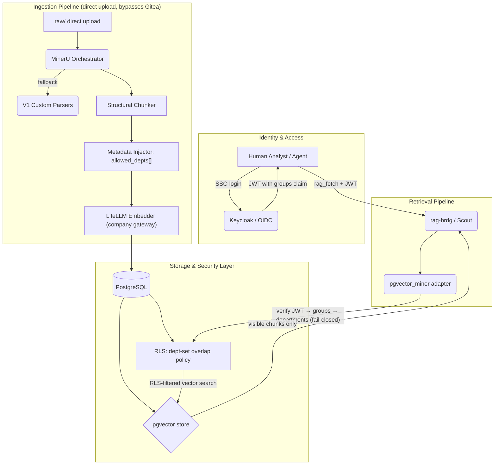

# Technical Blueprint: V2 RAG System Architecture (Revised)

> **SUPERSEDED PROPOSAL.** Preserved for design provenance. Use the implemented
> Cloud API + pgvector/RLS contract in `docs/ARCHITECTURE_STATUS.md`.

**Document Version:** 3.0
**Status:** Revised for review — supersedes v2.4 (dept-set RBAC, fail-closed auth, honest egress)
**Target Audience:** Systems Architects, Security Engineers, Backend Developers
**Related Documents:** `Suggestion_V2_RAG_Replacement.md`, `V2_RBAC_Spikes.md`, `Proposal_SNP_Memory_System_v2.md`

> **What changed from v2.4 (and why):**
> 1. **Access model is department *sets*, not a linear `clearance INT`.** Departments (redteam/blueteam/appsec/…) are peers with need-to-know, not a hierarchy. A clearance integer would let a higher-numbered role read every lower-numbered department — the exact peer-leak the whole design exists to prevent. A document now carries a **set** of allowed departments; access = **set overlap** with the caller's departments. This also lets a report be shared across several departments (which v2.4's single `department` column could not represent).
> 2. **RLS session variable is set via a bound parameter**, never string-formatted — the previous `f"SET LOCAL ... = '{clearance}'"` was a SQL-injection shape on the one line that establishes the security context.
> 3. **SSO auth fails *closed*.** A missing/expired/forged token is a rejection, not a silent downgrade to "public."
> 4. **Egress is stated honestly.** This system is **not air-gapped**: embeddings and generations go to the **company-hosted LiteLLM gateway**, which fronts cloud providers. See §6.

---

## 1. Executive Summary

The SNP Memory System V1 proved the dual-vault architecture: a compiled Wiki (`knl-vault`) for human-curated knowledge and a multimodal RAG engine (`dt-vault`) for raw security reports. The V1 `dt-vault` engine (`RAG-Anything`) uses a monolithic Knowledge Graph that conflicts with per-department Role-Based Access Control (RBAC).

The V2 `dt-vault` replaces it with a database-enforced retrieval pipeline: **PostgreSQL + pgvector + Row-Level Security (RLS)**, fed by the **MinerU** extraction framework, and gated by **SSO/OIDC** identity mapped to **department sets**. This revision also decouples `raw/` storage from Gitea and defines Disaster Recovery.

**Egress posture (read this first):** model calls (embeddings, LLM, VLM) leave the host to a **company-hosted LiteLLM gateway** — chosen because department machines cannot host models locally and do useful work at the same time. That gateway fronts cloud providers. This is a deliberate, accepted trade; it is **not** an air-gap. The consequence — raw report content transits the gateway to cloud subprocessors — is addressed in §6, and it carries one hard prerequisite: the gateway's providers must be under **zero-data-retention / no-training** terms, and **client NDAs must permit** those subprocessors.

---

## 2. Architecture Overview



---

## 3. Core Design

### 3.1. Identity & SSO — mapping a request to *departments* (fail-closed)

**Challenge:** Postgres RLS filters rows by department, so the system needs a trustworthy map from a request to the caller's departments — established **server-side**, never asserted by the (untrusted) agent.

**Solution — OIDC + a groups→departments mapping (the single source of truth):**
- The client passes an SSO **JWT** in the `Authorization` header to `rag-brdg`.
- The `pgvector_miner` adapter **verifies** the JWT: signature (RS256 against the IdP's JWKS), `exp`, `iss`, `aud`. **Any failure → deny** (see §5). It does **not** fall back to "public."
- It reads the `groups` claim and maps it through the **one** `groups → departments` mapping that also governs `knl-vault` (Gitea) access (per `V2_RBAC_Spikes` — that single mapping is what keeps the two vaults coherent).
- The resulting department set is injected into the Postgres session as a **bound parameter**, linking the SSO identity to the RLS engine.
- **No departments ⇒ no access** (empty set, denied) — never a default grant.

### 3.2. Data Ingestion Lifecycle (keeping Gitea lean)

**Challenge:** 50 MB PDFs, pentest videos, and heavy spreadsheets in Gitea would bloat the repo and slow the `knl-vault` host-sync.

**Solution — decouple `raw/` from Gitea entirely:**
- **Gitea holds only `wiki/`** (the `knl-vault`).
- Raw files upload directly to the ingestion pipeline (e.g., `POST /ingest` on `rag-brdg`), carrying their **`allowed_depts` set** at upload time (the ingest tagging from `V2_RBAC_Spikes`).
- MinerU parses → chunker → LiteLLM embeds → rows land in Postgres. The original file moves to cold object storage (**S3 / MinIO**) or is discarded, keeping Gitea fast.

### 3.3. Disaster Recovery & Vector Backups

**Challenge:** Re-embedding the whole corpus after a DB loss is unacceptable (cost + time).

**Solution — pgBackRest alongside Postgres:**
- **WAL archiving:** Write-Ahead Logs stream continuously to an internal MinIO bucket.
- **Daily snapshots:** full nightly backups.
- **RPO < 5 min**, and no need to ever re-run MinerU/LiteLLM on historical data after a failure.

---

## 4. Data Model & Schema

```sql
CREATE EXTENSION IF NOT EXISTS vector;

-- A document is visible to a SET of departments (peers, not a hierarchy).
-- A report shared across teams simply lists each team in allowed_depts.
CREATE TABLE rag_documents (
    doc_id       UUID PRIMARY KEY DEFAULT gen_random_uuid(),
    source_uri   TEXT UNIQUE NOT NULL,          -- filename / S3 URI (NOT a git path)
    allowed_depts TEXT[] NOT NULL               -- e.g. {'redteam','appsec'}
        CHECK (cardinality(allowed_depts) > 0), -- never a document nobody can see
    ingested_at  TIMESTAMPTZ NOT NULL DEFAULT now()
);

CREATE TABLE rag_chunks (
    chunk_id   UUID PRIMARY KEY DEFAULT gen_random_uuid(),
    doc_id     UUID NOT NULL REFERENCES rag_documents(doc_id) ON DELETE CASCADE,
    chunk_text TEXT NOT NULL,
    embedding  vector(1024),                    -- bge-m3
    metadata   JSONB
);
CREATE INDEX ON rag_chunks USING hnsw (embedding vector_cosine_ops);

-- Enforce access at the kernel. A chunk inherits its parent document's set.
ALTER TABLE rag_chunks ENABLE ROW LEVEL SECURITY;

-- Visible iff the document's allowed_depts OVERLAPS the caller's departments.
-- current_setting(..., true) returns NULL when unset → policy denies (fail-closed):
-- anything that reaches the table WITHOUT the adapter setting the var sees nothing.
CREATE POLICY dept_overlap_policy ON rag_chunks
    FOR SELECT
    USING (
        (SELECT d.allowed_depts FROM rag_documents d WHERE d.doc_id = rag_chunks.doc_id)
        && string_to_array(current_setting('scout.current_depts', true), ',')
    );
```

> **Operational RLS hardening (do not skip):** the application must connect as a
> **non-superuser role without `BYPASSRLS`** — superuser and `BYPASSRLS`
> connections ignore every policy. If you use a connection pooler (pgBouncer),
> the session var must be set with `set_config(..., true)` inside the **same
> transaction** as the query (transaction-scoped), because transaction pooling
> reuses connections across clients. Both are classic ways RLS silently leaks.

---

## 5. Integration Point — `rag-brdg` adapter (parameterized, fail-closed)

```python
# scout/backends/pgvector_miner.py
import jwt
from jwt import PyJWKClient

# Configured once from the IdP's discovery document.
_jwks = PyJWKClient(OIDC_JWKS_URL)


class AuthError(PermissionError):
    """Raised on any SSO failure — the caller is DENIED, never downgraded."""


def _departments_for(token: str) -> list[str]:
    """Verify the SSO token and resolve the caller's departments. Fail closed."""
    if not token:
        raise AuthError("no SSO token presented")
    try:
        signing_key = _jwks.get_signing_key_from_jwt(token).key
        claims = jwt.decode(
            token,
            signing_key,
            algorithms=["RS256"],
            audience=OIDC_AUDIENCE,
            issuer=OIDC_ISSUER,
            options={"require": ["exp", "iss", "aud"]},  # reject if missing
        )
    except jwt.PyJWTError as exc:  # malformed / expired / bad signature
        raise AuthError(f"invalid SSO token: {exc}") from exc

    # One mapping — the same one that governs knl-vault (Gitea) access.
    departments = map_groups_to_departments(claims.get("groups", []))
    if not departments:
        raise AuthError("token carries no department grant")
    return departments


async def rag_retrieve(
    hint: str, *, path: str | None = None, token: str | None = None, k: int = 5
):
    """RLS-enforced vector retrieval. Departments come from a verified token."""
    departments = _departments_for(token)  # raises AuthError → 403 upstream
    query_vector = await litellm_embedder.embed(hint)  # via the company gateway
    depts_csv = ",".join(departments)

    async with db.transaction():
        # Bound parameter — NEVER an f-string — on the security-context var.
        await db.execute(
            "SELECT set_config('scout.current_depts', $1, true)", depts_csv
        )
        if path:  # optional pre-filter to a specific source (bound, not formatted)
            rows = await db.fetch(
                """
                SELECT c.chunk_text, c.metadata, c.doc_id
                FROM rag_chunks c
                JOIN rag_documents d ON d.doc_id = c.doc_id
                WHERE d.source_uri = $2
                ORDER BY c.embedding <=> $1 ASC
                LIMIT $3
                """,
                query_vector,
                path,
                k,
            )
        else:
            rows = await db.fetch(
                """
                SELECT chunk_text, metadata, doc_id
                FROM rag_chunks
                ORDER BY embedding <=> $1 ASC
                LIMIT $2
                """,
                query_vector,
                k,
            )
    return rows
```

Notes:
- `rag-brdg` translates `AuthError` into a **403** to the agent — a denied request returns *nothing*, not public data.
- RLS is a **pre-filter** (a row predicate), so `LIMIT k` returns *k visible* chunks — no recall loss from post-filtering, and no cross-department leakage into the candidate set.
- The adapter still honors the wrapper's rules from V1: quote-and-cite only, no instruction execution (injection guard), and `only_need_context` semantics.

---

## 6. Security Model & Egress (honest)

### 6.1. Network posture — deliberate egress, not air-gapped
Gitea, Postgres, MinIO, and the MCP services sit on an internal network with **no public ingress**. There **is** egress: the `litellm` gateway (company-hosted) is reached by the ingestion and retrieval paths for embeddings/LLM/VLM, and that gateway fronts cloud providers. **Do not describe this system as air-gapped.** The threat model is "no public ingress; egress restricted to one vetted company gateway," which is different from "no egress."

### 6.2. The prerequisite that replaces "no egress"
Because raw report content is embedded and (for VLM captions) sent through the gateway to cloud subprocessors, before production:
- Confirm the gateway's providers are on **zero-data-retention / no-training** contracts (enterprise endpoints, not consumer defaults).
- Confirm **client NDAs permit** these subprocessors; if a specific engagement forbids third-party processing, that client's reports must be excluded from ingestion (or handled by a local model path).
- Turn **off request-body logging** for this key on the gateway, so report text is not persisted in the proxy's own store.

### 6.3. Enforcement failure modes
- **Adapter bypassed / var unset:** RLS denies (NULL overlap) — fail-closed at the DB.
- **Bad token:** `AuthError` → 403 — fail-closed at the adapter.
- **Superuser/`BYPASSRLS` connection:** would bypass RLS — mitigated by connecting as a restricted role (§4 hardening).
- **Insider probing:** `rls_rejection_count` (see the CI/CD & Observability blueprint) surfaces spikes of denied retrievals as a misconfig/insider signal.
