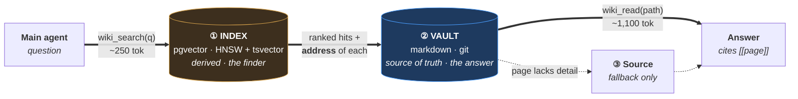
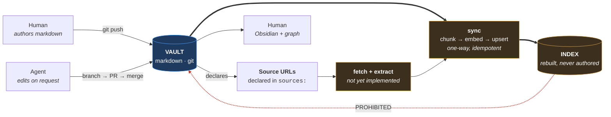
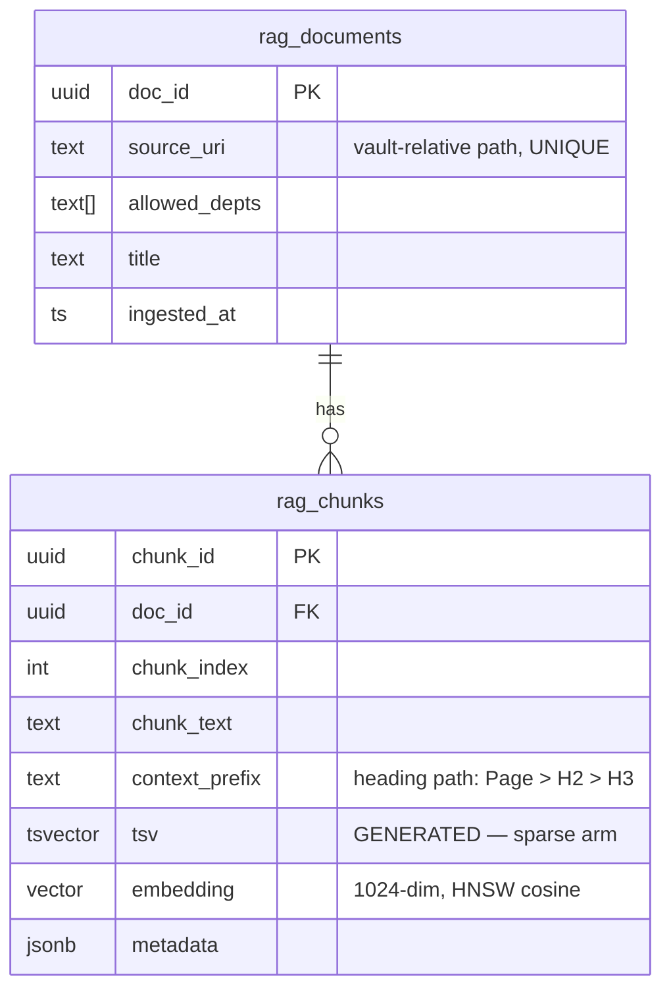
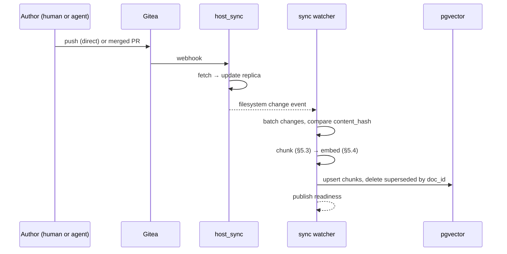
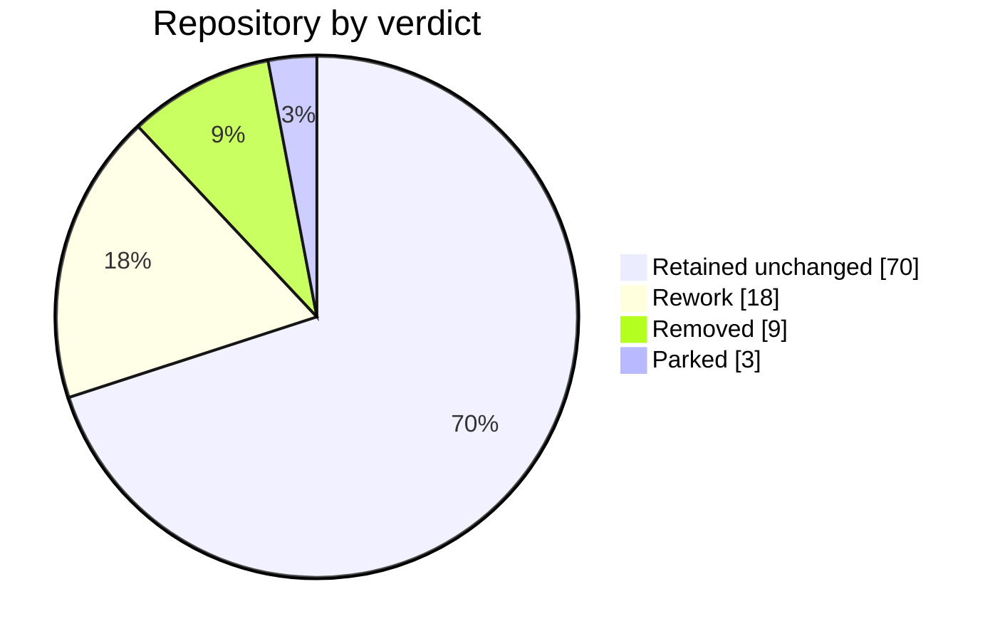
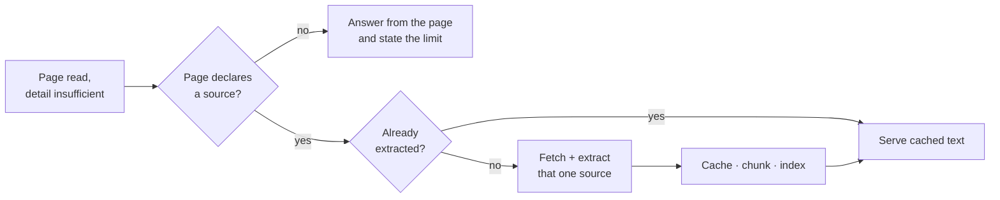

# Technical Blueprint V3 — Reworked Retrieval Architecture

> **DOMAIN REFERENCE, NOT SNP DEPLOYMENT AUTHORITY** — active proposal. The deployed contract remains the code and `AGENTS.md` until this is implemented and verified.

| | |
|---|---|
| **Status** | Active proposal, v3.1 |
| **Date** | 2026-08-27, revised 2026-08-28 |
| **Supersedes** | `Technical_Blueprint_Enterprise_Knowledge_Vault.md`, `Technical_Blueprint_Enterprise_Data_Vault_and_RAG.md`, `Technical_Blueprint_Auto_Healer_CICD.md`, `Suggestion_V2_RAG_Replacement.md`, and the Golden Rule as stated in `CLAUDE.md` / `AGENTS.md` / `.claude/rules/snp-memory.md` |
| **Reference corpus** | 433-page Obsidian vault, measured 2026-08-28 |
| **Audience** | Platform engineers, agent authors |

---

## 1. Scope

### 1.1 Acceptance contract

Three input operations, one output condition. Both actors perform all three
inputs; humans and agents are symmetric on the write side.

| ID | Operation | Surface | Section |
|---|---|---|---|
| **I-1** | `hỏi` — ask a question | `wiki_search` → `wiki_read` | §3.1 |
| **I-2** | `input tài liệu` — add a document | vault write → sync → index | §7.3 |
| **I-3** | `chỉnh sửa wiki` — edit a page | vault write → sync → reindex | §7.2 |
| **O-1** | `trả lời được` — the system answers | agent answer naming a retrievable page | §3.1 |

These four operations form a closed cycle:

```
   add / edit  ──▶  sync  ──▶  index  ──▶  search  ──▶  answer  ──▶  add / edit
```

**Every component is either on this cycle or off it.** On-cycle components are
phase 1. Off-cycle components are deferred regardless of completion state:
address minting, address verification, drift healing, groundedness gating,
department RLS enforcement, release preflight. None is load-bearing for O-1.

### 1.2 Acceptance conditions

O-1 as stated is not falsifiable — any returned string satisfies it. The
operative reading is: **the answer is produced through the system's own
retrieval path and names a page the operator can open.**

Four conditions make an acceptance run meaningful:

| ID | Condition | Rationale |
|---|---|---|
| **H-1** | The agent's only vault access is `wiki_search` + `wiki_read` over MCP. No filesystem read of the vault, no `grep`, no shell. | The vault is a directory inside the agent's working tree. Direct read is faster and more reliable than a degraded retrieval call, so it will be taken whenever available. |
| **H-2** | The corpus is not reachable on the agent's local disk. **Mechanism:** a fresh container per run, no bind mount of the vault, no credentials inside the sandbox; the MCP endpoint is the only route in. | Structurally removes H-1's bypass rather than relying on discipline. Each run starting from clean filesystem state also ensures the result reflects the system and not leftover state. Also ensures the corpus is large enough that retrieval is *necessary* — §5.5. |
| **H-3** | Every answer emits a retrieval trace: query → ranked hits with scores → page read → answer. | Satisfies index-inspection requirements inline rather than as a separate viewer. |
| **H-4** | The run is driven through shipped surfaces — `snpmemory` CLI and MCP tools — not ad-hoc shell. | Any command improvised during a run is a missing CLI command; it must be identified before the run, not during. |

---

## 2. Architecture

### 2.1 Retrieval path

The index is queried first and returns **an address, not an answer**.



### 2.2 Write and sync path



### 2.3 Invariants

| # | Invariant | Enforcement |
|---|---|---|
| **INV-1** | Truth flows one direction: git vault → sync → index. No write path terminates in the index. | Index roles hold no `INSERT` grant from any agent-facing service; writes originate only from `sync`. |
| **INV-2** | The index is disposable. Dropping it and rebuilding from the vault and the source cache reproduces it **up to the embedding model** — same documents, same chunk boundaries, same ordering. | W-5 (§7.5) runs in CI and asserts document count, per-document chunk count, chunk hashes and top-k ordering over a fixed query set. **Never vector equality** — hosted providers revise models behind an alias, so float comparison reports a routine provider update as a violation. |
| **INV-3** | Find is not read. `wiki_search` returns page identity, score and a bounded snippet — never sufficient text to answer from. | Snippet capped at ~40 tokens; chunk bodies are not returned. §3.1. |

**Plain-language equivalent.** The vault is the files on disk; the index is a
search index over them. It is a second store and it does hold copies of the
text, but its function is to identify which file to open. Deleting it and
rebuilding from the files is lossless; deleting the files makes it worthless.
No content originates in it.

INV-3 is a deliberate cost. Search alone could frequently answer from a
retrieved chunk, which would be the token-minimal path. Forcing the page read
costs ~1,100 additional tokens against a corpus of ~0.5M, and yields an answer
grounded in a document an operator can open and verify.

### 2.4 Failure analysis of the current build

The deployed retrieval path cannot locate pages that exist in the reference
corpus. Three independent causes, all measurable.

**F-1 — the index reads frontmatter, not body.**

`scout/diy_engine.py` derives both retrieval arms from frontmatter fields:

```python
summary = str(p.frontmatter.get("summary", ""))        # line 464 — defaults ""
fts5(page_id UNINDEXED, title, summary, entities)      # line 438 — no body
```

Field presence in the reference corpus:

| Indexed field | Present |
|---|---|
| `title` | 399 / 433 |
| `summary` | **0 / 433** |
| `entities` | **0 / 433** |

Consequence: every page embeds the empty string and its full-text row contains
the title alone. Dense vectors are identical across the corpus; ranking is
arbitrary. A page is retrievable only when the query matches its title.

`LLM-Wiki_Blueprint.md` §4.1 states the dependency explicitly — *"`summary` …
là chuỗi được embed để định tuyến … Thiếu → định tuyến trật, nhất là câu hỏi
tiếng Việt không trùng từ khoá"* — and specifies `summary` as required. The
field is absent from the reference corpus and from that corpus's own schema
(§4.4).

**F-2 — two embedding engines, two vector spaces.**

`snp-embed` (LiteLLM route, `dimensions: 1024`) serves the pgvector path;
`snp-wiki` embeds in-process with FastEmbed `bge-small-en-v1.5` @384. Vectors
from different models are not comparable. Cross-space queries return
near-random ordering and raise no error. Documented at
`scout/cli/commands/wiki.py:14`: *"identical queries will return different
orderings."* Resolution: §5.4.

**F-3 — no retrieval surface is reachable.**

The reference deployment exposes no `wiki_search` / `wiki_read`. Any agent
operating against the vault is not calling this system. Resolution: §3.3.

**Resolution of F-1** is §5.3: index chunked page bodies. Frontmatter variance
ceases to affect retrievability, and no page requires editing.

---

## 3. Interfaces

### 3.1 Agent retrieval contract

| Step | Call | Returns | Context cost | Backing |
|---|---|---|---|---|
| 1 | `wiki_search(query, k=5, seen=[])` | `[{path, type, score, snippet}]` — **one row per page** | **~250 tok** | hybrid → group → rerank (§5.6) |
| 2 | `wiki_read(path, mode, section)` | canonical envelope | **40 – 1,100 tok** | markdown file in the vault |
| 3 | `read_source(uri)` | source text | variable | on-demand extraction (§9.1) |

**`wiki_read` returns a canonical envelope** — identical in shape for every
page, irrespective of that page's frontmatter or heading conventions:

```
{
  path, title, type, updated,
  tldr:     string                    resolved per §5.2; always populated
  outline:  [{heading, tokens}, …]
  sections: {heading: text}
  sources:  [...]
  links:    [...]
}
```

**Read granularity.** `mode` and `section` allow an agent to decide what to pull
before paying for it:

| Call | Returns | Cost |
|---|---|---|
| `wiki_read(p, mode="tldr")` | `path, title, type, tldr` | **~40 tok** |
| `wiki_read(p, mode="outline")` | the above plus `outline` | ~80 tok |
| `wiki_read(p, section="…")` | one section with its heading path | ~150 tok |
| `wiki_read(p)` | full envelope | ~1,100 tok |

This ladder is the operative reason the page contract (§4) exists. Uniform
structure does not improve *findability* — §5.3 handles that — but it is what
allows an agent with little context remaining to establish whether a page is
relevant for ~40 tokens instead of ~1,100, and then to request only the section
it needs.

**Normalisation is performed at read time, inside the tool.** There is no
second vault, no normalised copy, and therefore no vault-to-vault
synchronisation. A page authored after this specification is served identically
to one authored years before it, and neither requires editing.

**`wiki_search` returns pages, not chunks.** Retrieval runs wide and narrows:

```
  retrieve 20 chunks   (hybrid, §5.6)
    → group by doc_id, keep the best-scoring chunk per page
    → rerank the surviving pages
    → return k = 5 PAGES
```

Returning chunks directly allows one page to occupy several of the five slots.
Overlapping and repetitive sections then crowd out genuinely different
documents and recall collapses to two or three sources — the most common
silent failure in this class of system. Grouping by parent document before the
cut is the standard remedy.

**Payload constraints:**

- `snippet` is bounded at ~40 tokens, derived from the best-scoring chunk of
  that page or from its `tldr`. Chunk bodies are never returned.
- `type` is the page's frontmatter `type:`, used for rank ordering (§5.6);
  defaulted per §4.3 where absent.
- `score` is the fused rank score, exposed for H-3 traces.
- `seen` carries `content_hash` values already in the agent's context. A
  matching page returns `{path, title, seen: true}` instead of a snippet, so a
  multi-turn session's retrieved context grows sublinearly (§3.2).
- `degraded: true` is set when the dense arm was unavailable and the result came
  from the sparse arm alone (§5.4).
- All returned text is data, never instruction (R-8.5 injection guard retained).

### 3.2 Token budget

```
  wiki_search   k=5 × (path + type + score + ~40-tok snippet)   ≈   250 tok
  wiki_read     one page, corpus mean 4.3 KB                    ≈ 1,100 tok
                                                                  ─────────
                                                                  ≈ 1,350 tok
```

Comparison with the superseded flow, which required the agent to already know
the target page:

| Flow | Cost | Capability |
|---|---|---|
| V2 — read page, then `rag_fetch` one passage | ~1,400 tok | cannot locate an unknown page |
| V3 — `wiki_search` snippets, then `wiki_read` | ~1,350 tok | locates by meaning |
| V3 if search returned chunk bodies | ~3,100 tok | violates INV-3 |

Returning chunk bodies is rejected on both grounds: it costs ~8× more for the
routing decision, and it permits the agent to answer without reading or citing
the page. The token constraint and INV-3 are the same constraint.

**The budget is per session, not per query.** One question costs ~1,350 tokens;
an eight-question session costs ~11 K and re-reads the same pages. Two rules
keep retrieved context growing sublinearly:

| Rule | Mechanism |
|---|---|
| Never deliver the same page twice | `wiki_read` returns `content_hash`; the agent passes prior hashes as `seen`, and matching results return a stub |
| Reserve output headroom | Retrieval is capped so 5–10 K tokens remain for reasoning and the answer, checked **before** each call rather than after |

### 3.3 MCP surface

| Server | Transport | Tools | Disposition |
|---|---|---|---|
| `scout` | streamable-http | `rag_fetch` → **`wiki_search`, `wiki_read`** | Rework. Auth branches, read-only annotations and the injection guard are retained verbatim; only the tool surface changes. |
| `snpmemory` | stdio | `verify`, `plan_articles`, `compile_plan`, `compile_status` | Retained. |
| `snp-wiki` | streamable-http | `search_notes`, `read_note`, `write_note`, `list_notes` | Removed — §8.3. |

### 3.4 CLI surface

`docs/CLI_SPEC.md` governs exit codes, the JSON envelope and error contract, and
is direction-agnostic. It is retained in full, with one deletion: the
`snpmemory search` non-parity caveat, which is void once §5.4 collapses the
system to one embedding engine.

Per-command disposition: §8.2.

---

## 4. Page contract

### 4.1 Frontmatter — adopt the corpus schema

The reference vault carries its own contract at `SCHEMA.md`. **It is adopted
unchanged.**

```yaml
---
title: Page Title
created: YYYY-MM-DD
updated: YYYY-MM-DD
type: entity | concept | comparison | query | summary | schema
tags: [cve, security, openshift]
sources: [https://example.com/source]
confidence: high | medium | low
contested: true                        # optional
contradictions: [other-page-slug]      # optional
---
```

Accompanying conventions, also adopted: lowercase-hyphen filenames; YAML
frontmatter on every page; `[[wikilinks]]` for cross-references; a minimum of
two outbound wikilinks per page; `updated` bumped on edit; new pages added to
`index.md` and changes logged in `log.md`; `raw/` treated as immutable.

**Fields consumed by the pipeline:**

| Field | Consumer | Coverage |
|---|---|---|
| `title` | display, citation, `metadata.title` | 92% |
| `type` | rank ordering (§5.3), `metadata.type` | 92% |
| `sources` | tier-3 addressing, fetch queue (§9.1), `metadata.sources` | 85% |
| `sources[].sha256` | digest of the cached source artifact — written by the fetch stage, not by the author. Makes rebuild reproducible and records which version of a source a page was compiled from (§9.1). | written, not authored |
| `updated` | staleness signal | 80% |
| `tags` | facet filter | 92% |
| `contested`, `contradictions` | rank demotion of superseded pages | sparse |

All other keys — `stars`, `fork`, `license`, `language`, `sha256`, `ingested`,
`source_url`, `confidence`, `author`, `status`, `created`, `aliases` — are
carried into `metadata` unmodified and are not read by retrieval. They encode
capture-path provenance and are not normalised.

**Fields withdrawn as requirements:** `summary`, `entities`, `department`,
`last_compiled`, and `sources` in `{path, loc, hint}` object form. The first is
replaced by `## TL;DR` (§4.2); the second is superseded by body indexing; the
third is deferred with department RLS; the fourth by `updated`; the fifth
depends on address minting, which is removed (§8.3).

**Optional addition:** `aliases: [...]` — alternate designations, folded into
`context_prefix` and therefore searchable. Present on 17% of the corpus.

### 4.2 Body — required heading structure

This is the one change requested against the corpus's existing practice. The
frame is mandatory; the interior is not.

```markdown
# <title>

## TL;DR                      ← recommended, not required (§5.2 resolves it)
2–4 assertive, self-contained sentences.

## <free-form sections>
Existing vocabulary is acceptable: What it is · Why it matters ·
Trade-offs · Cluster position · Open questions · Vấn đề chính · Giảm thiểu

## Provenance
Source attribution; contradictions between sources stated explicitly.

## Cross-References
[[wikilinks]] only.
```

Each mandated heading maps to a defined pipeline behaviour:

| Heading | Required | Pipeline behaviour |
|---|---|---|
| `# <title>` | yes | Page anchor. Present on 98% of the corpus. |
| `## TL;DR` | recommended | Emitted as chunk 0 with `metadata.role = "tldr"`; highest-precedence source for the `tldr` field and the `wiki_search` snippet (§3.1). **Not required** — the §5.2 resolution chain covers the corpus without it. Writing one makes the routing text author-owned rather than inferred. |
| free-form `##` | no | Packed into chunks up to the §5.3 target, `context_prefix` = heading path. |
| `## Provenance` | **yes**, if the page has sources | Parsed into `metadata.sources`; reconciled against frontmatter `sources:`. |
| `## Cross-References` | **yes** | Parsed into `metadata.wikilinks` as graph edges. **Lines consisting only of wikilinks are excluded from the embedded text**; explanatory prose in the same section is retained as chunk text — §5.3. |

**No heading in this table requires a migration.** Each has a fallback resolved
at sync time (§5.2) or at read time (§3.1). The frame is what a page *should*
look like; the pipeline does not depend on it being true yet.

**Authoring rules with retrieval consequences:**

1. State the section topic in its first sentence. Headings become
   `context_prefix`, but a term occurring only in a heading is thinly
   represented in the chunk vector.
2. Precede a list with a sentence declaring what the list enumerates. That
   sentence is carried into the chunk; bare list items carry no context.
3. One primary subject per page; split pages that mix subjects. (Already
   `SCHEMA.md` policy.)

### 4.3 Corpus conformance

Measured over 433 files, 2026-08-28.

| Property | Conformance |
|---|---|
| Starts with `#` H1 | 428 — 98% |
| Has ≥ 1 `##` section | 420 — 96% |
| Contains `[[wikilinks]]` | 369 — 85% |
| Has a lead paragraph before the first `##` | 276 — 63% |
| `##` sections per page | median 5, mean 5.9 |
| Section length, words | median 59 · p25 35 · p75 98 · max 4,572 |
| Distinct frontmatter key-sets | **30** |
| Files with no frontmatter | 8 |
| `sources:` entries | 727 external URL · 167 local path · **0 object form** |

The 30 key-sets are drift from `SCHEMA.md`, not the absence of a schema.
Capture-path signatures are identifiable: `created, fork, source, stars, tags`
(GitHub, 9 files); `ingested, sha256, source_url` (web clip, 13 files);
`confidence, created, sources, tags, title, type, updated` (curated, 240 files).

**Remediation scope: none blocking.** ~35 files lack `type` or `title`; both
are defaulted in the pipeline where absent (`type` from the containing
directory, else `unknown`; `title` from the filename), so filling them is an
improvement rather than a prerequisite. **No frontmatter migration and no body
migration are performed** — the §5.2 `tldr` resolution chain removes the
previously specified `## TL;DR` backfill from the critical path entirely.

**Non-conforming pages are defaulted, not excluded.** Restricting the corpus to
the conforming key-sets would drop ~92 files, including the GitHub captures and
web clips — which `index.md` shows to be among the most richly described
entries. Exclusion makes them unfindable, which is a capability loss traded for
a presentational gain.

Object-form `sources:` is not introduced, as it exists to support address
minting (§8.3).

### 4.4 Vault scaffolding

The reference vault carries three control documents. None is replaced.

| File | Size | Disposition |
|---|---|---|
| `SCHEMA.md` | 287 w | **Authoritative page contract.** §4.1. |
| `index.md` | 10,089 w | 302 catalogued pages, each with a hand-written one-line description. **Harvest, lint; never regenerate.** |
| `log.md` | 28,925 w | Editorial change record. **Human-authored; no machine appends.** |

**`index.md` — harvest and lint.**

| Property | Value |
|---|---|
| Entries with description | 302 |
| Resolving to an existing page | 298 — 98% |
| Description length | median 16 words |
| Vault pages absent from index | 131 |

`scripts/gen_index.py` generates index entries from `summary:`. Executed against
this corpus it would emit 433 titles with empty descriptions, destroying 302
authored ones. It is **repurposed from generation to verification**: report
pages absent from `index.md`, enforcing an existing `SCHEMA.md` convention.

The 302 descriptions are ingested as `metadata.summary` at sync time and serve
as `wiki_search` snippets where a `## TL;DR` is not yet present. This recovers
the routing text F-1 requires at zero authoring cost.

A generated index page is not added to the vault: a node with 433 outbound
wikilinks forms a hub that dominates the Obsidian graph layout (§9.2).

**`log.md` — no machine writes.** It records the reasoning behind knowledge
changes. Operational events (`reindexed N pages`, `fetch failed`) are emitted to
service logs and the index inspector. Git provides the file-level audit trail.

**Archive is a field, not a file.** Superseded pages must not surface in
retrieval. This is expressed through `contested` / `contradictions` / `status`,
which the ranking stage demotes or excludes. No `archive.md` is introduced.

`wiki/index.md`, `wiki/log.md` and `wiki/archive.md` in this repository are demo
fixtures and retire with the seven demo pages.

---

## 5. Index

### 5.1 Relational schema

Unchanged from `config/postgres/migrations/001_initial_schema.sql`. A page is a
document; a packed section group is a chunk.



`source_uri` is `UNIQUE NOT NULL`, so every chunk carries a resolvable address
through `doc_id`. No schema change is required to support §3.1.

### 5.2 Chunk metadata contract

All additions occupy the existing `metadata` JSONB column.

| Key | Type | Source | Consumer |
|---|---|---|---|
| `content_hash` | string | SHA of the source markdown | Sync change detection — compared instead of mtime, so a `git checkout` does not trigger re-embedding |
| `type` | string | frontmatter `type:` | **Rank ordering** — curated types outrank `raw` at equal score (§5.3) |
| `role` | string | body structure | `tldr` \| `section` \| `provenance`; `tldr` chunks are preferred for snippets |
| `title` | string | frontmatter `title:` | Citation |
| `sources` | array | frontmatter `sources:` + `## Provenance` | Tier-3 addressing, fetch queue (§9.1) |
| `wikilinks` | array | `## Cross-References` | Graph edges (§9.2); parsed once at sync, not re-parsed |
| `tldr` | string | resolution chain below | `wiki_search` snippet; `wiki_read` mode `tldr` |
| `tldr_source` | string | which rung of the chain supplied it | Inspector reporting; identifies pages that would benefit from an explicit TL;DR |
| `outline` | array | `[{heading, tokens}]` | `wiki_read` mode `outline` (§3.1) |
| `wiki_path` | string | on a source-derived chunk, the page compiled from it | Routes a source hit to a readable page (§10, D-7) |
| `sha256` | string | on a source-derived chunk, the digest of the cached artifact it was extracted from | Reproducible rebuild (§9.1); provenance audit |
| `model`, `dim` | string, int | embedding provenance, pinned version | Migration control (§5.4) |

**`tldr` resolution order.** Evaluated at sync time; first match wins.

| # | Source | Corpus coverage | Ownership |
|---|---|---|---|
| 1 | `## TL;DR` section | as authored | author |
| 2 | Lead paragraph before the first `##` | 276 / 433 | author |
| 3 | The page's `index.md` description (§4.4), **only when `index.md.updated >= page.updated`** | 302 entries, 298 resolving | author |
| 4 | First two sentences of the body | remainder | inferred |

Rungs 1–3 are author-written; rung 4 is inferred. Coverage under the chain is
effectively total, which is why **no page requires editing** for the §3.1 read
contract to hold.

**Rung 3 carries a staleness guard.** `index.md` was last updated 2026-07-31 and
omits 131 pages; a catalogue line written months ago can contradict a page
edited since. Where the page is newer, rung 3 is skipped and the chain falls
through to rung 4 — **a current inference outranks a stale human summary.**
`metadata.tldr_source` records which rung fired, so the inspector can report
both the pages running on an inference and the pages whose catalogue line has
gone stale.

### 5.3 Chunking

Section length in the reference corpus is median 59 words (~80 tokens), p25 35,
p75 98, max 4,572. One-chunk-per-section is therefore rejected: an 80-token
chunk is insufficiently distinctive and matches broadly and weakly.

```
  ALGORITHM  chunk(page)

  1  emit `## TL;DR` as chunk 0            metadata.role = "tldr"
    2  `## Cross-References` → metadata.wikilinks (graph edges);
        drop only the LINES that are nothing but wikilinks —
        retain any explanatory prose in that section as chunk text
     `## Provenance` body  → metadata.sources
  3  walk remaining `##` / `###` sections in order:
        pack consecutive sections while total ≤ 350 tokens
        split any single section exceeding 350 tokens on paragraph boundaries
  4  for each emitted chunk:
        context_prefix = "<title> > <H2> [> <H3>]"  (+ aliases if present)
        chunk_text     = section text, headings inclusive
```

Rationale for step 2: roughly 241 pages terminate in a section of the form
`Related` / `Liên quan` / `See also` / `Links`. Embedded whole, each yields a
chunk consisting of page names, which matches queries poorly and displaces
useful results; as graph edges the same content is strictly more useful. The
exclusion is **per line, not per section** — authors sometimes write
explanation alongside the links ("see X for the mitigation path, though it
contradicts Y"), and that prose is exactly the kind of text worth retrieving.

Expected output for the reference corpus: **~1,500 chunks from 433 pages.**

### 5.4 Embedding layer

**Constraint: one engine for both indexing and querying.** Vectors produced by
different models are not comparable. A mismatch degrades ranking silently — see
F-2 (§2.4).

| | Hosted route (`snp-embed`) | In-process (FastEmbed) | Self-hosted service |
|---|---|---|---|
| Model instances in memory | 0 | one per worker | 1 |
| Concurrency limit | provider quota, shared | none | none |
| Per-call cost | yes | none | none |
| Corpus egress on backfill | full corpus | none | none |
| Horizontal scaling | yes | no | yes |
| Vietnamese `recall@1` | multilingual, unaffected | **0.625** | 0.812 (bge-m3) |

The `recall@1 0.625` figure (`docs/ARCHITECTURE_STATUS.md` §OD-1) belongs to
`bge-small-en-v1.5` @384, not to the hosted route. OD-1 closes as a consequence
of engine consolidation regardless of which engine is retained.

**Specification:**

1. Remove the in-process FastEmbed index. It is the second vector space.
2. Retain `snp-embed` via LiteLLM. Already configured at `dimensions: 1024`,
   already multilingual, no new component.
3. **Pin the model to an explicit version string**, and persist
   `metadata.model` / `metadata.dim` at index time. Providers revise models
   behind an alias; an unpinned route changes the vector space under a live
   index with no signal at all. The query path compares its configuration
   against the index at startup.
4. **Migrate blue-green, not by refusal.** Add a second vector column sized for
   the new model, backfill it while the existing column keeps serving, verify
   against the eval suite, then promote atomically by flag — keeping the prior
   column live for immediate rollback. **A hard refusal to serve is correct
   only when no consistent set exists.** At reference scale a full re-index is
   minutes and refusal is harmless; at the §5.5 projection it is hours of
   downtime on a routine model rotation, which is how guards get switched off.
5. Migration trigger to self-hosted bge-m3, when any holds: sustained quota
   rejection under concurrent agents; corpus egress becomes a policy constraint
   at source backfill; per-call cost becomes material.

**Degradation.** The embedding call carries a timeout — ~250 ms is the commonly
cited budget. On timeout or error `wiki_search` runs **the sparse arm alone**,
sets `degraded: true` in the response, and emits a reason code into the H-3
trace. The hybrid design provides this for free, since `tsv` requires no model;
it must be claimed explicitly rather than left to fail hard. Every fallback is
instrumented, so how often each degradation path fires is measurable rather
than anecdotal.

bge-m3 is also 1024-dimensional, so migration requires no schema change — only
a re-index of ~1,500 chunks. `scout/diy_engine.py` defines an injectable
`Embedder` protocol; the substitution seam exists.

**Sparse arm.** `tsv` is generated with `to_tsvector('english', …)` over a
predominantly Vietnamese corpus, applying English stemming and stopwords.
`'simple'` is the correct configuration for mixed VN/EN. The column is
`GENERATED ALWAYS`, so the change is a migration plus a full column rewrite:
inexpensive at 1,500 chunks, expensive later.

### 5.5 Capacity

| | Reference corpus | + source backfill | 2 GB projection |
|---|---|---|---|
| Documents | 433 | ~1,160 | ~500,000 |
| Tokens | ~0.5 M | ~5–20 M | ~500 M |
| Chunks | **~1,500** | ~30–60 K | ~1 M |
| Vectors, 1024-dim f32 | ~6 MB | ~250 MB | ~4 GB |
| Postgres total | **< 100 MB** | ~1 GB | ~10 GB |
| Full rebuild | **minutes** | hours | hours |
| Incremental sync, one page | seconds | seconds | seconds |

Single container throughout; no sharding, no quantisation. The pipeline is
designed scale-agnostic (batched, resumable, quantisation as configuration) but
provisioned for the first column.

The first column also determines H-2 (§1.2): at ~0.5 M tokens the corpus cannot
be read in full, so retrieval is necessary rather than optional. At the
seven-page demo scale (~20 K tokens) it is not, which is why an acceptance run
against that fixture demonstrates nothing.

---

### 5.6 Ranking

Fusion is **rank-based, not score-based**. Dense and sparse scores are not
comparable on any common scale, which is precisely the problem reciprocal rank
fusion exists to sidestep — it reads positions, not magnitudes:

```
  RRF(d) = Σ over arms   1 / (k_d + rank_arm(d))
```

Preference between document classes is therefore expressed **inside the
fusion**, by varying `k` per document, never as a post-hoc tie-break:

| Class | `k_d` | Effect |
|---|---|---|
| `type` ∈ {`concept`, `query`, `entity`, `comparison`, `summary`} | `k` | baseline |
| `type` absent → `unknown` | `k` | **baseline — not demoted** |
| `type: raw` | `k + δ_raw` | consistently below curated at comparable rank |
| `contested: true` | `k + δ_contested` | demoted regardless of type |

Two consequences worth stating explicitly:

- **A rule conditioned on equal scores would never fire.** Fused ranks are
  effectively never equal, so "rank curated above raw *at equal score*" is
  inert. Class preference either enters the fusion or it does not exist. This
  is the mechanism that actually settles D-7 (§10).
- **Untyped pages rank with curated pages, not below `raw`.** A page marked
  `raw` is declared subordinate *by its author*; an untyped page is merely
  undeclared. Demoting it treats a metadata gap as an editorial judgement, and
  would systematically bury 32 pages — 7% of the corpus — over a missing line.
  The inspector lists them for backfill instead.

`δ_raw` and `δ_contested` are configuration tuned against the eval suite, not
constants fixed by this document.

Reranking operates on **pages**, after grouping by `doc_id` (§3.1), never on
raw chunk hits.

---

## 6. Sync

### 6.1 Trigger and flow



`scout/sync_job.py` implements this loop. Its watch root is a parameter
(`raw_dir: Path = Path("raw")`), so a second instance targeting the vault is a
configuration change, not a code change.

### 6.2 Reconciliation cases

| Case | Required behaviour |
|---|---|
| **Add** | Insert `rag_documents` row; insert chunks. |
| **Edit** | `content_hash` differs → delete all chunks for `doc_id`, re-insert. Single transaction. |
| **Delete** | Remove the document row; `ON DELETE CASCADE` clears chunks. |
| **Rename** | `source_uri` is `UNIQUE`; a rename must update the existing row, not insert a second. Detected by `content_hash` match under a new path. |

Delete and rename are the only genuinely new code in the sync path. Both are
required: an orphaned chunk set surfaces content that no longer exists, which is
indistinguishable from a correct result at query time.

### 6.3 Properties

| Property | Requirement |
|---|---|
| Direction | One-way. No write path terminates in the vault from the index. |
| Idempotence | Re-running sync over an unchanged vault produces no writes. |
| Change detection | `content_hash`, never mtime. |
| Granularity | Per-document. A one-page edit re-embeds one page. |
| Recovery | Full rebuild is always valid (INV-2) and completes in minutes at reference scale. |
| Failure mode | Sync failure leaves the index stale, never inconsistent. Readiness is published; a stale index is observable. |

---

## 7. Workflows

Six flows cover §1.1 in full. Traces use the reference corpus.

### 7.1 W-1 · Ask — I-1, O-1

```
  Q  "Can SS7 be used to bypass 2FA?"

  ①  wiki_search("SS7 bypass 2FA", k=5)                        ~250 tok
     rank  score  type      path
       1   0.82   query     SS7 Interception as a Service.md
       2   0.79   concept   Signaling System 7 Security.md
       3   0.71   raw       raw/articles/ss7-interception-….md   ← demoted
       4   0.64   concept   Message Routing Security.md
       5   0.61   entity    …
     each row: path + type + score + ≤40-token snippet. No chunk bodies.

  ②  wiki_read("SS7 Interception as a Service.md")           ~1,100 tok
     → frontmatter + body

  ③  answer, citing [[SS7 Interception as a Service]]
     tier 3 not reached
                                                     total ≈ 1,350 tok
```

Properties demonstrated: the answer transits the index (H-1); rank 3 is demoted
by `metadata.type` (§5.2, D-7); the citation resolves to an openable page.

### 7.2 W-2 · Edit a page — I-3

```
  1  author edits Signaling System 7 Security.md, saves
  2  git commit && push                              → Gitea
  3  webhook → host_sync                             → replica updated
  4  sync watcher: one changed file
       content_hash differs → re-chunk → re-embed → upsert
       prior chunks for that doc_id deleted in the same transaction
  5  next wiki_search reflects the edit

  elapsed: seconds · commands run by the operator: none
```

### 7.3 W-3 · Add a document — I-2

```
  (a) new markdown page
        place the .md in the vault  →  W-2 from step 2. No other action.

  (b) new external source
        add the URL to the page's `sources:` / `## Provenance`
          → fetch + extract                    ← not yet implemented (§8.6)
          → chunk, embed, index with metadata.wiki_path = that page
          → the page becomes retrievable through its source's wording
```

(b) is the operative meaning of *"đưa vào vector DB"* (§10, D-1). Its value is
recall the vault alone cannot supply: a page becomes findable through terms
present in the source document but absent from the page.

### 7.4 W-4 · Agent edit — I-3, agent actor

```
  agent writes markdown
     → branch  →  PR  →  human merge  →  W-2 from step 3

  Consequence: the answer does not change until merge (§10, D-6).
```

This latency follows from R-6.4 and is intentional. It must be demonstrated
deliberately; an operator who edits through an agent and expects the next answer
to change will otherwise classify the gate as a defect.

### 7.5 W-5 · Rebuild — INV-2

```
    $ drop the vector store
  $ reindex from git + the source cache (§9.1)
      433 pages → ~1,500 chunks → one embedding pass → minutes
  $ assert:  document count
             per-document chunk count
             chunk hashes
             top-k ORDERING over a fixed query set
```

**The assertion is inventory and ordering, never vector equality.** Hosted
providers revise embedding models behind an alias, so float comparison reports
a routine provider update as *"something is authoring inside the index"* — a
false positive that trains people to ignore the check. What must reproduce is
the set of documents, how they were cut, and how they rank.

Run in CI from phase 1. A rebuild that stops reproducing the inventory is the
earliest detectable violation of INV-2.

It is also the disaster-recovery procedure — **which holds only because fetched
source text is cached under version control (§9.1).** Without that cache a
rebuild silently loses tier 3, and the claim that nothing downstream of git
requires backup would be false.

### 7.6 W-6 · Source fallback — tier 3

```
  page read, detail insufficient
    → read `sources:` / `## Provenance`
        ├ local raw note (raw/articles/….md)  → read; already markdown
        └ external URL                        → fetch, extract, cache, index
    → answer citing both the page and the source
```

`SS7 Interception as a Service.md` declares one local raw note and three
external PDFs, making it the reference fixture for this path.

---

## 8. Component disposition

### 8.1 Method

Two views. §8.2 is keyed to deployment state and is authoritative for
sequencing; §8.3–§8.6 give the justification per component. Status glyphs are
from the 2026-08-27 live pass: ✅ executed · 🟢 present, not executed this pass ·
🟡 present in repo, absent from the deployed image · 🟠 partial or disabled by
decision · 📄 declared, not implemented.

Verdicts: **🟩 keep · 🟨 rework · 🟥 remove.**

### 8.2 Deployment-keyed verdicts

```
Layer 1 — Knowledge Vault
  🟨 frontmatter contract        → adopt SCHEMA.md verbatim (§4.1)
  🟨 body structure              → require TL;DR / Provenance / Cross-References (§4.2)
  🟩 [[wikilink]] graph
  🟨 gen_index.py                → generate ⇒ verify (§4.4)
  🟥 structured `supersedes:`  📄 → superseded by contested/contradictions

Layer 2 — Data Vault
  🟩 schema, vector(1024), HNSW + tsvector
  🟩 hybrid retrieval (dense + sparse, RRF)
      🟨 tsv config 'english' → 'simple'
  🟩 Row-Level Security, 2 roles, INSERT-only audit
  🟩 parsers: PDF · Markdown/text · CSV/TSV · source · images
  🟨 figure/table extraction  🟠  → parked for D-5
  🟨 bibliography lift (references.py)  🟡

CLI — 27 commands
  stack       🟩 status · logs · up · down · init
  ingest      🟩 ingest
  compile     🟩 compile · compile-plan · compile-cancel · plan-articles ·
                 compile-status
  addressing  🟨 fetch          🟥 mint · heal · gate
  verify      🟩 verify-secrets
              🟨 verify-vault · verify-groundedness · check
              🟥 verify-addresses
  read/search 🟩 read           🟨 search
  governance  🟩 propose
  agent       🟩 schema · mcp-config · install-agent      🟨 mcp

MCP servers
  🟨 scout        rag_fetch → wiki_search + wiki_read; 📄 empty description
  🟩 snpmemory    verify · plan_articles · compile_plan · compile_status
  🟥 snp-wiki     server, search_notes, list_notes 📄
     🟨 read_note · write_note (transitional — D-2)

Agent package
  🟨 8 skills · 6 workflows · 10 instructions · 1 rule
  🟩 install-agent.sh · mcp-config generator

Infrastructure — 9 compose services
  🟩 postgres · litellm · sync-job · host-sync · git · postgres-migrate
  🟨 scout            tool surface changes, container does not
  🟥 basic-memory     service removed
  🟨 gitea-runner  📄 never started on this host

Verification chain
  🟩 vault lint · secret scan
  🟨 groundedness judging (50/day cap)
  🟥 address resolution · closed-loop address gate
  🟩 capability fingerprint boundary  🟡 — deploy

Release & ops
  🟩 release_backup · write_release_manifest · preflight_stack · release_preflight

CI
  🟩 checks · security          ⚠ never executed — see gitea-runner
  🟥 auto-healer

Tests
  🟩 ~1,380 offline
  🟨 3 eval scripts → repoint at the production path
  🟥 test_mint · test_ci_address_gate · test_healer
```

### 8.3 Removals

| Component | State | Cause |
|---|---|---|
| `scripts/mint.py`, CLI `mint` | 🟢 | Mints `sources[].hint`, a semantic anchor from a page into a specific index passage. V3 defines no page→index pointer; the agent reaches the page *from* the index. No address exists to mint. |
| `scripts/verify_addresses.py`, CLI `verify-addresses` | ✅ | Verifies minted hints resolve after re-embedding. No hints. |
| `scripts/ci_address_gate.py`, CLI `gate` | 🟢 | Blocks merges on hint drift. Drift is a property of minted addresses; the failure class is eliminated. |
| `scout/healer.py`, CLI `heal`, `snp-auto-heal-vault`, `snp-heal`, CI `auto-healer`, `Technical_Blueprint_Auto_Healer_CICD.md` | 🟢 | The auto-heal subsystem re-mints drifted addresses. Same cause, subsystem scope. |
| Verification chain — address resolution, closed-loop gate | ✅ / 🟢 | Both assert `sources[].hint` resolution. **Split the chain rather than deleting it**: vault lint and secret scan are unaffected. |
| `test_mint.py`, `test_ci_address_gate.py`, `test_healer.py` | 🟢 | Cover the above. |
| **basic-memory — service, `search_notes`, `read_note`, `write_note`** | ✅ | `search_notes` embeds with FastEmbed @384 against a @1024 index — the second vector space of F-2 (§2.4). Cross-space retrieval returns near-random ordering with no error. This is the only removal that deletes a functioning surface; it is removed because "functioning" here denotes *returns results*, not *returns correct results*. D-2 permits retaining the server for `read_note` until `wiki_read` is proven; the index is removed immediately. |
| `list_notes` | 📄 | Advertised in the manifest, never served. An agent reading the manifest will invoke it and fail. |
| `supersedes:` | 📄 | Unimplemented, and superseded by `contested` / `contradictions`, which exist in `SCHEMA.md` and are in use. |
| **R-5.1 — Sufficiency Stop** | rule | *"If the wiki page answers the question, STOP. Do not query RAG."* Retrieval now begins at the index; there is no prior stage to stop at. |
| **R-6.3 — Verifiable Address Minting** | rule | Governs a withdrawn field. |
| **The Golden Rule as written** | rule | *"The wiki tells you where to go; RAG gives you the verbatim source"* states the inverted architecture as doctrine. Every agent loading it is misdirected before its first action. |

Every entry creates, verifies, repairs, gates, tests or documents **the
page→index address**. The removal set is broad but shallow: one design decision,
not twelve independent ones.

### 8.4 Reworks

| Component | Current | Target |
|---|---|---|
| `scout/diy_engine.py` | Implements `wiki_search` / `wiki_read` against SQLite; embeds `frontmatter["summary"]`, one vector per page | **Primary retrieval path.** SQLite → pgvector; summary-only → chunked bodies (§5.3). **This is the resolution of F-1.** Contract, ranking and `Embedder` seam are already correct. |
| `scout/mcp_server.py` — `rag_fetch(path, hint, loc)` | Address resolver; caller supplies page and passage | `wiki_search(query, k)` + `wiki_read(path)`. Auth branches, read-only annotations and R-8.5 guard retained verbatim. |
| CLI `fetch` | The same resolver | `search` + `read`, at parity with MCP |
| CLI `search` | *"diagnostic, not parity — a different engine from `snp-wiki`"* | Same engine as the agent. §5.4 makes operator output identical to agent input; the caveat is deleted from `CLI_SPEC.md`. |
| `verify-vault` | Frontmatter lint **and** address resolution | Lint only, against `SCHEMA.md` (§4.1) plus the §4.2 heading requirement |
| `verify-groundedness` | Page claim vs. minted raw passage | **Answer vs. cited page.** Judge, 50/day cap and scoring retained; only the compared pair changes. Becomes the W-1 quality gate. |
| `scripts/gen_index.py` | Generates `index.md` from `summary:` | Verifies `index.md` coverage; harvests 302 descriptions into `metadata.summary` (§4.4) |
| `scout/sync_job.py` | One watcher on `raw/` | Two watchers, `raw/` and the vault. `raw_dir` is a parameter — configuration. New code: rename and delete reconciliation (§6.2). |
| `scout/chunker.py` | PDF page structure | PDF **and** markdown heading structure. Additive; the PDF path remains in service (§10, D-1). |
| `tsv` column | `to_tsvector('english', …)` | `'simple'` — §5.4 |
| Figure/table extraction | 🟠 disabled | Parked intact pending D-5. It is the basis of the structured path; deletion implies rebuild. |
| `scout/references.py` | 🟡 lifts bibliographies from parsed documents | Populates `sources:` from fetched URLs — W-3(b) |
| 8 skills · 6 workflows · 10 instructions · 1 rule | Encode wiki-first, index-second | Index-first: `wiki_search` → `wiki_read` → cite. **Highest sequencing priority in §8**: three skills document tool contracts that are already incorrect. Per-unit disposition below. |

**Agent package, per unit.**

| Unit | Verdict | Note |
|---|---|---|
| `snp-search-wiki` | 🟨 | Instructs wiki-first. Becomes step 2 of §3.1, not step 1. |
| `snp-rag-fetch` | 🟨 | Trigger is *"use when the wiki lacks detail"* — inverted. Becomes the entry point, renamed to the §3.1 pair. |
| `snp-ingest-raw-data` | 🟨 | Retarget to the fetch queue of §9.1. |
| `snp-verify-vault` | 🟨 | Drop address resolution; retain frontmatter and heading lint (§4.1, §4.2). |
| `snp-auto-heal-vault` | 🟥 | §8.3. |
| `snp-compile-wiki` | 🟩 | Humans author, agents edit on request — unchanged. Only its minting step is removed. |
| `snp-bootstrap-system` | 🟩 | Infrastructure lifecycle. |
| `snp-export-mcp` | 🟩 | Client wiring. |
| `workflows/snp-heal.md` | 🟥 | §8.3. |
| Remaining 5 workflows | 🟨 | Tool-name updates only. |
| `instructions/query_protocol` | 🟨 | Encodes the superseded flow directly; highest priority of the ten. |
| `instructions/frontmatter_schema` | 🟨 | Replace with §4.1 + §4.2. |
| `instructions/agent_guide` | 🟨 | Tool surface and ordering. |
| `rules/snp-memory.md` | 🟨 | R-5.1, R-6.3 and the Golden Rule removed (§8.3); R-8.5 and the scope boundary retained. |
| 3 eval scripts | Measure a side engine that serves no traffic | Measure the production path; become the phase-1 exit metric |
| `gitea-runner` | 📄 never started | Running. Not a V3 change, but `checks` and `security` are retained components that have never executed on any commit. |

### 8.5 Retained without change

`scout/vault.py` · `scout/backends/pgvector.py` · `scout/ingest.py` ·
`scout/auth.py` · `scout/gateway_retry.py` · `scripts/host_sync.py` ·
`scripts/migrate_postgres.py` · `scripts/provision_postgres_roles.py` ·
`scripts/release_backup.py` · `scripts/release_preflight.py` ·
`scripts/write_release_manifest.py` · `scripts/preflight_stack.py` ·
`scripts/scan_secrets.py` · `scripts/setup_gitea_webhook.py` ·
`scripts/bootstrap_secrets.py` · all four compose files · `config/litellm/` ·
all three migrations · `docs/CLI_SPEC.md` · ~1,380 offline tests

### 8.6 New components

| Component | Specification |
|---|---|
| **Markdown chunking** | §5.3. TL;DR extraction, section packing, link-section exclusion. |
| **Fetch + extract for `sources:` URLs** | §7.3(b), §9.1. The corpus declares 727 external URLs; `scout/ingest.py` reads local paths only. The single genuinely absent element of the ingest pipeline. |
| **Snippet-bounded search payload** | §3.1. Path + type + score + ≤40-token snippet. Enforces INV-3 and the §3.2 budget in one mechanism. |
| **Model / dimension stamp and startup guard** | §5.4. |
| **Canonical read envelope + read modes** | §3.1. `wiki_read` normalises every page to one shape and serves it at four granularities. This is what converts the page contract into token savings, and it removes any requirement for a normalised copy of the vault. |
| **Index inspector** | Documents indexed, chunk counts, last sync, live query box. Satisfies H-3 and the inspection requirement §9.2 defers the graph for. |
| **Content-addressed source cache** | §9.1. Fetch once, store as `sources/cache/<sha256>`, record the digest in the page. Makes rebuild reproducible and INV-2 true for tier 3. |
| **Page-level grouping and rerank** | §3.1, §5.6. Retrieve 20 chunks, group by `doc_id`, rerank pages, return 5. Prevents one document occupying most of the result set. |
| **Per-class rank fusion** | §5.6. `k_d` varies by `type` and `contested`; settles D-7 with a mechanism that actually fires. |
| **Blue-green embedding migration** | §5.4. Second vector column, backfill while serving, atomic promotion, prior column retained for rollback. |
| **Degradation path** | §5.4. Timeout on the dense arm, sparse-only fallback, `degraded: true` plus an instrumented reason code. |
| **Session dedup** | §3.1, §3.2. `seen` hashes in, stubs out, so retrieved context grows sublinearly across a multi-turn session. |
| **`read_source` fallback tool** | §7.6. |

### 8.7 Blast radius



Components touching **the address** are removed. Components touching
**transport, packaging, operations, ingest, parsing and authoring** are
retained. Rework concentrates in three places: what is indexed, what the tools
are named, and what the agent contracts state.

---

## 9. Deferred subsystems

### 9.1 Source extraction

D-1 (§10) settles that source document *contents* are indexed; reference-only
storage is rejected. The remaining question is scheduling, not architecture:
bulk-parse ahead of demand, or extract per document on first reference. Both
converge on the same terminal state.



**Corpus shape.** The vault contains ~81 `type: raw` provenance notes, already
markdown and directly indexable. The documents *those* reference are **727
external URLs** — ENISA and ITU PDFs, published articles — referenced in
frontmatter, not stored.

Extraction is therefore **fetch-then-parse**, bounded by a list the vault
already enumerates, rather than a directory walk over an unmeasured corpus. 727
documents is a tractable backfill. Lazy extraction remains the default —
many URLs will never be queried and some will be unreachable — but cost scales
with demand and the operation is reversible.

**Fetched content is cached under version control.** Extracted source text that
exists only in the index breaks INV-2: dropping the index would require
re-fetching 727 URLs, and some will by then be dead, paywalled or silently
changed. The rebuild would not reproduce, and §7.5's disaster-recovery claim
would be false.

| Stage | Behaviour |
|---|---|
| **Fetch** | Once per URL. The raw response body is stored as `sources/cache/<sha256>`. |
| **Record** | The digest is written back into the page's `sources:` entry — a lockfile (§4.1). |
| **Extract** | Parsing reads the cached artifact, never the network. |
| **Rebuild** | Reads the cache. **No network access required, and no dependence on a remote host still serving the same bytes.** |

This is the content-addressed artifact pattern: re-running a stage against the
same input yields the same bytes. It also makes the corpus auditable — the
digest records precisely which revision of a source a page was compiled from,
which is the property `confidence:` and `contested:` are currently asserting
without evidence.

`scout/ingest.py` reads local paths. The fetch-and-cache stage is the sole
missing element (§8.6).

### 9.2 Graph view

Two distinct requirements have been conflated under one term.

| Requirement | Satisfied by | Cost |
|---|---|---|
| Visualise the knowledge graph | **Obsidian, over the vault, today.** 4,412 wikilinks, ~10.2 per page. | None — extant |
| Inspect index contents | Index inspector: documents indexed, chunk counts, last sync, live query box (§8.6) | Low |

The second requirement is what the failed acceptance run exposed. It is
satisfied by a list and a query form, not by a renderer.

A similarity graph — nodes as pages, edges as cosine similarity, solid where a
`[[wikilink]]` also exists and dashed where it does not — remains a legitimate
enhancement. Its value is specific: dashed edges are the only direct
visualisation of what the index contributes beyond hand-authored links. It is
not a deliverable, and it is deferred to phase 3.

### 9.3 Structured data path

D-5 (§10). Numeric and tabular values are excluded from the vector index by
design: cosine similarity over an embedding of `1,240` retrieves text
resembling a figure, never that figure. Exact lookup requires a different index.

Figure/table extraction code exists and is disabled (§8.4). It is retained as
the basis of this path. The path itself is unspecified pending a decision on
shape — see D-5.

---

## 10. Open decisions

| # | Question | Blocks | Position |
|---|---|---|---|
| **D-1** | Are source file contents vectorised, or reference-only? | — | **Settled 2026-08-28: vectorised.** The question put was explicit — *"nội dung bên trong file raw (pdf, word, excel…) có được đưa vào vector luôn không, hay chỉ giữ nguyên file và link vào wiki?"* — answered *"đưa vào vector DB."* Reference-only is withdrawn; the ingest pipeline returns to service unchanged (§8.5). |
| **D-2** | Retire basic-memory outright, or retain the server as a read surface? | Phase 2 | Retain for `read_note` until `wiki_read` is proven; retire thereafter. Its *index* is removed immediately (§8.3). Two read paths is one too many as a steady state. |
| **D-3** | Enforce department RLS now or later? | — | Deferred by the requester. Schema and roles retained, enforcement off. Retrofitting ACL into a populated index is expensive; unused columns are free. |
| **D-4** | Hosted graph view, or Obsidian's? | — | **Obsidian.** §9.2. |
| **D-5** | How are numeric and tabular values queried, given exclusion from the vector index? | Phase 3 | Unspecified. *"Nên đưa docs thui, còn số liệu, thông số => số hóa cái đó để Agent query vào."* Three candidate shapes: (a) extract tables into typed SQL columns, queried by name; (b) an agent tool opening the source on demand; (c) out of scope until the document path is demonstrated. Read as (c) now, (a) eventually. Requires a decision before implementation. |
| **D-6** | Do agent edits reach the vault directly or through a PR? | Phase 2 | PR-first, per R-6.4. This places a human merge between I-3 and O-1 (§7.4). The latency is a consequence of the governance rule and must be agreed explicitly rather than discovered. |
| **D-7** | When a query matches both a page chunk and a source chunk, which is served? | Phase 3 | Page wins; the source hit is a recall contribution and a drill-down target, never the default answer. **Implemented as a per-class `k` in the rank fusion (§5.6), not as a score tie-break** — fused ranks are never equal, so a tie-break rule would never fire. `metadata.type` supplies the class and the corpus already populates it at 92%. The alternative reading — *the agent quotes the original document* — is defensible and produces the opposite behaviour, so this still requires confirmation. |

**D-1 detail.** Two statements from the same exchange constrain different
things and are consistent:

| | Rule |
|---|---|
| **Ingest** | All source document content — PDF, Word, spreadsheet. Chunked, embedded, in `rag_chunks`. |
| **Query semantics** | *Which documents relate to this?* — never *what is the value in that cell?* |

The rejection applies to the retrieval expectation, not to ingestion. A
spreadsheet is a valid ingest target as a document and remains an invalid target
for cell-level interrogation. D-5 addresses values requiring exact lookup.

---

## 11. Phasing

```mermaid
gantt
    dateFormat X
    axisFormat %s
    section Phase 0 — Consistency
    Remove in-process FastEmbed      :p0a, 0, 1
    Model + dimension stamp          :p0b, after p0a, 1
    section Phase 1 — Retrieval
    Markdown chunking (§5.3)         :p1a, after p0b, 2
    diy_engine → pgvector            :p1b, after p1a, 2
    Backfill vault → index           :p1c, after p1b, 1
    wiki_search + wiki_read MCP      :p1d, after p1b, 2
    Snippet-bounded payload          :p1e, after p1d, 1
    Read envelope + modes            :p1g, after p1d, 1
    Rewrite agent contracts          :p1f, after p1d, 1
    section Phase 2 — Live
    sync second root on the vault    :p2a, after p1e, 1
    Delete + rename reconciliation   :p2b, after p2a, 1
    Index inspector                  :p2c, after p1e, 1
    section Phase 3 — Depth
    Fetch + extract sources[] URLs   :p3a, after p2b, 3
    Similarity graph view            :p3b, after p2c, 2
    Remove minting + healer          :p3c, after p2a, 1
```



| Phase | Exit criterion |
|---|---|
| **0** | One embedding engine, and an index that refuses to serve when the model that built it differs from the model querying it (§5.4). Half a day. Every subsequent measurement depends on it. |
| **1** | Covers I-1 and O-1, demonstrated as W-1 (§7.1): an agent receives a question, queries the index, reads the returned page from the vault, and answers **naming that page**. Executed under H-1…H-4 through shipped surfaces, against the reference corpus, with filesystem access closed. **An answer obtainable by reading a directory does not satisfy this.** |
| **2** | Covers I-2 and I-3, demonstrated as W-2 and W-3(a) (§7.2, §7.3), closing the cycle: a page is edited in Obsidian and pushed; the next agent answer reflects the edit with no command executed by any operator. The inspector then lists that page with its updated chunk count. |
| **3** | W-3(b) and W-6 (§7.3, §7.6): an agent reaches a page that lacks the required detail, follows its declared source, and quotes the original document with nothing pre-parsed. |

Phases 1 and 2 together satisfy §1.1 in full. Phase 3 is depth, not scope.

W-4 and W-5 are not phased. W-4 follows from phase 2 once an agent holds write
access. W-5 runs in CI from phase 1 onward: a rebuild that ceases to reproduce
is the earliest detectable violation of INV-2.

---

## 12. Supersession

| Document | Disposition |
|---|---|
| `Technical_Blueprint_Enterprise_Knowledge_Vault.md` | Superseded. Layer-1 topology — Gitea, host-sync, replicas — remains accurate and is reused. |
| `Technical_Blueprint_Enterprise_Data_Vault_and_RAG.md` | Superseded. Schema, RLS and injection-guard sections remain accurate; the raw-evidence-warehouse premise does not. |
| `Technical_Blueprint_V2_RAG.md` | Data-model contract continues to govern the schema. Retrieval semantics superseded here. |
| `Technical_Blueprint_Auto_Healer_CICD.md` | Superseded entirely — its subject, address drift, is eliminated (§8.3). |
| `Suggestion_V2_RAG_Replacement.md` | Superseded by §8. |
| `LLM-Wiki_Blueprint.md` | **Partially retained**, clause by clause — see below. |

**`LLM-Wiki_Blueprint.md`, clause by clause.** Section numbers below are that
document's; the mapping column gives this one's.

| Its clause | Disposition | Here |
|---|---|---|
| §2 — engine-slot contract, `wiki_search(q,k)` / `wiki_read(id\|path)` | **Adopted verbatim.** Both engines exposing one contract is the reason the substitution in §8.4 is a swap and not a rewrite. | §3.1 |
| §2 — derived-index invariant, PR-first write path | Adopted. | §2.3, §2.2 |
| §4.1 — 7-field frontmatter contract | **Superseded** by the reference corpus's own `SCHEMA.md`. `summary`, `entities`, `department`, `last_compiled` withdrawn as requirements; `sources` object form withdrawn with address minting. | §4.1 |
| §4.1 — the stated dependency of routing on `summary` | Retained as the diagnosis of F-1; resolved by indexing bodies rather than by requiring the field. | §2.4, §5.3 |
| §4.2 — body structure `TL;DR / Technical Specifications / Provenance / Cross-References` | **Adopted as the mandatory heading frame**, with the interior left free-form. This is the single change requested against existing corpus practice. | §4.2 |
| §4.3 — wikilinks in body only, no `related:` frontmatter | Retained unchanged. | §2.3, §5.3 |
| §5 — engine slot: basic-memory primary, Scout-DIY fallback | **Inverted.** Scout-DIY becomes primary against pgvector; basic-memory's index is removed as the second vector space. | §5.4, §8.3 |
| §6 — `index.md` + lint | Retained as lint; generation withdrawn. | §4.4 |
| §9 — `sources[]` seam to RAG | **Superseded.** The seam pointed page → index; retrieval now runs index → page. The field survives; the `{path, loc, hint}` address does not. | §8.3 |
| `CLAUDE.md`, `AGENTS.md`, `.claude/rules/snp-memory.md` | **Must be rewritten before any agent operates under V3.** They currently instruct every agent to follow the superseded flow (§8.3). |
