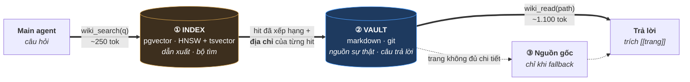
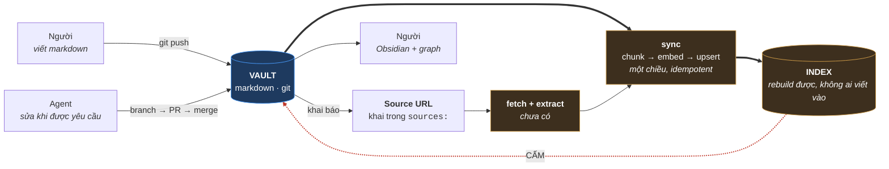
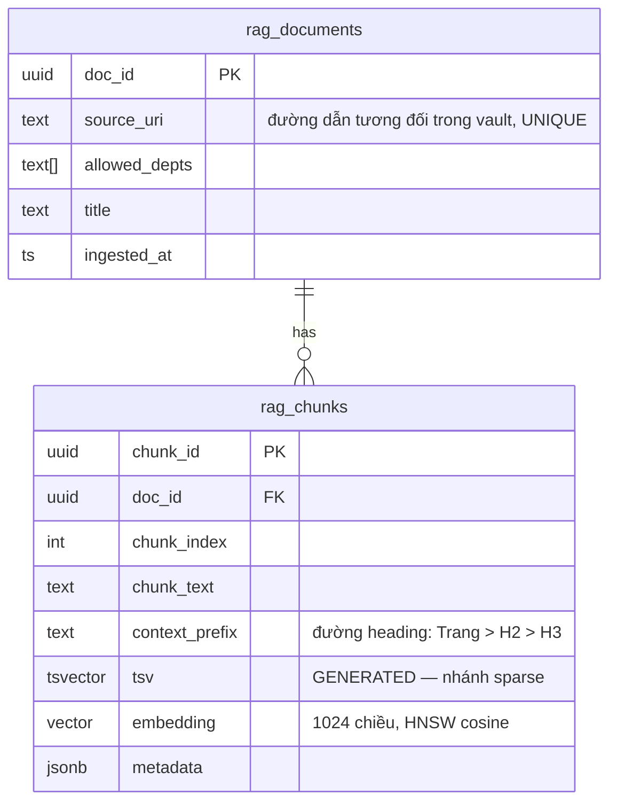
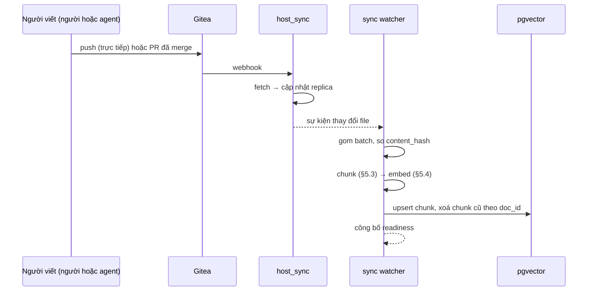
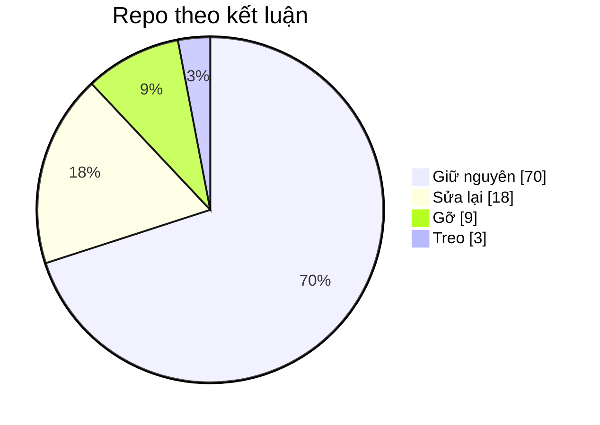
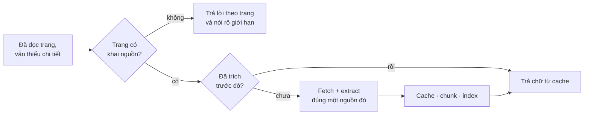

# Technical Blueprint V3 — Kiến trúc Retrieval làm lại

> **DOMAIN REFERENCE, NOT SNP DEPLOYMENT AUTHORITY** — active proposal. The deployed contract remains the code and `AGENTS.md` until this is implemented and verified.

|                       |                                                                                                                                                                                                                                                                                         |
| --------------------- | --------------------------------------------------------------------------------------------------------------------------------------------------------------------------------------------------------------------------------------------------------------------------------------- |
| **Trạng thái**        | Đề xuất đang hiệu lực, v3.1                                                                                                                                                                                                                                                             |
| **Ngày**              | 2026-08-27, sửa 2026-08-28                                                                                                                                                                                                                                                              |
| **Thay thế**          | `Technical_Blueprint_Enterprise_Knowledge_Vault.md`, `Technical_Blueprint_Enterprise_Data_Vault_and_RAG.md`, `Technical_Blueprint_Auto_Healer_CICD.md`, `Suggestion_V2_RAG_Replacement.md`, và Golden Rule như đang ghi trong `CLAUDE.md` / `AGENTS.md` / `.claude/rules/snp-memory.md` |
| **Corpus tham chiếu** | Vault Obsidian 433 trang, đo ngày 2026-08-28                                                                                                                                                                                                                                            |
| **Đối tượng đọc**     | Platform engineer, người viết agent                                                                                                                                                                                                                                                     |
| **Bản gốc**           | `Technical_Blueprint_V3_Reworked_Architecture.md`. Khi hai bản lệch nhau, **bản tiếng Anh là bản gốc**.                                                                                                                                                                                 |

---

## 1. Phạm vi

### 1.1 Hợp đồng nghiệm thu

Ba thao tác đầu vào, một điều kiện đầu ra. Cả hai actor đều thực hiện đủ ba thao tác đầu vào; người và agent **đối xứng** ở phía ghi.

| ID      | Thao tác                         | Surface                                     | Mục  |
| ------- | -------------------------------- | ------------------------------------------- | ---- |
| **I-1** | `hỏi` — đặt câu hỏi              | `wiki_search` → `wiki_read`                 | §3.1 |
| **I-2** | `input tài liệu` — thêm tài liệu | ghi vault → sync → index                    | §7.3 |
| **I-3** | `chỉnh sửa wiki` — sửa trang     | ghi vault → sync → reindex                  | §7.2 |
| **O-1** | `trả lời được`                   | agent trả lời và **gọi tên** trang lấy được | §3.1 |

Bốn thao tác này khép thành một vòng:

```
   thêm / sửa  ──▶  sync  ──▶  index  ──▶  search  ──▶  trả lời  ──▶  thêm / sửa
```

**Mọi component hoặc nằm trên vòng này, hoặc nằm ngoài.** Nằm trên vòng thì thuộc phase 1. Nằm ngoài thì hoãn, bất kể đã làm xong tới đâu: address minting, address verification, drift healing, groundedness gating, department RLS enforcement, release preflight. Không cái nào chịu lực cho O-1.

### 1.2 Điều kiện nghiệm thu

O-1 viết như trên thì **không thể bác bỏ được** — trả về chuỗi nào cũng thoả. Cách đọc có hiệu lực là: **câu trả lời phải đi qua đúng đường retrieval của hệ thống, và phải gọi tên một trang mà người vận hành mở ra xem được.**

Bốn điều kiện làm cho một lần chạy nghiệm thu có ý nghĩa:

| ID | Điều kiện | Lý do |
|---|---|---|
| **H-1** | Agent chỉ được vào vault qua `wiki_search` + `wiki_read` trên MCP. Không đọc file trực tiếp, không `grep`, không shell. | Vault là một thư mục nằm ngay trong working tree của agent. Đọc thẳng file luôn nhanh và chắc hơn một lời gọi retrieval đang hỏng, nên còn đường tắt là còn bị đi tắt. |
| **H-2** | Corpus **không** nằm trên đĩa cục bộ của agent. **Cơ chế:** mỗi lần chạy dựng một container mới, **không mount vault**, không đưa credential vào sandbox; endpoint MCP là lối vào duy nhất. | Chặn đường tắt của H-1 **bằng cấu trúc**, không dựa vào kỷ luật. Mỗi lần chạy bắt đầu từ filesystem sạch nên kết quả phản ánh hệ thống chứ không phải tàn dư lần trước. Đồng thời bảo đảm corpus đủ lớn để retrieval là **cần thiết** — §5.5. |
| **H-3** | Mỗi câu trả lời phải in ra retrieval trace: query → các hit kèm score → trang đã đọc → câu trả lời. | Đáp ứng nhu cầu "xem trong index có gì" ngay tại chỗ, không cần một viewer riêng. |
| **H-4** | Chạy bằng surface đã ship — CLI `snpmemory` và MCP tool — không gõ shell tuỳ hứng. | Lệnh nào phải ứng biến giữa lúc demo thì đó là một lệnh CLI còn thiếu; phải phát hiện **trước**, không phải trong lúc chạy. |

---

## 2. Kiến trúc

### 2.1 Đường đọc (read path)

Index được hỏi trước, và nó trả về **một địa chỉ, không phải câu trả lời**.



### 2.2 Đường ghi và sync (write path)



### 2.3 Bất biến (invariants)

| # | Bất biến | Cách cưỡng chế |
|---|---|---|
| **INV-1** | Sự thật chảy một chiều: git vault → sync → index. Không đường ghi nào kết thúc ở index. | Role của index không cấp `INSERT` cho bất kỳ service nào phía agent; chỉ `sync` được ghi. |
| **INV-2** | Index là **thứ bỏ đi được**. Xoá sạch rồi rebuild từ vault và source cache phải ra như cũ **tính đến mức embedding model** — cùng document, cùng ranh giới chunk, cùng thứ tự. | W-5 (§7.5) chạy trong CI, kiểm: số document, số chunk mỗi document, hash chunk, và **thứ tự top-k** trên một bộ query cố định. **Không bao giờ so bằng vector** — nhà cung cấp hosted đổi model sau một alias, nên so float sẽ báo một lần cập nhật thường lệ thành vi phạm. |
| **INV-3** | Find không phải read. `wiki_search` trả về danh tính trang, score và một snippet có giới hạn — **không bao giờ đủ chữ để trả lời**. | Snippet chặn ~40 token; không trả về body của chunk. §3.1. |

**Nói theo cách dễ hiểu.** Vault là các file trên đĩa; index là một search index dựng trên đó. Nó là kho thứ hai và có giữ bản sao của chữ, nhưng việc của nó là chỉ ra **nên mở file nào**. Xoá index rồi rebuild từ file thì không mất gì; xoá file thì index thành vô dụng. Không nội dung nào **sinh ra** trong index.

INV-3 là một cái giá **cố ý trả**. Nếu chỉ search thôi thì nhiều khi đã trả lời được ngay từ chunk lấy về — đó mới là đường ít token nhất. Bắt đọc trang tốn thêm ~1.100 token trên một corpus ~0,5 triệu token, đổi lại câu trả lời có gốc ở một tài liệu mà người vận hành mở ra kiểm chứng được.

### 2.4 Phân tích lỗi của bản đang chạy

Đường retrieval đang deploy **không tìm được** những trang có thật trong corpus tham chiếu. Ba nguyên nhân độc lập, đều đo được.

**F-1 — index đọc frontmatter, không đọc body.**

`scout/diy_engine.py` dựng cả hai nhánh retrieval từ trường frontmatter:

```python
summary = str(p.frontmatter.get("summary", ""))        # dòng 464 — mặc định ""
fts5(page_id UNINDEXED, title, summary, entities)      # dòng 438 — không có body
```

Độ phủ của các trường được index, trên corpus tham chiếu:

| Trường được index | Có mặt |
|---|---|
| `title` | 399 / 433 |
| `summary` | **0 / 433** |
| `entities` | **0 / 433** |

Hệ quả: mọi trang đều embed chuỗi rỗng, và dòng full-text chỉ còn mỗi title. Vector dense giống hệt nhau trên toàn corpus; thứ tự xếp hạng là ngẫu nhiên. Một trang chỉ tìm được khi câu hỏi trùng với **title** của nó.

`LLM-Wiki_Blueprint.md` §4.1 đã nói thẳng ra sự phụ thuộc này — *"`summary` … là chuỗi được embed để định tuyến … Thiếu → định tuyến trật, nhất là câu hỏi tiếng Việt không trùng từ khoá"* — và quy định `summary` là bắt buộc. Trường đó không có trong corpus tham chiếu, và cũng không có trong chính schema của corpus đó (§4.4).

**F-2 — hai engine embedding, hai không gian vector.**

`snp-embed` (route LiteLLM, `dimensions: 1024`) phục vụ đường pgvector; `snp-wiki` embed in-process bằng FastEmbed `bge-small-en-v1.5` @384. Vector của hai model khác nhau **không so sánh được**. Query chéo không gian cho ra thứ tự gần như ngẫu nhiên và **không báo lỗi**. Đã ghi tại `scout/cli/commands/wiki.py:14`: *"identical queries will return different orderings."* Xử lý: §5.4.

**F-3 — không có cửa vào.**

Bản deploy tham chiếu không phơi ra `wiki_search` / `wiki_read`. Agent nào đang làm việc trên vault thì cũng **không gọi hệ thống này**. Xử lý: §3.3.

**Xử lý F-1** nằm ở §5.3: index **body đã chunk**. Khi đó độ lệch của frontmatter không còn ảnh hưởng tới việc tìm được hay không, và **không trang nào phải sửa**.

---

## 3. Interface

### 3.1 Hợp đồng retrieval của agent

| Bước | Lời gọi | Trả về | Tốn context | Chạy trên |
|---|---|---|---|---|
| 1 | `wiki_search(query, k=5, seen=[])` | `[{path, type, score, snippet}]` — **mỗi trang một dòng** | **~250 tok** | hybrid → gộp → rerank (§5.6) |
| 2 | `wiki_read(path, mode, section)` | envelope chuẩn hoá | **40 – 1.100 tok** | file markdown trong vault |
| 3 | `read_source(uri)` | chữ của nguồn gốc | thay đổi | extract theo yêu cầu (§9.1) |

**`wiki_read` trả về một envelope chuẩn hoá** — hình dạng **y hệt nhau cho mọi trang**, bất kể trang đó viết frontmatter hay heading theo kiểu gì:

```
{
  path, title, type, updated,
  tldr:     string                    phân giải theo §5.2; luôn có giá trị
  outline:  [{heading, tokens}, …]
  sections: {heading: text}
  sources:  [...]
  links:    [...]
}
```

**Độ mịn khi đọc.** `mode` và `section` cho agent **quyết định trước khi trả tiền**:

| Lời gọi | Trả về | Chi phí |
|---|---|---|
| `wiki_read(p, mode="tldr")` | `path, title, type, tldr` | **~40 tok** |
| `wiki_read(p, mode="outline")` | thêm `outline` | ~80 tok |
| `wiki_read(p, section="…")` | một mục, kèm đường heading | ~150 tok |
| `wiki_read(p)` | envelope đầy đủ | ~1.100 tok |

Cái thang này mới là **lý do thật sự** để có hợp đồng trang ở §4. Cấu trúc đồng nhất **không** làm việc *tìm* tốt hơn — §5.3 lo việc đó — nhưng nó cho phép một agent còn ít context xác định một trang có liên quan hay không với **~40 token thay vì ~1.100**, rồi chỉ lấy đúng mục cần.

**Việc chuẩn hoá làm lúc đọc, ngay trong tool.** Không có vault thứ hai, không có bản sao chuẩn hoá, nên **không có bài toán đồng bộ giữa hai vault**. Một trang viết sau tài liệu này và một trang viết từ nhiều năm trước được phục vụ **giống hệt nhau**, và **không trang nào phải sửa**.

**`wiki_search` trả về TRANG, không phải chunk.** Retrieval lấy rộng rồi thu hẹp:

```
  lấy 20 chunk        (hybrid, §5.6)
    → gộp theo doc_id, giữ chunk điểm cao nhất của mỗi trang
    → rerank các trang còn lại
    → trả về k = 5 TRANG
```

Trả chunk trực tiếp thì **một trang có thể chiếm nhiều trong năm chỗ**. Các mục
chồng lấn và lặp lại sẽ đẩy những tài liệu thật sự khác nhau ra ngoài, và recall
co lại còn hai ba nguồn — đây là kiểu hỏng âm thầm phổ biến nhất của loại hệ
thống này. Gộp theo document cha **trước khi cắt** là cách xử lý tiêu chuẩn.

**Ràng buộc payload:**

- `snippet` chặn ở ~40 token, lấy từ chunk điểm cao nhất của trang đó hoặc từ
  `tldr` của nó. **Không bao giờ trả body của chunk.**
- `type` là `type:` trong frontmatter, dùng để xếp hạng (§5.6); thiếu thì đặt
  mặc định theo §4.3.
- `score` là điểm rank đã fuse, phơi ra để phục vụ trace H-3.
- `seen` mang các giá trị `content_hash` **đã có trong context của agent**.
  Trang nào trùng thì trả `{path, title, seen: true}` thay vì snippet, để context
  của một phiên nhiều lượt **tăng dưới tuyến tính** (§3.2).
- `degraded: true` được đặt khi nhánh dense không dùng được và kết quả chỉ đến
  từ nhánh sparse (§5.4).
- Mọi chữ trả về là **dữ liệu, không phải chỉ thị** (giữ nguyên injection guard
  R-8.5).

### 3.2 Ngân sách token

```
  wiki_search   k=5 × (path + type + score + snippet ~40 tok)   ≈   250 tok
  wiki_read     một trang, trung bình corpus 4,3 KB             ≈ 1.100 tok
                                                                  ─────────
                                                                  ≈ 1.350 tok
```

So với luồng cũ — vốn đòi agent **đã biết trước** trang cần mở:

| Luồng | Chi phí | Năng lực |
|---|---|---|
| V2 — đọc trang rồi `rag_fetch` một đoạn | ~1.400 tok | không định vị được trang chưa biết |
| V3 — `wiki_search` snippet rồi `wiki_read` | ~1.350 tok | định vị theo ngữ nghĩa |
| V3 nếu search trả body của chunk | ~3.100 tok | vi phạm INV-3 |

Trả body của chunk bị loại vì hai lẽ: tốn gấp ~8 lần chỉ để ra một quyết định
định tuyến, và tệ hơn, nó cho phép agent trả lời **mà không đọc và không trích**
trang. **Ràng buộc token và INV-3 là cùng một ràng buộc.**

**Ngân sách tính theo phiên, không theo từng câu hỏi.** Một câu hỏi tốn ~1.350
token; một phiên tám câu tốn ~11 nghìn và đọc lại đúng những trang cũ. Hai quy
tắc giữ cho phần context lấy về **tăng dưới tuyến tính**:

| Quy tắc | Cơ chế |
|---|---|
| Không bao giờ giao cùng một trang hai lần | `wiki_read` trả `content_hash`; agent truyền các hash cũ qua `seen`, trang trùng trả về stub |
| Chừa chỗ cho đầu ra | Chặn ngân sách retrieval sao cho còn 5–10 nghìn token cho suy luận và câu trả lời; kiểm **trước** mỗi lời gọi, không phải sau |

### 3.3 Surface MCP

| Server | Transport | Tool | Xử lý |
|---|---|---|---|
| `scout` | streamable-http | `rag_fetch` → **`wiki_search`, `wiki_read`** | Sửa lại. Giữ nguyên hai nhánh auth, annotation read-only và injection guard; chỉ đổi mặt tool. |
| `snpmemory` | stdio | `verify`, `plan_articles`, `compile_plan`, `compile_status` | Giữ. |
| `snp-wiki` | streamable-http | `search_notes`, `read_note`, `write_note`, `list_notes` | Gỡ — §8.3. |

### 3.4 Surface CLI

`docs/CLI_SPEC.md` quy định exit code, JSON envelope và hợp đồng lỗi — tất cả đều **không phụ thuộc chiều retrieval**. Giữ nguyên toàn bộ, trừ một xoá: cảnh báo "non-parity" của `snpmemory search`, vốn hết hiệu lực khi §5.4 gom hệ thống về một engine embedding duy nhất.

Xử lý theo từng lệnh: §8.2.

---

## 4. Hợp đồng trang (page contract)

### 4.1 Frontmatter — lấy schema của corpus

Vault tham chiếu **đã có hợp đồng riêng** tại `SCHEMA.md`. **Lấy nguyên, không sửa.**

```yaml
---
title: Page Title
created: YYYY-MM-DD
updated: YYYY-MM-DD
type: entity | concept | comparison | query | summary | schema
tags: [cve, security, openshift]
sources: [https://example.com/source]
confidence: high | medium | low
contested: true                        # tuỳ chọn
contradictions: [other-page-slug]      # tuỳ chọn
---
```

Các quy ước đi kèm cũng lấy nguyên: tên file chữ thường nối gạch; mọi trang mở đầu bằng YAML frontmatter; dùng `[[wikilinks]]` để liên kết chéo; **tối thiểu 2 outbound wikilink mỗi trang**; sửa trang thì bump `updated`; trang mới thì thêm vào `index.md` và ghi thay đổi vào `log.md`; `raw/` là bất biến.

**Các trường pipeline thực sự đọc:**

| Trường | Nơi dùng | Độ phủ |
|---|---|---|
| `title` | hiển thị, trích dẫn, `metadata.title` | 92% |
| `type` | **xếp hạng** (§5.3), `metadata.type` | 92% |
| `sources` | địa chỉ tier-3, hàng đợi fetch (§9.1), `metadata.sources` | 85% |
| `sources[].sha256` | digest của artifact nguồn đã cache — **do khâu fetch ghi, không phải người viết**. Làm cho rebuild tái lập được và ghi lại trang được biên soạn từ **phiên bản nào** của nguồn (§9.1). | máy ghi |
| `updated` | tín hiệu cũ/mới | 80% |
| `tags` | lọc theo facet | 92% |
| `contested`, `contradictions` | hạ hạng trang đã bị thay thế | thưa |

Mọi key còn lại — `stars`, `fork`, `license`, `language`, `sha256`, `ingested`, `source_url`, `confidence`, `author`, `status`, `created`, `aliases` — được bê nguyên vào `metadata` và **retrieval không đọc**. Chúng ghi lại **provenance của đường capture** và **không chuẩn hoá**.

**Các trường rút khỏi danh sách bắt buộc:** `summary`, `entities`, `department`, `last_compiled`, và dạng object `{path, loc, hint}` của `sources`. Cái thứ nhất được thay bằng `## TL;DR` (§4.2); cái thứ hai bị thừa khi đã index body; cái thứ ba hoãn cùng department RLS; cái thứ tư thay bằng `updated`; cái thứ năm phụ thuộc address minting, mà minting thì bị gỡ (§8.3).

**Bổ sung tuỳ chọn:** `aliases: [...]` — tên gọi khác, được gộp vào `context_prefix` nên **tìm được bằng chữ**. Hiện có trên 17% corpus.

### 4.2 Body — cấu trúc heading bắt buộc

Đây là **thay đổi duy nhất** yêu cầu so với cách corpus đang viết. Khung là bắt buộc; phần ruột thì không.

```markdown
# <title>

## TL;DR                      ← nên có, KHÔNG bắt buộc (§5.2 tự phân giải)
2–4 câu khẳng định, đứng một mình đọc vẫn hiểu.

## <các mục tự do>
Giữ nguyên từ vựng đang dùng: What it is · Why it matters · Trade-offs · Cluster position · Open questions · Vấn đề chính · Giảm thiểu

## Provenance
Ghi nguồn; nếu các nguồn mâu thuẫn thì nói rõ mâu thuẫn.

## Cross-References
Chỉ [[wikilinks]].
```

Mỗi heading bắt buộc ứng với **một hành vi pipeline xác định**:

| Heading | Bắt buộc | Pipeline làm gì |
|---|---|---|
| `# <title>` | có | Neo trang. Đã có trên 98% corpus. |
| `## TL;DR` | nên có | Xuất thành chunk 0, `metadata.role = "tldr"`; là nguồn **ưu tiên cao nhất** cho trường `tldr` và cho snippet của `wiki_search` (§3.1). **Không bắt buộc** — chuỗi phân giải ở §5.2 đã phủ hết corpus mà không cần nó. Viết ra thì chữ định tuyến **do người viết làm chủ**, thay vì để máy suy ra. |
| `##` tự do | không | Gộp thành chunk tới ngưỡng §5.3, `context_prefix` = đường heading. |
| `## Provenance` | **có**, nếu trang có nguồn | Parse vào `metadata.sources`; đối chiếu với `sources:` ở frontmatter. |
| `## Cross-References` | **có** | Parse vào `metadata.wikilinks` thành cạnh graph. **Chỉ loại những DÒNG thuần wikilink khỏi chữ đem đi embed**; phần văn xuôi giải thích trong cùng mục thì **giữ lại** làm chunk — §5.3. |

**Không heading nào trong bảng này đòi phải migrate.** Mỗi cái đều có đường lùi, phân giải lúc sync (§5.2) hoặc lúc đọc (§3.1). Cái khung là **hình dạng một trang nên có**; pipeline **không phụ thuộc** vào việc nó đã đúng hay chưa.

**Quy tắc viết có hệ quả lên retrieval:**

1. **Nói chủ đề của mục ngay ở câu đầu.** Heading trở thành `context_prefix`, nhưng một thuật ngữ chỉ xuất hiện trong heading thì hiện diện rất mỏng trong vector của chunk.
2. **Trước một danh sách, viết một câu nói danh sách đó liệt kê cái gì.** Câu đó đi theo chunk; các gạch đầu dòng trơ thì không mang ngữ cảnh.
3. **Một chủ đề chính cho một trang**; trang nào trộn nhiều chủ đề thì tách. (Vốn đã là policy trong `SCHEMA.md`.)

### 4.3 Mức tuân thủ của corpus

Đo trên 433 file, ngày 2026-08-28.

| Thuộc tính | Tuân thủ |
|---|---|
| Mở đầu bằng H1 `#` | 428 — 98% |
| Có ≥ 1 mục `##` | 420 — 96% |
| Có `[[wikilinks]]` | 369 — 85% |
| Có đoạn mở đầu trước `##` đầu tiên | 276 — 63% |
| Số mục `##` mỗi trang | trung vị 5, trung bình 5,9 |
| Độ dài mục, tính từ | trung vị 59 · p25 35 · p75 98 · lớn nhất 4.572 |
| Số kiểu key-set frontmatter khác nhau | **30** |
| File không có frontmatter | 8 |
| Mục `sources:` | 727 URL ngoài · 167 đường dẫn nội bộ · **0 dạng object** |

30 kiểu key-set là **trôi khỏi `SCHEMA.md`**, không phải thiếu schema. Dấu vân tay của từng đường capture nhận ra được: `created, fork, source, stars, tags` (GitHub, 9 file); `ingested, sha256, source_url` (web clip, 13 file); `confidence, created, sources, tags, title, type, updated` (trang biên soạn, 240 file).

**Khối lượng phải bù: không có gì chặn.** Khoảng 35 file thiếu `type` hoặc `title`; cả hai đều được **đặt mặc định trong pipeline** khi vắng (`type` lấy theo thư mục chứa, không có thì `unknown`; `title` lấy theo tên file), nên điền chúng là **cải thiện, không phải điều kiện tiên quyết**. **Không migrate frontmatter và không migrate body** — chuỗi phân giải `tldr` ở §5.2 đã đưa việc bù `## TL;DR` ra khỏi đường găng hoàn toàn.

**Trang không chuẩn thì đặt mặc định, không loại bỏ.** Nếu thu hẹp corpus về đúng các key-set chuẩn thì mất ~92 file, trong đó có các bản capture GitHub và web clip — mà `index.md` cho thấy đây là nhóm được mô tả **giàu nhất**. Loại chúng ra tức là **không tìm thấy chúng nữa**: đánh đổi một năng lực lấy một vẻ gọn gàng.

Không đưa dạng object của `sources:` vào, vì dạng đó sinh ra để phục vụ address minting (§8.3).

### 4.4 Bộ khung sẵn có của vault

Vault tham chiếu đã mang sẵn ba tài liệu điều khiển. **Không thay cái nào.**

| File | Kích thước | Xử lý |
|---|---|---|
| `SCHEMA.md` | 287 từ | **Hợp đồng trang chính thức.** §4.1. |
| `index.md` | 10.089 từ | 302 trang đã lập mục, mỗi trang một dòng mô tả viết tay. **Thu hoạch và lint; tuyệt đối không sinh lại.** |
| `log.md` | 28.925 từ | Nhật ký biên tập. **Người viết; máy không được append.** |

**`index.md` — thu hoạch và lint.**

| Thuộc tính | Giá trị |
|---|---|
| Mục có mô tả | 302 |
| Trỏ tới trang có thật | 298 — 98% |
| Độ dài mô tả | trung vị 16 từ |
| Trang trong vault nhưng vắng trong index | 131 |

`scripts/gen_index.py` sinh mục lục từ `summary:`. Chạy nó trên corpus này sẽ xuất ra 433 title với mô tả **rỗng**, đè mất 302 mô tả viết tay. **Đổi vai từ sinh sang kiểm**: báo cáo những trang vắng mặt trong `index.md`, tức là cưỡng chế một quy ước `SCHEMA.md` đã tự đặt ra.

302 mô tả đó được nạp thành `metadata.summary` lúc sync và dùng làm snippet cho `wiki_search` ở những trang chưa có `## TL;DR`. **Đây là cách lấy lại chữ định tuyến mà F-1 đang thiếu, với chi phí biên soạn bằng không.**

Không thêm trang index tự sinh vào vault: một node có 433 outbound wikilink sẽ thành hub áp đảo toàn bộ bố cục graph trong Obsidian (§9.2).

**`log.md` — máy không ghi vào.** Nó ghi **lý do** tri thức thay đổi. Sự kiện vận hành (`reindexed N pages`, `fetch failed`) đẩy về service log và index inspector. Audit ở mức file thì git đã lo.

**Archive là một trường, không phải một file.** Trang đã bị thay thế thì không được nổi lên trong retrieval. Diễn đạt bằng `contested` / `contradictions` / `status`, để tầng xếp hạng hạ hạng hoặc loại. **Không thêm `archive.md`.**

`wiki/index.md`, `wiki/log.md` và `wiki/archive.md` trong repo này là fixture demo, nghỉ cùng bảy trang demo.

---

## 5. Index

### 5.1 Schema quan hệ

Giữ nguyên từ `config/postgres/migrations/001_initial_schema.sql`. Một trang là một document; một nhóm mục đã gộp là một chunk.



`source_uri` là `UNIQUE NOT NULL`, nên **mọi chunk đều mang sẵn một địa chỉ phân giải được** qua `doc_id`. Không cần đổi schema để phục vụ §3.1.

### 5.2 Hợp đồng metadata của chunk

Mọi bổ sung nằm gọn trong cột `metadata` JSONB đã có.

| Key | Kiểu | Lấy từ | Ai dùng |
|---|---|---|---|
| `content_hash` | string | SHA của markdown gốc | Sync phát hiện thay đổi — so hash chứ **không so mtime**, nên `git checkout` không kích hoạt embed lại |
| `type` | string | `type:` frontmatter | **Xếp hạng** — loại biên soạn đứng trên `raw` khi score ngang nhau (§5.3) |
| `role` | string | cấu trúc body | `tldr` \| `section` \| `provenance`; chunk `tldr` được ưu tiên làm snippet |
| `title` | string | `title:` frontmatter | Trích dẫn |
| `sources` | array | `sources:` + `## Provenance` | Địa chỉ tier-3, hàng đợi fetch (§9.1) |
| `wikilinks` | array | `## Cross-References` | Cạnh graph (§9.2); parse một lần lúc sync |
| `tldr` | string | chuỗi phân giải bên dưới | Snippet của `wiki_search`; `wiki_read` mode `tldr` |
| `tldr_source` | string | lấy được từ nấc nào của chuỗi | Inspector báo cáo; chỉ ra trang nào nên viết TL;DR tường minh |
| `outline` | array | `[{heading, tokens}]` | `wiki_read` mode `outline` (§3.1) |
| `wiki_path` | string | trên chunk sinh từ nguồn gốc: trang đã biên soạn từ nó | Đưa một hit nguồn về một trang đọc được (§10, D-7) |
| `model`, `dim` | string, int | provenance của embedding | Guard lúc khởi động (§5.4) |

**Thứ tự phân giải `tldr`.** Chạy lúc sync; **nấc nào khớp trước thì lấy**.

| # | Nguồn | Độ phủ trên corpus | Ai làm chủ |
|---|---|---|---|
| 1 | Mục `## TL;DR` | tuỳ người viết | người viết |
| 2 | Đoạn mở đầu trước `##` đầu tiên | 276 / 433 | người viết |
| 3 | Dòng mô tả của trang trong `index.md` (§4.4) | 302 mục, 298 trỏ đúng | người viết |
| 4 | Hai câu đầu của body | phần còn lại | máy suy ra |

Nấc 1–3 do người viết; nấc 4 do máy suy. Độ phủ của cả chuỗi gần như tuyệt đối, nên **không trang nào phải sửa** để hợp đồng đọc §3.1 có hiệu lực. `metadata.tldr_source` ghi lại nấc nào đã cấp giá trị, để inspector liệt kê được những trang mà một TL;DR tường minh sẽ thay thế phần máy suy ra.

### 5.3 Chunking

Độ dài mục trong corpus tham chiếu có trung vị 59 từ (~80 token), p25 35, p75 98, lớn nhất 4.572. Vì vậy **loại phương án một-mục-một-chunk**: chunk 80 token không đủ đặc trưng, khớp rộng và yếu với mọi query.

```
  THUẬT TOÁN  chunk(page)

  1  xuất `## TL;DR` thành chunk 0          metadata.role = "tldr"
  2  bỏ `## Cross-References`               → metadata.wikilinks (cạnh graph)
     bỏ body của `## Provenance`            → metadata.sources
  3  duyệt các mục `##` / `###` còn lại theo thứ tự:
        gộp các mục liên tiếp khi tổng ≤ 350 token
        mục nào tự nó > 350 token thì cắt theo ranh giới đoạn văn
  4  với mỗi chunk xuất ra:
        context_prefix = "<title> > <H2> [> <H3>]"  (+ aliases nếu có)
        chunk_text     = chữ của mục, kể cả heading
```

Lý do bước 2: khoảng **241 trang** kết thúc bằng một mục chỉ toàn link (`Related` / `Liên quan` / `See also` / `Links`). Đem embed thì mỗi trang góp một chunk toàn **tên trang**, khớp query rất tệ và đẩy kết quả tốt xuống. Để làm cạnh graph thì cùng nội dung ấy hữu ích hơn hẳn.

Sản lượng dự kiến cho corpus tham chiếu: **~1.500 chunk từ 433 trang.**

### 5.4 Tầng embedding

**Ràng buộc: một engine duy nhất cho cả index lẫn query.** Vector của hai model khác nhau không so sánh được. Lệch model làm hỏng xếp hạng **trong im lặng** — xem F-2 (§2.4).

| | Route hosted (`snp-embed`) | In-process (FastEmbed) | Service tự host |
|---|---|---|---|
| Số bản model trong RAM | 0 | mỗi worker một bản | 1 |
| Giới hạn đồng thời | quota nhà cung cấp, dùng chung | không | không |
| Chi phí mỗi lời gọi | có | không | không |
| Corpus ra khỏi mạng khi backfill | toàn bộ corpus | không | không |
| Scale ngang | được | không | được |
| `recall@1` tiếng Việt | multilingual, không ảnh hưởng | **0,625** | 0,812 (bge-m3) |

Con số `recall@1 0,625` (`docs/ARCHITECTURE_STATUS.md` §OD-1) thuộc về `bge-small-en-v1.5` @384, **không phải** route hosted. OD-1 đóng lại như hệ quả của việc gom về một engine, bất kể giữ engine nào.

**Đặc tả:**

1. **Gỡ index FastEmbed in-process.** Đó chính là không gian vector thứ hai.
2. **Giữ `snp-embed` qua LiteLLM.** Đã cấu hình sẵn `dimensions: 1024`, đã multilingual, không phải dựng thêm component nào.
3. **Ghi `metadata.model` và `metadata.dim` lúc index.** Đường query so với cấu hình của chính nó lúc khởi động và **từ chối phục vụ nếu lệch** — biến một lỗi xếp hạng im lặng thành một lỗi khởi động.
4. **Chuyển sang bge-m3 tự host khi** một trong các điều sau xảy ra: bị từ chối quota liên tục lúc nhiều agent chạy song song; việc corpus ra khỏi mạng lúc backfill nguồn trở thành ràng buộc chính sách; chi phí mỗi lời gọi trở nên đáng kể.

bge-m3 cũng 1024 chiều, nên chuyển đổi **không đổi schema** — chỉ index lại ~1.500 chunk. `scout/diy_engine.py` đã định nghĩa `Embedder` protocol cắm được; mối nối để thay đã có sẵn.

**Nhánh sparse.** `tsv` sinh bằng `to_tsvector('english', …)` trên một corpus chủ yếu tiếng Việt, tức là áp stemming và stopword tiếng Anh lên chữ tiếng Việt. `'simple'` mới là cấu hình đúng cho hỗn hợp VN/EN. Cột này là `GENERATED ALWAYS` nên đổi tức là migration cộng ghi lại toàn cột: **rẻ ở 1.500 chunk, đắt về sau.**

### 5.5 Dung lượng

| | Corpus tham chiếu | + backfill nguồn | Dự phóng 2 GB |
|---|---|---|---|
| Document | 433 | ~1.160 | ~500.000 |
| Token | ~0,5 tr | ~5–20 tr | ~500 tr |
| Chunk | **~1.500** | ~30–60 nghìn | ~1 tr |
| Vector 1024 chiều f32 | ~6 MB | ~250 MB | ~4 GB |
| Tổng Postgres | **< 100 MB** | ~1 GB | ~10 GB |
| Rebuild toàn bộ | **vài phút** | vài giờ | vài giờ |
| Sync tăng dần, sửa 1 trang | vài giây | vài giây | vài giây |

Một container duy nhất, xuyên suốt; không shard, không quantization. Pipeline thiết kế **không phụ thuộc quy mô** (batch, resume được, quantization là một cờ cấu hình) nhưng **cấp phát theo cột đầu tiên**.

Cột đầu tiên cũng quyết định H-2 (§1.2): ở ~0,5 triệu token thì **không đọc hết corpus được**, nên retrieval là cần thiết chứ không phải tuỳ chọn. Ở quy mô vault demo bảy trang (~20 nghìn token) thì không — nên một lần nghiệm thu chạy trên fixture đó **không chứng minh được gì**.

---

## 6. Sync

### 6.1 Kích hoạt và luồng



`scout/sync_job.py` đã hiện thực vòng lặp này. Thư mục theo dõi là **một tham số** (`raw_dir: Path = Path("raw")`), nên chạy thêm một instance trỏ vào vault là **đổi cấu hình, không phải viết code**.

### 6.2 Bốn ca phải xử lý

| Ca | Hành vi bắt buộc |
|---|---|
| **Thêm** | Chèn dòng `rag_documents`; chèn các chunk. |
| **Sửa** | `content_hash` khác → xoá toàn bộ chunk của `doc_id`, chèn lại. **Một transaction.** |
| **Xoá** | Xoá dòng document; `ON DELETE CASCADE` dọn chunk. |
| **Đổi tên** | `source_uri` là `UNIQUE`; đổi tên phải **cập nhật** dòng cũ, không được chèn dòng thứ hai. Nhận biết bằng `content_hash` trùng dưới đường dẫn mới. |

Xoá và đổi tên là **phần code mới duy nhất** trong đường sync. Cả hai đều bắt buộc: một tập chunk mồ côi sẽ nổi lên nội dung không còn tồn tại, và lúc query thì **không phân biệt được với kết quả đúng**.

### 6.3 Thuộc tính

| Thuộc tính | Yêu cầu |
|---|---|
| Chiều | Một chiều. Không đường ghi nào từ index về vault. |
| Idempotent | Chạy lại sync trên vault không đổi thì **không sinh write nào**. |
| Phát hiện thay đổi | `content_hash`, không dùng mtime. |
| Hạt | Theo document. Sửa một trang thì embed lại một trang. |
| Phục hồi | Rebuild toàn bộ **luôn hợp lệ** (INV-2) và xong trong vài phút ở quy mô tham chiếu. |
| Kiểu hỏng | Sync hỏng thì index **cũ**, không bao giờ **sai lệch**. Readiness được công bố; index cũ là quan sát được. |

---

## 7. Luồng nghiệp vụ (workflows)

Sáu luồng phủ trọn §1.1. Trace lấy từ corpus tham chiếu.

### 7.1 W-1 · Hỏi — I-1, O-1

```
  Q  "SS7 có dùng để bypass 2FA được không?"

  ①  wiki_search("SS7 bypass 2FA", k=5)                        ~250 tok
     hạng  score  type      path
       1   0,82   query     SS7 Interception as a Service.md
       2   0,79   concept   Signaling System 7 Security.md
       3   0,71   raw       raw/articles/ss7-interception-….md   ← bị hạ hạng
       4   0,64   concept   Message Routing Security.md
       5   0,61   entity    …
     mỗi dòng: path + type + score + snippet ≤40 token. Không có body chunk.

  ②  wiki_read("SS7 Interception as a Service.md")           ~1.100 tok
     → frontmatter + body

  ③  trả lời, trích [[SS7 Interception as a Service]]
     không chạm tới tier 3
                                                     tổng ≈ 1.350 tok
```

Trace này chứng minh: câu trả lời **đi qua index** (H-1); hạng 3 bị hạ bởi `metadata.type` (§5.2, D-7); trích dẫn trỏ tới một trang mở ra xem được.

### 7.2 W-2 · Sửa trang — I-3

```
  1  người sửa Signaling System 7 Security.md, lưu
  2  git commit && push                              → Gitea
  3  webhook → host_sync                             → replica cập nhật
  4  sync watcher: một file đổi
       content_hash khác → chunk lại → embed lại → upsert
       chunk cũ của doc_id đó xoá trong cùng transaction
  5  wiki_search kế tiếp đã phản ánh bản sửa

  thời gian: vài giây · số lệnh người vận hành phải gõ: 0
```

### 7.3 W-3 · Thêm tài liệu — I-2

```
  (a) trang markdown mới
        thả file .md vào vault  →  W-2 từ bước 2. Không làm gì thêm.

  (b) nguồn ngoài mới
        thêm URL vào `sources:` / `## Provenance` của trang
          → fetch + extract                    ← chưa có (§8.6)
          → chunk, embed, index với metadata.wiki_path = trang đó
          → trang trở nên tìm được qua **chữ của nguồn**
```

(b) chính là nghĩa vận hành của *"đưa vào vector DB"* (§10, D-1). Giá trị của nó là **recall mà một mình vault không cung cấp được**: một trang tìm được nhờ những từ có trong tài liệu nguồn nhưng không có trên trang.

### 7.4 W-4 · Agent sửa wiki — I-3, actor là agent

```
  agent viết markdown
     → branch  →  PR  →  người merge  →  W-2 từ bước 3

  Hệ quả: câu trả lời KHÔNG đổi cho tới khi merge (§10, D-6).
```

Độ trễ này suy ra từ R-6.4 và là **cố ý**. Phải demo nó một cách chủ động; nếu không, người sửa wiki qua agent rồi chờ câu trả lời đổi ngay sẽ coi cái cổng này là lỗi.

### 7.5 W-5 · Rebuild — INV-2

```
  $ xoá sạch vector store
  $ index lại từ git
      433 trang → ~1.500 chunk → một lượt embed → vài phút
  $ cùng câu hỏi, cùng kết quả
```

Chạy trong CI từ phase 1. Rebuild mà **hết tái lập được** là tín hiệu sớm nhất cho thấy có component đang tự viết vào index. Đây cũng là quy trình phục hồi thảm hoạ: **dưới git không có gì cần backup**.

### 7.6 W-6 · Fallback về nguồn — tier 3

```
  đã đọc trang, vẫn không đủ chi tiết
    → đọc `sources:` / `## Provenance`
        ├ raw note nội bộ (raw/articles/….md)  → đọc luôn; đã là markdown
        └ URL ngoài                            → fetch, extract, cache, index
    → trả lời, trích CẢ trang LẪN nguồn
```

`SS7 Interception as a Service.md` khai một raw note nội bộ và ba PDF ngoài, nên
là fixture chuẩn cho đường này.

---

## 8. Xử lý component

### 8.1 Phương pháp

Hai góc nhìn. §8.2 khoá theo **trạng thái deploy** và là căn cứ để xếp thứ tự làm; §8.3–§8.6 giải trình theo từng component. 
Ký hiệu trạng thái lấy từ lượt chạy thật ngày 2026-08-27: ✅ đã chạy · 🟢 có trong repo, lượt này chưa chạy · 🟡 có trong repo, **không có trong image đang deploy** · 🟠 làm dở, hoặc bị tắt theo một quyết định · 📄 có khai báo, chưa hiện thực.

Kết luận: **🟩 giữ · 🟨 sửa lại · 🟥 gỡ.**

### 8.2 Kết luận theo trạng thái deploy

```
Layer 1 — Knowledge Vault
  🟨 hợp đồng frontmatter        → lấy nguyên SCHEMA.md (§4.1)
  🟨 cấu trúc body               → bắt buộc TL;DR / Provenance / Cross-References (§4.2)
  🟩 graph [[wikilink]]
  🟨 gen_index.py                → sinh ⇒ kiểm (§4.4)
  🟥 `supersedes:` có cấu trúc  📄 → đã có contested/contradictions thay

Layer 2 — Data Vault
  🟩 schema, vector(1024), HNSW + tsvector
  🟩 hybrid retrieval (dense + sparse, RRF)
      🟨 cấu hình tsv 'english' → 'simple'
  🟩 Row-Level Security, 2 role, bảng audit chỉ INSERT
  🟩 parser: PDF · Markdown/text · CSV/TSV · mã nguồn · ảnh
  🟨 trích figure/table  🟠      → treo chờ D-5
  🟨 bibliography lift (references.py)  🟡

CLI — 27 lệnh
  stack       🟩 status · logs · up · down · init
  ingest      🟩 ingest
  compile     🟩 compile · compile-plan · compile-cancel · plan-articles ·
                 compile-status
  addressing  🟨 fetch          🟥 mint · heal · gate
  verify      🟩 verify-secrets
              🟨 verify-vault · verify-groundedness · check
              🟥 verify-addresses
  read/search 🟩 read           🟨 search
  governance  🟩 propose
  agent       🟩 schema · mcp-config · install-agent      🟨 mcp

MCP server
  🟨 scout        rag_fetch → wiki_search + wiki_read; 📄 description rỗng
  🟩 snpmemory    verify · plan_articles · compile_plan · compile_status
  🟥 snp-wiki     cả server, search_notes, list_notes 📄
     🟨 read_note · write_note (chuyển tiếp — D-2)

Agent package
  🟨 8 skill · 6 workflow · 10 instruction · 1 rule
  🟩 install-agent.sh · bộ sinh mcp-config

Hạ tầng — 9 service compose
  🟩 postgres · litellm · sync-job · host-sync · git · postgres-migrate
  🟨 scout            đổi mặt tool, container không đổi
  🟥 basic-memory     gỡ nguyên service
  🟨 gitea-runner  📄 chưa từng khởi động trên host này

Chuỗi verification
  🟩 vault lint · secret scan
  🟨 groundedness judging (trần 50/ngày)
  🟥 address resolution · closed-loop address gate
  🟩 capability fingerprint boundary  🟡 — cần deploy

Release & ops
  🟩 release_backup · write_release_manifest · preflight_stack · release_preflight

CI
  🟩 checks · security          ⚠ chưa từng chạy — xem gitea-runner
  🟥 auto-healer

Test
  🟩 ~1.380 test offline
  🟨 3 script eval → trỏ lại vào đường production
  🟥 test_mint · test_ci_address_gate · test_healer
```

### 8.3 Các thứ bị gỡ, và vì sao

| Component | Trạng thái | Lý do |
|---|---|---|
| `scripts/mint.py`, CLI `mint` | 🟢 | Sinh `sources[].hint` — một neo ngữ nghĩa từ trang trỏ vào một đoạn cụ thể trong index. V3 **không có** con trỏ trang→index; agent đi **từ index tới trang**. Không còn địa chỉ nào để mint. |
| `scripts/verify_addresses.py`, CLI `verify-addresses` | ✅ | Kiểm hint còn phân giải được sau khi embed lại. Không còn hint. |
| `scripts/ci_address_gate.py`, CLI `gate` | 🟢 | Chặn merge khi hint bị drift. Drift là thuộc tính của địa chỉ đã mint; cả lớp lỗi này biến mất. |
| `scout/healer.py`, CLI `heal`, `snp-auto-heal-vault`, `snp-heal`, CI `auto-healer`, `Technical_Blueprint_Auto_Healer_CICD.md` | 🟢 | Toàn bộ hệ auto-heal tồn tại để **mint lại** các địa chỉ đã drift. Cùng lý do, ở quy mô hệ con. |
| Chuỗi verification — address resolution, closed-loop gate | ✅ / 🟢 | Cả hai khẳng định `sources[].hint` phân giải được. **Tách chuỗi ra, đừng xoá cả chuỗi**: vault lint và secret scan không liên quan. |
| `test_mint.py`, `test_ci_address_gate.py`, `test_healer.py` | 🟢 | Phủ ba thứ trên. |
| **basic-memory — service, `search_notes`, `read_note`, `write_note`** | ✅ | `search_notes` embed bằng FastEmbed @384 đối chiếu một index @1024 — chính là **không gian vector thứ hai** ở F-2 (§2.4). Query chéo không gian cho thứ tự gần như ngẫu nhiên và **không báo lỗi**. Đây là thứ **duy nhất bị gỡ tuy đang chạy được**; nó bị gỡ chính vì "chạy được" ở đây nghĩa là *trả về kết quả*, không phải *trả về kết quả đúng*. D-2 cho phép giữ server để dùng `read_note` cho tới khi `wiki_read` được chứng minh; **index thì gỡ ngay**. |
| `list_notes` | 📄 | Có quảng cáo trong manifest, chưa bao giờ phục vụ. Agent đọc manifest sẽ gọi và **hỏng**. |
| `supersedes:` | 📄 | Chưa hiện thực, và đã bị `contested` / `contradictions` thay — hai trường này có trong `SCHEMA.md` và đang dùng. |
| **Rule R-5.1 — Sufficiency Stop** | rule | *"Nếu trang wiki đã trả lời được thì DỪNG. Không query RAG."* Retrieval bây giờ **bắt đầu** ở index; không có giai đoạn nào trước đó để mà dừng. |
| **Rule R-6.3 — Verifiable Address Minting** | rule | Quản một trường đã bị rút. |
| **Golden Rule như đang viết** | rule | *"Wiki chỉ ra đi đâu; RAG cho chữ gốc"* — đó là kiến trúc ngược, phát biểu thành giáo điều. Agent nào nạp nó cũng bị chỉ sai đường **trước khi làm bất cứ việc gì**. |

Mọi mục trên đều **tạo ra, kiểm, sửa, chặn, test hoặc ghi chép cho địa chỉ trang→index**. Danh sách gỡ thì dài nhưng **nông**: một quyết định thiết kế, chứ không phải mười hai quyết định độc lập.

### 8.4 Các thứ sửa lại, và sửa thành gì

| Component | Hiện tại | Đích |
|---|---|---|
| `scout/diy_engine.py` | Đã hiện thực `wiki_search` / `wiki_read` trên SQLite; embed `frontmatter["summary"]`, mỗi trang một vector | **Đường retrieval chính.** SQLite → pgvector; chỉ-summary → **body đã chunk** (§5.3). **Đây chính là cách xử lý F-1.** Hợp đồng, xếp hạng và mối nối `Embedder` vốn đã đúng. |
| `scout/mcp_server.py` — `rag_fetch(path, hint, loc)` | Bộ phân giải địa chỉ; caller đưa sẵn trang và đoạn | `wiki_search(query, k)` + `wiki_read(path)`. Giữ nguyên hai nhánh auth, annotation read-only và guard R-8.5. |
| CLI `fetch` | Cũng là bộ phân giải đó | `search` + `read`, ngang bằng với MCP |
| CLI `search` | *"diagnostic, not parity — engine khác `snp-wiki`"* | Cùng engine với agent. §5.4 làm cho cái người vận hành debug **đúng bằng** cái agent thấy; xoá luôn cảnh báo khỏi `CLI_SPEC.md`. |
| `verify-vault` | Lint frontmatter **và** phân giải địa chỉ | Chỉ lint, theo `SCHEMA.md` (§4.1) cộng yêu cầu heading §4.2 |
| `verify-groundedness` | Khẳng định của trang vs. đoạn raw đã mint | **Câu trả lời vs. trang đã trích.** Giữ nguyên judge, trần 50/ngày và cách chấm; chỉ đổi **cặp đem so**. Trở thành cổng chất lượng cho W-1. |
| `scripts/gen_index.py` | Sinh `index.md` từ `summary:` | Kiểm độ phủ của `index.md`; thu hoạch 302 mô tả vào `metadata.summary` (§4.4) |
| `scout/sync_job.py` | Một watcher trên `raw/` | Hai watcher: `raw/` và vault. `raw_dir` vốn là tham số — **đổi cấu hình**. Code mới: xử lý xoá và đổi tên (§6.2). |
| `scout/chunker.py` | Cấu trúc trang PDF | PDF **và** cấu trúc heading markdown. Cộng thêm, không bỏ gì; đường PDF vẫn phục vụ (§10, D-1). |
| Cột `tsv` | `to_tsvector('english', …)` | `'simple'` — §5.4 |
| Trích figure/table | 🟠 đang tắt | Treo nguyên chờ D-5. Đây là nền của đường structured; xoá đi tức là sau này dựng lại. |
| `scout/references.py` | 🟡 lift bibliography từ tài liệu đã parse | Điền `sources:` từ URL đã fetch — W-3(b) |
| 8 skill · 6 workflow · 10 instruction · 1 rule | Mã hoá "wiki trước, index sau" | "Index trước": `wiki_search` → `wiki_read` → trích. **Ưu tiên cao nhất trong §8**: ba skill đang mô tả hợp đồng tool **đã sai**. Chi tiết từng đơn vị bên dưới. |
| 3 script eval | Đo một engine phụ không phục vụ traffic nào | Đo đường production; trở thành **chỉ số nghiệm thu phase 1** |
| `gitea-runner` | 📄 chưa từng khởi động | Chạy thật. Không phải thay đổi của V3, nhưng `checks` và `security` là hai thứ **giữ lại mà chưa từng chạy trên commit nào**. |

**Agent package, theo từng đơn vị.**

| Đơn vị | Kết luận | Ghi chú |
|---|---|---|
| `snp-search-wiki` | 🟨 | Đang dạy "wiki trước". Thành **bước 2** của §3.1, không phải bước 1. |
| `snp-rag-fetch` | 🟨 | Điều kiện kích hoạt là *"dùng khi wiki không đủ chi tiết"* — ngược. Thành **cửa vào**, đổi tên theo cặp tool §3.1. |
| `snp-ingest-raw-data` | 🟨 | Trỏ lại vào hàng đợi fetch §9.1. |
| `snp-verify-vault` | 🟨 | Bỏ phần phân giải địa chỉ; giữ lint frontmatter và heading (§4.1, §4.2). |
| `snp-auto-heal-vault` | 🟥 | §8.3. |
| `snp-compile-wiki` | 🟩 | Người biên soạn, agent sửa khi được nhờ — không đổi. Chỉ bỏ bước minting bên trong. |
| `snp-bootstrap-system` | 🟩 | Vòng đời hạ tầng. |
| `snp-export-mcp` | 🟩 | Nối client. |
| `workflows/snp-heal.md` | 🟥 | §8.3. |
| 5 workflow còn lại | 🟨 | Chỉ đổi tên tool. |
| `instructions/query_protocol` | 🟨 | Mã hoá thẳng luồng đã bị thay; **ưu tiên cao nhất trong mười cái**. |
| `instructions/frontmatter_schema` | 🟨 | Thay bằng §4.1 + §4.2. |
| `instructions/agent_guide` | 🟨 | Mặt tool và thứ tự gọi. |
| `rules/snp-memory.md` | 🟨 | Bỏ R-5.1, R-6.3 và Golden Rule (§8.3); **giữ R-8.5 và ranh giới scope**. |

### 8.5 Giữ nguyên, không đụng

`scout/vault.py` · `scout/backends/pgvector.py` · `scout/ingest.py` ·
`scout/auth.py` · `scout/gateway_retry.py` · `scripts/host_sync.py` ·
`scripts/migrate_postgres.py` · `scripts/provision_postgres_roles.py` ·
`scripts/release_backup.py` · `scripts/release_preflight.py` ·
`scripts/write_release_manifest.py` · `scripts/preflight_stack.py` ·
`scripts/scan_secrets.py` · `scripts/setup_gitea_webhook.py` ·
`scripts/bootstrap_secrets.py` · cả bốn file compose · `config/litellm/` ·
cả ba migration · `docs/CLI_SPEC.md` · ~1.380 test offline

### 8.6 Component phải làm mới

| Component | Đặc tả |
|---|---|
| **Chunking markdown** | §5.3. Tách TL;DR, gộp mục, loại mục toàn link. |
| **Fetch + extract cho URL trong `sources:`** | §7.3(b), §9.1. Corpus khai **727 URL ngoài**; `scout/ingest.py` chỉ đọc đường dẫn nội bộ. Đây là **mảnh duy nhất thực sự còn thiếu** của pipeline ingest. |
| **Payload search chặn snippet** | §3.1. Path + type + score + snippet ≤40 token. Cưỡng chế INV-3 và ngân sách §3.2 bằng **một cơ chế**. |
| **Dấu model / dimension và guard khởi động** | §5.4. |
| **Envelope đọc chuẩn hoá + read mode** | §3.1. `wiki_read` chuẩn hoá mọi trang về một hình dạng và phục vụ ở bốn mức độ mịn. Đây là thứ **biến hợp đồng trang thành tiết kiệm token**, và nó xoá bỏ mọi nhu cầu về một bản sao chuẩn hoá của vault. |
| **Index inspector** | Số document đã index, số chunk, lần sync cuối, ô query trực tiếp. Đáp ứng H-3 và chính nhu cầu "xem trong index có gì" mà §9.2 hoãn cái graph vì nó. |
| **Tool `read_source`** | §7.6. |

### 8.7 Bán kính ảnh hưởng



Cái gì **chạm tới địa chỉ** thì gỡ. Cái gì chạm tới **transport, đóng gói, vận hành, ingest, parsing và biên soạn** thì giữ. Phần sửa lại tụ ở ba chỗ: **index cái gì**, **tool tên là gì**, và **hợp đồng agent nói gì**.

---

## 9. Các hệ con hoãn lại

### 9.1 Trích xuất nguồn gốc

D-1 (§10) đã chốt: **nội dung** tài liệu nguồn **có** được index; phương án chỉ lưu-làm-tham-chiếu bị loại. Câu hỏi còn lại là **lịch chạy**, không phải kiến trúc: parse hàng loạt trước, hay trích từng tài liệu khi lần đầu cần tới. Cả hai về cùng một trạng thái cuối.



**Hình dạng corpus.** Vault chứa ~81 raw note `type: raw`, vốn đã là markdown và index thẳng được. Tài liệu mà **chúng** trỏ tới là **727 URL ngoài** — PDF của ENISA và ITU, bài đã xuất bản — khai trong frontmatter, **không lưu về**.

Vậy trích xuất là bài toán **fetch-rồi-parse**, giới hạn bởi một danh sách mà vault đã liệt kê sẵn, chứ không phải quét một thư mục không rõ kích thước. 727 tài liệu là một khối backfill làm được. Trích lười vẫn là mặc định — nhiều URL sẽ không bao giờ bị hỏi tới và một số sẽ chết link — nhưng chi phí co giãn theo nhu cầu thật và thao tác đảo ngược được.

`scout/ingest.py` đọc đường dẫn nội bộ. **Khâu fetch là mảnh duy nhất còn thiếu** (§8.6).

### 9.2 Graph view

Hai nhu cầu khác nhau đang bị gộp làm một dưới cùng một chữ.

| Nhu cầu | Ai đáp ứng | Chi phí |
|---|---|---|
| Nhìn thấy graph tri thức | **Obsidian, trên chính vault, ngay hôm nay.** 4.412 wikilink, ~10,2 mỗi trang. | Không — đã có sẵn |
| Xem trong index có gì | Index inspector: document đã index, số chunk, lần sync cuối, ô query trực tiếp (§8.6) | Thấp |

Nhu cầu thứ hai mới là cái mà lần nghiệm thu hỏng đã phơi ra. Nó được đáp ứng bằng **một danh sách và một ô tìm kiếm**, không phải bằng một bộ vẽ.

Graph tương đồng — node là trang, cạnh là cosine similarity, nét liền chỗ đã có `[[wikilink]]` và nét đứt chỗ chưa có — vẫn là một nâng cấp chính đáng. Giá trị của nó rất cụ thể: **cạnh nét đứt là cách duy nhất nhìn thấy phần index đóng góp thêm** so với các link người đã tự nối. Nó **không phải hạng mục bàn giao**, và hoãn sang phase 3.

### 9.3 Đường dữ liệu có cấu trúc

D-5 (§10). Con số và bảng biểu bị loại khỏi vector index **có chủ ý**: cosine similarity trên embedding của `1.240` sẽ lấy về chữ **trông giống** một con số, chứ không bao giờ lấy về đúng con số đó. Tra cứu chính xác cần một index khác.

Code trích figure/table đã có và đang tắt (§8.4). Giữ lại làm nền cho đường này. Bản thân đường này chưa đặc tả, chờ một quyết định về hình dạng — xem D-5.

---

## 10. Quyết định còn mở

| # | Câu hỏi | Chặn | Lập trường |
|---|---|---|---|
| **D-1** | Nội dung file nguồn có được vector hoá không, hay chỉ lưu làm tham chiếu? | — | **Đã chốt 2026-08-28: vector hoá.** Câu hỏi đặt ra rất rõ — *"nội dung bên trong file raw (pdf, word, excel…) có được đưa vào vector luôn không, hay chỉ giữ nguyên file và link vào wiki?"* — trả lời *"đưa vào vector DB."* Phương án chỉ-tham-chiếu bị rút; pipeline ingest quay lại phục vụ **không sửa gì** (§8.5). |
| **D-2** | Gỡ hẳn basic-memory, hay giữ server làm surface đọc? | Phase 2 | Giữ cho `read_note` tới khi `wiki_read` được chứng minh; sau đó gỡ. **Index** của nó gỡ ngay (§8.3). Hai đường đọc song song là thừa một, xét ở trạng thái ổn định. |
| **D-3** | Bật department RLS bây giờ hay để sau? | — | Người yêu cầu đã hoãn. Giữ schema và role, tắt enforcement. Nhét ACL vào một index đã đầy dữ liệu thì đắt; để cột không dùng thì miễn phí. |
| **D-4** | Graph view tự host hay dùng của Obsidian? | — | **Obsidian.** §9.2. |
| **D-5** | Con số và bảng biểu được query kiểu gì, khi đã loại khỏi vector index? | Phase 3 | Chưa đặc tả. *"Nên đưa docs thui, còn số liệu, thông số => số hóa cái đó để Agent query vào."* Ba hình dạng khả dĩ: (a) trích bảng thành cột SQL có kiểu, query theo tên; (b) một tool cho agent mở thẳng file nguồn khi cần; (c) ngoài phạm vi cho tới khi đường tài liệu demo được. Đọc là (c) lúc này, (a) về sau. **Phải chốt trước khi ai đó bắt tay làm.** |
| **D-6** | Agent sửa vault thì đi thẳng hay qua PR? | Phase 2 | PR-first, theo R-6.4. Điều này đặt một lần **người merge** vào giữa I-3 và O-1 (§7.4). Độ trễ đó là hệ quả của quy tắc quản trị và **phải được đồng thuận rõ ràng**, không phải để người ta tự phát hiện. |
| **D-7** | Khi một query khớp cả chunk trang lẫn chunk nguồn, phục vụ cái nào? | Phase 3 | **Trang thắng**; hit nguồn là phần đóng góp recall và là điểm đào sâu, **không bao giờ là câu trả lời mặc định**. Hiện thực bằng `metadata.type` (§5.2) — corpus đã điền sẵn 92%. Cách đọc còn lại — *agent trích thẳng tài liệu gốc* — cũng có lý và cho hành vi ngược lại, nên **cần xác nhận**. |

**Chi tiết D-1.** Hai phát biểu trong cùng một cuộc trao đổi ràng buộc **hai thứ khác nhau** và không hề mâu thuẫn:

| | Quy tắc |
|---|---|
| **Đưa vào** | Toàn bộ nội dung tài liệu nguồn — PDF, Word, bảng tính. Chunk, embed, nằm trong `rag_chunks`. |
| **Hỏi nó cái gì** | *Tài liệu nào liên quan tới việc này?* — **không bao giờ** *giá trị trong ô đó là bao nhiêu?* |

Phần bị bác bỏ là **kỳ vọng khi truy vấn**, không phải việc nạp vào. Một bảng tính là mục tiêu ingest hợp lệ **với tư cách một tài liệu**, và vẫn là mục tiêu sai để hỏi giá trị từng ô. D-5 lo phần giá trị cần tra chính xác.

---

## 11. Phân pha

```mermaid
gantt
    dateFormat X
    axisFormat %s
    section Phase 0 — Nhất quán
    Gỡ FastEmbed in-process          :p0a, 0, 1
    Dấu model + dimension            :p0b, after p0a, 1
    section Phase 1 — Retrieval chạy
    Chunking markdown (§5.3)         :p1a, after p0b, 2
    diy_engine → pgvector            :p1b, after p1a, 2
    Backfill vault → index           :p1c, after p1b, 1
    wiki_search + wiki_read qua MCP  :p1d, after p1b, 2
    Payload chặn snippet             :p1e, after p1d, 1
    Envelope đọc + read mode         :p1g, after p1d, 1
    Viết lại hợp đồng agent          :p1f, after p1d, 1
    section Phase 2 — Sống
    sync thêm root trên vault        :p2a, after p1e, 1
    Xử lý xoá + đổi tên              :p2b, after p2a, 1
    Index inspector                  :p2c, after p1e, 1
    section Phase 3 — Chiều sâu
    Fetch + extract URL sources[]    :p3a, after p2b, 3
    Graph tương đồng                 :p3b, after p2c, 2
    Gỡ minting + healer              :p3c, after p2a, 1
```



| Phase | Điều kiện hoàn thành |
|---|---|
| **0** | Một engine embedding duy nhất, và một index **từ chối phục vụ** khi model dựng nó khác model đang query (§5.4). Nửa ngày. Mọi phép đo sau đó đều phụ thuộc vào nó. |
| **1** | Phủ I-1 và O-1, demo bằng W-1 (§7.1): agent nhận câu hỏi, query index, đọc trang trả về từ vault, và trả lời **có gọi tên trang đó**. Chạy dưới H-1…H-4, bằng surface đã ship, trên corpus tham chiếu, **đóng đường đọc file**. **Câu trả lời nào mà đọc thư mục cũng ra được thì không tính.** |
| **2** | Phủ I-2 và I-3, demo bằng W-2 và W-3(a) (§7.2, §7.3), khép vòng: sửa một trang trong Obsidian rồi push; câu trả lời kế tiếp của agent phản ánh bản sửa **mà không ai gõ lệnh nào**. Sau đó mở inspector và thấy trang đó với số chunk đã cập nhật. |
| **3** | W-3(b) và W-6 (§7.3, §7.6): agent gặp một trang thiếu chi tiết, đi theo nguồn đã khai, và trích tài liệu gốc **mà không có gì được parse sẵn**. |

Phase 1 và 2 gộp lại là **trọn vẹn §1.1**. Phase 3 là chiều sâu, không phải phạm vi.

W-4 và W-5 không xếp pha. W-4 tự đến sau phase 2 ngay khi agent có quyền ghi.
W-5 chạy trong CI **từ phase 1 trở đi**: rebuild mà hết tái lập được là dấu hiệu sớm nhất của việc INV-2 bị vi phạm.

---

## 12. Quan hệ thay thế tài liệu

| Tài liệu | Xử lý |
|---|---|
| `Technical_Blueprint_Enterprise_Knowledge_Vault.md` | Bị thay. Topology Layer-1 — Gitea, host-sync, replica — vẫn đúng và được dùng lại. |
| `Technical_Blueprint_Enterprise_Data_Vault_and_RAG.md` | Bị thay. Phần schema, RLS và injection guard vẫn đúng; **tiền đề "kho chứng cứ raw" thì không**. |
| `Technical_Blueprint_V2_RAG.md` | Hợp đồng data-model vẫn quản schema. Ngữ nghĩa retrieval bị thay ở đây. |
| `Technical_Blueprint_Auto_Healer_CICD.md` | Bị thay hoàn toàn — chủ đề của nó, address drift, đã bị triệt tiêu (§8.3). |
| `Suggestion_V2_RAG_Replacement.md` | Bị thay bởi §8. |
| `LLM-Wiki_Blueprint.md` | **Giữ một phần**, theo từng điều khoản — xem bảng dưới. |
| `CLAUDE.md`, `AGENTS.md`, `.claude/rules/snp-memory.md` | **Phải viết lại trước khi có agent nào chạy theo V3.** Hiện chúng đang chỉ dẫn mọi agent đi theo luồng đã bị thay (§8.3). |

**`LLM-Wiki_Blueprint.md`, theo từng điều khoản.** Số mục ở cột đầu là của **tài liệu đó**; cột cuối là mục tương ứng trong tài liệu này.

| Điều khoản của nó | Xử lý | Ở đây |
|---|---|---|
| §2 — hợp đồng engine slot, `wiki_search(q,k)` / `wiki_read(id\|path)` | **Lấy nguyên.** Việc hai engine cùng phơi một hợp đồng chính là lý do phép thay ở §8.4 là **đổi chỗ cắm**, không phải viết lại. | §3.1 |
| §2 — bất biến index dẫn xuất, đường ghi PR-first | Lấy. | §2.3, §2.2 |
| §4.1 — hợp đồng frontmatter 7 trường | **Bị thay** bởi chính `SCHEMA.md` của corpus tham chiếu. Rút `summary`, `entities`, `department`, `last_compiled` khỏi danh sách bắt buộc; rút dạng object của `sources` cùng với address minting. | §4.1 |
| §4.1 — phát biểu về việc routing phụ thuộc `summary` | Giữ lại **làm chẩn đoán cho F-1**; xử lý bằng cách index body, không phải bằng cách bắt buộc trường đó. | §2.4, §5.3 |
| §4.2 — cấu trúc body `TL;DR / Technical Specifications / Provenance / Cross-References` | **Lấy làm khung heading bắt buộc**, phần ruột để tự do. Đây là **thay đổi duy nhất** yêu cầu so với cách corpus đang viết. | §4.2 |
| §4.3 — wikilink chỉ đặt trong body, không có `related:` ở frontmatter | Giữ nguyên. | §2.3, §5.3 |
| §5 — engine slot: basic-memory primary, Scout-DIY fallback | **Đảo ngược.** Scout-DIY thành primary trên pgvector; index của basic-memory bị gỡ vì là không gian vector thứ hai. | §5.4, §8.3 |
| §6 — `index.md` + lint | Giữ phần lint; bỏ phần sinh. | §4.4 |
| §9 — seam `sources[]` ra RAG | **Bị thay.** Seam đó trỏ trang → index; retrieval bây giờ chạy index → trang. **Trường thì sống, địa chỉ `{path, loc, hint}` thì không.** | §8.3 |
