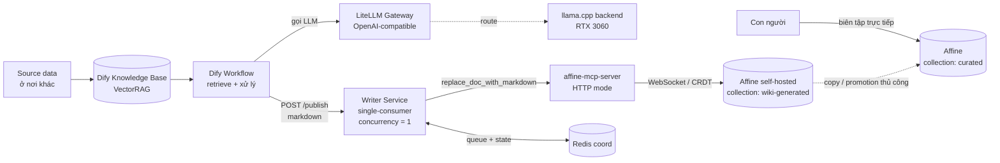

# Đề xuất: Local-First LLM-Wiki với VectorRAG, Affine và cơ chế Multi-Agent Locking

| | |
|---|---|
| **Version** | 0.1 (Draft) |
| **Tác giả** | saltless-bruh |
| **Ngày** | 14/07/2026 |
| **Trạng thái** | Draft — chờ review |

---

## 1. Tóm tắt (Executive Summary)

Đề xuất này mô tả kiến trúc cho một **LLM-wiki** self-hosted, local-first: một knowledge base nơi các **agent** tự động đọc dữ liệu nguồn, xử lý qua **RAG**, và ghi kết quả vào một workbench dạng wiki để con người đọc và biên tập. Toàn bộ hệ thống chạy trên **Docker**, không phụ thuộc vào bất kỳ dịch vụ cloud bên ngoài nào.

Ba thành phần chính:

- **Dify** — RAG + workflow engine, sử dụng **VectorRAG**.
- **Affine** (self-hosted) — sink / workbench, ghi vào qua **MCP**.
- **LiteLLM** — model gateway cung cấp endpoint OpenAI-compatible cho toàn bộ inference.

Đóng góp kỹ thuật cốt lõi là **cơ chế lock cho multi-agent**: đảm bảo nhiều agent không ghi đè lẫn nhau, và xử lý đúng trường hợp con người và agent cùng biên tập (**human + agent editing**). Thiết kế chọn hướng **single-writer serializer (Topology A)** thay vì distributed lock — biến bài toán mutual exclusion thành bài toán ordering đơn giản, gần như loại bỏ hoàn toàn nhu cầu về lock rõ ràng ở giai đoạn đầu.

---

## 2. Bối cảnh & Vấn đề (Background & Problem Statement)

Mục tiêu là một wiki tự cập nhật: agent liên tục lấy dữ liệu từ các nguồn khác, tổng hợp và ghi thành các trang tri thức có cấu trúc. Vì lý do chủ quyền dữ liệu và bảo mật, hệ thống phải **local-first, self-hosted** — không đẩy nội dung qua cloud.

Trong mô hình này, **nguồn dữ liệu nằm ở nơi khác**; Affine chỉ đóng vai trò **sink** (nơi lưu output cuối cùng), không phải nguồn. Điều này đơn giản hoá đáng kể: không có vòng lặp read-process-write trên cùng một store, và không có drift giữa RAG index và nội dung Affine.

Vấn đề trọng tâm cần giải quyết: khi nhiều agent — và cả con người — cùng ghi vào một document, phải tránh hai lỗi:

1. **Lost update / overwrite** — agent A ghi đè công việc đang dở của agent B.
2. **Semantic corruption** — hai bên ghi đồng thời, nội dung bị trộn (interleave) thành vô nghĩa, *kể cả khi không mất byte nào*.

Ràng buộc nền tảng quan trọng: Affine lưu document dưới dạng **CRDT** (BlockSuite / Yjs) và sync qua **WebSocket**. MCP là stateless và **không cung cấp atomic conditional write** (không có `if-match` / `etag` / compare-and-swap trên write path). Vì CRDT merge tự động ở tầng byte, "không mất dữ liệu" **không** đồng nghĩa với "không cần lock" — hai đoạn văn của hai tác giả vẫn có thể bị đan xen thành nội dung hỏng. Do đó mutual exclusion phải được enforce ở một **coordination layer** bên ngoài mà mọi agent bắt buộc phải đi qua (một chokepoint).

---

## 3. Mục tiêu (Objectives)

**Functional:**

- Agent pipeline: đọc nguồn → xử lý qua VectorRAG trong Dify → publish markdown vào Affine.
- Con người đọc và biên tập song song mà không bị agent ghi đè.

**Non-functional:**

- Local-first, self-hosted, chạy hoàn toàn trên Docker.
- **Correctness ưu tiên hơn throughput** — đây là wiki, không phải hệ high-QPS.
- **Idempotent writes** — retry / replay không tạo ra bản duplicate.
- **Observability** — biết được agent nào ghi document nào, vào lúc nào.

---

## 4. Kiến trúc tổng quan (Architecture Overview)



Bốn layer:

- **Model layer — LiteLLM.** Gateway OpenAI-compatible, route tới inference backend (local llama.cpp trên RTX 3060, hoặc remote). LiteLLM **không tự inference** — nó là proxy/gateway. Lợi ích: Dify chỉ cần một endpoint ổn định; đổi hoặc route model tập trung; quản lý virtual key; fallback và rate limit.
- **RAG / Workflow layer — Dify.** Knowledge base (chunking + embeddings + reranking) + workflow sinh ra document hoàn chỉnh. Gọi model qua LiteLLM.
- **Coordination layer — Writer service.** Single-consumer serializer, là **write path duy nhất** của agent vào Affine. Đây là nơi lock "sống".
- **Sink layer — Affine (self-hosted).** Workbench dạng wiki. Ghi vào qua **affine-mcp-server** (bản community của DAWNCR0W, chạy HTTP mode) — server này đã xử lý sẵn phần ghi CRDT qua WebSocket, nên ta không phải tự chạm vào Yjs.

> **Lưu ý về MCP self-hosted:** native MCP integration của Affine (Settings → Integrations → MCP Server) chỉ có trên **Affine Cloud**. Vì hệ thống là self-hosted, ta dùng bản community `affine-mcp-server` (hoặc, nếu sau này thiếu primitive, một direct GraphQL/WebSocket writer). **Không** làm homemade MCP server — xem mục 11.

---

## 5. Luồng dữ liệu (Data Flow)

1. Source data → Dify knowledge base (ingest, embed).
2. Dify workflow: retrieve + xử lý (gọi LLM qua LiteLLM) → emit **markdown hoàn chỉnh** cho một logical document.
3. Node cuối của workflow: HTTP POST tới Writer `/publish` với payload `{logical_key, markdown, target_collection, job_id}`.
4. Writer enqueue API: validate target nằm trong agent-owned collection → tính `content_hash` → `XADD` vào Redis Stream.
5. Writer consumer (concurrency = 1): dedup → human-edit check → publish qua MCP (`replace_doc_with_markdown`) → record state → ack.

**Nguyên tắc thiết kế then chốt:** vì Affine là sink và Dify sinh ra nội dung *đã hoàn chỉnh*, mỗi lần ghi được mô hình hoá như một **atomic full-document publish**, không phải live co-edit. Dify tạo cả trang; Writer thực hiện một `replace`. Điều này biến yêu cầu concurrency từ "merge các fine-grained edit đồng thời cho đúng" (khó) xuống còn "serialize các lần publish theo từng document" (dễ). Whole-doc replace cũng **idempotent theo bản chất** — ghi lại cùng nội dung cuối hai lần cho ra cùng kết quả.

---

## 6. Cơ chế Lock & Concurrency (phần cốt lõi)

### 6.1. Agent-vs-Agent: single-consumer chính là lock

Chạy Writer như **một consumer duy nhất, `WRITER_CONCURRENCY=1`**. Một worker duy nhất drain queue *chính là* mutual exclusion — không thể có hai write overlap vì luôn chỉ có một write in-flight. Ở v1, **không cần** Redis lock, lease, hay lý luận về TTL: concurrency-of-1 *là* lock.

Crash story: queue (Redis Streams, `appendonly`) giữ lại các job chưa ack; Writer chết, restart, reprocess. Chỉ cần write là idempotent (mục 6.2).

Nếu throughput vượt một worker (khả năng rất thấp với wiki): **shard bằng hashing `logical_key`** — mỗi document luôn route về cùng một consumer, giữ per-doc ordering trong khi vẫn parallel across documents. Gần như chắc chắn không cần cho use case này.

### 6.2. Idempotency

Mỗi job mang `logical_key` (title / slug ổn định) + `content_hash`. Writer giữ `last_written[logical_key]` trong coordination store; nếu hash trùng → skip (đã publish). Nhờ đó:

- Một job crash-rồi-replay trở thành **no-op**.
- Race "hai agent cùng tạo một document" **tự chết**, vì single consumer nhìn thấy job thứ hai *sau khi* job đầu đã commit.

Lưu ý: với thao tác **tạo mới** document, lock key phải là **logical identity** (title / slug) chứ không phải Affine guid (guid chưa tồn tại lúc tạo). Trong Topology A điều này tự động đúng nếu partition queue theo `logical_key`.

### 6.3. Agent-vs-Human: không thể lock — phải giải quyết bằng cấu trúc

**Sự thật quan trọng nhất của thiết kế: lock không thể chặn con người.** Writer chỉ điều phối những gì đi qua chokepoint của nó — tức là các agent. Con người biên tập trong Affine UI đi **thẳng** vào WebSocket / CRDT sync; browser của họ không bao giờ hỏi lock. Nên agent-vs-agent giải quyết được hoàn toàn, còn **agent-vs-human không giải quyết được bằng bất kỳ lock nào trong stack này**. CRDT sẽ merge edit của người và rewrite của agent mà không mất byte — nhưng "merged" có thể là một section do agent tái sinh bị đan xen với đoạn văn viết dở của con người, thành nội dung vô nghĩa.

Vì không thể lock con người, ta giải quyết bằng cấu trúc, theo thứ tự sức mạnh:

- **Segregation (chính).** Agent chỉ ghi vào một space nó **sở hữu độc quyền** — collection / workspace `wiki-generated`. Con người đọc từ đó; khi muốn sửa thì **copy** trang sang collection `curated` do người sở hữu, và promotion là hành động thủ công. Hai tập document tách rời → người và agent không bao giờ tranh chấp cùng một doc (mô hình CQRS-style). Vì Writer là write path *duy nhất* của agent, việc **từ chối ghi ra ngoài `wiki-generated`** đã *enforce* được segregation ở tầng code. Chi phí: con người biên tập trên bản copy, không phải trang generated gốc — thường chấp nhận được với wiki (generated = source, curated = derived).
- **Agent-yields-to-human (safety net cho doc bắt buộc chia sẻ).** Trước khi ghi doc X, agent fetch `last_updated` hiện tại của doc từ Affine, so với `last_write_time[logical_key]` mà Writer tự ghi lại sau mỗi lần ghi của chính nó. Nếu `affine_last_updated > last_write_time + ε` → *có ai đó khác* (con người) đã sửa kể từ lần agent chạm cuối → agent **defer**: requeue có delay, hoặc đẩy vào conflict-review queue. Cơ chế này biến "mutual exclusion" (bất khả thi với con người) thành "agent politeness" — agent không bao giờ đè lên doc con người đang thao tác. Chỉ dựa trên timestamp `last_updated` mà document nào cũng có sẵn — không cần author metadata.
- **Cooperative signal (UX nicety).** Agent set marker `🤖 updating…` (một custom property hoặc banner block) trước khi ghi, clear sau khi xong, để con người thấy mà tạm dừng. Chỉ **advisory** — con người có thể phớt lờ, và có một race window nhỏ giữa set-signal và write — nhưng low-friction khi đặt lên trên hai lớp kia.

**Khuyến nghị:** segregation làm xương sống + agent-yields cho doc thật sự cần chia sẻ + agent-vs-agent serializer ở dưới. **Không** dựa vào signal đơn lẻ — nó là cooperation, không phải enforcement.

---

## 7. Mô hình Human + Agent (segregation chi tiết)

Hai không gian tách biệt trong Affine:

| | `wiki-generated` | `curated` |
|---|---|---|
| **Chủ sở hữu write** | Agent (qua Writer) | Con người |
| **Ai được ghi** | Chỉ Writer | Chỉ con người (Affine UI) |
| **Vai trò** | Source — output thô từ pipeline | Derived — tri thức đã được người biên tập |
| **Concurrency** | Serialize bởi single-consumer | Live CRDT collaboration của con người |

**Promotion flow:** khi một trang `wiki-generated` đủ tốt để đưa vào tri thức chính thức, con người copy nó sang `curated` và biên tập tại đó. Từ thời điểm đó, agent không còn tác động đến bản curated. Nếu cần refresh từ nguồn, agent cập nhật bản `wiki-generated`, và con người quyết định có re-promote hay không.

Mô hình này cho một ranh giới sạch: **agent-write side** vs **human-curate side**, với handoff tường minh, và không có contention CRDT đồng thời vì hai population document rời nhau.

---

## 8. Triển khai Docker (Deployment Topology)

Affine và Dify mỗi cái chạy compose **riêng** (mỗi cái tự mang Postgres + Redis nội bộ — **không** cross-wire vào các Postgres/Redis đó; chúng là nội bộ của từng stack). Join cả ba project vào một **shared external network** `wiki-net` để service resolve lẫn nhau qua tên. Thêm một **Redis riêng cho coordination** (`redis-coord`) để liveness của pipeline không bị couple với internals của Affine hay Dify.

Xem `docker-compose` rút gọn ở **Phụ lục A**. Dify được cấu hình trỏ tới LiteLLM (`http://litellm:4000`, dùng LiteLLM virtual key) như một OpenAI-compatible model provider — cấu hình đó nằm trong compose/UI của Dify, không nằm trong file coordination.

---

## 9. Bảo mật & Vận hành (Security & Operations)

- **Dedicated Affine account / token cho agent.** Tách identity của agent → phân biệt được edit của agent với con người (nền tảng cho agent-yields ở mục 6.3) và cho audit sạch.
- **Least-privilege MCP.** Dùng `AFFINE_TOOL_PROFILE` (`read_only` / `core` / `authoring`) + `AFFINE_DISABLED_GROUPS` (`destructive`, `admin`) để thu hẹp tool surface xuống đúng những gì Writer cần.
- **HTTP MCP bảo vệ bằng bearer token** (`AFFINE_MCP_HTTP_TOKEN`), HTTPS nếu đi ra ngoài localhost, `/healthz` + `/readyz` cho health check.
- **LiteLLM virtual keys.** Cấp key riêng cho Dify, đặt rate limit, tách khỏi các key khác; master key giữ kín.
- **Resource footprint.** Affine (~4 container) + Dify (~8, gồm vector store) + coordination (`redis-coord` + `writer` + `affine-mcp`) ≈ 15 container. 32GB DDR5 đủ giữ, nhưng **giữ GPU inference tách khỏi wiki compute path**: LiteLLM route tới llama.cpp backend, không co-schedule inference GPU-bound cùng các container CPU/IO-bound của wiki. Điều này cô lập VRAM 12GB khỏi pipeline.

---

## 10. Lộ trình (Roadmap)

- **v1 (MVP).** VectorRAG + single-consumer (`concurrency=1`) + segregation + idempotency (`logical_key` + `content_hash`) + agent-yields. Đủ cho correctness. Đây là phần lock "tự tan biến" vào serializer.
- **v2+.**
  - Shard Writer (hash theo `logical_key`) nếu throughput vượt một worker.
  - Conflict-review UI / queue cho các trường hợp agent defer vì human edit.
  - **GraphRAG như một external knowledge bolt-on** qua external-knowledge API của Dify — thêm khi cần cross-document relational reasoning ("cái gì kết nối X và Y trên toàn corpus"), **không tác động đến** phần Affine / lock / sink.

---

## 11. Rủi ro & Giả định (Risks & Assumptions)

- **MCP write primitives.** `affine-mcp-server` đã xác nhận có `replace_doc_with_markdown` (whole-doc publish) và markdown roundtrip — đủ cho thiết kế. Nếu về sau thiếu primitive hoặc latency không đạt, hướng đi là **direct GraphQL/WebSocket writer** (bỏ MCP trên write path), *không* làm homemade MCP server (worst option: tự reimplement CRDT write logic + wrap MCP boilerplate cho một consumer deterministic).
- **`last_updated` từ Affine.** Giả định timestamp `last_updated` đủ tin cậy và đủ độ phân giải để phát hiện human edit. Cần verify trước khi phụ thuộc vào agent-yields.
- **Segregation phù hợp UX.** Giả định con người chấp nhận biên tập trên bản copy (`curated`) thay vì in-place trên trang generated. Nếu bắt buộc in-place human edit trên generated doc → phải chấp nhận rằng CRDT merge + agent-yields là *tất cả* gì có thể có; không có hard mutual exclusion với con người.
- **No atomic CAS.** Không có compare-and-swap trên Affine write path → optimistic concurrency ở tầng Affine không khả thi; toàn bộ correctness dựa trên serializer + idempotency + segregation.

---

## Phụ lục A — `docker-compose` (rút gọn)

```yaml
# Tạo network chung một lần:  docker network create wiki-net
# Attach compose của Affine và Dify vào wiki-net (external network).

networks:
  wiki-net: { external: true }

services:
  litellm:                          # model gateway, OpenAI-compatible
    image: ghcr.io/berriai/litellm:main-latest
    command: ["--config", "/app/config.yaml"]
    volumes: ["./litellm-config.yaml:/app/config.yaml:ro"]
    environment:
      LITELLM_MASTER_KEY: ${LITELLM_MASTER_KEY}
    networks: [wiki-net]
    # backend inference (llama.cpp trên RTX 3060) khai báo trong config.yaml

  redis-coord:                      # queue (Redis Streams) + dedup/state
    image: redis:7-alpine
    command: ["redis-server", "--appendonly", "yes"]   # bền qua restart
    volumes: ["redis-coord-data:/data"]
    networks: [wiki-net]

  affine-mcp:                       # DAWNCR0W làm write executor, HTTP mode
    image: ghcr.io/dawncr0w/affine-mcp-server:latest
    environment:
      MCP_TRANSPORT: http
      AFFINE_BASE_URL: http://affine:3010        # khớp service name/port của Affine
      AFFINE_API_TOKEN: ${AGENT_AFFINE_TOKEN}    # identity RIÊNG của agent
      AFFINE_MCP_AUTH_MODE: bearer
      AFFINE_MCP_HTTP_TOKEN: ${MCP_HTTP_SECRET}
      AFFINE_TOOL_PROFILE: authoring             # least-privilege
      AFFINE_DISABLED_GROUPS: destructive,admin
    networks: [wiki-net]

  writer:                           # service của mình: enqueue API + single-consumer loop
    build: ./writer
    environment:
      REDIS_URL: redis://redis-coord:6379
      MCP_URL: http://affine-mcp:3000/mcp
      MCP_HTTP_TOKEN: ${MCP_HTTP_SECRET}
      AGENT_TARGET_COLLECTION: wiki-generated    # ranh giới segregation
      HUMAN_EDIT_COOLDOWN_SEC: "600"
      WRITER_CONCURRENCY: "1"                     # == the lock
    depends_on: [redis-coord, affine-mcp, litellm]
    networks: [wiki-net]

volumes:
  redis-coord-data:
```

## Phụ lục B — Job schema (`/publish`)

```json
{
  "logical_key": "handbook/onboarding/network-access",
  "markdown": "# Network Access\n\n...nội dung hoàn chỉnh...",
  "target_collection": "wiki-generated",
  "job_id": "01J8...ULID",
  "content_hash": "sha256:..."
}
```

`content_hash` có thể do Dify tính hoặc do Writer tính tại enqueue; `job_id` (ULID) dùng cho trace và ack. Writer từ chối job có `target_collection` khác `AGENT_TARGET_COLLECTION`.

---

*Hết bản draft v0.1. Các mục còn mở để review: (1) độ tin cậy của `last_updated` cho agent-yields; (2) UX segregation (biên tập trên copy) có chấp nhận được không; (3) ngôn ngữ triển khai Writer service (Rust vs Python).*
