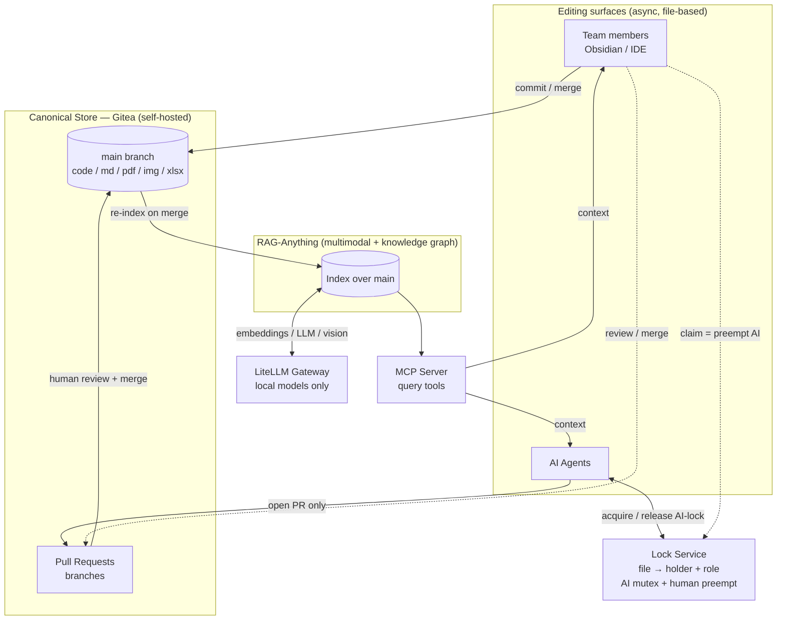

# Đề xuất (v0.2): Team Security LLM-Wiki — Git-backed, RAG-indexed, MCP-served

| | |
|---|---|
| **Version** | 0.2 (Draft) — thay thế v0.1 |
| **Tác giả** | saltless-bruh |
| **Ngày** | 14/07/2026 |
| **Trạng thái** | Draft — chờ review |
| **Thay đổi lớn so với v0.1** | Bỏ Dify + Affine. Canonical store chuyển sang **self-hosted Git (Gitea)**; RAG chuyển sang **RAG-Anything** (multimodal + graph); consumer chính là **IDE/Agent qua MCP**; lock chuyển sang **PR-based model**. Sync là **async (git-style)**, không real-time co-editing. |

---

## 1. Tóm tắt (Executive Summary)

Đề xuất này mô tả kiến trúc cho một **LLM-Wiki dùng chung cho một team Cybersecurity**: nơi lưu trữ multi-data (raw code, PDF, doc/docx, md, image, excel/csv), cho phép cả **con người (thành viên team)** và **AI/Agent** cùng đóng góp, và **kết nối trực tiếp vào IDE và Agent của từng thành viên** để truy vấn context. Toàn bộ hệ thống self-hosted trên **Docker**, local-first — không có cloud trong đường đi của embedding/LLM.

Nhận định cốt lõi định hình kiến trúc: **consumer chính là IDE và Agent truy vấn (query), không phải con người đọc một trang wiki.** Vì vậy trọng tâm là ba lớp: **storage → multimodal index → MCP query layer**. Bốn quyết định then chốt:

- **Canonical store = Git (Gitea, self-hosted).** Versioning, access control, và multi-writer qua merge — đồng thời repo *đã nằm sẵn trong IDE* của mọi thành viên.
- **RAG = RAG-Anything** (trên nền LightRAG). Multimodal native cho đúng mix dữ liệu của team, và có **MCP server** để IDE/Agent kết nối.
- **Sync = async (git-style).** Edit → save → commit/PR/merge. Không real-time co-editing.
- **Lock = PR-based collaboration + per-file AI mutex**, với thứ tự ưu tiên **Human > AI, AI ⊥ AI**, và human **preempt** được AI (stop/pause).

---

## 2. Bối cảnh & Vấn đề (Background & Problem Statement)

Một team Cybersecurity cần một knowledge base dùng chung: gom code, báo cáo (PDF/doc), ghi chú (md), sơ đồ/screenshot (image), và bảng dữ liệu (excel/csv) vào một nơi, rồi **để IDE và Agent của từng người truy vấn** như một nguồn context ("hỏi codebase/tài liệu team ngay trong editor"). Vì dữ liệu nhạy cảm (findings, có thể chứa thông tin khách hàng), hệ thống bắt buộc **local-first, self-hosted**.

Yêu cầu về collaboration & lock (do team lead đặt ra), diễn giải nguyên văn:

1. **Human edit → AI không được edit, chỉ được *suggest* trên cùng file.**
2. **AI edit → AI khác không được edit cùng file; khác file thì OK.**
3. **Human có thể edit khi AI đang edit**, hoạt động như một cơ chế **stop/pause** khi AI đang thêm nội dung sai.

Điểm quan trọng: đây **không** phải một concurrency primitive mới. Nó chính là **mô hình Pull Request của git** cộng một **per-file AI mutex** mỏng, với priority nghiêm ngặt: con người luôn thắng, hai AI loại trừ nhau trên cùng file.

Về store: v0.1 dùng Affine (self-hosted) làm sink và thiết kế một serializer/lock nặng. Hai lý do khiến hướng đó bị loại: (a) consumer thật sự là IDE/Agent query, không phải người đọc trang wiki; (b) self-hosted Affine bị giới hạn tính năng (không có native MCP server, ít integration hơn Cloud). Với sync async + editing bằng file-based tool, một **git repo** là canonical store tự nhiên hơn nhiều.

---

## 3. Mục tiêu (Objectives)

**Functional:**

- Lưu trữ multi-data (code, PDF, doc/docx, md, image, xlsx/csv) trong một store dùng chung, có version.
- Con người và AI/Agent cùng đóng góp; AI chỉ *đề xuất* (không tự commit vào canonical), con người review & merge.
- IDE và Agent của từng thành viên kết nối để **query** knowledge base (retrieval as context).
- Multimodal retrieval: hỏi được cả nội dung trong PDF/hình/bảng, không chỉ text thuần.

**Non-functional:**

- **Local-first, self-hosted**, chạy hoàn toàn trên Docker; không cloud trong đường LLM/embedding.
- **Async sync** (git-style) — không cần real-time co-editing.
- **Access control / need-to-know** — phù hợp team security (không phải ai cũng query được mọi thứ).
- Correctness & attribution (biết ai/agent nào đóng góp gì, khi nào — git cho sẵn).

**Non-goals (v1):**

- Real-time co-editing kiểu Google Docs (đã loại — async là đủ cho một KB).
- Đồng bộ hai chiều với Affine (không khả thi sạch — xem §13).

---

## 4. Kiến trúc tổng quan (Architecture Overview)



Sáu lớp:

- **Storage / collaboration / versioning — Gitea (self-hosted).** Canonical store. Team's multi-data nằm trong repo; binaries (PDF/image/xlsx) qua **Git LFS**. Versioning, blame, per-repo/org access control, và **PR/merge** làm multi-writer model. Repo *đã có sẵn trong IDE* của mọi người → một nửa yêu cầu "connect to IDE" là miễn phí.
- **Editing surfaces (file-based).** Con người: Obsidian trên clone của họ, hoặc IDE, hoặc bất kỳ markdown editor nào. Agent: đọc/ghi file và **chỉ mở PR**. Tất cả sync qua git. Async.
- **Lock service.** Giữ map `file → {holder, role}`; enforce AI-mutex và human-preempt (§6).
- **RAG index — RAG-Anything.** Index nội dung `main` (đã merge). Multimodal (code/PDF/image/table/equation) + knowledge graph (LightRAG). Model chạy local qua LiteLLM.
- **MCP query layer.** Expose query tools cho IDE/Agent kết nối (§8).
- **Model serving — LiteLLM.** Gateway OpenAI-compatible → local inference backends (llama.cpp / VLM). Local-only.

---

## 5. Luồng dữ liệu (Data Flow)

**5.1. Ingest / đóng góp nội dung**

1. Thành viên (hoặc agent) thêm/sửa file → commit.
   - Con người: có thể commit vào branch của mình rồi mở PR, hoặc (tùy policy team) push thẳng `main`.
   - Agent: **luôn** mở PR, không bao giờ ghi thẳng `main`.
2. Human review & merge PR vào `main`.
3. Trên merge event, RAG-Anything **re-index** phần thay đổi (LightRAG hỗ trợ incremental update — chỉ reprocess content block đã đổi, giữ nguyên phần graph còn lại).

**5.2. Query (đường chính — IDE/Agent)**

1. IDE/Agent của thành viên gửi truy vấn qua **MCP** (ví dụ `rag_query`, hoặc enhanced multimodal query).
2. RAG-Anything retrieve (graph + vector, cross-modal), gọi model qua LiteLLM khi cần.
3. Trả context về IDE/Agent để đưa vào prompt/hoàn thiện code.

**5.3. Agent authoring (khi agent tạo nội dung mới cho KB)**

1. Agent acquire **AI-lock** trên các file đích (chặn agent khác trên cùng file — §6).
2. Agent soạn nội dung trên một **branch**, mở **PR** ("suggest").
3. Human review → merge (hoặc từ chối). Agent **không** tự merge.
4. Merge → re-index.

---

## 6. Cơ chế Lock & Collaboration (phần cốt lõi)

Mô hình = **PR-based collaboration + per-file AI mutex**, thoả từng mệnh đề của team lead:

### 6.1. Ánh xạ yêu cầu → cơ chế

| Yêu cầu (team lead) | Cơ chế |
|---|---|
| Human edit → AI chỉ *suggest* cùng file | Agent **không có quyền ghi `main`** — chỉ mở **PR/branch**. "Suggest, không edit" được enforce **về mặt cấu trúc**, không dựa vào việc AI tự giác. |
| AI edit → AI khác không edit cùng file; khác file OK | **Per-file AI mutex**: agent acquire AI-lock trước khi edit một file; agent khác bị chặn trên file đó, nhưng **chạy song song trên file khác**. |
| Human edit khi AI edit = stop/pause | **Human preempt**: human claim/edit một file → orchestrator **pause/halt** agent đang giữ AI-lock trên file đó. Con người luôn thắng. |

Priority tổng: **Human > AI**, và **AI ⊥ AI** (trên cùng file).

### 6.2. Lock service

Một service nhỏ (Redis hoặc DB đơn giản) giữ:

```
lock:<repo>:<path> → { holder_id, role: "human"|"ai", acquired_at, ttl }
```

- **Acquire (AI):** agent set lock role=ai nếu file chưa có lock role=ai. Nếu đã có lock role=human trên file → agent **không** direct-edit, tự hạ xuống chế độ suggest-only (vẫn có thể mở PR đề xuất nhưng không đụng file trực tiếp).
- **Preempt (human):** human claim role=human → nếu tồn tại lock role=ai trên file, service phát tín hiệu **halt** cho agent (webhook/poll), agent dừng ghi và (tuỳ chọn) đóng branch dở.
- **Release:** khi agent xong (mở PR) hoặc human rời file.
- **TTL + heartbeat:** AI-lock có TTL để agent chết không giữ lock vĩnh viễn; agent heartbeat gia hạn khi còn làm việc.

### 6.3. Mảnh duy nhất git không cho sẵn: presence signal

File **không tự báo** "đang có human edit". (Affine có live presence/awareness; substrate file thì không.) Vì vậy human-preempt cần một **cooperative signal**:

- **Explicit claim (v1):** thành viên chạy một lệnh / bấm một UI nhỏ "editing file X" → tạo lock role=human.
- **Presence plugin (v2):** plugin Obsidian/editor phát event khi mở/đóng file → tự động claim/release.

Đây là **phần custom duy nhất** mà rule preempt cần. Khả thi, nhưng phải build (không free như phần còn lại của git).

### 6.4. Vì sao mô hình này nhẹ hơn v0.1

Git đã mã hoá sẵn "propose vs commit" (PR) và "human-gated merge". Nên toàn bộ serializer/CRDT-lock của v0.1 co lại còn: một **per-file mutex** cho AI⊥AI + một **preempt signal** cho Human>AI. Không cần Redis Streams serializer, không cần chống CRDT-interleave — vì store là file + git merge, không phải CRDT-over-MCP.

---

## 7. RAG Layer — RAG-Anything

- **Multimodal native:** parse và index text, images, tables, equations trong cùng một pipeline (MinerU-class parsing) — đúng mix dữ liệu của team (code/PDF/image/xlsx).
- **Knowledge graph (LightRAG):** trích entity + relationship xuyên modal. Với một KB code + docs, **graph là điểm cộng** — bắt được quan hệ (hàm nào gọi gì, finding nào tham chiếu tài liệu nào), không chỉ similarity.
- **Incremental update:** re-index chỉ phần đổi khi merge vào `main`.
- **Storage backends:** LightRAG hỗ trợ nhiều backend (KV: JSON/Postgres/Redis; vector: FAISS/Milvus/Chroma; graph: Neo4j/Postgres AGE) — chọn theo quy mô; v1 có thể dùng default file-based, lên Postgres/Milvus/Neo4j khi cần scale.
- **Model:** embeddings + LLM + vision đều gọi qua LiteLLM (local).

**Code-quality note:** chunking mặc định có thể cắt ngang function. Với code (dữ liệu nặng của team), nên cấu hình chunk theo cấu trúc (function/class) hoặc dùng một code-aware parser trước khi index. Đây là điểm cần tinh chỉnh, không phải blocker.

---

## 8. MCP Query Layer — kết nối IDE/Agent

Yêu cầu "connect to each member's IDE/Agent" = **expose RAG layer qua MCP**. Đây là pattern đã trưởng thành:

- **RAG-Anything MCP server** — xử lý directory, multimodal, query qua LightRAG.
- **LightRAG MCP servers** — nhiều bản (30 tools / 22 tools / bản 3-tool nhẹ) với document management + query (modes: naive/local/global/hybrid/mix) + knowledge-graph ops.
- **Code-RAG MCP servers** — index một repo, expose `rag_query` / `read_file` / `list_files`, cắm thẳng vào Cursor / VS Code Copilot / Claude Code, chạy fully local không outbound call.

Mỗi thành viên thêm MCP server này vào IDE/agent của mình như một context source. **Auth** trên MCP endpoint; chỉ trong internal network. v1 chọn một trong các bản trên (ưu tiên bản wrap RAG-Anything để giữ multimodal), fallback là tự viết một MCP wrapper mỏng quanh query API nếu tool coverage thiếu.

---

## 9. Model Serving — LiteLLM

- Gateway OpenAI-compatible; route tới local inference backend (llama.cpp trên RTX 3060 / GPU box dùng chung) + một **vision model** cho multimodal parsing.
- **Local-only:** không route embedding/LLM ra cloud (dữ liệu security).
- Virtual keys cho từng consumer (RAG service, agent), rate limit, fallback.
- Giữ GPU inference tách khỏi các container CPU/IO; nếu một GPU 12GB không đủ cho parsing + generation đồng thời, route sang slot/GPU riêng.

---

## 10. Bảo mật & Access Control (đặc thù team Security)

Đây là "phần khó" mới, thay chỗ của lock trong v0.1:

- **Storage access:** Gitea permissions (per-repo/org) quyết định ai đọc/ghi repo nào.
- **Access control / need-to-know cho RAG:** một index phẳng **không có ranh giới per-user** — ai kết nối cũng query được *mọi thứ*. Nếu có dữ liệu compartmentalized (nhiều khách hàng/engagement, finding nhạy cảm) → đây là leak xuyên ranh giới. Giải pháp: **per-project/per-engagement index** riêng, hoặc **metadata-scoped retrieval** (filter theo tag/quyền) thay vì một global graph duy nhất.
- **Bản thân index là tài sản nhạy cảm** — nó là dạng distilled, query được của toàn bộ tri thức security của team. → auth MCP endpoint, internal-network only, không cloud.
- **Secrets hygiene:** không index secrets/credentials; bật secret-scanning + `.gitignore`/`.ragignore` để loại file nhạy cảm khỏi cả repo lẫn index.

---

## 11. Triển khai Docker (Deployment Topology)

Tất cả trên Docker Compose, một shared network. Thành phần: Gitea (+ DB), RAG-Anything/LightRAG backend (+ storage), MCP server, Lock service (+ Redis), LiteLLM. Xem **Phụ lục A**.

Resource note (một box, 12GB VRAM): MinerU-class parsing + graph construction + LLM đồng thời là **nặng**. Kỳ vọng contention; tách parsing/generation sang slot riêng behind LiteLLM, hoặc dùng GPU riêng cho inference.

---

## 12. Lộ trình (Roadmap)

- **v1 (MVP).** Gitea + RAG-Anything + MCP + LiteLLM, Docker. Lock = PR-based + per-file AI mutex + **explicit claim command** cho human-preempt. Index phẳng (single). Đường chính: IDE/Agent query; agent authoring qua PR.
- **v2+.**
  - **Presence plugin** (Obsidian/editor) để auto-claim/release thay explicit command.
  - **Per-project index segmentation** cho access control / need-to-know.
  - Tinh chỉnh code-aware chunking + incremental re-index.
  - Conflict-review / PR-triage UI cho agent-authored PRs.

---

## 13. Rủi ro & Giả định (Risks & Assumptions)

- **RAG-Anything MCP maturity.** Các MCP server phần lớn là community. Cần verify tool coverage; fallback: LightRAG MCP hoặc một MCP wrapper tự viết quanh query API.
- **Presence signal cần custom.** Human-preempt phụ thuộc claim mechanism (mảnh duy nhất không free). v1 dùng explicit claim; rủi ro là thành viên quên claim → agent không biết có human đang sửa. Giảm thiểu bằng presence plugin ở v2.
- **Access control là bài toán thật.** Index phẳng leak xuyên need-to-know. Nếu team có compartmentalization → phải làm per-project index sớm, không để sau.
- **Resource.** Multimodal parsing trên GPU dùng chung có thể là bottleneck; cần đo sớm.
- **Git LFS cho binaries.** PDF/image/xlsx lớn cần LFS; lưu ý dung lượng và tốc độ clone.
- **Async only.** Đã chấp nhận không real-time co-editing. Nếu về sau team muốn live co-typing → đó là một hệ khác (CRDT), sẽ phá vỡ câu chuyện file/IDE hiện tại. Không nằm trong scope.
- **Affine sync (đã loại).** Đồng bộ hai chiều markdown↔Affine (CRDT/DB) là lossy/fragile — một project riêng. Không làm.

---

## Phụ lục A — `docker-compose` (rút gọn)

```yaml
# docker network create wiki-net  (chạy một lần)
networks:
  wiki-net: { external: true }

services:
  gitea:                            # canonical store (self-hosted git)
    image: gitea/gitea:latest
    environment:
      GITEA__database__DB_TYPE: postgres
      GITEA__database__HOST: gitea-db:5432
      GITEA__server__ROOT_URL: http://gitea:3000/
    volumes: ["gitea-data:/data"]
    depends_on: [gitea-db]
    networks: [wiki-net]

  gitea-db:
    image: postgres:16-alpine
    environment:
      POSTGRES_DB: gitea
      POSTGRES_USER: gitea
      POSTGRES_PASSWORD: ${GITEA_DB_PASSWORD}
    volumes: ["gitea-db-data:/var/lib/postgresql/data"]
    networks: [wiki-net]

  litellm:                          # model gateway, local-only backends
    image: ghcr.io/berriai/litellm:main-latest
    command: ["--config", "/app/config.yaml"]
    volumes: ["./litellm-config.yaml:/app/config.yaml:ro"]
    environment:
      LITELLM_MASTER_KEY: ${LITELLM_MASTER_KEY}
    networks: [wiki-net]
    # backends (llama.cpp + VLM) khai báo trong config.yaml

  rag:                              # RAG-Anything / LightRAG backend
    build: { context: ./rag }       # image gói RAG-Anything + lightrag-server
    environment:
      LIGHTRAG_HOST: 0.0.0.0
      LIGHTRAG_PORT: "9621"
      LLM_BINDING: openai            # trỏ về LiteLLM (OpenAI-compatible)
      LLM_BINDING_HOST: http://litellm:4000
      EMBEDDING_BINDING_HOST: http://litellm:4000
      REPO_MOUNT: /data/repo         # clone của main để index
    volumes:
      - "rag-storage:/app/storage"   # vector + graph store
      - "repo-clone:/data/repo:ro"   # bản clone main (do một sync job cập nhật)
    depends_on: [litellm]
    networks: [wiki-net]

  rag-mcp:                          # MCP server → IDE/Agent kết nối
    build: { context: ./rag-mcp }
    environment:
      LIGHTRAG_SERVER_URL: http://rag:9621
      MCP_TRANSPORT: http
      MCP_HTTP_TOKEN: ${MCP_HTTP_SECRET}
    depends_on: [rag]
    networks: [wiki-net]

  lock-svc:                         # per-file AI mutex + human preempt
    build: { context: ./lock-svc }
    environment:
      REDIS_URL: redis://redis-lock:6379
    depends_on: [redis-lock]
    networks: [wiki-net]

  redis-lock:
    image: redis:7-alpine
    command: ["redis-server", "--appendonly", "yes"]
    volumes: ["redis-lock-data:/data"]
    networks: [wiki-net]

volumes:
  gitea-data:
  gitea-db-data:
  rag-storage:
  repo-clone:
  redis-lock-data:
```

> Ghi chú: một sync job nhỏ (cron/webhook trên merge event của Gitea) cập nhật `repo-clone` và trigger re-index của `rag`. Wiring chính xác của `rag`/`rag-mcp` phụ thuộc bản MCP được chọn (RAG-Anything MCP vs LightRAG MCP vs wrapper tự viết).

## Phụ lục B — Lock rules (state)

```
State per file:  none | ai_locked{agent} | human_locked{user}

Agent muốn edit file f:
  if state(f) == none            -> set ai_locked{self}; edit trên branch; mở PR; release
  if state(f) == ai_locked{other}-> BLOCK (đợi / chọn file khác)
  if state(f) == human_locked{*} -> KHÔNG direct-edit; hạ xuống suggest-only (PR, không đụng file)

Human claim file f (explicit hoặc presence plugin):
  set human_locked{self}
  if trước đó ai_locked{agent} -> gửi HALT cho agent; agent dừng + đóng branch dở

Release:
  agent: sau khi mở PR hoặc bị HALT
  human: khi rời file (đóng editor / lệnh release / presence off)

An toàn: AI-lock có TTL + heartbeat (agent chết -> lock tự hết hạn).
Ưu tiên: human_locked luôn thắng ai_locked.
```

## Phụ lục C — PR flow (agent authoring)

```
agent → acquire AI-lock(files) → branch → soạn nội dung → mở PR("suggest")
      → human review → merge vào main → Gitea webhook → sync repo-clone → RAG re-index
      (nếu human claim file giữa chừng → HALT agent → branch bị bỏ)
```

---

*Hết bản v0.2. Các mục còn mở để review: (1) chọn bản MCP server (RAG-Anything MCP vs LightRAG MCP vs wrapper tự viết); (2) single flat index vs per-project index cho access control; (3) explicit claim (v1) vs presence plugin (v2) cho human-preempt; (4) ngôn ngữ triển khai lock-service.*
