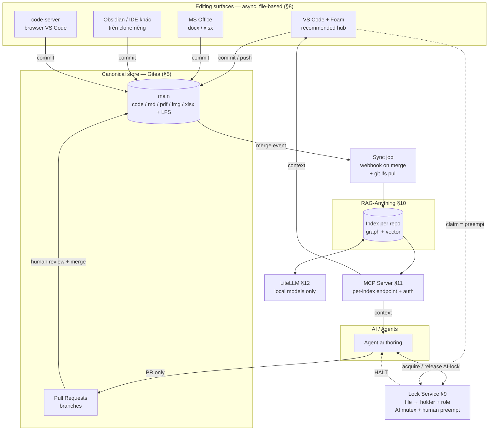

# Đề xuất (v0.3): Team Security LLM-Wiki — Git-backed, RAG-indexed, MCP-served

| | |
|---|---|
| **Version** | 0.3 (Draft) — thay thế v0.1, v0.2 |
| **Tác giả** | saltless-bruh |
| **Ngày** | 14/07/2026 |
| **Trạng thái** | Draft — chờ team lead review |
| **Thay đổi so với v0.2** | Bổ sung và tích hợp: **Data model & Format policy** (§6), **Ingress paths** (§7), **Editing surfaces** (§8), **Build scope** (§15), **Rejected alternatives** (§17). Thêm **Design spine** (§3) — chuỗi suy luận nối toàn bộ quyết định. Làm rõ: repo = permission boundary = index scope; và **binary không merge được → lock là lớp bảo vệ duy nhất**. |

> **Cách đọc tài liệu này:** §3 là xương sống — mọi thành phần trong hệ thống đều dẫn xuất từ ba sự thật của use case, không có gì tồn tại vì "nice to have". Các section sau chỉ là triển khai chi tiết của §3. §17 liệt kê những phương án đã **bị loại và vì sao** — đọc §3 + §17 là đủ hiểu toàn bộ lý do thiết kế.

---

## 1. Tóm tắt (Executive Summary)

**Cái gì:** Một **LLM-Wiki dùng chung cho team Cybersecurity** — lưu trữ multi-data (raw code, PDF, doc/docx, md, image, excel/csv), cho phép **cả con người và AI/Agent đóng góp**, và **kết nối trực tiếp vào IDE/Agent của từng thành viên** để truy vấn context. Self-hosted hoàn toàn trên **Docker**, local-first — không có cloud trong đường đi của embedding/LLM.

**Nhận định định hình toàn bộ kiến trúc:** consumer chính là **IDE và Agent truy vấn**, không phải người đọc một trang wiki. Đây là **query system**, không phải authoring system. Vì vậy trọng tâm là ba lớp: **storage → multimodal index → MCP query layer**.

**Năm quyết định cốt lõi (what + why một dòng):**

| # | Quyết định | Vì sao (một dòng) |
|---|---|---|
| 1 | **Canonical store = Git (Gitea, self-hosted)** | Consumer là IDE → repo *đã nằm sẵn trong IDE*; sync async → git là đúng model; và **PR chính là cơ chế lock team lead mô tả**. |
| 2 | **RAG = RAG-Anything** (nền LightRAG) | Là engine duy nhất **native multimodal** đúng mix dữ liệu của team, **và có MCP server** để IDE/Agent cắm vào. |
| 3 | **Query layer = MCP** | Là đúng yêu cầu "connect to each member's IDE/Agent" — pattern đã trưởng thành. |
| 4 | **Model serving = LiteLLM (local-only)** | Một endpoint ổn định cho RAG + **một chokepoint duy nhất** để enforce "không cloud" với dữ liệu security. |
| 5 | **Lock = PR-based + per-file AI mutex + human preempt** | Thoả **từng mệnh đề** của team lead, và enforce **về mặt cấu trúc** thay vì tin AI tự giác. |

**Chi phí xây dựng:** phần lớn hệ thống là **wiring các tool có sẵn**. Chỉ **một** thành phần phải tự viết: **lock service + presence signal** (§15). Đây là điểm mạnh về rủi ro triển khai.

---

## 2. Use case & Yêu cầu (Requirements)

### 2.1. Use case

Một team Cybersecurity cần một knowledge base dùng chung: gom **code, báo cáo (PDF/doc/docx), ghi chú (md), sơ đồ/screenshot (image), bảng dữ liệu (excel/csv)** vào một nơi, rồi **để IDE và Agent của từng thành viên truy vấn** như một nguồn context — "hỏi tri thức của team ngay trong editor". Dữ liệu nhạy cảm (findings, có thể chứa thông tin khách hàng) → bắt buộc **local-first, self-hosted**.

### 2.2. Functional requirements

| ID | Yêu cầu |
|---|---|
| **R1** | Lưu trữ multi-data: raw code (mọi ngôn ngữ), PDF, doc/docx, md, image, excel/csv. |
| **R2** | **Cả con người (team member) và AI/Agent đều edit được.** |
| **R3** | IDE và Agent của từng thành viên **kết nối để query** knowledge base. |
| **R4** | Multimodal retrieval — hỏi được cả nội dung trong PDF/hình/bảng, không chỉ text thuần. |
| **R5** | **Ai cũng dùng được tool mình quen** (MS Office cho Office docs, VS Code/IDE cho code, v.v.) và vẫn sync được. |

### 2.3. Lock requirements (team lead đặt ra — nguyên văn diễn giải)

| ID | Yêu cầu |
|---|---|
| **L1** | **Human edit → AI không được edit, chỉ được *suggest* trên cùng file.** |
| **L2** | **AI edit → AI khác không được edit cùng file; khác file thì OK.** |
| **L3** | **Human có thể edit khi AI đang edit**, hoạt động như **stop/pause** khi AI thêm nội dung sai. |

Tổng quát: **Human > AI** (con người luôn thắng), **AI ⊥ AI** (hai agent loại trừ nhau trên cùng file).

### 2.4. Constraints

- **C1 — Local-first, self-hosted, Docker.** Không cloud trong đường LLM/embedding.
- **C2 — Sync = async (git-style).** Đã chốt: edit → save → commit/PR/merge. **Không** real-time co-editing.
- **C3 — Access control / need-to-know.** Team security có dữ liệu compartmentalized (nhiều engagement/khách hàng).

### 2.5. Non-goals (v1)

- Real-time co-editing kiểu Google Docs — **đã loại** (C2; xem §17).
- Đồng bộ hai chiều với Affine — **đã loại** (§17).
- Một UI edit native **cả 6** định dạng — **không tồn tại** trên thị trường (§8.4 giải thích lý do cấu trúc).

---

## 3. Design spine — chuỗi suy luận (THE WHY)

> Mọi thành phần trong tài liệu này dẫn xuất từ **ba sự thật** của use case. Nếu một sự thật đổi, phần kiến trúc treo dưới nó phải xem lại — đó là cách kiểm tra tính nhất quán của thiết kế.

### Sự thật 1 — Consumer là **IDE/Agent query**, không phải người đọc trang wiki (R3)

```
→ Đây là QUERY SYSTEM, không phải authoring system
   → Cần: multimodal index (§10) + MCP query layer (§11)
   → Store phải là thứ IDE đọc trực tiếp được  →  FILE, không phải DB/CRDT
      → Loại Affine/Obsidian-as-store (§17)
```

### Sự thật 2 — Sync là **async, git-style** (C2)

```
→ Canonical store = GIT (§5)
   ├→ Git là file  →  BẤT KỲ file-based tool nào cũng edit được  →  pluralism (R5, §8)
   │    → VS Code + Foam là hub tự nhiên: git-native VÀ MCP-native (§8.1)
   ├→ Git có PR    →  CHÍNH LÀ lock model team lead mô tả (L1, §9)
   │    → "AI suggest, human decide" được enforce CẤU TRÚC, không dựa vào AI tự giác
   ├→ Git có permission per-repo  →  repo = boundary = index scope (§5.1)
   │    → Access control gần như FREE, không phải build ACL layer riêng (C3, §13)
   ├→ Git có commit author  →  attribution FREE
   └→ Git KHÔNG merge được binary  →  cần format policy (§6.2)
        → và lock trở thành LỚP BẢO VỆ DUY NHẤT cho binary (§9.4)
```

### Sự thật 3 — Dữ liệu là **security-sensitive** và **multi-modal** (R1, R4, C1, C3)

```
→ Multi-modal mix (code/PDF/image/table)  →  RAG-Anything, native multimodal (§10)
→ Security-sensitive  →  local-only  →  LiteLLM làm chokepoint duy nhất (§12)
→ Index là tài sản nhạy cảm (dạng distilled, query được của toàn bộ tri thức team)
   →  auth MCP endpoint + need-to-know segmentation (§13)
      →  khớp với repo = boundary ở Sự thật 2  →  per-engagement repo + per-repo index
```

### 3.1. Traceability matrix — yêu cầu → cơ chế → ở đâu

| Yêu cầu | Cơ chế | Section |
|---|---|---|
| **R1** Lưu multi-data | Gitea + Git LFS cho binary | §5, §6 |
| **R2** Human + AI cùng edit | Human: commit/merge. Agent: **PR-only** | §7, §9 |
| **R3** IDE/Agent query | RAG-Anything + MCP server | §10, §11 |
| **R4** Multimodal retrieval | RAG-Anything (parse text/image/table/equation) | §10 |
| **R5** Tool tuỳ chọn, vẫn sync | File substrate + git → mọi file-based tool là first-class | §8 |
| **L1** Human edit → AI suggest | Agent **không có write access** vào `main`; chỉ mở PR | §9.1 |
| **L2** AI ⊥ AI cùng file | **Per-file AI mutex** (lock service), song song trên file khác | §9.2 |
| **L3** Human preempt AI | Human claim → **HALT signal** → agent dừng | §9.2, §9.3 |
| **C1** Local-first, Docker | LiteLLM route local-only; toàn bộ compose | §12, §14 |
| **C2** Async sync | Git (không CRDT, không real-time layer) | §5 |
| **C3** Need-to-know | **Repo = permission boundary = index scope** | §5.1, §13 |

---

## 4. Kiến trúc tổng quan (Architecture Overview)



**Sáu lớp — mỗi lớp một lý do tồn tại:**

| Lớp | Là gì | Vì sao có mặt |
|---|---|---|
| **Editing surfaces** (§8) | VS Code + Foam, MS Office, Obsidian, code-server | R5 — file substrate cho phép pluralism; VS Code là hub vì git-native + MCP-native |
| **Storage** (§5) | Gitea self-hosted + LFS | Sự thật 2 — async → git; và git đem theo PR/permission/attribution miễn phí |
| **Lock service** (§9) | Per-file mutex + preempt | L1/L2/L3 — mảnh duy nhất git không cho sẵn |
| **Sync job** (§10.3) | Webhook on merge → update clone → re-index | Nối storage với index; **phải `git lfs pull`** (§10.3) |
| **RAG index** (§10) | RAG-Anything / LightRAG | R1+R4 — multimodal native |
| **MCP + LiteLLM** (§11, §12) | Query layer + model gateway | R3 (kết nối IDE) + C1 (local-only chokepoint) |

---

## 5. Storage layer — Gitea (self-hosted)

**Là gì:** Gitea self-hosted là **canonical store** duy nhất. Toàn bộ multi-data của team nằm trong git repo; binary (PDF/image/xlsx) qua **Git LFS**.

**Vì sao (6 lý do, không phải 1):**

1. **Repo đã nằm sẵn trong IDE của mọi thành viên** → một nửa yêu cầu R3 ("connect to IDE") là **miễn phí**; RAG chỉ thêm lớp semantic query lên trên.
2. **Async sync là chính xác model của git** (C2) — không cần bịa thêm layer sync nào.
3. **PR chính là lock model team lead mô tả** (L1) — không phải build từ đầu (§9).
4. **Permission per-repo → access control** (C3) — repo là ranh giới sẵn có, không cần ACL layer riêng (§5.1).
5. **Versioning + blame + attribution miễn phí** — biết ai/agent nào đóng góp gì, khi nào. Với team security, đây là yêu cầu ngầm quan trọng.
6. **File substrate → pluralism** (R5) — git không quan tâm tool nào ghi ra file (§8).

### 5.1. Repo = permission boundary = index scope (điểm nối quan trọng nhất)

Đây là chỗ ba thứ trùng nhau, và là lý do access control gần như free:

```
Gitea repo permission  ==  ranh giới need-to-know  ==  phạm vi RAG index
```

**Hệ quả trực tiếp:** *nơi* một người upload dữ liệu **quyết định** *ai* query được nó. Với team security có nhiều engagement/khách hàng → **per-engagement repo**, mỗi repo có permission riêng **và index riêng**:

```
security-kb/          → tri thức chung, cả team đọc     → index: shared
engagement-acme/      → chỉ team làm Acme               → index: acme
engagement-globex/    → chỉ team làm Globex             → index: globex
```

**Vì sao không dùng một index phẳng:** một index duy nhất **không có ranh giới per-user** — ai kết nối MCP cũng query được *mọi thứ*, kể cả dữ liệu khách hàng khác. Đó là leak xuyên need-to-know. Segmentation theo repo giải quyết triệt để mà **không phải build gì thêm** — vì Gitea đã enforce permission ở storage, ta chỉ cần map nó lên MCP endpoint (§11.2, §13).

Trong một repo, cấu trúc thư mục (`docs/`, `code/`, `data/`, `assets/`) chỉ để **tổ chức**, **không phải security boundary**. Xem **Phụ lục D**.

---

## 6. Data model & Format policy

### 6.1. Sáu định dạng — lưu thế nào, RAG đọc thế nào

| Định dạng | Lưu trong git | RAG-Anything xử lý | Ghi chú |
|---|---|---|---|
| **md** | ✅ text, diff/merge được | ✅ tốt nhất | Định dạng "hạng nhất" của hệ thống |
| **code** (mọi loại) | ✅ text, diff/merge được | ✅ (cần chunk theo function/class — §10.2) | |
| **csv** | ✅ text, diff được | ⚠️ dạng bảng | Merge được nhưng dễ conflict |
| **pdf** | ⚠️ binary → **LFS** | ✅ parse text + hình + bảng | Read-mostly |
| **docx** | ⚠️ binary → **LFS** | ✅ | **Không merge được** (§9.4) |
| **xlsx** | ⚠️ binary → **LFS** | ✅ bảng | **Không merge được** (§9.4) |
| **image** | ⚠️ binary → **LFS** | ✅ qua vision model (§12) | **Không merge được** |

### 6.2. Format policy: Born-digital vs Received artifacts

Đây là policy **rút ra trực tiếp từ Sự thật 2** ("git không merge được binary") — không phải sở thích:

**(a) Born-digital — tri thức team tự viết → dùng `markdown`.**

*Vì sao:* diff/merge được → **PR review thật sự có ý nghĩa**; mọi tool đều edit được (R5); RAG parse chuẩn nhất. Đây là "wiki proper" — phần nội dung sống, thay đổi thường xuyên, nhiều người đụng.

**(b) Received artifacts — báo cáo khách hàng, PDF vendor, sheet nhận về → giữ nguyên binary gốc.**

*Vì sao hai lý do:*
- **Evidence / chain-of-custody.** Với công việc security, **bản gốc là bằng chứng** — không được "chuyển thể" sang markdown rồi vứt bản gốc.
- **Read-mostly** → vấn đề "binary không merge" **hiếm khi nổ**, vì gần như không ai sửa chúng.

*Tuỳ chọn:* đặt kèm một `summary.md` do người viết bên cạnh artifact (`reports/acme-2026/report.pdf` + `reports/acme-2026/summary.md`) — cho human context nhanh, và cho RAG thêm text chất lượng cao.

**Kết quả của policy:** binary được giữ **ngoài hot path collaboration**, nên rủi ro mất dữ liệu do no-merge bị giảm về gần 0 mà **không cần cấm** định dạng nào.

### 6.3. Git LFS

**Là gì:** mọi binary (pdf/docx/xlsx/image) đi qua Git LFS.

**Vì sao:** repo git thuần phình rất nhanh với binary (mỗi version lưu nguyên file) → clone chậm, không dùng được. **Đặt threshold + `.gitattributes` TRƯỚC khi file PDF lớn đầu tiên vào repo**, không phải sau — sửa lịch sử git sau đó rất đau.

**Cạm bẫy nối sang §10.3:** clone dùng để index **phải `git lfs pull`** (smudge) — nếu không, RAG-Anything sẽ index **LFS pointer text** thay vì nội dung PDF thật.

### 6.4. Never-upload list (đặc thù team security)

| Không bao giờ đưa vào repo | Vì sao |
|---|---|
| Secrets / credentials / API keys | Git giữ lịch sử **vĩnh viễn** — xoá commit sau không đủ |
| **Malware samples** | Không thuộc về một wiki repo; rủi ro thực thi/lây nhiễm; AV/EDR sẽ quarantine cả clone của mọi người |
| Raw capture chứa live credentials | Như trên |

**Enforce bằng:** `.gitignore` + **secret scanning** của Gitea + pre-commit hook. Và **`.ragignore`** cho thứ *được phép nằm trong repo nhưng không được index* (ví dụ: dữ liệu thô rất lớn, hoặc tài liệu nhạy cảm cần lưu nhưng không nên query được).

> **Phân biệt:** `.gitignore` = **không vào repo**. `.ragignore` = **ở trong repo nhưng không vào index**. Hai lớp khác nhau, phục vụ hai mối lo khác nhau.

---

## 7. Ingress — What & Where (đường upload dữ liệu)

**Ba đường vào cho con người, một đường cho agent. Không có đường thứ tư.**

| # | Đường | Dành cho | Ghi chú |
|---|---|---|---|
| 1 | **git commit + push** từ local clone | Mặc định — team kỹ thuật | Canonical |
| 2 | **Gitea web UI upload** | Không cần biết git — kéo-thả PDF vào repo trên browser | Commit trực tiếp; hợp cho "đây là báo cáo, cứ lưu vào" |
| 3 | **code-server** (browser VS Code) | Ai không muốn setup local | §8.2 |
| — | **Agent → PR only** | AI/Agent | **Không bao giờ** ghi thẳng `main` (§9.1) |

**Vì sao KHÔNG có "drop folder tự động commit":** nó **bypass review** — chính là cách secrets rò rỉ vào repo. Mọi thứ vào `main` phải qua một hành động có chủ đích (commit của người) hoặc qua review (PR của agent).

**Vì sao "where" quan trọng ngang "what":** theo §5.1, **repo quyết định ai query được**. Nên câu hỏi "upload vào đâu" thực chất là câu hỏi **phân loại need-to-know**. Quy tắc đơn giản cho team:

> Dữ liệu của một engagement cụ thể → repo của engagement đó.
> Tri thức tái sử dụng được, không gắn khách hàng → `security-kb`.
> Nếu phân vân → repo hẹp hơn (dễ mở rộng quyền sau, không thể "thu hồi" thứ đã bị index chung).

---

## 8. Editing surfaces — "ai cũng dùng tool mình thích" (R5)

**Nguyên tắc:** vì canonical store là **file trong git**, git **không quan tâm tool nào ghi ra file**. Mọi **file-based tool** đều là first-class citizen. Đây không phải sự thoả hiệp — đây là **phần thưởng của việc chọn git** (và chính là thứ Affine không thể cho — §17).

### 8.1. VS Code + Foam — hub được khuyến nghị

**Là gì:** VS Code mở thẳng repo, cộng extension: **Foam** (wikilinks/backlinks/graph — cảm giác Obsidian trên file phẳng), **Office Viewer (cweijan)** / Syncfusion Document Viewer (xem docx/xlsx), Rainbow CSV / Edit CSV, PDF/image preview có sẵn.

**Vì sao VS Code thắng — lý do thật KHÔNG phải mấy cái viewer:**

> VS Code là **ứng cử viên duy nhất vừa git-native vừa MCP-native**.

Mọi lựa chọn single-UI khác (Affine, Obsidian, Nextcloud, SiYuan…) cần **hai cây cầu**: một cầu tới repo, một cầu tới RAG layer. VS Code **không cần cầu nào**: nó mở repo trực tiếp, và nó là nơi MCP client đã sống sẵn (Copilot agent mode, Cline, Continue, Claude Code). **Yêu cầu R3 được thoả một cách native ngay tại đây.** Foam và Office viewer chỉ là bonus. Thêm nữa: **gần như cả team đã dùng VS Code** → chi phí onboarding ~0.

### 8.2. code-server — VS Code trên browser

**Là gì:** `code-server` / `openvscode-server` trong Docker, chạy trên một clone của repo. Cho câu trả lời *[lead's feedback]* của team lead **mà không phải nhận storage của bất kỳ app nào**.

**Cảnh báo vận hành:** một container code-server **dùng chung** nghĩa là mọi người chung filesystem và **chung git identity** → **phá attribution** (§5, lý do 5). Nên: **mỗi user một instance** (mỗi instance một clone + credential riêng), hoặc coi code-server là **tuỳ chọn** và ưu tiên VS Code local.

### 8.3. Tool khác — đều hợp lệ

| Tool | Dùng cho | Đường sync |
|---|---|---|
| **MS Office** | docx / xlsx (edit thật) | Sửa trên local clone → commit → push |
| **Obsidian** | Ghi chú markdown cá nhân | Mở clone như một vault → commit |
| **IDE khác** (JetBrains, Neovim…) | Code | git như thường |
| **Tool ảnh** | Sửa/annotate image | Sửa file → commit |

> **Lưu ý về Obsidian:** dùng làm **editor cá nhân trên clone** là hoàn toàn OK. Cái bị loại (§17) là **Obsidian làm store/UI trung tâm dùng chung** — vì nó là app single-user và **không có merge layer**.

### 8.4. Sự thật về "single UI cho cả 6 định dạng"

**Không tồn tại — và đây là vấn đề cấu trúc, không phải thiếu sót khi tìm kiếm.** Ngay cả Affine và Obsidian cũng **không** "handle all 6": chúng edit markdown/block và chỉ **embed/preview** phần còn lại. Không có editor native thống nhất vì **code, spreadsheet, Word doc, PDF, image là những ứng dụng khác nhau với mô hình editing khác nhau**. Mọi tool "all-in-one" thực chất là (a) note app nhúng các định dạng khác, hoặc (b) platform **đóng gói nhiều editor riêng** (ví dụ Nextcloud ship OnlyOffice).

**Thực tế của VS Code — nói trước để không ai bất ngờ:**

| Định dạng | VS Code | |
|---|---|---|
| Code | ✅ edit native | Sân nhà |
| Markdown | ✅ edit native + **Foam** | Wikilink/backlink/graph |
| CSV | ✅ edit (Rainbow CSV / Edit CSV) | Tốt thật |
| Image | 👁 **chỉ xem** | Sửa cần tool ảnh thật |
| PDF | 👁 **chỉ xem** | Chấp nhận được — PDF là artifact để đọc |
| docx/xlsx | 👁 xem, edit hạn chế | Edit thật → **MS Office** (§8.3) |

**Kết luận:** VS Code = **edit mọi thứ dạng text, xem mọi thứ còn lại**. Với một wiki chủ yếu để **đọc và query**, đó là ~90% nhu cầu hằng ngày trong một cửa sổ. Phần 10% còn lại (edit Office/ảnh) → mở tool chuyên dụng trên cùng file, commit như thường. **Đó chính là R5.**

---

## 9. Lock & Collaboration (phần cốt lõi)

**Mô hình:** **PR-based collaboration + per-file AI mutex**. Đây **không** phải một concurrency primitive mới — nó là mô hình PR của git cộng một mutex mỏng.

### 9.1. Ánh xạ yêu cầu → cơ chế (từng mệnh đề)

| Yêu cầu | Cơ chế | Vì sao mạnh |
|---|---|---|
| **L1** Human edit → AI chỉ *suggest* cùng file | Agent **không có quyền ghi `main`** — chỉ mở **PR/branch** | "Suggest, không edit" được enforce **CẤU TRÚC**, không dựa vào việc AI tự giác hay prompt tốt. Human review & merge là cổng bắt buộc. |
| **L2** AI ⊥ AI cùng file | **Per-file AI mutex**: agent acquire AI-lock trước khi edit | Chặn agent khác trên **file đó**, vẫn **song song trên file khác** — đúng yêu cầu "khác file thì OK" |
| **L3** Human preempt AI | Human claim → service gửi **HALT** cho agent đang giữ AI-lock | Con người **luôn thắng**; agent dừng ghi + bỏ branch dở |

### 9.2. Lock service

Một service nhỏ (Redis-backed) giữ:

```
lock:<repo>:<path> → { holder_id, role: "human"|"ai", acquired_at, ttl }
```

- **Acquire (AI):** set lock `role=ai` nếu file chưa có lock `role=ai`. Nếu file đang có lock `role=human` → agent **không direct-edit**, tự hạ xuống **suggest-only** (vẫn mở PR đề xuất được, nhưng không đụng file trực tiếp).
- **Preempt (human):** human claim `role=human` → nếu tồn tại `ai_locked` trên file, service phát **HALT** (webhook/poll) → agent dừng.
- **Release:** agent xong (đã mở PR) hoặc bị HALT; human rời file.
- **TTL + heartbeat:** AI-lock có TTL để agent chết không giữ lock vĩnh viễn; agent heartbeat gia hạn khi còn đang làm.

Xem state machine ở **Phụ lục B**.

### 9.3. Presence signal — mảnh DUY NHẤT git không cho sẵn

**Vấn đề:** file **không tự báo** "đang có human edit". (Affine có live presence/awareness; substrate file thì không.) Human-preempt (L3) vì thế cần một **cooperative signal**:

- **v1 — Explicit claim:** thành viên chạy một lệnh / bấm UI nhỏ "editing file X" → tạo lock `role=human`.
- **v2 — Presence plugin:** extension VS Code / plugin Obsidian phát event khi open/close file → tự động claim/release.

**Rủi ro đã biết:** v1 phụ thuộc kỷ luật — quên claim → agent không biết có người đang sửa. Giảm thiểu bằng v2, và bằng format policy (§6.2) vốn đã giữ binary ra khỏi hot path.

### 9.4. Binary: lock là LỚP BẢO VỆ DUY NHẤT (điểm quan trọng nhất mục này)

Git **3-way-merge được text**, nhưng **không merge được** `.docx` / `.xlsx` / `.png`. Hai người sửa cùng một file Office → conflict mà con người phải giải bằng cách **chọn nguyên một bản** → **công của một bên biến mất**.

**Hệ quả:**

- Với **markdown/code**: nếu lock thất bại (ví dụ ai đó quên claim), **git merge vẫn là lưới an toàn** phía sau.
- Với **binary**: **không có lưới nào cả**. Lock (§9.2) + claim (§9.3) là **lớp bảo vệ duy nhất**.

**→ Đây là lý do lock không phải thủ tục hình thức.** Nói rõ với team lead: **cơ chế lock anh yêu cầu chính là thứ duy nhất bảo vệ file Office.** Và đây cũng là lý do §6.2 (format policy) tồn tại — giữ binary ở vùng read-mostly để **giảm tần suất** tình huống này, thay vì phải cấm định dạng.

### 9.5. Vì sao mô hình này nhẹ hơn v0.1

v0.1 (store = Affine/CRDT) phải build: Redis Streams serializer, single-writer chokepoint, chống CRDT-interleave, idempotency qua content-hash. **Tất cả biến mất** — vì git đã mã hoá sẵn "propose vs commit" (PR) và "human-gated merge", và substrate là file + git merge chứ không phải CRDT-over-MCP.

**Còn lại đúng hai thứ:** per-file mutex (L2) + preempt signal (L3). Đó là toàn bộ §15.

---

## 10. RAG layer — RAG-Anything

**Là gì:** RAG-Anything (nền **LightRAG**) index nội dung `main` đã merge, cho mỗi repo một index.

**Vì sao — bốn lý do:**

1. **Native multimodal** — parse và index text, image, table, equation trong **cùng một pipeline**. Đúng chính xác mix dữ liệu của team (R1, R4). Đây là thứ Dify không cho sẵn (§17).
2. **Có MCP server** → thoả R3 mà không phải tự viết (§11).
3. **Knowledge graph (LightRAG) là điểm cộng ở use case này** — với KB code + docs, **quan hệ chính là giá trị**: hàm nào gọi gì, finding nào tham chiếu tài liệu nào. Graph bắt được, similarity thuần thì không.
4. **Incremental update** — chỉ reprocess phần content đã đổi khi merge, không rebuild cả graph.

> **Ghi chú về việc "quay lại GraphRAG":** v0.1 đã bỏ GraphRAG để chọn VectorRAG. Điều đó **đúng cho use case cũ** (authoring pipeline). Use case thật là **query cho code + docs** → graph earns its keep. Đây là thay đổi **có chủ đích**, không phải dao động.

### 10.1. Storage backends

LightRAG hỗ trợ nhiều backend (KV: JSON/Postgres/Redis; vector: FAISS/Milvus/Chroma; graph: Neo4j/Postgres AGE). **v1:** dùng default file-based cho đơn giản. **Khi scale:** chuyển Postgres/Milvus/Neo4j — không đổi kiến trúc.

### 10.2. Code-aware chunking

**Vấn đề:** chunking mặc định cắt ngang function → phá retrieval. Code là dữ liệu nặng của team → điểm này quan trọng.

**Cách xử lý:** cấu hình chunk theo cấu trúc (function/class) hoặc chạy code-aware parser trước khi index. Là điểm **tinh chỉnh**, không phải blocker.

### 10.3. Sync job — nối §5 với §10

**Là gì:** Gitea webhook on merge → cập nhật clone → trigger re-index.

**Hai chi tiết bắt buộc:**

1. **`git lfs pull`** trên clone dùng để index. Nếu không → index nhận **LFS pointer text** thay vì nội dung PDF thật (nối §6.3). Đây là lỗi im lặng — index vẫn "chạy", chỉ là vô dụng.
2. **Tôn trọng `.ragignore`** (§6.4) — thứ trong repo nhưng không được vào index.

---

## 11. MCP query layer

**Là gì:** expose RAG layer qua **MCP** để IDE/Agent của từng thành viên cắm vào.

**Vì sao:** đây là **đúng nguyên văn R3** ("connect to each member's IDE/Agent"). MCP là chuẩn cho việc này, và pattern đã trưởng thành.

### 11.1. Lựa chọn (chốt ở review)

| Phương án | Ghi chú |
|---|---|
| **RAG-Anything MCP server** | Xử lý directory, multimodal, query qua LightRAG — **ưu tiên** vì giữ được multimodal |
| **LightRAG MCP servers** | Nhiều bản (30 tools / 22 tools / bản 3-tool nhẹ): document management + query modes (naive/local/global/hybrid/mix) + knowledge-graph ops |
| **Code-RAG MCP servers** | Index repo, expose `rag_query` / `read_file` / `list_files`, cắm thẳng vào Cursor / VS Code Copilot agent mode / Claude Code, chạy fully local |
| **Wrapper tự viết** | Fallback nếu tool coverage thiếu — mỏng, quanh query API |

### 11.2. MCP phải tôn trọng ranh giới của §5.1 (nếu không, boundary rò ở đây)

Nếu **repo = boundary = index scope** (§5.1) mà MCP layer expose **một endpoint chung cho mọi index** → **ranh giới bị rò ngay tại query layer**: một thành viên không có quyền đọc `engagement-globex` trong Gitea vẫn query được nội dung của nó qua MCP.

**→ Bắt buộc:** **một MCP endpoint (hoặc token scope) cho mỗi index**, và quyền của token **map đúng permission Gitea** của người đó. Đây là điểm nối §5.1 ↔ §11 ↔ §13 — bỏ sót thì toàn bộ mô hình access control vô nghĩa.

---

## 12. Model serving — LiteLLM

**Là gì:** LiteLLM là gateway OpenAI-compatible; RAG-Anything trỏ tới nó cho **embedding + LLM + vision**. Phía sau LiteLLM là local inference backend (llama.cpp) + một **vision model** cho multimodal parsing.

**Vì sao — bốn lý do:**

1. **Một endpoint ổn định** cho RAG service — đổi/route model không phải đụng config RAG.
2. **Chokepoint DUY NHẤT để enforce C1** ("không cloud"). Vì mọi lời gọi model đi qua đây, chỉ cần audit **một** file config để chứng minh dữ liệu security không rời hạ tầng. Đây là lý do mạnh nhất.
3. **Virtual keys per consumer** (RAG service, agent) → rate limit, tách quyền, thu hồi độc lập.
4. **Vision model routing** — multimodal parsing (§10) cần VLM; LiteLLM cho phép route riêng slot đó mà không đụng phần còn lại.

> **LiteLLM không tự inference** — nó là proxy/gateway. Inference thật nằm ở backend phía sau.

---

## 13. Security & Access control

> Đây là "phần khó" **thật sự** của kiến trúc này — nó **thay chỗ** của lock trong v0.1. Lock đã co lại thành một service nhỏ (§9.5); access control mới là thứ đáng dành thời gian.

| Mối lo | Cơ chế | Nối tới |
|---|---|---|
| Ai đọc/ghi được repo nào | Gitea permission per-repo/org | §5.1 |
| Ai **query** được index nào | **Per-index MCP endpoint/token, map đúng permission Gitea** | §11.2 |
| Index phẳng leak xuyên need-to-know | **Per-engagement repo → per-repo index** | §5.1 |
| **Bản thân index là tài sản nhạy cảm** | Auth MCP endpoint; internal-network only; không cloud | §11, §12 |
| Secrets vào repo | `.gitignore` + secret scanning + pre-commit hook | §6.4 |
| Thứ trong repo không nên query được | `.ragignore` | §6.4, §10.3 |
| Dữ liệu rời hạ tầng | LiteLLM local-only routing (chokepoint duy nhất) | §12 |
| Ai làm gì | Git commit author — **free** | §5 |

**Nhấn mạnh về index:** index là **dạng distilled, query được của toàn bộ tri thức security của team**. Nó **nguy hiểm hơn** từng file riêng lẻ — một truy vấn có thể tổng hợp thông tin xuyên nhiều nguồn mà người hỏi lẽ ra không ghép được. Vì vậy index phải được bảo vệ **ít nhất ngang** repo gốc, không phải như một "cache phụ".

---

## 14. Triển khai Docker (Deployment)

Toàn bộ trên Docker Compose, một shared network `wiki-net`. Thành phần: **Gitea (+ Postgres)**, **RAG-Anything/LightRAG** (+ storage), **MCP server**, **Lock service (+ Redis)**, **LiteLLM**, và **code-server** (tuỳ chọn, §8.2). Xem **Phụ lục A**.

**Resource note (trung thực):** MinerU-class parsing + graph construction + LLM chạy đồng thời là **nặng**. Trên một box với **RTX 3060 12GB**, đủ để **prototype v1**, nhưng kỳ vọng contention khi index dữ liệu lớn. Production cho cả team nên tách **GPU box riêng** cho inference, hoặc ít nhất tách slot parsing/generation behind LiteLLM (§12). **Cần đo sớm**, đừng giả định.

---

## 15. Build scope — cái gì phải TỰ VIẾT (điểm mạnh về rủi ro)

> Phần lớn hệ thống là **wiring tool có sẵn**. Đây là danh sách đầy đủ những gì phải viết:

| # | Thành phần | Quy mô | Vì sao không có sẵn |
|---|---|---|---|
| 1 | **Lock service** (per-file mutex + preempt + TTL/heartbeat) | Nhỏ (~200-300 dòng) | L2/L3 là yêu cầu riêng của team; git không có per-file lock |
| 2 | **Presence/claim mechanism** (v1: lệnh; v2: VS Code extension) | Nhỏ → vừa | Mảnh duy nhất git không cho sẵn (§9.3) |
| 3 | **Sync/re-index job** (webhook → clone + `git lfs pull` → trigger index) | Rất nhỏ (script) | Nối Gitea ↔ RAG (§10.3) |
| 4 | **MCP wrapper** (chỉ nếu server chọn ở §11.1 thiếu coverage) | Nhỏ, **có thể không cần** | Fallback |

**Mọi thứ còn lại — Gitea, RAG-Anything, LiteLLM, MCP server, VS Code + extensions, code-server — là tool có sẵn, chỉ cấu hình.** Đây là lập luận chính về khả năng giao được: bề mặt code tự viết nhỏ → ít bug, ít bảo trì, dễ handover.

---

## 16. Lộ trình (Roadmap)

**v1 (MVP) — mục tiêu: query được, và lock đúng spec.**
- Gitea + Git LFS + `.gitattributes` (đặt **trước** file binary đầu tiên).
- Repo layout: `security-kb` + per-engagement repos (§5.1, Phụ lục D).
- RAG-Anything + LiteLLM (local-only) + MCP endpoint per index.
- Lock service + **explicit claim command** (§9.3 v1).
- Editing: VS Code + Foam (khuyến nghị); MS Office/Obsidian/IDE khác đều OK.
- Sync job (webhook + `git lfs pull`).

**v2+**
- **Presence plugin** cho VS Code/Obsidian → auto claim/release thay lệnh thủ công.
- Code-aware chunking tinh chỉnh (§10.2).
- PR-triage UI cho agent-authored PR.
- Storage backend scale-up (Postgres/Milvus/Neo4j) nếu cần (§10.1).
- code-server per-user (nếu team thật sự cần browser editing).

---

## 17. Rejected alternatives — và VÌ SAO

> Mục này tồn tại để không ai phải hỏi lại "sao không dùng X?" sau ba tháng.

| Phương án | Vì sao bị loại |
|---|---|
| **Affine làm store/UI** | (a) Store là **CRDT/DB (BlockSuite/Yjs, OctoBase)**, **không phải file** → IDE/Agent không đọc trực tiếp được → phá Sự thật 1. (b) **Không có PR model** → L1 ("AI suggest") không có chỗ để enforce. (c) **Self-hosted bị giới hạn tính năng** — không có native MCP server, ít integration hơn Cloud (team lead đã gặp đúng vấn đề này khi chạy localhost). (d) Sync markdown↔CRDT hai chiều là **project riêng**, lossy và fragile. |
| **Obsidian làm store/UI trung tâm** | (a) App **single-user**; `linuxserver/obsidian` là **KasmVNC remote desktop** — một session, không phải multi-user. (b) **Không có merge layer** → human + agent cùng file có thể **mất dữ liệu thẳng** (Affine ít nhất còn CRDT merge). (c) Sai lớp: substrate đúng là git repo, không phải note app. → **Nhưng Obsidian vẫn dùng tốt như editor cá nhân trên clone** (§8.3). |
| **Dify** | (a) RAG native là **vector-only** → phải tự build pipeline per-type cho image/table/code. (b) Orchestration của nó phục vụ **chat app**, không phải query-KB spine — trong kiến trúc này **không có việc để làm**. (c) Thêm một layer nữa vào compose mà không đổi lại được gì. |
| **VectorRAG (quyết định cũ ở v0.1)** | Đúng khi use case là authoring pipeline. Use case thật là **query trên code + docs** → **quan hệ chính là giá trị** → graph earns its keep. Đảo chiều **có chủ đích** (§10). |
| **Nextcloud + OnlyOffice** | Là thứ **duy nhất thật sự edit Office trong browser** — nhưng: **storage riêng**, yếu với code-as-code, **không git-back sạch** → phá substrate (Sự thật 2). Chỉ xét lại **nếu** in-browser Office editing trở thành hard requirement. |
| **Note apps khác** (SiYuan, AppFlowy, Outline, Docmost, Logseq, SilverBullet, Anytype, Trilium) | Cùng một giới hạn: **markdown/block native, định dạng khác chỉ embed/preview** — không tool nào "handle all 6" (§8.4). Và hầu hết **mang storage riêng** → **mở lại đúng bài toán sync vừa đóng**. (Các bản plain-markdown như Logseq/SilverBullet *có thể* ngồi trên git — nhưng vẫn chỉ là markdown editor, không phải Office/code editor → không hơn VS Code.) |
| **Real-time co-editing (CRDT)** | Async đủ cho một KB (C2). Live co-typing sẽ **phá vỡ file/IDE story** — buộc quay lại một store dạng CRDT và mất toàn bộ lợi ích của git. Ngoài scope. |
| **Auto-commit drop folder** | **Bypass review** → chính là vector rò rỉ secrets (§7). |
| **Single flat index** | Không có ranh giới per-user → **leak xuyên need-to-know** (C3). Thay bằng per-repo index (§5.1). |

---

## 18. Rủi ro & Giả định (Risks & Assumptions)

| Rủi ro / Giả định | Mức | Giảm thiểu |
|---|---|---|
| **Presence signal phụ thuộc kỷ luật** (v1 explicit claim) — quên claim → agent không biết có người đang sửa | **Cao** (vì §9.4: binary không có lưới an toàn) | v2 presence plugin; format policy giữ binary read-mostly (§6.2) |
| **RAG-Anything MCP maturity** — phần lớn là community server, tool coverage chưa chắc đủ | Trung bình | Verify sớm ở review; fallback LightRAG MCP hoặc wrapper tự viết (§11.1) |
| **`git lfs pull` bị quên** trên clone index → index toàn LFS pointer | Trung bình (**lỗi im lặng**) | Health check: assert index chứa nội dung thật, không phải pointer (§10.3) |
| **Access control là bài toán thật** — index phẳng leak | **Cao** | Per-repo index **ngay từ v1**, không để sau (§5.1, §11.2, §13) |
| **Resource** — parsing + graph + LLM trên 12GB VRAM | Trung bình | Đo sớm; tách GPU box hoặc slot riêng (§14) |
| **Git LFS threshold đặt muộn** → repo phình, phải rewrite history | Trung bình | Đặt `.gitattributes` **trước** binary đầu tiên (§6.3) |
| **code-server dùng chung phá attribution** | Thấp | Per-user instance, hoặc coi là optional (§8.2) |
| **Async only** — nếu sau này team muốn live co-typing | Thấp | Đó là hệ khác (CRDT); sẽ phải xem lại Sự thật 2 (§17) |

---

## Phụ lục A — `docker-compose` (rút gọn)

```yaml
# docker network create wiki-net   (chạy một lần)
networks:
  wiki-net: { external: true }

services:
  gitea:                            # §5 — canonical store
    image: gitea/gitea:latest
    environment:
      GITEA__database__DB_TYPE: postgres
      GITEA__database__HOST: gitea-db:5432
      GITEA__server__ROOT_URL: http://gitea:3000/
      GITEA__server__LFS_START_SERVER: "true"      # §6.3 — LFS bật từ đầu
    volumes: ["gitea-data:/data"]
    depends_on: [gitea-db]
    networks: [wiki-net]

  gitea-db:
    image: postgres:16-alpine
    environment:
      POSTGRES_DB: gitea
      POSTGRES_USER: gitea
      POSTGRES_PASSWORD: ${GITEA_DB_PASSWORD}
    volumes: ["gitea-db-data:/var/lib/postgresql/data"]
    networks: [wiki-net]

  litellm:                          # §12 — chokepoint local-only
    image: ghcr.io/berriai/litellm:main-latest
    command: ["--config", "/app/config.yaml"]
    volumes: ["./litellm-config.yaml:/app/config.yaml:ro"]
    environment:
      LITELLM_MASTER_KEY: ${LITELLM_MASTER_KEY}
    networks: [wiki-net]
    # backends (llama.cpp + VLM) khai báo trong config.yaml — KHÔNG có cloud provider

  rag:                              # §10 — RAG-Anything / LightRAG
    build: { context: ./rag }
    environment:
      LIGHTRAG_HOST: 0.0.0.0
      LIGHTRAG_PORT: "9621"
      LLM_BINDING: openai
      LLM_BINDING_HOST: http://litellm:4000        # → §12
      EMBEDDING_BINDING_HOST: http://litellm:4000
      REPO_MOUNT: /data/repos                       # clone của các repo (đã lfs pull)
    volumes:
      - "rag-storage:/app/storage"
      - "repo-clones:/data/repos:ro"
    depends_on: [litellm]
    networks: [wiki-net]

  rag-mcp:                          # §11 — query layer cho IDE/Agent
    build: { context: ./rag-mcp }
    environment:
      LIGHTRAG_SERVER_URL: http://rag:9621
      MCP_TRANSPORT: http
      MCP_HTTP_TOKEN: ${MCP_HTTP_SECRET}
      # §11.2 — token scope phải map permission Gitea, một endpoint/scope mỗi index
    depends_on: [rag]
    networks: [wiki-net]

  sync-job:                         # §10.3 — webhook → clone + lfs pull → re-index
    build: { context: ./sync-job }
    environment:
      GITEA_URL: http://gitea:3000
      GITEA_TOKEN: ${GITEA_SYNC_TOKEN}
      RAG_URL: http://rag:9621
      CLONE_DIR: /data/repos
    volumes: ["repo-clones:/data/repos"]
    depends_on: [gitea, rag]
    networks: [wiki-net]

  lock-svc:                         # §9 — per-file AI mutex + human preempt
    build: { context: ./lock-svc }
    environment:
      REDIS_URL: redis://redis-lock:6379
    depends_on: [redis-lock]
    networks: [wiki-net]

  redis-lock:
    image: redis:7-alpine
    command: ["redis-server", "--appendonly", "yes"]
    volumes: ["redis-lock-data:/data"]
    networks: [wiki-net]

  # §8.2 — TUỲ CHỌN. Dùng chung sẽ phá attribution → nên per-user instance.
  code-server:
    image: lscr.io/linuxserver/code-server:latest
    environment:
      PUID: "1000"
      PGID: "1000"
      DEFAULT_WORKSPACE: /workspace
    volumes: ["cs-workspace:/workspace", "cs-config:/config"]
    ports: ["8443:8443"]
    networks: [wiki-net]

volumes:
  gitea-data:
  gitea-db-data:
  rag-storage:
  repo-clones:
  redis-lock-data:
  cs-workspace:
  cs-config:
```

## Phụ lục B — Lock state machine (§9)

```
State per file:  none | ai_locked{agent} | human_locked{user}

Agent muốn edit file f:
  state(f) == none             -> set ai_locked{self}; edit trên branch; mở PR; release
  state(f) == ai_locked{other} -> BLOCK  (đợi, hoặc chuyển sang file khác — L2 cho phép song song khác file)
  state(f) == human_locked{*}  -> KHÔNG direct-edit; hạ xuống suggest-only (mở PR, không đụng file)   [L1]

Human claim file f  (explicit command v1 / presence plugin v2):
  set human_locked{self}
  if trước đó ai_locked{agent} -> gửi HALT cho agent; agent dừng + bỏ branch dở                        [L3]

Release:
  agent : sau khi mở PR, hoặc khi bị HALT
  human : khi rời file (release command / presence off)

An toàn:  AI-lock có TTL + heartbeat  → agent chết thì lock tự hết hạn
Ưu tiên:  human_locked LUÔN thắng ai_locked                                                            [Human > AI]

Lưu ý (§9.4): với markdown/code, git merge là lưới an toàn nếu lock hụt.
              Với binary (docx/xlsx/image), KHÔNG có lưới — lock là lớp bảo vệ duy nhất.
```

## Phụ lục C — PR flow (agent authoring)

```
agent → acquire AI-lock(files)          [L2 — chặn agent khác trên đúng các file này]
      → tạo branch
      → soạn nội dung
      → mở PR ("suggest")               [L1 — agent KHÔNG có quyền ghi main]
      → release AI-lock
human → review PR → merge (hoặc từ chối)
Gitea → webhook on merge
sync  → update clone + `git lfs pull`   [§10.3 — nếu thiếu, index toàn LFS pointer]
RAG   → incremental re-index

Nếu human claim file giữa chừng → HALT agent → branch bị bỏ.   [L3]
```

## Phụ lục D — Repo layout (repo = boundary = index scope, §5.1)

```
security-kb/                     # tri thức chung — cả team đọc      → index: shared
├── .gitattributes               # LFS rules (§6.3)
├── .gitignore                   # secrets never enter (§6.4)
├── .ragignore                   # trong repo nhưng không index (§6.4)
├── docs/                        # born-digital → markdown (§6.2a)
│   ├── playbooks/
│   ├── techniques/
│   └── postmortems/
├── code/                        # tools, scripts, PoC
├── data/                        # csv / xlsx
└── assets/                      # images, diagrams (LFS)

engagement-acme/                 # chỉ team làm Acme                 → index: acme
├── .gitattributes
├── .ragignore
├── findings/                    # born-digital → markdown (§6.2a)
├── reports/                     # received artifacts — giữ nguyên gốc (§6.2b, LFS)
│   ├── acme-2026-final.pdf
│   └── acme-2026-final.summary.md   # tuỳ chọn: summary do người viết
└── evidence/                    # screenshots (LFS)

engagement-globex/               # chỉ team làm Globex               → index: globex
└── ...

# Thư mục TRONG repo = tổ chức, KHÔNG phải security boundary.
# Boundary = repo. Quyền = Gitea permission. Index scope = repo.  (§5.1, §11.2)
```

---

*Hết bản v0.3. Quyết định còn mở để chốt ở review:*
1. *Chọn bản MCP server (§11.1: RAG-Anything MCP vs LightRAG MCP vs wrapper tự viết).*
2. *Ngôn ngữ triển khai lock-service (§15 #1) — Rust hay Python.*
3. *v1 dùng explicit claim command hay đầu tư luôn presence plugin (§9.3) — cân nhắc theo mức rủi ro ở §18 hàng đầu tiên.*
4. *code-server: triển khai per-user, hay bỏ hẳn và chỉ dùng VS Code local (§8.2).*
