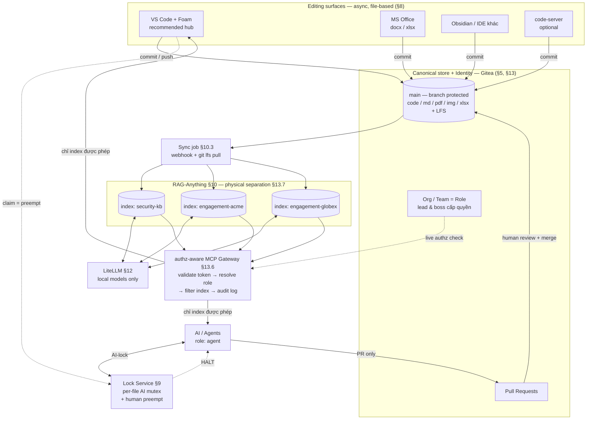

# Đề xuất (v0.4): Team Security LLM-Wiki — Git-backed, RAG-indexed, MCP-served, RBAC-enforced

| | |
|---|---|
| **Version** | 0.4 (Draft) — thay thế v0.1, v0.2, v0.3 |
| **Tác giả** | saltless-bruh |
| **Ngày** | 14/07/2026 |
| **Trạng thái** | Draft — chờ team lead review |
| **Thay đổi so với v0.3** | Bổ sung yêu cầu **RBAC / least-privilege** (C4). Viết lại §13 thành **Identity, Roles & Access Control** hoàn chỉnh. **Sửa độ chính xác của §9.1**: cơ chế thật của L1 là **branch protection + merge whitelist**, không phải "agent không có write access". Thêm **authz-aware MCP gateway** (§13.6) thay cho static per-index token. Làm rõ: **physical index separation, không phải filtered retrieval** (§13.7). |

> **Cách đọc:** §3 là xương sống — mọi thành phần đều dẫn xuất từ ba sự thật của use case. §13 là phần khó nhất về mặt thiết kế. §17 ghi lại mọi phương án **đã bị loại và vì sao**. Đọc §3 + §13 + §17 là đủ hiểu toàn bộ lý do.

---

## 1. Tóm tắt (Executive Summary)

**Cái gì:** Một **LLM-Wiki dùng chung cho team Cybersecurity** — lưu trữ multi-data (raw code, PDF, doc/docx, md, image, excel/csv), cho phép **cả con người và AI/Agent đóng góp**, **kết nối trực tiếp vào IDE/Agent của từng thành viên** để truy vấn context, và **phân quyền theo role** do team lead/boss cấp. Self-hosted hoàn toàn trên **Docker**, local-first.

**Nhận định định hình kiến trúc:** consumer chính là **IDE và Agent truy vấn** → đây là **query system**, không phải authoring system. Trọng tâm: **storage → multimodal index → MCP query layer**, với **RBAC xuyên suốt cả ba**.

**Sáu quyết định cốt lõi (what + why một dòng):**

| # | Quyết định | Vì sao (một dòng) |
|---|---|---|
| 1 | **Canonical store = Git (Gitea, self-hosted)** | Consumer là IDE → repo *đã nằm sẵn trong IDE*; async → git đúng model; **PR chính là lock model**; **và Gitea đã là identity + permission provider**. |
| 2 | **RAG = RAG-Anything** (nền LightRAG) | Engine duy nhất **native multimodal** đúng mix dữ liệu của team, **và có MCP server**. |
| 3 | **Query layer = MCP, qua authz-aware gateway** | Đúng yêu cầu "connect to IDE/Agent" (R3), **và** là nơi enforce role ở tầng query (C4). |
| 4 | **Model serving = LiteLLM (local-only)** | Một endpoint ổn định cho RAG + **chokepoint duy nhất** enforce "không cloud". |
| 5 | **Lock = PR-based + per-file AI mutex + human preempt** | Thoả **từng mệnh đề** của team lead, enforce **cấu trúc** thay vì tin AI tự giác. |
| 6 | **RBAC = Gitea org/team → repo → index → MCP scope** | Least-privilege **một chuỗi duy nhất**, lead/boss cấp quyền **một chỗ**, không có ACL system thứ hai. |

**Chi phí xây dựng:** phần lớn là **wiring tool có sẵn**. Chỉ **hai** thành phần phải tự viết đáng kể: **lock service** và **authz-aware MCP gateway** (§15).

---

## 2. Use case & Yêu cầu (Requirements)

### 2.1. Use case

Một team Cybersecurity cần knowledge base dùng chung: gom **code, báo cáo (PDF/doc/docx), ghi chú (md), sơ đồ/screenshot (image), bảng dữ liệu (excel/csv)**, rồi **để IDE và Agent của từng thành viên truy vấn** như nguồn context. Dữ liệu nhạy cảm (findings, thông tin khách hàng) → bắt buộc **local-first, self-hosted**, và **không phải ai cũng được đọc mọi thứ**.

### 2.2. Functional requirements

| ID | Yêu cầu |
|---|---|
| **R1** | Lưu trữ multi-data: raw code (mọi ngôn ngữ), PDF, doc/docx, md, image, excel/csv. |
| **R2** | **Cả con người và AI/Agent đều edit được.** |
| **R3** | IDE và Agent của từng thành viên **kết nối để query**. |
| **R4** | Multimodal retrieval — hỏi được nội dung trong PDF/hình/bảng. |
| **R5** | **Ai cũng dùng được tool mình quen** (MS Office, VS Code/IDE khác…) và vẫn sync. |

### 2.3. Lock requirements (team lead)

| ID | Yêu cầu |
|---|---|
| **L1** | **Human edit → AI không được edit, chỉ *suggest* trên cùng file.** |
| **L2** | **AI edit → AI khác không được edit cùng file; khác file thì OK.** |
| **L3** | **Human edit được khi AI đang edit** — như **stop/pause** khi AI thêm nội dung sai. |

Tổng quát: **Human > AI**, **AI ⊥ AI**.

### 2.4. Constraints

- **C1 — Local-first, self-hosted, Docker.** Không cloud trong đường LLM/embedding.
- **C2 — Sync = async (git-style).** Không real-time co-editing.
- **C3 — Need-to-know.** Dữ liệu compartmentalized theo engagement/khách hàng.
- **C4 — RBAC / least-privilege *(mới)*.** **Không phải ai cũng có quyền với dữ liệu cụ thể.** Mỗi người có **role**, privileges do **team lead và boss cấp**. Quyền phải **thu hồi được** và **audit được**.

> **Ghi chú thuật ngữ (quan trọng):** team lead gọi yêu cầu này là *"decentralization"*. Về mặt kiến trúc, **đây là ngược lại**: quyền được cấp bởi lead/boss = **thẩm quyền tập trung (centralized authority)**; cái được phân tán là **quyền truy cập (distributed access)**. Đúng tên gọi là **RBAC + least-privilege + compartmentalization**. Phân biệt này **không phải bắt bẻ chữ**: nếu ý thật sự là decentralization theo nghĩa kỹ thuật (P2P, không có central server, federated storage) thì **toàn bộ thiết kế Gitea là sai** và phải làm lại. → **Cần xác nhận với team lead.** Tài liệu này triển khai theo nghĩa RBAC.

### 2.5. Non-goals (v1)

- Real-time co-editing kiểu Google Docs — **đã loại** (C2, §17).
- Đồng bộ hai chiều với Affine — **đã loại** (§17).
- Một UI edit native **cả 6** định dạng — **không tồn tại** (§8.4).
- **Decentralization theo nghĩa kỹ thuật** (P2P/federated) — **đã loại**, mâu thuẫn với C4 (§17).
- **Cross-repo graph reasoning** — **đánh đổi có chủ đích** để lấy compartmentalization (§13.7).

---

## 3. Design spine — chuỗi suy luận (THE WHY)

> Mọi thành phần dẫn xuất từ **ba sự thật**. Nếu một sự thật đổi, phần treo dưới nó phải xem lại — đây là cách kiểm tra tính nhất quán của thiết kế.

### Sự thật 1 — Consumer là **IDE/Agent query**, không phải người đọc trang wiki (R3)

```
→ Đây là QUERY SYSTEM, không phải authoring system
   → Cần: multimodal index (§10) + MCP query layer (§11)
   → Store phải là thứ IDE đọc trực tiếp được  →  FILE, không phải DB/CRDT
      → Loại Affine/Obsidian-as-store (§17)
```

### Sự thật 2 — Sync là **async, git-style** (C2)

```
→ Canonical store = GIT (§5)
   ├→ Git là file  →  BẤT KỲ file-based tool nào cũng edit được  →  pluralism (R5, §8)
   │    → VS Code + Foam là hub tự nhiên: git-native VÀ MCP-native (§8.1)
   ├→ Git có PR + branch protection  →  CHÍNH LÀ lock model team lead mô tả (L1, §9)
   │    → "AI suggest, human decide" enforce CẤU TRÚC, không dựa vào AI tự giác
   ├→ Git có org/team/permission  →  RBAC (C4) + repo = boundary = index scope (§5.1, §13)
   │    → Gitea LÀ identity provider  →  KHÔNG cần ACL system thứ hai
   ├→ Git có commit author  →  attribution + audit FREE
   └→ Git KHÔNG merge được binary  →  cần format policy (§6.2)
        → và lock trở thành LỚP BẢO VỆ DUY NHẤT cho binary (§9.4)
```

### Sự thật 3 — Dữ liệu là **security-sensitive**, **multi-modal**, và **compartmentalized** (R1, R4, C1, C3, C4)

```
→ Multi-modal mix (code/PDF/image/table)  →  RAG-Anything, native multimodal (§10)
→ Security-sensitive  →  local-only  →  LiteLLM làm chokepoint duy nhất (§12)
→ Compartmentalized + RBAC  →  chuỗi privilege DUY NHẤT:
      role (Gitea team) → repo permission → index → MCP scope        (§13.2)
   → Index là artifact DẪN XUẤT của repo  →  PHẢI kế thừa ACL của repo
      → nếu kế thừa không tự động  →  DRIFT (thu hồi quyền mà token vẫn query được)
         → cần authz-aware MCP gateway, check LIVE (§13.6)
   → Graph merge entity xuyên nguồn  →  filtered retrieval KHÔNG an toàn
      → PHẢI physical index separation, một index mỗi repo (§13.7)
         → đánh đổi: mất cross-repo graph reasoning (chấp nhận)
```

### 3.1. Traceability matrix — yêu cầu → cơ chế → ở đâu

| Yêu cầu | Cơ chế | Section |
|---|---|---|
| **R1** Lưu multi-data | Gitea + Git LFS cho binary | §5, §6 |
| **R2** Human + AI cùng edit | Human: commit/merge. Agent: **PR-only qua branch protection** | §7, §9 |
| **R3** IDE/Agent query | RAG-Anything + MCP gateway | §10, §11 |
| **R4** Multimodal retrieval | RAG-Anything (text/image/table/equation) | §10 |
| **R5** Tool tuỳ chọn, vẫn sync | File substrate + git → mọi file-based tool first-class | §8 |
| **L1** Human edit → AI suggest | **Branch protection trên `main` + agent KHÔNG trong merge whitelist** | §9.1, §13.5 |
| **L2** AI ⊥ AI cùng file | **Per-file AI mutex** (lock service) | §9.2 |
| **L3** Human preempt AI | Human claim → **HALT signal** → agent dừng | §9.2, §9.3 |
| **C1** Local-first, Docker | LiteLLM route local-only; toàn bộ compose | §12, §14 |
| **C2** Async sync | Git (không CRDT, không real-time layer) | §5 |
| **C3** Need-to-know | **Repo = boundary = index scope** | §5.1, §13 |
| **C4** RBAC, lead/boss cấp quyền | **Gitea org/team → repo → index → MCP scope**, authz gateway check live | §13 |

---

## 4. Kiến trúc tổng quan (Architecture Overview)



**Bảy lớp — mỗi lớp một lý do tồn tại:**

| Lớp | Là gì | Vì sao có mặt |
|---|---|---|
| **Editing surfaces** (§8) | VS Code + Foam, MS Office, Obsidian, code-server | R5 — file substrate cho pluralism; VS Code là hub vì git-native + MCP-native |
| **Storage + Identity** (§5, §13) | Gitea + LFS + org/team | Sự thật 2 — async → git; git đem theo PR/permission/attribution/**identity** miễn phí |
| **Lock service** (§9) | Per-file mutex + preempt | L2/L3 — mảnh duy nhất git không cho sẵn |
| **Sync job** (§10.3) | Webhook on merge → clone + `git lfs pull` → re-index | Nối storage với index |
| **RAG index** (§10) | RAG-Anything, **một index mỗi repo** | R1+R4 multimodal; C3+C4 physical separation |
| **MCP gateway** (§13.6) | Authz + filter + audit | R3 (kết nối IDE) **+ C4 (enforce role tại query layer)** |
| **LiteLLM** (§12) | Model gateway | C1 — chokepoint duy nhất enforce "không cloud" |

---

## 5. Storage layer — Gitea (self-hosted)

**Là gì:** Gitea self-hosted là **canonical store** duy nhất **và** là **identity/permission provider**. Multi-data của team nằm trong git repo; binary (PDF/image/xlsx) qua **Git LFS**.

**Vì sao (7 lý do, không phải 1):**

1. **Repo đã nằm sẵn trong IDE của mọi thành viên** → một nửa R3 là **miễn phí**; RAG chỉ thêm lớp semantic query.
2. **Async sync là chính xác model của git** (C2).
3. **PR + branch protection chính là lock model team lead mô tả** (L1) — không phải build từ đầu (§9).
4. **Org/Team/Permission → RBAC** (C4) — **Gitea đã là identity provider**, không cần ACL system thứ hai (§13).
5. **Permission per-repo → access control boundary** (C3) — §5.1.
6. **Versioning + blame + attribution + audit miễn phí** — với team security đây là yêu cầu ngầm quan trọng.
7. **File substrate → pluralism** (R5) — git không quan tâm tool nào ghi ra file (§8).

### 5.1. Repo = permission boundary = index scope (điểm nối quan trọng nhất)

Ba thứ trùng nhau — và đó là lý do access control gần như free:

```
Gitea repo permission  ==  ranh giới need-to-know  ==  phạm vi RAG index
```

**Hệ quả trực tiếp:** *nơi* một người upload dữ liệu **quyết định** *ai* query được nó. Với team có nhiều engagement → **per-engagement repo**, mỗi repo có **permission riêng** và **index riêng**:

```
security-kb/          → tri thức chung, cả team đọc     → index: shared
engagement-acme/      → chỉ team làm Acme               → index: acme
engagement-globex/    → chỉ team làm Globex             → index: globex
```

**Ràng buộc quan trọng — repo là ĐƠN VỊ NGUYÊN TỬ của access:** git permission là **per-repo**, không phải per-folder. → **Nếu hai nhóm cần quyền khác nhau trên cùng một nội dung, chúng PHẢI là hai repo khác nhau.** Trong một repo, cấu trúc thư mục (`docs/`, `code/`, `data/`, `assets/`) chỉ để **tổ chức**, **không phải security boundary**. Cần granularity nhỏ hơn → **tách repo**, đừng bịa cơ chế mới. Xem **Phụ lục D**.

---

## 6. Data model & Format policy

### 6.1. Sáu định dạng — lưu thế nào, RAG đọc thế nào

| Định dạng | Lưu trong git | RAG-Anything xử lý | Ghi chú |
|---|---|---|---|
| **md** | ✅ text, diff/merge được | ✅ tốt nhất | Định dạng "hạng nhất" |
| **code** (mọi loại) | ✅ text, diff/merge được | ✅ (cần chunk theo function/class — §10.2) | |
| **csv** | ✅ text, diff được | ⚠️ dạng bảng | Merge được nhưng dễ conflict |
| **pdf** | ⚠️ binary → **LFS** | ✅ parse text + hình + bảng | Read-mostly |
| **docx** | ⚠️ binary → **LFS** | ✅ | **Không merge được** (§9.4) |
| **xlsx** | ⚠️ binary → **LFS** | ✅ bảng | **Không merge được** (§9.4) |
| **image** | ⚠️ binary → **LFS** | ✅ qua vision model (§12) | **Không merge được** |

### 6.2. Format policy: Born-digital vs Received artifacts

Rút ra **trực tiếp từ Sự thật 2** ("git không merge được binary") — không phải sở thích:

**(a) Born-digital — tri thức team tự viết → `markdown`.**
*Vì sao:* diff/merge được → **PR review có ý nghĩa thật**; mọi tool edit được (R5); RAG parse chuẩn nhất. Đây là "wiki proper" — nội dung sống, nhiều người đụng.

**(b) Received artifacts — báo cáo khách hàng, PDF vendor, sheet nhận về → giữ nguyên binary gốc.**
*Vì sao hai lý do:*
- **Evidence / chain-of-custody.** Với công việc security, **bản gốc là bằng chứng** — không "chuyển thể" rồi vứt gốc.
- **Read-mostly** → vấn đề "binary không merge" **hiếm khi nổ**.

*Tuỳ chọn:* đặt kèm `summary.md` do người viết bên cạnh artifact — cho human context nhanh và cho RAG thêm text chất lượng cao.

**Kết quả:** binary được giữ **ngoài hot path collaboration** → rủi ro mất dữ liệu do no-merge giảm về gần 0 mà **không cần cấm** định dạng nào.

### 6.3. Git LFS

**Là gì:** mọi binary đi qua Git LFS.
**Vì sao:** repo git thuần phình rất nhanh với binary → clone chậm, không dùng được. **Đặt `.gitattributes` TRƯỚC file PDF lớn đầu tiên**, không phải sau — rewrite history rất đau.
**Cạm bẫy nối §10.3:** clone dùng để index **phải `git lfs pull`**, nếu không RAG index **LFS pointer text** thay vì nội dung thật.

### 6.4. Never-upload list

| Không bao giờ vào repo | Vì sao |
|---|---|
| Secrets / credentials / API keys | Git giữ lịch sử **vĩnh viễn** — xoá commit sau không đủ |
| **Malware samples** | Không thuộc về wiki repo; rủi ro thực thi; AV/EDR quarantine clone của mọi người |
| Raw capture chứa live credentials | Như trên |

**Enforce:** `.gitignore` + **secret scanning** Gitea + pre-commit hook. Và **`.ragignore`** cho thứ *được phép trong repo nhưng không được index*.

> **Phân biệt:** `.gitignore` = **không vào repo**. `.ragignore` = **trong repo nhưng không vào index**. Hai lớp, hai mối lo.

---

## 7. Ingress — What & Where

**Ba đường cho người, một đường cho agent. Không có đường thứ tư.**

| # | Đường | Dành cho | Ghi chú |
|---|---|---|---|
| 1 | **git commit + push** từ local clone | Mặc định — team kỹ thuật | Canonical |
| 2 | **Gitea web UI upload** | Không cần biết git — kéo-thả PDF | Hợp cho "đây là báo cáo, cứ lưu" |
| 3 | **code-server** (browser VS Code) | Ai không muốn setup local | §8.2 |
| — | **Agent → PR only** | AI/Agent | **Không bao giờ** merge được (§9.1, §13.5) |

**Vì sao KHÔNG có "drop folder tự động commit":** **bypass review** — chính là cách secrets rò rỉ.

**Vì sao "where" quan trọng ngang "what":** theo §5.1, **repo quyết định ai query được**. "Upload vào đâu" thực chất là câu hỏi **phân loại need-to-know**:

> Dữ liệu của một engagement → repo của engagement đó.
> Tri thức tái sử dụng, không gắn khách hàng → `security-kb`.
> **Phân vân → chọn repo hẹp hơn.** Mở rộng quyền sau thì dễ; **không thể "thu hồi" thứ đã bị index chung**.

---

## 8. Editing surfaces — "ai cũng dùng tool mình thích" (R5)

**Nguyên tắc:** canonical store là **file trong git** → git **không quan tâm tool nào ghi ra file**. Mọi **file-based tool** là first-class citizen. Đây không phải thoả hiệp — đây là **phần thưởng của việc chọn git** (thứ Affine không thể cho — §17).

### 8.1. VS Code + Foam — hub được khuyến nghị

**Là gì:** VS Code mở thẳng repo + **Foam** (wikilinks/backlinks/graph — cảm giác Obsidian trên file phẳng), **Office Viewer (cweijan)** / Syncfusion Document Viewer, Rainbow CSV / Edit CSV, PDF/image preview có sẵn.

**Vì sao VS Code thắng — lý do thật KHÔNG phải mấy cái viewer:**

> VS Code là **ứng cử viên duy nhất vừa git-native vừa MCP-native**.

Mọi lựa chọn single-UI khác (Affine, Obsidian, Nextcloud, SiYuan…) cần **hai cây cầu**: một tới repo, một tới RAG layer. VS Code **không cần cầu nào** — nó mở repo trực tiếp, và là nơi MCP client đã sống sẵn (Copilot agent mode, Cline, Continue, Claude Code). **R3 được thoả native ngay tại đây.** Foam và Office viewer chỉ là bonus. Thêm nữa: **gần như cả team đã dùng VS Code** → onboarding ~0.

### 8.2. code-server — VS Code trên browser

**Là gì:** `code-server` trong Docker trên một clone. Trả lời *[lead's feedback]* **mà không nhận storage của app nào**.

**Cảnh báo vận hành:** một container code-server **dùng chung** = chung filesystem + **chung git identity** → **phá attribution** (§5 lý do 6) **và phá RBAC** (§13 — không phân biệt được ai đang thao tác). → **Bắt buộc per-user instance**, hoặc coi là **tuỳ chọn** và ưu tiên VS Code local.

### 8.3. Tool khác — đều hợp lệ

| Tool | Dùng cho | Đường sync |
|---|---|---|
| **MS Office** | docx / xlsx (edit thật) | Sửa trên local clone → commit → push |
| **Obsidian** | Ghi chú markdown cá nhân | Mở clone như một vault → commit |
| **IDE khác** (JetBrains, Neovim…) | Code | git như thường |
| **Tool ảnh** | Sửa/annotate image | Sửa file → commit |

> **Về Obsidian:** làm **editor cá nhân trên clone** thì hoàn toàn OK. Cái bị loại (§17) là **Obsidian làm store/UI trung tâm dùng chung** — vì là app single-user và **không có merge layer**.

### 8.4. Sự thật về "single UI cho cả 6 định dạng"

**Không tồn tại — vấn đề cấu trúc, không phải thiếu sót khi tìm.** Ngay cả Affine/Obsidian cũng **không** handle all 6: chúng edit markdown/block và chỉ **embed/preview** phần còn lại. Không có editor native thống nhất vì **code, spreadsheet, Word doc, PDF, image là những ứng dụng khác nhau với mô hình editing khác nhau**. Mọi tool "all-in-one" thực chất là (a) note app nhúng định dạng khác, hoặc (b) platform **đóng gói nhiều editor riêng** (Nextcloud ship OnlyOffice).

**Thực tế VS Code — nói trước để không ai bất ngờ:**

| Định dạng | VS Code | |
|---|---|---|
| Code | ✅ edit native | Sân nhà |
| Markdown | ✅ edit native + **Foam** | Wikilink/backlink/graph |
| CSV | ✅ edit | Tốt thật |
| Image | 👁 **chỉ xem** | Sửa cần tool ảnh |
| PDF | 👁 **chỉ xem** | OK — PDF là artifact để đọc |
| docx/xlsx | 👁 xem, edit hạn chế | Edit thật → **MS Office** |

**Kết luận:** VS Code = **edit mọi thứ dạng text, xem mọi thứ còn lại** ≈ **90% nhu cầu hằng ngày trong một cửa sổ**. 10% còn lại → mở tool chuyên dụng trên cùng file, commit như thường. **Đó chính là R5.**

---

## 9. Lock & Collaboration

**Mô hình:** **PR-based collaboration + per-file AI mutex**. Không phải concurrency primitive mới — là mô hình PR của git cộng một mutex mỏng.

### 9.1. Ánh xạ yêu cầu → cơ chế (từng mệnh đề)

| Yêu cầu | Cơ chế | Vì sao mạnh |
|---|---|---|
| **L1** Human edit → AI chỉ *suggest* | **Branch protection trên `main`**: require PR + approval, **agent KHÔNG nằm trong merge whitelist** | Enforce **CẤU TRÚC bởi Gitea**, không dựa vào AI tự giác hay prompt tốt. **Đây là một RBAC rule** (§13.5) — lock và RBAC dùng chung một cơ chế. |
| **L2** AI ⊥ AI cùng file | **Per-file AI mutex**: agent acquire AI-lock trước khi edit | Chặn agent khác trên **file đó**, vẫn **song song trên file khác** — đúng "khác file thì OK" |
| **L3** Human preempt AI | Human claim → service gửi **HALT** cho agent giữ AI-lock | Con người **luôn thắng**; agent dừng + bỏ branch dở |

> **Sửa so với v0.3:** v0.3 viết "agent không có write access vào `main`" — **không chính xác**. Gitea permission là Read/Write/Admin **per-repo**, không có mức "PR-only". Agent **cần** Write để push branch của nó. Cơ chế đúng của L1 là **branch protection**: chặn direct push vào `main`, require PR + approval, và **agent không có trong merge whitelist** → agent **không thể merge PR của chính nó**. Kết quả giống hệt, nhưng cơ chế là **native Gitea**, không cần custom code.

### 9.2. Lock service

Service nhỏ (Redis-backed):

```
lock:<repo>:<path> → { holder_id, role: "human"|"ai", acquired_at, ttl }
```

- **Acquire (AI):** set `ai_locked` nếu file chưa có `ai_locked`. Nếu file đang `human_locked` → agent **không direct-edit**, hạ xuống **suggest-only**.
- **Preempt (human):** human claim `role=human` → nếu có `ai_locked`, phát **HALT** (webhook/poll) → agent dừng.
- **Release:** agent xong (đã mở PR) hoặc bị HALT; human rời file.
- **TTL + heartbeat:** AI-lock có TTL → agent chết thì lock tự hết hạn.

Xem **Phụ lục B**.

### 9.3. Presence signal — mảnh DUY NHẤT git không cho sẵn

**Vấn đề:** file **không tự báo** "đang có human edit". (Affine có live presence; substrate file thì không.) L3 vì thế cần **cooperative signal**:

- **v1 — Explicit claim:** lệnh / UI nhỏ "editing file X" → tạo `human_locked`.
- **v2 — Presence plugin:** extension VS Code / plugin Obsidian phát event khi open/close file → auto claim/release.

**Rủi ro:** v1 phụ thuộc kỷ luật — quên claim → agent không biết có người đang sửa. Giảm thiểu bằng v2 và bằng format policy (§6.2).

### 9.4. Binary: lock là LỚP BẢO VỆ DUY NHẤT

Git **3-way-merge được text**, **không merge được** `.docx`/`.xlsx`/`.png`. Hai người sửa cùng file Office → conflict phải giải bằng cách **chọn nguyên một bản** → **công của một bên biến mất**.

**Hệ quả:**
- **markdown/code:** lock hụt → **git merge vẫn là lưới an toàn**.
- **binary:** **không có lưới nào**. Lock (§9.2) + claim (§9.3) là **lớp bảo vệ duy nhất**.

**→ Lock không phải thủ tục hình thức.** Nói rõ với team lead: **cơ chế lock anh yêu cầu chính là thứ duy nhất bảo vệ file Office.** Và đây cũng là lý do §6.2 tồn tại — giữ binary ở vùng read-mostly để **giảm tần suất**, thay vì cấm định dạng.

### 9.5. Vì sao mô hình này nhẹ hơn v0.1

v0.1 (store = Affine/CRDT) phải build: Redis Streams serializer, single-writer chokepoint, chống CRDT-interleave, idempotency qua content-hash. **Tất cả biến mất** — git đã mã hoá sẵn "propose vs commit" (PR) và "human-gated merge"; substrate là file + git merge, không phải CRDT-over-MCP.

**Còn lại đúng hai thứ:** per-file mutex (L2) + preempt signal (L3).

---

## 10. RAG layer — RAG-Anything

**Là gì:** RAG-Anything (nền **LightRAG**) index nội dung `main` đã merge — **một index riêng cho mỗi repo** (§13.7).

**Vì sao — bốn lý do:**

1. **Native multimodal** — parse/index text, image, table, equation trong **cùng một pipeline**. Đúng mix dữ liệu của team (R1, R4). Dify không cho sẵn (§17).
2. **Có MCP server** → thoả R3 mà không tự viết (§11).
3. **Knowledge graph là điểm cộng ở use case này** — với KB code + docs, **quan hệ chính là giá trị**: hàm nào gọi gì, finding nào tham chiếu tài liệu nào. Graph bắt được, similarity thuần thì không.
4. **Incremental update** — chỉ reprocess phần đã đổi khi merge.

> **Về việc "quay lại GraphRAG":** v0.1 bỏ GraphRAG chọn VectorRAG — **đúng cho use case cũ** (authoring pipeline). Use case thật là **query trên code + docs** → graph earns its keep. Thay đổi **có chủ đích**, không phải dao động.

### 10.1. Storage backends

LightRAG hỗ trợ nhiều backend (KV: JSON/Postgres/Redis; vector: FAISS/Milvus/Chroma; graph: Neo4j/Postgres AGE). **v1:** default file-based. **Scale:** chuyển Postgres/Milvus/Neo4j — không đổi kiến trúc.

### 10.2. Code-aware chunking

**Vấn đề:** chunking mặc định cắt ngang function → phá retrieval. Code là dữ liệu nặng của team.
**Cách xử lý:** chunk theo cấu trúc (function/class) hoặc code-aware parser trước khi index. Điểm **tinh chỉnh**, không phải blocker.

### 10.3. Sync job — nối §5 với §10

**Là gì:** Gitea webhook on merge → cập nhật clone → trigger re-index của **đúng repo đó**.

**Ba chi tiết bắt buộc:**

1. **`git lfs pull`** trên clone index. Nếu không → index nhận **LFS pointer text** thay vì nội dung PDF thật (§6.3). **Lỗi im lặng** — index vẫn "chạy", chỉ vô dụng.
2. **Tôn trọng `.ragignore`** (§6.4).
3. **Không trộn repo.** Mỗi repo → clone riêng → index riêng (§13.7). Sync job **không được** gộp nhiều repo vào một index.

---

## 11. MCP query layer

**Là gì:** expose RAG layer qua **MCP** để IDE/Agent cắm vào — **qua authz-aware gateway** (§13.6), không phải nối thẳng vào index.

**Vì sao:** đúng nguyên văn R3 ("connect to each member's IDE/Agent"), **và** gateway là nơi enforce C4 ở tầng query.

### 11.1. Lựa chọn MCP server (chốt ở review)

| Phương án | Ghi chú |
|---|---|
| **RAG-Anything MCP server** | Xử lý directory, multimodal, query qua LightRAG — **ưu tiên**, giữ được multimodal |
| **LightRAG MCP servers** | Nhiều bản (30/22/3 tools): document management + query modes (naive/local/global/hybrid/mix) + graph ops |
| **Code-RAG MCP servers** | Index repo, expose `rag_query`/`read_file`/`list_files`, cắm thẳng Cursor / VS Code Copilot agent mode / Claude Code, fully local |
| **Wrapper tự viết** | Fallback nếu tool coverage thiếu |

> Dù chọn bản nào, nó **nằm SAU gateway** (§13.6), không expose trực tiếp cho user.

### 11.2. MCP phải tôn trọng ranh giới §5.1 — nếu không, boundary rò tại đây

Nếu **repo = boundary = index scope** (§5.1) mà MCP layer expose **một endpoint chung cho mọi index** → **ranh giới rò ngay tại query layer**: người không có quyền đọc `engagement-globex` trong Gitea vẫn query được nội dung qua MCP. **Toàn bộ mô hình access control trở nên vô nghĩa.**

**→ Giải pháp: authz-aware gateway (§13.6).** Đây là điểm nối §5.1 ↔ §11 ↔ §13.

---

## 12. Model serving — LiteLLM

**Là gì:** gateway OpenAI-compatible; RAG-Anything trỏ tới nó cho **embedding + LLM + vision**. Phía sau là local inference backend (llama.cpp) + một **vision model** cho multimodal parsing.

**Vì sao — bốn lý do:**

1. **Một endpoint ổn định** cho RAG — đổi/route model không đụng config RAG.
2. **Chokepoint DUY NHẤT để enforce C1** ("không cloud"). Mọi lời gọi model qua đây → chỉ cần audit **một** file config để chứng minh dữ liệu security không rời hạ tầng. **Lý do mạnh nhất.**
3. **Virtual keys per consumer** → rate limit, tách quyền, thu hồi độc lập.
4. **Vision model routing** — multimodal parsing cần VLM; route riêng slot đó không đụng phần còn lại.

> **LiteLLM không tự inference** — nó là proxy/gateway. Inference thật nằm ở backend phía sau.

---

## 13. Identity, Roles & Access Control (RBAC) — C4

> **Đây là phần khó nhất của kiến trúc này.** Lock đã co lại thành một service nhỏ (§9.5); access control mới là thứ đáng dành thời gian nhất.

### 13.1. Yêu cầu, nói đúng tên

Team lead gọi là *"decentralization"*. Thực chất:

| | |
|---|---|
| **Thẩm quyền (authority)** | **TẬP TRUNG** — lead & boss cấp quyền |
| **Quyền truy cập (access)** | **PHÂN TÁN** — mỗi role chỉ thấy phần của mình |
| **Tên đúng** | **RBAC + least-privilege + compartmentalization** |

**Vì sao phân biệt này quan trọng:** nếu ý thật sự là decentralization kỹ thuật (P2P/federated, không central server), **toàn bộ thiết kế Gitea sai** — vì Gitea *chính là* central authority. **Cần xác nhận với team lead trước khi build.** Tài liệu triển khai theo nghĩa RBAC.

### 13.2. Chuỗi privilege — MỘT chuỗi duy nhất

```
Boss / Team Lead  (Gitea Org Owner)
        │  cấp / thu hồi membership
        ▼
   Gitea Team  =  ROLE
        │  team có permission trên repo
        ▼
     Repo  =  ranh giới need-to-know          (§5.1)
        │  mỗi repo có index dẫn xuất
        ▼
     Index  =  phải KẾ THỪA ACL của repo      (§13.7)
        │  gateway check live
        ▼
   MCP scope  =  người đó query được gì       (§13.6)
```

**Vì sao chuỗi này mạnh:** không có **ACL system thứ hai**. Lead/boss cấp quyền **một chỗ duy nhất** (Gitea org/team), và mọi lớp dưới **dẫn xuất** từ đó. Không có bảng phân quyền song song để lệch nhau.

**Gitea là identity provider.** User's **Gitea personal access token (PAT)** (hoặc OAuth2 — Gitea là OAuth2 provider) là identity duy nhất. **Không cần SSO/LDAP riêng cho v1** (Gitea vẫn hỗ trợ nếu công ty đã có).

### 13.3. Role taxonomy (đề xuất khởi điểm — **cần lead xác nhận**)

| Role | Cơ chế Gitea | Privileges | Cấp bởi |
|---|---|---|---|
| **Owner** | Org Owner | Tạo repo, cấp/thu hồi quyền, admin | — (lead + boss) |
| **Engagement Lead** | Team `<eng>-leads`, **Write** + có trong **merge whitelist** | Write repo engagement; **review & merge PR** | Owner |
| **Analyst / Pentester** | Team `<eng>-analysts`, **Write** | Write repo engagement, mở PR; **không merge** | Owner |
| **KB Contributor** | Team `kb-contributors` trên `security-kb`, **Write** | Write KB chung | Owner |
| **Reader** | Team `<x>-readers`, **Read** | Đọc repo + **query index tương ứng** | Owner |
| **Agent** (service account) | Gitea user riêng, Team `<eng>-agents`, **Write**, **KHÔNG** trong merge whitelist | Clone, push branch, **mở PR**. **Không merge được.** | Owner |

**Nguyên tắc:** mỗi thành viên chỉ nằm trong team của **engagement họ đang làm**. Rời engagement → **remove khỏi team** → mất cả repo access **và** query access (§13.6). Một hành động, hai hiệu lực.

### 13.4. Agent là MỘT ROLE — không phải ngoại lệ

Điểm gọn nhất của thiết kế: **agent không cần cơ chế riêng.** Nó là một **principal** với role hạn chế:

- Có **Gitea account riêng** → mọi commit của nó có **attribution rõ ràng** (ai/agent nào viết cái gì — audit free).
- Có **Write** để push branch, **không có trong merge whitelist** → **không thể tự merge**.
- Chỉ nằm trong team của **repo được phép** → agent làm Acme **không đọc được** Globex.

**→ L1 (Human > AI) và C4 (RBAC) dùng CHUNG một cơ chế.** Không phải hai hệ thống. Đây là lý do §9.1 được sửa lại ở v0.4.

### 13.5. Branch protection — enforcement thật của L1

Cấu hình trên `main` của mọi repo:

| Setting | Giá trị | Phục vụ |
|---|---|---|
| Disable direct push to `main` | ✅ | L1 — không ai (kể cả agent) ghi thẳng |
| Require Pull Request | ✅ | L1 — mọi thay đổi phải qua đề xuất |
| Require approvals | ≥ 1 | L1 — human review là cổng bắt buộc |
| Restrict merge (whitelist) | **Engagement Lead** (+ Owner) | L1 — **agent không có trong danh sách** → không tự merge |
| Dismiss stale approvals | ✅ | Chống PR bị sửa sau khi đã approve |

**Vì sao đây là defense-in-depth:** kể cả nếu token của agent bị lộ hoặc agent có bug, **nó vẫn không thể ghi vào `main`** — Gitea từ chối ở tầng server, không phụ thuộc vào việc agent "cư xử đúng".

### 13.6. Authz-aware MCP Gateway — thành phần mới, và là chỗ enforce C4

**Vấn đề nó giải quyết (revocation drift):** nếu mỗi index có một **static MCP token**, thì khi lead **thu hồi** quyền của một người (remove khỏi Gitea team), **token cũ vẫn query được** — quyền lệch giữa storage và query layer. **Thu hồi là ca nguy hiểm nhất**, và static token làm nó thất bại **âm thầm**.

**Thiết kế:**

```
IDE / Agent (MCP client, gửi Gitea PAT của user)
   │
   ▼
mcp-gateway
   1. Xác thực PAT với Gitea API           → danh tính user
   2. Hỏi Gitea: user này Read được repo nào?  (cache TTL ngắn ~60s)
   3. Chỉ query index của các repo đó       → physical separation (§13.7)
   4. Ghi audit log: ai, hỏi gì, chạm index nào, lúc nào
   5. Trả context về
```

**Vì sao gateway thay vì static token:**

| | Static per-index token | **Authz gateway** |
|---|---|---|
| Thu hồi quyền | Thủ công, **dễ quên** → drift | **≤ 60s** (cache TTL), tự động |
| Nguồn sự thật | Bảng token riêng (hệ thống thứ hai) | **Gitea** (một nguồn duy nhất) |
| Audit query | Không có | **Có sẵn** |
| Thêm engagement mới | Phát token mới bằng tay | Tự động (team membership) |
| Chi phí | 0 | 1 API call/query (cache được) |

**Đánh đổi:** thêm một component phải viết (§15) + một Gitea API call mỗi query (cache TTL ngắn làm nó rẻ). **Đáng** — vì với team security, **thu hồi quyền phải đúng, không phải "gần đúng"**.

### 13.7. Physical index separation — KHÔNG phải filtered retrieval

**Quyết định:** **một index riêng cho mỗi repo.** Gateway query **union các index user được phép**. **Không** dùng một index chung rồi lọc theo metadata.

**Vì sao — lý do đặc thù của GRAPH RAG (điểm này quan trọng):**

- Với **vector store** thuần, ta *có thể* tag chunk theo repo rồi filter lúc retrieve. Tạm ổn.
- Với **knowledge graph** thì **không**: LightRAG **trích entity và relationship xuyên nguồn** và **merge chúng vào node chung**; community summary **trộn nội dung nhiều tài liệu**. Nghĩa là **thông tin đã bị hoà vào nhau ngay từ lúc index** — filter lúc query là **quá muộn**. Một entity node có thể mang thông tin từ cả Acme lẫn Globex; một community summary có thể mô tả quan hệ xuyên hai khách hàng.
- **→ Filtered retrieval trên graph chung là KHÔNG an toàn.** Ranh giới phải được dựng **ở tầng vật lý, lúc index**, không phải lúc query.

**Đánh đổi — nói thẳng:** **mất cross-repo graph reasoning.** Một người có quyền trên 3 repo sẽ nhận **union kết quả từ 3 index riêng**, chứ không phải một graph thống nhất bắc cầu qua cả ba. Truy vấn kiểu "cái gì nối X ở Acme với Y ở Globex" **sẽ không hoạt động** — **và đó chính là mục đích** (C3: đó đúng là câu hỏi không nên trả lời được).

### 13.8. Audit

| Bề mặt | Cơ chế | Ghi chú |
|---|---|---|
| Ai viết gì | **Git commit author** | Free — kể cả agent (§13.4) |
| Ai được cấp/thu hồi quyền | Gitea admin/audit log | Lead/boss thao tác trên Gitea |
| **Ai query gì** | **Gateway log** (§13.6 bước 4) | **Bề mặt mới** — không có nếu không có gateway |
| Ai merge gì | Gitea PR history | Ai approve, ai merge |

**Vì sao query log quan trọng:** đọc một file để lại dấu trong git; **query index thì không** — trừ khi gateway ghi lại. Với dữ liệu compartmentalized, "ai đã hỏi gì" là câu boss sẽ cần trả lời được.

### 13.9. Index là tài sản nhạy cảm — nhấn mạnh

Index là **dạng distilled, query được của toàn bộ tri thức security của team**. Nó **nguy hiểm hơn từng file riêng lẻ**: một truy vấn có thể **tổng hợp xuyên nhiều nguồn** ra thứ mà người hỏi lẽ ra không tự ghép được. → Bảo vệ index **ít nhất ngang repo gốc**, không coi như "cache phụ": auth qua gateway, internal-network only, không cloud (§12).

### 13.10. Tổng hợp Security & Access Control

| Mối lo | Cơ chế | Nối tới |
|---|---|---|
| Ai đọc/ghi repo nào | Gitea org/team permission (role) | §13.2, §13.3 |
| Ai **query** index nào | **Authz gateway check live với Gitea** | §13.6 |
| Thu hồi quyền không kịp | **Cache TTL ngắn (~60s)**, không static token | §13.6 |
| Leak xuyên need-to-know qua graph | **Physical index separation** | §13.7 |
| AI tự merge nội dung sai | **Branch protection + merge whitelist** | §13.5 |
| Granularity nhỏ hơn repo | **Tách repo** — repo là đơn vị nguyên tử | §5.1 |
| Secrets vào repo | `.gitignore` + secret scanning + pre-commit | §6.4 |
| Thứ trong repo không nên query | `.ragignore` | §6.4, §10.3 |
| Dữ liệu rời hạ tầng | LiteLLM local-only (chokepoint duy nhất) | §12 |
| Ai làm gì / hỏi gì | Git author + **gateway query log** | §13.8 |
| code-server dùng chung phá identity | Per-user instance | §8.2 |

---

## 14. Triển khai Docker (Deployment)

Toàn bộ trên Docker Compose, shared network `wiki-net`: **Gitea (+ Postgres)**, **RAG-Anything/LightRAG** (+ storage), **mcp-gateway**, **MCP server**, **Lock service (+ Redis)**, **LiteLLM**, **sync-job**, và **code-server** (tuỳ chọn). Xem **Phụ lục A**.

**Resource note (trung thực):** MinerU-class parsing + graph construction + LLM đồng thời là **nặng**. Trên box với **RTX 3060 12GB**: đủ **prototype v1**, nhưng kỳ vọng contention khi index dữ liệu lớn. **Physical index separation (§13.7) làm tăng chi phí** — N repo = N graph, mỗi cái tốn parsing/embedding riêng, không share entity. Production cho cả team nên tách **GPU box riêng**, hoặc tách slot parsing/generation behind LiteLLM. **Đo sớm, đừng giả định.**

---

## 15. Build scope — cái gì phải TỰ VIẾT

> Phần lớn hệ thống là **wiring tool có sẵn**. Đây là danh sách đầy đủ:

| # | Thành phần | Quy mô | Vì sao không có sẵn |
|---|---|---|---|
| 1 | **Lock service** (per-file mutex + preempt + TTL/heartbeat) | Nhỏ (~200-300 dòng) | L2/L3 là yêu cầu riêng; git không có per-file lock |
| 2 | **Authz-aware MCP gateway** (§13.6) | Nhỏ–vừa (proxy mỏng) | Không MCP server sẵn nào biết map role Gitea → index scope |
| 3 | **Presence/claim mechanism** (v1: lệnh; v2: VS Code extension) | Nhỏ → vừa | Mảnh duy nhất git không cho sẵn (§9.3) |
| 4 | **Sync/re-index job** (webhook → clone + `git lfs pull` → index đúng repo) | Rất nhỏ (script) | Nối Gitea ↔ RAG (§10.3) |
| 5 | **MCP wrapper** (chỉ nếu server ở §11.1 thiếu coverage) | Nhỏ, **có thể không cần** | Fallback |

**Mọi thứ còn lại — Gitea (+RBAC, +branch protection, +LFS, +secret scanning), RAG-Anything, LiteLLM, MCP server, VS Code + extensions, code-server — là tool có sẵn, chỉ cấu hình.**

**Đáng chú ý:** **RBAC gần như không thêm code** — role/permission/branch protection/audit đều là tính năng **native Gitea**. Thứ duy nhất C4 thêm vào build scope là **gateway (#2)**, và nó tồn tại **chỉ vì** index là artifact dẫn xuất cần kế thừa ACL.

---

## 16. Lộ trình (Roadmap)

**v1 (MVP) — mục tiêu: query được, lock đúng spec, RBAC đúng spec.**
- Gitea + Git LFS + `.gitattributes` (**trước** file binary đầu tiên).
- **Org/Team/Role setup** (§13.3) + **branch protection** (§13.5) trên mọi repo.
- Repo layout: `security-kb` + per-engagement repos (§5.1, Phụ lục D).
- RAG-Anything + LiteLLM (local-only), **một index mỗi repo** (§13.7).
- **Authz-aware MCP gateway** + audit log (§13.6).
- Lock service + **explicit claim command** (§9.3 v1).
- Editing: VS Code + Foam (khuyến nghị); MS Office/Obsidian/IDE khác đều OK.
- Sync job (webhook + `git lfs pull`).

**v2+**
- **Presence plugin** VS Code/Obsidian → auto claim/release.
- Code-aware chunking tinh chỉnh (§10.2).
- PR-triage UI cho agent-authored PR.
- Storage backend scale-up (Postgres/Milvus/Neo4j) nếu cần (§10.1).
- OAuth2/SSO thay PAT nếu công ty có IdP sẵn (§13.2).
- code-server per-user (nếu thật sự cần).

---

## 17. Rejected alternatives — và VÌ SAO

> Mục này tồn tại để không ai phải hỏi lại "sao không dùng X?" sau ba tháng.

| Phương án | Vì sao bị loại |
|---|---|
| **Affine làm store/UI** | (a) Store là **CRDT/DB (BlockSuite/Yjs, OctoBase)**, **không phải file** → IDE/Agent không đọc trực tiếp → phá Sự thật 1. (b) **Không có PR model** → L1 không có chỗ enforce. (c) **Không có RBAC per-repo** kiểu Gitea → C4 phải build ACL riêng. (d) **Self-hosted bị giới hạn tính năng** — không native MCP server, ít integration hơn Cloud (team lead đã gặp đúng vấn đề này ở localhost). (e) Sync markdown↔CRDT hai chiều là **project riêng**, lossy và fragile. |
| **Obsidian làm store/UI trung tâm** | (a) App **single-user**; `linuxserver/obsidian` là **KasmVNC remote desktop** — một session, không multi-user. (b) **Không có merge layer** → human + agent cùng file có thể **mất dữ liệu thẳng**. (c) **Không có RBAC** — vault là all-or-nothing → phá C4 hoàn toàn. (d) Sai lớp. → **Nhưng vẫn dùng tốt như editor cá nhân trên clone** (§8.3). |
| **Dify** | (a) RAG native **vector-only** → phải tự build pipeline per-type cho image/table/code. (b) Orchestration phục vụ **chat app**, không phải query-KB spine — **không có việc để làm**. (c) Thêm layer mà không đổi lại gì. |
| **VectorRAG (quyết định cũ v0.1)** | Đúng khi use case là authoring pipeline. Use case thật là **query trên code + docs** → quan hệ chính là giá trị → graph earns its keep. Đảo chiều **có chủ đích** (§10). |
| **Nextcloud + OnlyOffice** | Thứ **duy nhất thật sự edit Office trong browser** — nhưng **storage riêng**, yếu với code-as-code, **không git-back sạch** → phá substrate (Sự thật 2), và RBAC lại là **hệ thứ hai** phải đồng bộ với Gitea. Xét lại **chỉ nếu** in-browser Office editing thành hard requirement. |
| **Note apps khác** (SiYuan, AppFlowy, Outline, Docmost, Logseq, SilverBullet, Anytype, Trilium) | Cùng giới hạn: **markdown/block native, định dạng khác chỉ embed/preview** — không tool nào "handle all 6" (§8.4). Hầu hết **mang storage riêng** → **mở lại bài toán sync vừa đóng**, và **RBAC của chúng yếu hơn Gitea**. |
| **Decentralization theo nghĩa kỹ thuật** (P2P / federated / no central server) | **Mâu thuẫn trực tiếp với C4**: lead & boss **cấp quyền tập trung** → cần một central authority. P2P không có chỗ cho "boss thu hồi quyền của X". Nếu lead thật sự muốn nghĩa này → **phải xem lại toàn bộ thiết kế** (§13.1). |
| **Static per-index MCP token** | **Revocation drift**: thu hồi quyền Gitea nhưng token cũ vẫn query được, **thất bại âm thầm**. Là hệ thống quyền **thứ hai** để lệch với Gitea. → thay bằng gateway check live (§13.6). |
| **Single flat index + metadata filtering** | Với **graph** RAG: entity **đã bị merge xuyên nguồn lúc index**, community summary **đã trộn** nội dung → filter lúc query là **quá muộn** và **không an toàn** (§13.7). Phải physical separation. |
| **Real-time co-editing (CRDT)** | Async đủ cho KB (C2). Live co-typing **phá vỡ file/IDE story** — buộc quay lại store dạng CRDT, mất toàn bộ lợi ích git. Ngoài scope. |
| **Auto-commit drop folder** | **Bypass review** → vector rò rỉ secrets (§7). |

---

## 18. Rủi ro & Giả định (Risks & Assumptions)

| Rủi ro / Giả định | Mức | Giảm thiểu |
|---|---|---|
| **"Decentralization" bị hiểu sai** — nếu lead thật sự muốn nghĩa kỹ thuật | **Cao** (ảnh hưởng toàn bộ) | **Xác nhận NGAY** trước khi build (§13.1) |
| **Presence signal phụ thuộc kỷ luật** (v1 explicit claim) | **Cao** (vì §9.4: binary không có lưới an toàn) | v2 presence plugin; format policy giữ binary read-mostly (§6.2) |
| **Access control là bài toán thật** — index leak xuyên need-to-know | **Cao** | Physical separation + gateway **ngay từ v1**, không để sau (§13.6, §13.7) |
| **Role sprawl** — quá nhiều team/repo → khó quản | Trung bình | Giữ taxonomy tối giản (§13.3); tách repo chỉ khi **thật sự** khác need-to-know |
| **RAG-Anything MCP maturity** — community server, coverage chưa chắc đủ | Trung bình | Verify sớm; fallback LightRAG MCP hoặc wrapper (§11.1) |
| **`git lfs pull` bị quên** → index toàn LFS pointer | Trung bình (**lỗi im lặng**) | Health check: assert index chứa nội dung thật, không phải pointer (§10.3) |
| **Resource** — parsing + N graph + LLM trên 12GB VRAM; **separation làm tăng chi phí** | Trung bình–Cao | Đo sớm; tách GPU box hoặc slot riêng (§14) |
| **Git LFS threshold đặt muộn** → phải rewrite history | Trung bình | `.gitattributes` **trước** binary đầu tiên (§6.3) |
| **Gateway là single point of failure** cho query | Trung bình | Stateless → scale ngang được; RAG/Gitea vẫn sống nếu gateway chết (chỉ mất query qua MCP) |
| **code-server dùng chung phá identity + RBAC** | Thấp–Trung bình | Per-user instance, hoặc bỏ (§8.2) |
| **Async only** — nếu sau này muốn live co-typing | Thấp | Hệ khác (CRDT); phải xem lại Sự thật 2 (§17) |

---

## Phụ lục A — `docker-compose` (rút gọn)

```yaml
# docker network create wiki-net   (chạy một lần)
networks:
  wiki-net: { external: true }

services:
  gitea:                            # §5 + §13 — store VÀ identity provider
    image: gitea/gitea:latest
    environment:
      GITEA__database__DB_TYPE: postgres
      GITEA__database__HOST: gitea-db:5432
      GITEA__server__ROOT_URL: http://gitea:3000/
      GITEA__server__LFS_START_SERVER: "true"      # §6.3 — LFS bật từ đầu
    volumes: ["gitea-data:/data"]
    depends_on: [gitea-db]
    networks: [wiki-net]
    # Cấu hình thủ công sau khi lên: Org/Team (§13.3) + Branch protection (§13.5)

  gitea-db:
    image: postgres:16-alpine
    environment:
      POSTGRES_DB: gitea
      POSTGRES_USER: gitea
      POSTGRES_PASSWORD: ${GITEA_DB_PASSWORD}
    volumes: ["gitea-db-data:/var/lib/postgresql/data"]
    networks: [wiki-net]

  litellm:                          # §12 — chokepoint local-only
    image: ghcr.io/berriai/litellm:main-latest
    command: ["--config", "/app/config.yaml"]
    volumes: ["./litellm-config.yaml:/app/config.yaml:ro"]
    environment:
      LITELLM_MASTER_KEY: ${LITELLM_MASTER_KEY}
    networks: [wiki-net]
    # backends (llama.cpp + VLM) trong config.yaml — KHÔNG có cloud provider

  rag:                              # §10 — RAG-Anything / LightRAG
    build: { context: ./rag }
    environment:
      LIGHTRAG_HOST: 0.0.0.0
      LIGHTRAG_PORT: "9621"
      LLM_BINDING: openai
      LLM_BINDING_HOST: http://litellm:4000        # → §12
      EMBEDDING_BINDING_HOST: http://litellm:4000
      REPO_MOUNT: /data/repos
      INDEX_MODE: per-repo                          # §13.7 — physical separation
    volumes:
      - "rag-storage:/app/storage"                  # một namespace mỗi repo
      - "repo-clones:/data/repos:ro"
    depends_on: [litellm]
    networks: [wiki-net]

  rag-mcp:                          # §11.1 — MCP server, KHÔNG expose ra ngoài
    build: { context: ./rag-mcp }
    environment:
      LIGHTRAG_SERVER_URL: http://rag:9621
    depends_on: [rag]
    networks: [wiki-net]            # chỉ gateway gọi được

  mcp-gateway:                      # §13.6 — authz + filter + audit  ★ component mới
    build: { context: ./mcp-gateway }
    environment:
      GITEA_URL: http://gitea:3000
      RAG_MCP_URL: http://rag-mcp:3000/mcp
      AUTHZ_CACHE_TTL_SEC: "60"     # §13.6 — thu hồi quyền có hiệu lực ≤60s
      AUDIT_LOG_PATH: /var/log/mcp-audit.jsonl      # §13.8
    volumes: ["mcp-audit:/var/log"]
    ports: ["9000:9000"]            # ← ĐÂY là endpoint duy nhất user/IDE cắm vào
    depends_on: [gitea, rag-mcp]
    networks: [wiki-net]

  sync-job:                         # §10.3 — webhook → clone + lfs pull → re-index
    build: { context: ./sync-job }
    environment:
      GITEA_URL: http://gitea:3000
      GITEA_TOKEN: ${GITEA_SYNC_TOKEN}
      RAG_URL: http://rag:9621
      CLONE_DIR: /data/repos
      LFS_PULL: "true"              # §6.3 — BẮT BUỘC, nếu không index toàn pointer
    volumes: ["repo-clones:/data/repos"]
    depends_on: [gitea, rag]
    networks: [wiki-net]

  lock-svc:                         # §9 — per-file AI mutex + human preempt
    build: { context: ./lock-svc }
    environment:
      REDIS_URL: redis://redis-lock:6379
    depends_on: [redis-lock]
    networks: [wiki-net]

  redis-lock:
    image: redis:7-alpine
    command: ["redis-server", "--appendonly", "yes"]
    volumes: ["redis-lock-data:/data"]
    networks: [wiki-net]

  # §8.2 — TUỲ CHỌN. Dùng chung sẽ phá attribution VÀ RBAC → per-user instance.
  code-server:
    image: lscr.io/linuxserver/code-server:latest
    environment: { PUID: "1000", PGID: "1000", DEFAULT_WORKSPACE: /workspace }
    volumes: ["cs-workspace:/workspace", "cs-config:/config"]
    ports: ["8443:8443"]
    networks: [wiki-net]

volumes:
  gitea-data:
  gitea-db-data:
  rag-storage:
  repo-clones:
  redis-lock-data:
  mcp-audit:
  cs-workspace:
  cs-config:
```

## Phụ lục B — Lock state machine (§9)

```
State per file:  none | ai_locked{agent} | human_locked{user}

Agent muốn edit file f:
  state(f) == none             -> set ai_locked{self}; edit trên branch; mở PR; release
  state(f) == ai_locked{other} -> BLOCK  (đợi, hoặc chuyển file khác — L2 cho phép song song khác file)
  state(f) == human_locked{*}  -> KHÔNG direct-edit; hạ xuống suggest-only                          [L1]

Human claim file f  (explicit command v1 / presence plugin v2):
  set human_locked{self}
  if trước đó ai_locked{agent} -> gửi HALT cho agent; agent dừng + bỏ branch dở                     [L3]

Release:
  agent : sau khi mở PR, hoặc khi bị HALT
  human : khi rời file (release command / presence off)

An toàn:  AI-lock có TTL + heartbeat  → agent chết thì lock tự hết hạn
Ưu tiên:  human_locked LUÔN thắng ai_locked                                                         [Human > AI]

Lưu ý (§9.4): markdown/code → git merge là lưới an toàn nếu lock hụt.
              binary (docx/xlsx/image) → KHÔNG có lưới; lock là lớp bảo vệ duy nhất.

Lưu ý (§13.5): lock service là lớp THỨ NHẤT (phối hợp).
               Branch protection là lớp THỨ HAI (enforcement) — agent không merge được
               kể cả khi lock service hỏng hoặc bị bypass.
```

## Phụ lục C — PR flow (agent authoring)

```
agent → acquire AI-lock(files)          [L2 — chặn agent khác trên đúng các file này]
      → tạo branch
      → soạn nội dung
      → mở PR ("suggest")               [L1 — branch protection chặn direct push vào main]
      → release AI-lock
human → review PR
      → merge   (chỉ Engagement Lead / Owner — agent KHÔNG trong merge whitelist §13.5)
Gitea → webhook on merge
sync  → update clone + `git lfs pull`   [§10.3 — thiếu thì index toàn LFS pointer]
RAG   → incremental re-index (đúng index của repo đó — §13.7)

Nếu human claim file giữa chừng → HALT agent → branch bị bỏ.   [L3]
```

## Phụ lục D — Repo layout + Role matrix (§5.1, §13)

```
security-kb/                     # tri thức chung — cả team đọc      → index: shared
├── .gitattributes               # LFS rules (§6.3)
├── .gitignore                   # secrets never enter (§6.4)
├── .ragignore                   # trong repo nhưng không index (§6.4)
├── docs/                        # born-digital → markdown (§6.2a)
│   ├── playbooks/
│   ├── techniques/
│   └── postmortems/
├── code/                        # tools, scripts, PoC
├── data/                        # csv / xlsx
└── assets/                      # images, diagrams (LFS)

engagement-acme/                 # chỉ team làm Acme                 → index: acme
├── .gitattributes
├── .ragignore
├── findings/                    # born-digital → markdown (§6.2a)
├── reports/                     # received artifacts — giữ gốc (§6.2b, LFS)
│   ├── acme-2026-final.pdf
│   └── acme-2026-final.summary.md   # tuỳ chọn: summary do người viết
└── evidence/                    # screenshots (LFS)

engagement-globex/               # chỉ team làm Globex               → index: globex
└── ...
```

**Role matrix (ví dụ — §13.3):**

| Principal | `security-kb` | `engagement-acme` | `engagement-globex` | Query được index |
|---|---|---|---|---|
| **Boss / Team Lead** (Owner) | Admin | Admin | Admin | shared, acme, globex |
| **Alice** (Acme lead) | Write | Write + **merge** | — | shared, acme |
| **Bob** (Acme analyst) | Write | Write | — | shared, acme |
| **Carol** (Globex analyst) | Write | — | Write | shared, globex |
| **Dave** (reader) | Read | — | — | shared |
| **agent-acme** (service) | — | Write, **KHÔNG merge** | — | acme |

```
# Thư mục TRONG repo = tổ chức, KHÔNG phải security boundary.
# Boundary = repo.  Quyền = Gitea team.  Index scope = repo.  Query scope = gateway check live.
# Cần granularity nhỏ hơn repo?  → TÁCH REPO. Đừng bịa cơ chế mới.     (§5.1, §13.2)
```

---

*Hết bản v0.4. Quyết định còn mở để chốt ở review:*
1. ***Xác nhận "decentralization" = RBAC*** *(§13.1) — nếu lead muốn nghĩa kỹ thuật thì phải thiết kế lại từ đầu. **Ưu tiên cao nhất.***
2. *Role taxonomy (§13.3) — team thật sự có những role nào; ai nằm trong merge whitelist.*
3. *Chọn bản MCP server (§11.1) đặt sau gateway.*
4. *Ngôn ngữ triển khai lock-service (§15 #1) và mcp-gateway (§15 #2) — Rust hay Python.*
5. *v1 dùng explicit claim command hay đầu tư luôn presence plugin (§9.3).*
6. *code-server: per-user, hay bỏ hẳn (§8.2).*
