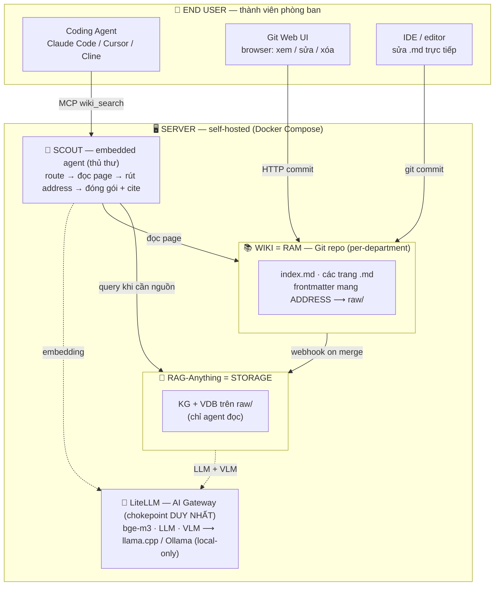
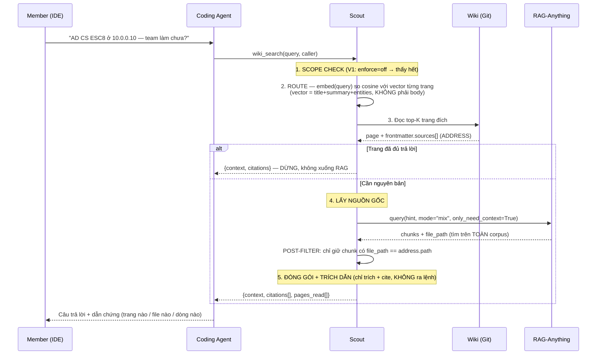
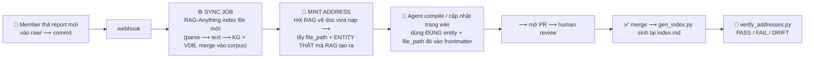

# LLM-Wiki — Tài liệu Kiến trúc & Đề xuất Kỹ thuật

| | |
|---|---|
| **Version** | 2.0 — Architecture Proposal (tái cấu trúc) |
| **Tác giả** | saltless-bruh |
| **Ngày** | 19/07/2026 |
| **Phạm vi V1** | (1) Thiết kế – xây – chạy thử **LLM-Wiki** · (2) Cài đặt & tích hợp **RAG-Anything** · (3) **Workflow** truy vấn + nạp dữ liệu |
| **Cảm hứng** | LLM-Wiki pattern của Karpathy (một wiki tri thức mà agent đọc được), tầng lưu trữ dùng **RAG-Anything** (HKUDS) |

---

## 0. Tóm tắt điều hành

LLM-Wiki là **kho tri thức dùng chung của team Security**, được thiết kế để **các coding agent trong IDE của từng thành viên đọc và tra cứu được**, thay vì chỉ để con người đọc. Hệ thống tách làm hai tầng: một tầng **Wiki** (các file Markdown đã được compile, gọn, điều hướng nhanh) và một tầng **RAG** (nguồn gốc thô — PDF, report, evidence, sheet — lưu nguyên bản, dung lượng lớn). Wiki đóng vai "bản đồ", RAG đóng vai "kho hàng"; mỗi trang Wiki mang sẵn **địa chỉ (address)** trỏ xuống đúng nguồn trong RAG.

Bản v1 này **chỉ tập trung vào cơ chế lõi**: dựng được Wiki, cài được RAG-Anything, và nối hai thứ đó bằng workflow truy vấn + nạp dữ liệu chạy được đầu-cuối. Các phần **phân quyền (RBAC), khóa file khi nhiều người/agent cùng sửa (lock), và giao diện cho người không rành kỹ thuật** được **để dành cho V2** — có nêu rõ *cái gì, làm thế nào, vì sao* ở §5.

---

## 1. Dự án này là gì

### 1.1. Vấn đề đang giải

Tri thức của team Security hiện nằm rải rác: report pentest, advisory, evidence, sheet, ảnh màn hình, đoạn code… ở nhiều định dạng, nhiều nơi. Hệ quả:

- **Con người** phải nhớ "cái đó nằm ở đâu" và mở từng file để tìm.
- **Coding agent** (Claude Code / Cursor / Cline…) không có nguồn tri thức chung của team — mỗi lần hỏi phải nạp cả đống tài liệu vào context, vừa tốn token vừa nhiễu.
- Tri thức **không có phiên bản**: ai sửa gì, xóa gì, lúc nào — không truy được.

### 1.2. LLM-Wiki là gì

LLM-Wiki là một **wiki mà cả người lẫn AI đọc–ghi được**, lưu dưới dạng file Markdown trong Git. Ý tưởng gốc lấy từ **LLM-Wiki pattern của Karpathy**: một trang wiki không viết cho người đọc lướt, mà viết **mật độ cao, khẳng định, có cấu trúc** để một model có thể nạp vào và dùng ngay.

Điểm **khác** Karpathy: ở pattern gốc chỉ có **một người viết**; ở đây **cả con người và AI cùng viết** vào wiki. Đó là lý do sau này (V2) cần cơ chế khóa để tránh giẫm chân nhau — nhưng V1 chưa cần.

Wiki **không chứa nguồn gốc thô**. Nó chứa **tri thức đã compile**, và mỗi trang mang một **address** trỏ xuống nguồn gốc nằm trong RAG. Agent đọc trang wiki trước; chỉ khi cần bằng chứng/nguyên bản mới lần theo address xuống RAG.

### 1.3. Ai dùng, dùng để làm gì

| Người dùng | Dùng để làm gì | Vào hệ thống bằng đường nào |
|---|---|---|
| **Coding agent** (trong IDE của member) | Hỏi tri thức team ("kỹ thuật X đã dùng ở target nào chưa?"), lấy về câu trả lời có dẫn chứng | MCP tool `wiki_search` → Scout |
| **Thành viên rành kỹ thuật** | Clone repo, sửa `.md` trong IDE, commit | Git (file I/O) |
| **Thành viên không rành Git** | Mở trang trên browser, bấm sửa, Save | Git Web UI (HTTP) |

Giá trị cốt lõi: **agent trả lời dựa trên tri thức thật của team, kèm trích dẫn nguồn**, mà **không** phải nuốt toàn bộ kho tài liệu vào context.

### 1.4. Mô hình khái niệm: LLM = CPU · Wiki = RAM · RAG = Storage

Cách dễ nhất để nắm kiến trúc là ánh xạ theo phần cứng máy tính:

```
   LLM   =  CPU       Model chính trong IDE của member. Suy luận, ra quyết định.
   Wiki  =  RAM       Tri thức đã compile. Nóng, điều hướng nhanh; người + AI cùng sửa.
   RAG   =  STORAGE   raw/ — nguồn gốc bất biến. Nguội, dung lượng lớn; agent chỉ đọc.
```

- **CPU không lưu dữ liệu lâu dài** → LLM không "nhớ" tri thức team; nó phải đọc từ RAM/Storage.
- **RAM là nơi làm việc nóng** → Wiki là tri thức đã sắp xếp để nạp nhanh.
- **Storage là nguồn sự thật** → RAG giữ nguyên bản; nếu Wiki và RAG lệch nhau, **RAG đúng**.

### 1.5. Nguyên tắc phân tách Wiki ↔ RAG

Đây là ranh giới thiết kế quan trọng nhất, cần thuộc:

| | **Wiki (RAM)** | **RAG (Storage)** |
|---|---|---|
| **Nội dung** | Markdown đã compile | PDF, advisory, evidence, sheet gốc |
| **Kích thước** | ~100–500 trang | 5–10 GB |
| **Ai ghi** | Người + AI, thường xuyên | Người thả vào, hiếm khi sửa |
| **Ai đọc** | Người + agent | **Chỉ agent** |
| **Phạm vi** | Theo phòng ban | Dùng chung |
| **Cách truy cập** | **Điều hướng** (index → trang) | **Truy hồi** (semantic query) |
| **Vai trò** | Bản đồ | Kho hàng / nguồn sự thật |

> Ghi nhớ một câu: **Wiki để đi tới đúng chỗ; RAG để lấy nguyên bản. Không lẫn hai việc.**

---

## 2. Kiến trúc hệ thống

### 2.1. Sơ đồ kiến trúc LLM-Wiki

Toàn bộ hệ thống chạy **self-hosted trong Docker Compose**. Con người vào bằng 3 đường; agent vào bằng đúng 1 đường (qua Scout). Mọi lời gọi model đều đi qua **một chokepoint duy nhất** là LiteLLM (chứng minh dữ liệu không ra cloud).



**Ba mảnh cần hiểu:**

1. **Scout là ranh giới giữa Wiki và RAG.** Agent chính **không bao giờ** gọi thẳng RAG-Anything — nó luôn đi qua Scout, và Scout mới quyết định khi nào cần xuống Storage. Nhờ vậy chi phí token của việc "dò tìm" nằm ở Scout, không đổ vào context của agent chính.
2. **Wiki là file trong Git, không phải một service riêng.** Agent đọc trực tiếp file, Scout đọc trực tiếp file. Không cần database cho wiki.
3. **LiteLLM là chokepoint.** Mọi lời gọi model (embedding của Scout, LLM/VLM của RAG-Anything) đều qua đây, route về model local. Muốn chứng minh "không ra cloud" chỉ cần soi **một** config.

### 2.2. Kiến trúc RAG-Anything (nguồn: HKUDS)

Sơ đồ chính thức của RAG-Anything (dùng ảnh trong repo của nhóm HKUDS):


*Nguồn: [github.com/HKUDS/RAG-Anything](https://github.com/HKUDS/RAG-Anything) — pipeline 3 giai đoạn: Parsing → Knowledge Grounding → Query.*

RAG-Anything **không phải** một API "lấy chunk theo file". Nó là **pipeline hoàn chỉnh** gồm 3 giai đoạn:

1. **Multi-modal Content Parsing** — tài liệu vào (PDF/PPT/DOC/XLS/ảnh) được parser (MinerU) bóc thành *Structured Content List*: text, ảnh, công thức, bảng.
2. **Graph-based Knowledge Grounding** — VLM/LLM biến ảnh/bảng/công thức thành **text trước** ("Textual Multi-modal Info"), rồi rút **Entity & Relation** để dựng **Knowledge Graph (KG)** và encode thành **Vector Database (VDB)**.
3. **Query** — câu hỏi được tách high-/low-level keys → truy hồi trên KG **và** VDB → trả về *Retrieved Info* → (mặc định) đưa vào LLM để sinh *Response*.

**Ba điều rút ra — ảnh hưởng TRỰC TIẾP tới thiết kế của ta:**

| # | Sự thật về RAG-Anything | Hệ quả cho LLM-Wiki |
|---|---|---|
| **1** | Nó **merge MỌI document vào MỘT KG + MỘT VDB** ("KG/VDB over All Documents"). Gộp xuyên tài liệu là **tính năng lõi**, không phải tác dụng phụ. | **Không lọc trước theo file được.** Không có `path_filter`. Muốn giữ đúng nguồn → phải **post-filter** ở phía Scout (§3.1). |
| **2** | **Multimodal → text trước.** "Multimodal" ở đây nghĩa là *parse ảnh/bảng ra text rồi xử lý như text.* | Recall phụ thuộc chất lượng caption/parse. Ảnh mờ, bảng vỡ layout ⟶ grounding kém. Cần kiểm trên data thật. |
| **3** | **Đầu ra mặc định là Response do LLM của NÓ sinh ra**, không phải đoạn gốc. | Phải bật `only_need_context=True` để lấy **đoạn gốc** — nếu không, hai model cùng suy luận (thừa) và ta **mất chuỗi trích dẫn**. Đây cũng là hàng rào chống prompt-injection: context là **dữ liệu**, không phải lệnh. |

**API thật** (không phải bản nháp cũ ghi `path_filter`):

```python
rag.query(text, QueryParam(mode="mix", only_need_context=True))
# mode: naive (vector) · local (entity) · global (KG) · hybrid · mix
# only_need_context=True  → trả ĐOẠN GỐC + file_path, KHÔNG chạy LLM của RAG
```

### 2.3. Tech Stack (V1 — chỉ phần lõi)

| Lớp | Công nghệ | Vai trò | Lý do chọn |
|---|---|---|---|
| **Wiki base** | obsidian-second-brain (MIT, Python) | Vault người sửa được + AI bảo trì | Có sẵn semantic search local + MCP + fallback keyword |
| **Embedded agent** | **Scout** *(tự viết, ~400 dòng)* | Model tìm giùm agent chính | Lấp khoảng trống: token-saving + đa ngôn ngữ |
| **Embedding model** | bge-m3 (qua LiteLLM/Ollama) | Vector hoá query + trang | Multilingual — recall tiếng Việt |
| **Storage engine** | RAG-Anything (LightRAG) | Index + truy hồi `raw/` | Native multimodal: PDF/ảnh/bảng |
| **Model gateway** | LiteLLM | Chokepoint mọi lời gọi model | Chứng minh không ra cloud bằng 1 config |
| **Version store** | Git — Gitea *(hoặc GitLab nếu công ty đã có)* | Version + audit trail | Ai / cái gì / lúc nào / agent-hay-người |
| **Runtime** | Docker Compose | Đóng gói toàn bộ | Self-hosted, portable |

Ba thứ **tự viết** trong V1: **Scout**, **schema frontmatter** (`AGENTS.md` — văn bản), và **script sinh/kiểm index** (`gen_index.py`, `verify_addresses.py`). Còn lại là cấu hình.

> **Đã dời sang V2:** Lock service (Redis) và mọi thứ về RBAC/phân quyền — xem §5. V1 **không** có các thành phần này.

### 2.4. Data contract — frontmatter (liên kết cơ khí Wiki ↔ RAG)

Frontmatter là **sợi dây cơ khí** nối một trang Wiki với nguồn gốc của nó trong RAG. Đây là thứ khiến "agent đọc wiki rồi lần xuống RAG" chạy được.

```yaml
---
# ===== HỢP ĐỒNG CƠ KHÍ — KHÔNG đổi tên trường =====
type: technique                    # technique | entity | playbook | concept
title: Kerberoasting               # tên hiển thị ở index
summary: Lấy TGS của service account có SPN rồi crack offline.
                                   # ← dòng index.md + VECTOR ĐỊNH TUYẾN của Scout. BẮT BUỘC.
entities: [kerberoasting, active-directory, service-account]
department: redteam                # scope hook (V1: chưa enforce)
sources:                           # ADDRESS xuống RAG
  - path: raw/reports/acme-2026-final.pdf
    loc:  "p.12-14"
    hint: "Acme kerberoasting service account SPN"
last_compiled: 2026-07-19
---

## TL;DR                    # mật độ cao, khẳng định, KHÔNG kể lể
## Technical Specifications # tri thức đã compile ("RAM")
## Provenance              # nối về raw/ + ghi rõ mâu thuẫn giữa nguồn (nếu có)
## Cross-References        # [[wikilink]] thuần — KHÔNG chỉ thị routing
```

**Vì sao `summary` bắt buộc:** đây là chuỗi Scout embed để **định tuyến**. Bỏ `summary` → vector định tuyến chỉ còn entity-slug + hint → dễ đi sai trang, đặc biệt với câu hỏi tiếng Việt không trùng từ khoá (vd *"cách lấy mật khẩu tài khoản dịch vụ trong AD"* vẫn phải tìm ra trang Kerberoasting).

**Vì sao `index.md` sinh tự động:** `gen_index.py` gom mọi `summary` thành `index.md` (deterministic → luôn khớp nội dung), đồng thời **lint**: address gãy, wikilink gãy, trang mồ côi.

---

## 3. Workflows

Đây là phần "cơ chế lõi" của V1: hai luồng chính — **truy vấn** (agent lấy bài) và **nạp dữ liệu** (đưa nguồn vào RAG rồi query được).

### 3.1. Workflow TRUY VẤN — 1 hay nhiều agent lấy 1 hay nhiều bài

Kịch bản: nhiều thành viên, mỗi người một coding agent trong IDE, cùng hỏi wiki. Mỗi agent gọi MCP tool `wiki_search`, và **mỗi lời gọi được phục vụ bởi một phiên Scout độc lập**. Vì Scout **chỉ đọc**, nhiều phiên chạy song song **an toàn** — không tranh chấp.



**Chú giải từng bước:**

| Bước | Việc | Ghi chú then chốt |
|---|---|---|
| 1 | **Scope check** | V1 `enforce=off` (thấy hết). Hook đã có sẵn để V2 lọc theo `department`. |
| 2 | **Route** | Vector chạy trên **metadata** (title+summary+entities), không phải toàn body → đây là "page table" của wiki. Chi phí embedding nằm ở **Scout**. |
| 3 | **Đọc trang đích + rút address** | Nếu nội dung trang đã đủ → **DỪNG**, không xuống RAG (tiết kiệm). |
| 4 | **Lấy nguồn gốc** | *Route A:* address là `.md`/`.txt` → đọc thẳng file (0 token đi tìm). *Route B:* PDF/binary → gọi RAG, rồi **post-filter theo `file_path`**. |
| 5 | **Đóng gói + cite** | Scout **chỉ trích + cite**, không tóm-tắt-rồi-ra-lệnh (raw/ có thể chứa payload kẻ tấn công → chống prompt-injection). |

**"Nhiều bài" (multi-article):** top-K > 1 → Scout đọc và đóng gói nhiều trang trong cùng một phiên, mỗi mảnh kèm citation riêng.

**"Nhiều agent" (multi-agent):** N agent → N phiên Scout song song. Read-only nên không cần lock ở V1. (Ghi đồng thời mới cần lock → V2.)

**Vì sao đáng làm (đo được từ prototype, câu hỏi *"kerberoasting ở Acme?"*):**

```
   Scout tốn định tuyến : ~578 token   ← chạy trên model LOCAL của Scout
   Agent chính nhận     : ~401 token   ← chỉ payload + citation
```

Chi phí đọc index (vd 300 trang ≈ 13K token) **không bao giờ** vào context của agent chính.

### 3.2. Workflow NẠP DỮ LIỆU — đưa nguồn vào RAG rồi query được

Kịch bản: có report/evidence mới. Cần đưa vào RAG (để truy hồi được) **và** cập nhật trang wiki liên quan (để agent điều hướng tới). Điểm tinh tế nhất là **address phải được "mint" từ chính RAG**, không viết tay.



**Vì sao phải MINT address, không viết tay** (đây là cái bẫy im lặng):

Cùng một document bị **hai quá trình trích xuất độc lập** đặt tên khác nhau:

```
   raw/reports/acme.pdf
        ├─► RAG-Anything (Entity & Relation Extraction) → KG nodes:
        │        "Kerberoasting" · "SPN" · "Service Account" · "Acme AD"
        └─► Agent compile → trang wiki → entities: [kerberoasting, service-account]
```

Không ai bảo đảm hai bên dùng **cùng từ vựng**. LightRAG rút high-/low-level keys từ `hint` rồi khớp vào **KG của nó**. Lệch từ vựng ⟹ address **trả rỗng, im lặng** — file vẫn tồn tại, lint đường dẫn vẫn PASS, nhưng agent đi vào ngõ cụt.

**Quy tắc mint (4 bước):**

| Bước | Việc |
|---|---|
| 1 | Doc mới vào `raw/` → RAG index |
| 2 | Hỏi RAG về doc đó → lấy `file_path` + **entity THẬT** RAG trả về |
| 3 | Viết trang wiki dùng **chính** entity + `file_path` đó |
| 4 | `verify_addresses.py` → chứng minh `hint` kéo đúng nguồn |

`verify_addresses.py` phân ba trạng thái: **PASS** (đúng nguồn) · **FAIL** (hint không khớp KG) · **DRIFT** (kéo được context nhưng toàn file khác). Đây là lớp kiểm **khác** với `gen_index.py` (chỉ kiểm `path` có tồn tại trên đĩa).

### 3.3. Ba cách con người sửa Wiki (tóm tắt)

```
   Không rành Git   ──► Git Web UI: mở trang, bấm sửa, Save.          (0 setup)
   Rành kỹ thuật    ──► clone repo, sửa .md trong IDE, commit.
   Qua hội thoại    ──► bảo agent "cập nhật trang X" → agent mở PR → mình duyệt.
```

Ở V1, agent **đề xuất qua PR**, con người **duyệt rồi merge**. (Cơ chế khóa tự động khi nhiều writer cùng lúc → V2.)

---

## 4. Phạm vi V1 — cơ chế lõi

V1 cố tình **hẹp**: chứng minh cơ chế lõi chạy đầu-cuối, rồi mới mở rộng. Ba khối việc:

### 4.1. Thiết kế – Xây – Chạy thử LLM-Wiki

- Dựng cấu trúc vault: `wiki/` với `index.md`, các thư mục `techniques/ entities/ playbooks/ concepts/`.
- Chốt **schema frontmatter** (§2.4) và viết `gen_index.py` (sinh `index.md` + lint).
- Viết **Scout** (~400 dòng): route → đọc page → rút address → đóng gói + cite (§3.1).
- Chạy thử với một wiki mẫu + vài câu hỏi (gồm câu tiếng Việt không trùng từ khoá).

### 4.2. Cài đặt & tích hợp RAG-Anything

- Cài RAG-Anything (LightRAG + MinerU), cấu hình `working_dir` trỏ vào `raw/`.
- Nối RAG-Anything và Scout vào **LiteLLM** (embedding bge-m3, LLM/VLM local).
- Xác lập giao ước tích hợp: **`only_need_context=True`** (lấy đoạn gốc) + **post-filter theo `file_path`** (§2.2, §3.1).
- Viết `verify_addresses.py` (PASS/FAIL/DRIFT) cho quy trình mint address (§3.2).

### 4.3. Workflow design layouts

- Chốt **workflow truy vấn** (§3.1) và **workflow nạp dữ liệu** (§3.2) thành layout chuẩn để cả team theo.
- Viết `sync-job` (webhook `raw/` → index + gen `index.md`).
- Đóng gói toàn bộ bằng **Docker Compose**.

**Deployment topology (V1):**

```
   docker compose:
   ┌─ scout          (embedded agent + bge-m3 client)
   ├─ rag            (RAG-Anything trên raw/)
   ├─ rag-mcp        (MCP: Scout ↔ RAG)
   ├─ litellm        (gateway → llama.cpp / Ollama, local-only)
   ├─ sync-job       (webhook → index + gen index.md)
   └─ git            (Gitea; nếu công ty đã có GitLab → bỏ service này)

   Wiki KHÔNG cần container riêng — nó là file trong Git repo.
```

### 4.4. Ranh giới V1 — cái gì KHÔNG nằm trong V1

**Ranh giới thiết kế (cố ý giữ):**
- Agent chính **không** gọi RAG trực tiếp — luôn qua Scout.
- Scout **chỉ đọc**, không ghi.
- RAG **chỉ index `raw/`**, không index `wiki/`.
- Wiki điều hướng, RAG truy hồi — không lẫn.

**Chưa nằm trong V1 (→ V2, xem §5):**
- Lock service (L1/L2/L3) khi nhiều người/agent cùng ghi.
- RBAC / phân quyền / scope enforce theo phòng ban.
- Presence (thay lệnh claim thủ công).
- Giao diện đẹp cho người không rành kỹ thuật.
- Tách nhiều wiki phòng ban vào cùng một RAG.

**Chưa verify — cần test trên data thật:**
- Recall tiếng Việt của bge-m3 trên corpus của team.
- obsidian-second-brain (vốn cho cá nhân) chịu tải nhiều người trên server.
- Độ trễ Scout khi N người hỏi đồng thời.
- Chống prompt-injection từ `raw/` qua Scout.
- Chi phí index lần đầu (chạy khảo sát khi có data).

---

## 5. Đề xuất V2 (cái gì · làm thế nào · vì sao)

Những phần dưới đây **đã có hook/chỗ chờ trong thiết kế V1** nhưng **chưa bật**. Nêu ở đây để lộ trình rõ ràng.

| # | Cái gì | Làm thế nào | Vì sao |
|---|---|---|---|
| **1** | **Lock service** (concurrency khi nhiều writer) | Service Python + **Redis** giữ per-file mutex trên `wiki/<path>`. **L1:** human sửa → AI chỉ mở PR (branch protection). **L2:** AI sửa → AI khác bị chặn cùng file (khác file OK). **L3:** human claim khi AI đang sửa → gửi HALT → agent dừng, bỏ branch. | Cả người lẫn AI cùng ghi (khác Karpathy 1 writer). Git merge cứu được text nhưng hai agent ghi cùng file cùng lúc vẫn tạo branch xung đột, tốn công. Chặn từ đầu tốt hơn. |
| **2** | **RBAC / scope theo phòng ban** | Bật `enforce=True` ở bước Scope Check của Scout (§3.1), lọc theo `caller.departments` vs `frontmatter.department`. Với RAG: **tách instance theo `working_dir`** (không thể chỉ là một filter). | Chống rò rỉ ngữ nghĩa xuyên phòng ban ngay từ tầng tìm kiếm. Lưu ý: post-filter của V1 chỉ **chặn ở ranh giới Scout** — RAG **vẫn retrieve** dữ liệu phòng khác. Muốn cô lập thật phải tách instance. |
| **3** | **Nhiều wiki → một RAG** | `wiki-redteam/ wiki-blueteam/ wiki-appsec/` cùng nối vào **một** RAG general. `department` trong frontmatter làm hook để Scout scope. | Mở rộng ra nhiều phòng ban mà không nhân bản kho nguồn. |
| **4** | **Presence plugin** | Thay lệnh claim thủ công của L3 bằng cơ chế presence tự phát hiện ai đang mở/sửa trang. | Trải nghiệm mượt hơn, giảm thao tác tay. |
| **5** | **UI cho người không rành kỹ thuật** | Lớp giao diện thân thiện phủ lên Git (đọc/sửa trang không cần biết Git). | Team hiện quen terminal/code; khi mở rộng cho người không kỹ thuật cần QoL tốt hơn Git Web UI thuần. |
| **6** | **Supersedes / chống tự mâu thuẫn** | Frontmatter `supersedes:` (structured): `page:` (trang bị thay) + `claim:` (khẳng định bị lật). Sự thật thay thế → **ghi đè toàn file** + khai `supersedes`, KHÔNG append. Lint kiểm cả hai dạng. | Wiki sống lâu sẽ tích mâu thuẫn; cần cơ chế để tri thức cũ bị thay minh bạch, truy được. |

---

## Phụ lục A — Thuật ngữ nhanh

| Thuật ngữ | Nghĩa trong tài liệu này |
|---|---|
| **Wiki (RAM)** | Các file Markdown đã compile, người + AI đọc–ghi, lưu trong Git. |
| **RAG (Storage)** | RAG-Anything index trên `raw/` — nguồn gốc thô, agent chỉ đọc. |
| **Scout** | Embedded agent (thủ thư) tự viết: định tuyến + lấy nguồn + đóng gói có trích dẫn. |
| **Address** | `frontmatter.sources[]` — con trỏ từ một trang Wiki xuống một nguồn trong RAG. |
| **Mint address** | Lấy `file_path` + entity **thật** từ RAG rồi mới viết vào frontmatter (không viết tay). |
| **only_need_context** | Cờ của RAG-Anything: trả **đoạn gốc** thay vì để LLM của RAG tự sinh câu trả lời. |
| **Post-filter** | Scout lọc kết quả RAG theo `file_path` (vì RAG không lọc trước theo file được). |
| **KG / VDB** | Knowledge Graph / Vector Database — hai chỉ mục RAG-Anything dựng trên corpus. |
| **Chokepoint (LiteLLM)** | Điểm nghẽn duy nhất mọi lời gọi model đi qua, để chứng minh local-only. |
